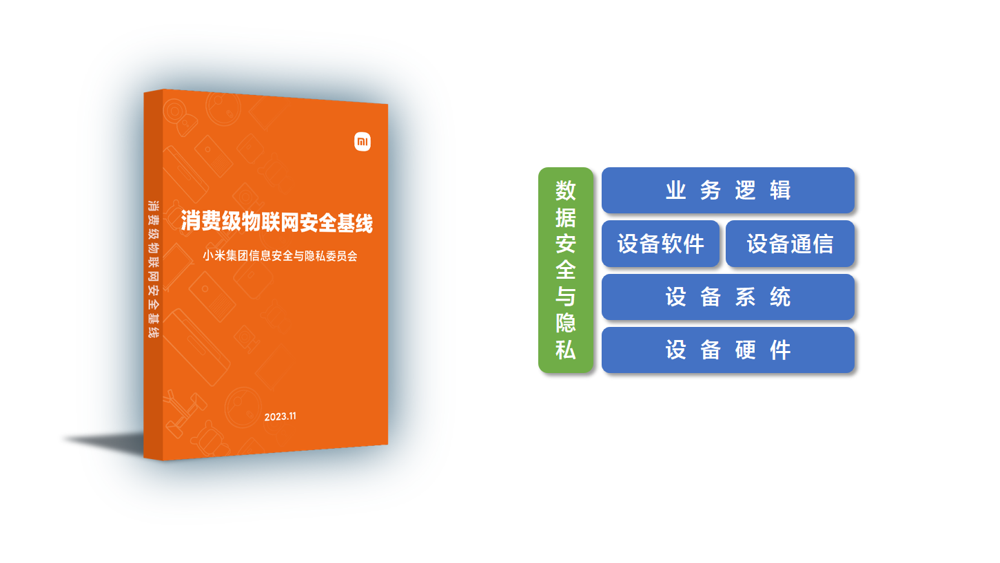

## 《消费级物联网安全基线》4.0

2021年初，小米作为物联网安全领域的践行者，首次对外发布了《消费级物联网安全基线》，向物联网企业提供了一份开放的安全要求实施指南。小米内部及合作厂商依据此安全基线对各品类物联网产品进行安全评估和安全检测工作，我们真切地感受到在基线的指引下，物联网产品安全能力大幅度的提升[^1]。

2024年1月，小米正式对外发布《消费级物联网安全基线》4.0版本，4.0版本从行业发展以及落地实施角度出发[^1]：
1. 优化修改了 33 项安全要求描述，细化落地规范易于理解；
2. 新增 2 项针对 Android 系统的通用要求，并包含 1 个通用参考解决方案；
3. 新增 3 项技术通用解决方案和要求，细化米家安全芯片建议型号并补充完善米家三元组 Key 安全方案；
4. 补充新增 5 项针对门锁品类特殊安全要求（符合即将发版 GA 374-2023 要求），并包含 1 个通用参考解决方案；
5. 优化 PDF 易读性（通用 / 参考方案合并到正文、正文增加要求适用等级、目录跳转等）；

## 安全基线与攻击面

要想说清楚安全基线与攻击面，首先理解二者的定义：
- 攻击面[^2]，是指漏洞、途径或方法（有时称为攻击媒介）的总和，攻击者可以利用这些漏洞、途径或方法获取对网络或敏感数据进行未经授权访问或者实施网络攻击。
- 安全基线，是一个信息系统的最小安全保证。信息系统安全往往需要在安全付出成本与所能够承受的安全风险之间进行平衡, 而安全基线正是这个平衡的合理分界线。

由此可见，通过学习安全基线，可以根据安全防护策略推导出攻击面；通过学习攻击面，可以据此完善安全基线。本文从《消费级物联网安全基线》4.0出发，学习消费级物联网的安全基线与攻击面。

## 设备硬件

### 一、调试接口关闭、鉴权、输入输出

| 基线对象 | 策略级别 | 具体策略 |
| :-: | :-: | :-: |
| 调试接口，如TX、RX、UART、JTAG、SWD、ADB | 中 | 鉴权 |
| | 中 | 输入输出控制 |
| | 高 | 永久关闭 |

中级策略 **鉴权**
设备正式版本固件默认关闭调试接口，需要开启时进行鉴权。有以下3种鉴权方式：
1. 云端鉴权，在芯片 efuse 烧录一机一密，需要登录账号密码从云端拉取设备刷机密码，在线刷工具输入并验证该密码正确后才可进行线刷。
2. 加密鉴权，如使用私有USB Dongle串接使用进行鉴权加密等。
3. 物理鉴权，飞线通联，需要调试时使用导线焊接到 PCB 的调试节点使调试接口电路通联；特殊操作，如特殊按键组合、设备倾斜通电等。

攻击面：
1. 云端设备刷机密码泄漏
2. 低安全等级设备，物理鉴权方案泄漏

中级策略 **输入输出控制**
关闭信息输入：开启调试接口时，关闭调试接口的信息输入，防止设备固件被篡改或本地存储的敏感信息被读取。

关闭敏感信息输出：开启调试接口时，log输出不包含用户与设备敏感信息（敏感安全参数如 key、token，个人敏感信息如 password、Wi-Fi密码等），如需输出完整数据流日志，需要将此类信息遮蔽展示（如：password ：********）。

攻击面：
...

高级策略 **永久关闭**
从软件、硬件两个途径永久关闭调试接口：
1. 根据 MCU/SoC 的芯片技术手册，在芯片 efuse 烧录对应的安全配置字段，一次性永久关闭调试接口。
2. 设备去除 PCB 板上的调试接口丝印，以防止逆向工程。

攻击面：
...

### 二、敏感数据加密、防篡改

| 基线对象 | 策略级别 | 具体策略 |
| :-: | :-: | :-: |
| 敏感数据，如公私钥、证书，设备唯一标识符（如 SN、IMEI、Device ID） | 高 | 加密存储 |
| | 高 | 防篡改 |

高级策略 **加密存储**
将敏感信息加密存储在存储芯片（flash、nand、emmc 等），加密方案可通过采用集成具备数据加密能力的安全芯片、TEE 或操作系统分区加密来实现。

攻击面：
1. 采用了加密措施，但是调试接口开启且未控制输入输出。

高级策略 **防篡改**
设备用于存储保护、传输保护和鉴权的公私钥、证书等需要防止被篡改的敏感信息，和用于识别或验证设备身份合法性的设备唯一标识符，除加密存储外，应存储在设备不可被外部篡改的分区内，如 flash 只读分区、安全芯片或 TEE 中。

攻击面：
1. 采用了防篡改措施，但是调试接口开启且未控制输入输出。

### 三、芯片间通信加密

| 基线对象 | 策略级别 | 具体策略 |
| :-: | :-: | :-: |
| 芯片间通信协议（UART/IIC/SPI/USB等）传输的数据 | 高 | 加密通信 |

高级策略 **加密通信**
设备对芯片间通信协议传输的数据本身进行加密，有以下2种方案：
1. 采用安全芯片（SE）或可信执行环境（TEE）来确保加密密钥的安全性，并在 TEE 内实现敏感信息加解密和密钥管理等功能。
2. 对于未集成安全芯片和不支持可信执行环境的设备，设备关键MCU 之间首次上电后宜互相协商通信密钥（芯片间通过串口 ECC 生成公私钥对，计算临时密钥，生成随机数和挑战值，验证挑战值，验证通过后使用 LTK 做鉴权密钥），并存储在外部没有访问权限的存储分区。

攻击面：
...

### 四、安全启动

| 基线对象 | 策略级别 | 具体策略 |
| :-: | :-: | :-: |
| 固件、Flash关键分区 | 高 | 安全启动 |

高级策略 **安全启动**
从设备上电开始，依次对固件（bootloader、kernel、rootfs）或 Flash 关键分区（如固件程序所在分区）进行合法加载校验，确保存储芯片中的系统合法性和完整性校验通过后才能正常启动。

攻击面：
...

## 参考文献
[^1]:消费级物联网安全基线，小米，https://github.com/MiSecurity/Cyber-Security-Baseline-for-Consumer-Internet-of-Things
[^2]:什么是攻击面，IBM，https://www.ibm.com/cn-zh/topics/attack-surface

