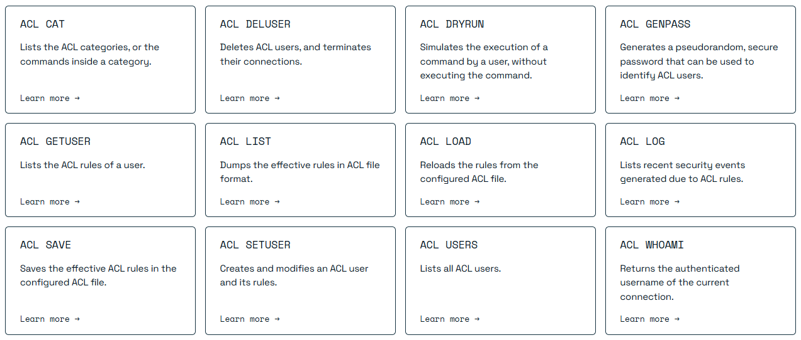

## 分析流程

对Redis漏洞分析的流程分为4个步骤：

1. 寻找Moderate、High级别的漏洞，寻找脆弱版本和修复版本。
2. 编译源码，指定libc、ASAN选项。
``` shell
make MALLOC=libc CFLAGS="-fsanitize=address -fno-omit-frame-pointer -O0 -g" LDFLAGS="-fsanitize=address" -j4
```
3. 寻找PoC，没有则寻找Diff。
4. 从4个方面分析漏洞：前置知识、PoC、漏洞成因、补丁。

## 前置知识

ACL是Access Control List（访问控制列表）的缩写，通过ACL,Redis可以控制客户端对不同redis命令和数据的访问权限。
用于配置ACL的命令有12个，一些业务功能成对实现，比如ACL SETUSER/DELUSER负责创建/删除一个账户，ACL SAVE/LOAD负责ACL的备份和恢复。其他业务功能单独实现，比如ACL CAT [category]用于索引当前账户，指定类别的访问权限。


## CVE-2024-31227 断言错误，DoS

披露时间：2024年10月
复现版本: 7.2.0
补丁版本: 7.4.1

| 严重程度 | CWE | 攻击向量 | 攻击复杂度 | 需要权限 |
| :----:  | :----: | :----: | :----: | :----: |
| 4.4 / 10 |  CWE-20 Improper Input Validation | Local | Low | High |


### 一、前置知识

该漏洞产生于ACL SETUSER命令的处理逻辑当中，ACL SETUSER命令的语法如下，针对设置的user，可以配置多个规则。

``` shell
语法：

    ACL SETUSER username [rule [rule ...]]

引入自: Redis Open Source 6.0.0
时间复杂度: O(N)
ACL 类别: @admin, @slow, @dangerous
```

Redis ACL规则分为两类：1. 定义命令权限的规则，即命令规则；2. 定义用户状态的规则，即用户管理规则。

**1.命令规则（部分）**

~<<pattern>pattern>：将指定的键模式（glob样式模式，类似于KEYS命令）添加到用户可访问的键模式列表中。这将为匹配该模式的键授予读和写权限。可以向同一个用户添加多个键模式。

%R~<<pattern>pattern>:（在Redis 7.0及以后版本中可用）添加指定的读取键模式。这与常规的键模式类似，但只授予权限从匹配给定模式的键中读取数据。

%W~<<pattern>pattern>:（在Redis 7.0及以后版本中可用）添加指定的写键模式。它的行为类似于常规的键模式，但只允许对匹配给定模式的键进行写操作。

%RW~<<pattern>pattern>:（可在Redis 7.0及以后版本中使用），是第一个规则的别名。

**2.用户管理规则（部分）**

on：将用户设置为激活，可以使用AUTH <username> <password>作为该用户进行身份验证。

off：将用户设置为未激活，将无法以此用户登录。如果一个用户在已经通过该用户的身份验证的连接之后被禁用（设置为off），那么该连接将继续按预期工作。

nopass：用户被设置为无密码用户。这意味着可以使用任何密码进行身份验证。

### 二、PoC
使用ACL SETUSER命令构造一个恶意的命令规则，在获取user的规则时即可触发断言错误。

``` shell
ACL SETUSER user %~
ACL GETUSER user
```
ASAN追踪漏洞，可以发现PoC在src/acl.c:307引发了崩溃。看到调用栈上面还有对_serverPanic的调用，可以判断这是一个断言错误，即redis对非预期的结果进行了断言处理。

``` shell
==36101==ERROR: AddressSanitizer: unknown-crash on address 0x0000800f7000 at pc 0x7f8835527956 bp 0x7ffe2f073940 sp 0x7ffe2f073100
READ of size 1048576 at 0x0000800f7000 thread T0
#0 0x7f8835527955 in memcpy ../../../../src/libsanitizer/sanitizer_common/sanitizer_common_interceptors_memintrinsics.inc:115
#1 0x557a2d158714 in memtest_preserving_test /opt/redis-7.2.0/src/memtest.c:317
#2 0x557a2d1130b4 in memtest_test_linux_anonymous_maps /opt/redis-7.2.0/src/debug.c:2005
#3 0x557a2d1132bd in doFastMemoryTest /opt/redis-7.2.0/src/debug.c:2046
#4 0x557a2d113f8c in printCrashReport /opt/redis-7.2.0/src/debug.c:2190
#5 0x557a2d111788 in _serverPanic /opt/redis-7.2.0/src/debug.c:1158
#6 0x557a2d227284 in sdsCatPatternString /opt/redis-7.2.0/src/acl.c:307
#7 0x557a2d23550c in aclAddReplySelectorDescription /opt/redis-7.2.0/src/acl.c:2723
#8 0x557a2d23657f in aclCommand /opt/redis-7.2.0/src/acl.c:2844
#9 0x557a2d001571 in call /opt/redis-7.2.0/src/server.c:3519
#10 0x557a2d0055cb in processCommand /opt/redis-7.2.0/src/server.c:4160
#11 0x557a2d04439a in processCommandAndResetClient /opt/redis-7.2.0/src/networking.c:2466
#12 0x557a2d0448ab in processInputBuffer /opt/redis-7.2.0/src/networking.c:2574
#13 0x557a2d04578c in readQueryFromClient /opt/redis-7.2.0/src/networking.c:2713
#14 0x557a2d23d24f in callHandler /opt/redis-7.2.0/src/connhelpers.h:79
#15 0x557a2d23e728 in connSocketEventHandler /opt/redis-7.2.0/src/socket.c:298
#16 0x557a2cfe45fd in aeProcessEvents /opt/redis-7.2.0/src/ae.c:436
#17 0x557a2cfe4cf0 in aeMain /opt/redis-7.2.0/src/ae.c:496
#18 0x557a2d01798c in main /opt/redis-7.2.0/src/server.c:7360
```
### 三、漏洞成因
定位到src/acl.c:307，漏洞产生于sdsCatPatternString函数中，可以断定，恶意构造的命令规则没有进行正确的解析，被断言发现，引发panic。

``` c
src/acl.c 
sds sdsCatPatternString(sds base, keyPattern *pat) {
    if (pat->flags == ACL_ALL_PERMISSION) {
        base = sdscatlen(base,"~",1);
    } else if (pat->flags == ACL_READ_PERMISSION) {
        base = sdscatlen(base,"%R~",3);
    } else if (pat->flags == ACL_WRITE_PERMISSION) {
        base = sdscatlen(base,"%W~",3);
    } else {
        // 断言错误
👉       serverPanic("Invalid key pattern flag detected");
    }
    return sdscatsds(base, pat->pattern);
}
```

那么我们审计规则处理函数ACLSetSelector，尝试从中寻找漏洞。大致看一下处理逻辑，首先根据规则首字符(op[0])分出基本块，注意到处理%规则符时，会进入一个循环，在此循环中给flags赋值，这里的flags就是sdsCatPatternString索引的对象。
考虑这样一种边界条件，在%之后的规则符是~，这样控制流会跳出循环，而flags依旧是初始值0，同时函数返回C_OK，指示命令成功执行。
``` c
src/acl.c 
int ACLSetSelector(aclSelector *selector, const char* op, size_t oplen) {
    ...
    } else if (op[0] == '~' || op[0] == '%') {
        if (selector->flags & SELECTOR_FLAG_ALLKEYS) {
            errno = EEXIST;
            return C_ERR;
        }
        int flags = 0;
        size_t offset = 1;
        if (op[0] == '%') {
            for (; offset < oplen; offset++) {
                if (toupper(op[offset]) == 'R' && !(flags & ACL_READ_PERMISSION)) {
                    flags |= ACL_READ_PERMISSION;
                } else if (toupper(op[offset]) == 'W' && !(flags & ACL_WRITE_PERMISSION)) {
                    flags |= ACL_WRITE_PERMISSION;
                // 跳出循环
👉               } else if (op[offset] == '~') {
                    offset++;
                    break;
                } else {
                    errno = EINVAL;
                    return C_ERR;
                }
            }
        } else {
            flags = ACL_ALL_PERMISSION;
        }
        ...
    } else if (op[0] == '&') {
    ...
    }
    ...
    return C_OK;
}
```
该漏洞的成因是，处理逻辑没有考虑到边界条件，在未对flags赋值之前就可以跳出循环。

### 四、补丁

所以针对该边界条件，补丁对其进行了检测，增加了对flags的非零判断。

``` c
src/acl.c 
@@ -1051,7 +1051,7 @@ int ACLSetSelector(aclSelector *selector, const char* op, size_t oplen) {

    flags |= ACL_READ_PERMISSION;

} else if (toupper(op[offset]) == 'W' && !(flags & ACL_WRITE_PERMISSION)) {

    flags |= ACL_WRITE_PERMISSION;

- } else if (op[offset] == '~') {
+ } else if (op[offset] == '~' && flags) {

    offset++;

    break;

} else {
```
## CVE-2024-51741 断言错误，DoS
披露时间：2025年1月6日
复现版本: 7.4.1
补丁版本: 7.4.2

| 严重程度 | CWE | 攻击向量 | 攻击复杂度 | 需要权限 |
| :----:  | :----: | :----: | :----: | :----: |
| 4.4 / 10 |  CWE-20 Improper Input Validation | Local | Low | High |

在分析上一个漏洞成因时，是否发现了ACLSetSelector其中还潜伏着一个漏洞？
### 一、另一个漏洞
这次PoC更简单。
``` shell
ACL SETUSER user %
ACL GETUSER user
```
回顾ACLSetSelector的处理逻辑，如果我们构造一个只有%的规则，会发生什么？结果是直接跳出for循环，触发panic。

``` c
src/acl.c 
int ACLSetSelector(aclSelector *selector, const char* op, size_t oplen) {
    
    ...

    } else if (op[0] == '~' || op[0] == '%') {
        if (selector->flags & SELECTOR_FLAG_ALLKEYS) {
            errno = EEXIST;
            return C_ERR;
        }
        int flags = 0;
        size_t offset = 1;
        if (op[0] == '%') {
            // 直接跳出循环
👉           for (; offset < oplen; offset++) {
                if (toupper(op[offset]) == 'R' && !(flags & ACL_READ_PERMISSION)) {
                    flags |= ACL_READ_PERMISSION;
                } else if (toupper(op[offset]) == 'W' && !(flags & ACL_WRITE_PERMISSION)) {
                    flags |= ACL_WRITE_PERMISSION;
                } else if (op[offset] == '~' && flags) {
                    offset++;
                    break;
                } else {
                    errno = EINVAL;
                    return C_ERR;
                }
            }
        } else {
            flags = ACL_ALL_PERMISSION;
        }
        ...
    } else if (op[0] == '&') {
    ...
    }
    ...
    return C_OK;
}
```
该漏洞成因是，补丁注意到了flags的非零判断，但不多。于是二次补丁将flags的非零判断后移到了for循环之后。

``` c
src/acl.c 
@@ -1078,19 +1078,24 @@ int ACLSetSelector(aclSelector *selector, const char *op, size_t oplen) {
 
    int flags = 0;
    size_t offset = 1;
    if (op[0] == '%') {
+        int perm_ok = 1;
        for (; offset < oplen; offset++) {
            if (toupper(op[offset]) == 'R' && !(flags & ACL_READ_PERMISSION)) {
                flags |= ACL_READ_PERMISSION;
            } else if (toupper(op[offset]) == 'W' && !(flags & ACL_WRITE_PERMISSION)) {
                flags |= ACL_WRITE_PERMISSION;
-            } else if (op[offset] == '~' && flags) {
+            } else if (op[offset] == '~') {
                offset++;
                break;
            } else {
-                errno = EINVAL;
-                return C_ERR;
+                perm_ok = 0;
+                break;
            }
        }
+        if (!flags || !perm_ok) {
+            errno = EINVAL;
+            return C_ERR;
+        }
    } else {
        flags = ACL_ALL_PERMISSION;
    }
```
## valkey/issues/1832 空指针解引用，DoS
披露时间：2025年3月
复现版本：8.0.2 (valkey)
补丁版本：8.0.3 (valkey)

| 严重程度 | CWE | 攻击向量 | 攻击复杂度 | 需要权限 |
| :----:  | :----: | :----: | :----: | :----: |
| None |  CWE-754: Improper Check for Exceptional Conditions | Local | Low | High |

### 一、前置知识

Valkey是Redis7.2.4的开源fork，目前21k stars，经历几个小版本的迭代，在某些模块中已经和Redis和较大的改动。

### 二、PoC

PoC来自issue[^1]，复制一个server，作为replica。在replica中执行ACL LOAD命令会触发crash。

``` shell
# 复制server
src/valkey-server --port 6379 --aclfile 1.acl
src/valkey-server --port 6380 --replicaof "localhost 6379" --aclfile 1.acl
# 恢复ACL
src/valkey-cli -p 6380
127.0.0.1:6380 > ACL LOAD
```
issue中提到，Redis中不存在该漏洞。我们可以提出假设，Valkey在ACL LOAD命令函数中进行了改动，改动的代码引发了issue中的问题。

### 三、漏洞成因

diff二者的acl.c文件，在ACLLoadFromFile函数中，可以看到漏洞的成因。删除的if语句明确注释到，user在某种状况下可能为NULL，接下来需要验证，这项改动是否是成因。

``` c
src/acl.c
sds ACLLoadFromFile(const char *filename) {
    FILE *fp;
    char buf[1024];
    ...
    listIter li;
    listNode *ln;
    listRewind(server.clients,&li);

    while ((ln = listNext(&li)) != NULL) {
        client *c = listNodeValue(ln);
-       /* a MASTER client can do everything (and user = NULL) so we can skip it */
-       if (c->flags & CLIENT_MASTER)
-           continue;
        user *original = c->user;
        list *channels = NULL;
        // crash
        user *new = ACLGetUserByName(c->user->name, sdslen(c->user->name));
           ...
        }
}
```

注释Redis的这行代码，进行验证。

``` shell
src/redis-server --port 6379 --aclfile 1.acl
src/redis-server --port 6380 --replicaof "localhost 6379" --aclfile 1.acl

src/redis-cli -p 6380
127.0.0.1:6380 > ACL LOAD
```

ASAN追踪漏洞，可以验证Valkey的不严谨改动导致了crash。

``` shell
==7633==ERROR: AddressSanitizer: unknown-crash on address 0x0000800f7000 at pc 0x7f904fb78956 bp 0x7ffde41381b0 sp 0x7ffde4137970
READ of size 1048576 at 0x0000800f7000 thread T0
#0 0x7f904fb78955 in memcpy ../../../../src/libsanitizer/sanitizer_common/sanitizer_common_interceptors_memintrinsics.inc:115
#1 0x55c5adc29a59 in memtest_preserving_test /opt/redis-7.4.2/src/memtest.c:296
#2 0x55c5adbe15cb in memtest_test_linux_anonymous_maps /opt/redis-7.4.2/src/debug.c:2157
#3 0x55c5adbe17d4 in doFastMemoryTest /opt/redis-7.4.2/src/debug.c:2198
#4 0x55c5adbe2af6 in printCrashReport /opt/redis-7.4.2/src/debug.c:2408
#5 0x55c5adbe242b in sigsegvHandler /opt/redis-7.4.2/src/debug.c:2328
#6 0x7f904f7fc57f  (/lib/x86_64-linux-gnu/libc.so.6+0x3d57f) (BuildId: 2e01923fea4ad9f7fa50fe24e0f3385a45a6cd1c)
#7 0x55c5add08afd in ACLLoadFromFile /opt/redis-7.4.2/src/acl.c:2444
#8 0x55c5add0c582 in aclCommand /opt/redis-7.4.2/src/acl.c:2990
#9 0x55c5adabaac4 in call /opt/redis-7.4.2/src/server.c:3575
#10 0x55c5adabea1f in processCommand /opt/redis-7.4.2/src/server.c:4206
#11 0x55c5adafe524 in processCommandAndResetClient /opt/redis-7.4.2/src/networking.c:2505
#12 0x55c5adafea70 in processInputBuffer /opt/redis-7.4.2/src/networking.c:2613
#13 0x55c5adaffaac in readQueryFromClient /opt/redis-7.4.2/src/networking.c:2759
#14 0x55c5add12b84 in callHandler /opt/redis-7.4.2/src/connhelpers.h:58
#15 0x55c5add1405d in connSocketEventHandler /opt/redis-7.4.2/src/socket.c:277
#16 0x55c5ada8b67d in aeProcessEvents /opt/redis-7.4.2/src/ae.c:417
#17 0x55c5ada8bd70 in aeMain /opt/redis-7.4.2/src/ae.c:477
#18 0x55c5adad133e in main /opt/redis-7.4.2/src/server.c:7251
```
### 四、补丁

Valkey直接对c->user进行判空。

``` c
src/acl.c

sds ACLLoadFromFile(const char *filename) {
    FILE *fp;
    char buf[1024];
    ...
    listIter li;
    listNode *ln;
    listRewind(server.clients,&li);

    while ((ln = listNext(&li)) != NULL) {
        client *c = listNodeValue(ln);
+       /* Some clients, e.g. the one from the primary to replica, don't have a user
+        * associated with them. */
+       if (!c->user) continue;
        user *original = c->user;
        list *channels = NULL;
        // crash
        user *new = ACLGetUserByName(c->user->name, sdslen(c->user->name));
           ...
        }
}
```
### 五、类似缺陷
既然这个漏洞是Valkey对fork代码进行改动而引入的，那么还有没有类似的缺陷？diff二者的acl.c文件，发现除了上述的ACLLoadFromFile函数有明显改动，aclCatWithFlags函数中也有类似改动。

``` c
src/acl.c
void aclCatWithFlags(client *c, dict *commands, uint64_t cflag, int *arraylen) {
     dictEntry *de;
     dictIterator *di = dictGetIterator(commands);
 
     while ((de = dictNext(di)) != NULL) {
        // 潜在的整型溢出
         struct redisCommand *cmd = dictGetVal(de);
-        if (cmd->flags & CMD_MODULE) 
-            continue;
         if (cmd->acl_categories & cflag) {
             addReplyBulkCBuffer(c, cmd->fullname, sdslen(cmd->fullname));
             (*arraylen)++;
         }
 
         if (cmd->subcommands_dict) {
             aclCatWithFlags(c, cmd->subcommands_dict, cflag, arraylen);
         }
     }
     dictReleaseIterator(di);
 }

```
在执行ACL CAT [category] 命令时，Redis跳过了模块引入的命令，Valkey则删除了if判断。查看函数的逻辑，初步判断存在整型溢出。
当模块引入超过2^31的命令时，arraylen会溢出。这里的arraylen是一个指针，是否会影响后续代码呢?回到aclCatWithFlags函数的调用位置，arraylen作为参数传递给setDeferredArrayLen函数。

``` c
src/acl.c
void aclCommand(client *c) {
    ...
    } else if (!strcasecmp(sub, "cat") && c->argc == 3) {
        uint64_t cflag = ACLGetCommandCategoryFlagByName(c->argv[2]->ptr);
        if (cflag == 0) {
            addReplyErrorFormat(c, "Unknown category '%.128s'", (char *)c->argv[2]->ptr);
            return;
        }
        int arraylen = 0;
        void *dl = addReplyDeferredLen(c);
        // 潜在漏洞
👉      aclCatWithFlags(c, server.orig_commands, cflag, &arraylen);
        setDeferredArrayLen(c, dl, arraylen);
        ...
    }
    ...
}
```
可惜的是，传递时作了类型扩展，以long的大小传递，这样无法达到溢出为负值的效果。同时模块需要创建2^31个命令，这个条件也不好达成。

## 参考文献

[^1]:https://github.com/valkey-io/valkey/issues/1832