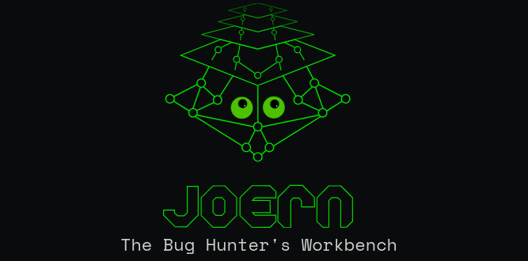

## 代码审计基础

代码审计通过分析程序源码或二进制码，识别潜在安全漏洞的系统化过程。深度理解代码，有助于学习漏洞模式、发现漏洞、新的攻击面。同时，在内存安全语言代码中，fuzzing受限，需要代码审计发现逻辑漏洞。
1. 学习1day，在补丁对比和逆向工程的辅助下，定位漏洞，学习1day。
2. 寻找攻击面，从海量代码中确定好测试的对象，比如特定函数、API接口，聚焦高风险区域，比如命令执行、文件解析。从中寻找新的攻击面，在此攻击面上执行模糊测试。

代码审计策略有多种，每种策略都包括4个元素，其中以污点分析为基础：
1. 起点（source）：代码审计的起点。
2. 终点（sink）：代码审计的目标，或者跟踪代码的终点。
3. 方法：代码审计的方法，比如，跟踪数据流、控制流。
4. 漏洞类型：针对的是什么类型的漏洞。

常用的代码审计策略有3种：自顶向下、自底向上、见微知著。

### 一、自顶向下

**1.静态污点分析STA**

起点：数据入口点，比如函数的参数、环境变量等。
终点：最终的漏洞触发点，比如越权、注入、内存破坏等。
方法：通过跟踪用户的输入数据找到潜在的漏洞点。
漏洞类型：可被恶意输入触发的安全漏洞。

在审计过程中记录一系列传播的数据并进行跟踪，配合安全边界分析和常用的漏洞类型来定位漏洞。面对类似于 Java 或者 C++ 等语言的项目时候，跟踪原始输入会经过多个中间类，导致你打开了十几个文件之后还没有到达真正处理数据的代码，在这种情况下最好有设计文档的帮助。

**2.模块分析**

假设模块以文件进行划分，因此实际上分析一个模块就是分析对应文件的源文件。比如redis模块就以文件划分，ACL相关代码存储在acl.c中。

起点：文件开头。
终点：文件末尾。
方法：阅读模块中的每个函数，记录潜在问题。
漏洞类型：所有类型。

模块分析的过程就是从头到尾阅读一个源码文件，并且不跟踪其中调用到的外部函数，也不关心当前函数的引用情况，只将目前遇到的问题记录下来。

**3.引用分析**

引用分析和模块分析类似，区别在于聚焦的是代码中的类或者结构体实现。

起点：某个对象实现。
终点：所有对该对象的引用 (xref)。
方法：聚焦于对象引用的代码。
漏洞类型：接口使用导致的错误，类型混淆等。

### 二、自底向上

与1相反，该策略从可能导致漏洞的底层代码出发，反向追踪，来验证漏洞的触发路径。

**1.敏感调用**

起点：潜在的漏洞点。
终点：任意用户可控的输入。
方法：指定一系列的敏感调用，反向分析这些调用是否构成可利用的漏洞。
漏洞类型：可被恶意输入触发的安全漏洞。

最简单的方式是通过正则表达式来指定敏感函数或者语句，通过文本搜索工具查找潜在漏洞并进行验证。这个策略的优点是针对已知的漏洞类型可以达到较高的覆盖率，比如格式化字符串、命令注入等。

**2.接口分析**

区别于敏感函数，接口暴露于用户输入，也是可能存在漏洞的地方。
起点：接口函数
终点：任意用户可控的输入。
方法：指定一系列的接口函数，反向分析这些调用是否构成可利用的漏洞。
漏洞类型：可被恶意输入触发的安全漏洞。

### 三、见微知著

在经过前两类策略的审计后，已经对代码本身有了一定程度的理解，这时候就可以纵观全局，审计应用整体的设计和实现。这类策略关注上层的设计缺陷、逻辑漏洞，因此可以找到隐藏较深的严重漏洞。

**1.系统建模**

完成具体实现的分析后再反向推断整体的的设计思路，然后根据这个推测的思路去找到一些未曾触及的组件实现。

起点：待审计模块的起点。
终点：安全漏洞。
方法：通过行为建模还原模块的抽象行为，并寻找潜在的逻辑和功能漏洞。
漏洞类型：所有类型。

通常只需要对一些核心模块进行反向建模，比如应用的安全子系统、输入过滤模块或者其他广泛使用的核心组件等。在建模的过程中，把自己放在开发者或者架构师的位置重新考虑模块的设计，通过系统建模来挖掘逻辑漏洞。

**2.安全边界**

起点：所有安全相关的校验和检查代码。
终点：安全漏洞。
方法：通过已知的安全相关代码去推测还原目标的设计的安全边界。
漏洞类型：所有类型。

通过收集代码中的安全校验相关代码片段进行记录，然后对这些针对安全边界的检查进行分类整理，最后归纳出原始的安全层级划分。

**3.设计验证**

如果有目标应用的设计文档或者规范手册，那么直观的审计策略就是通过对比规范和实现代码来查找其中的未定义行为或者冲突之处。

起点：模块的起点
终点：模块的末尾
方法：挖掘代码实现中和设计有出入的漏洞点
漏洞类型：所有类型

简单来说，设计验证是先推测和还原目标模块的主要功能和正常行为，然后再针对其中的临界情况进行重点审计。

## joern综述

joern是针对源代码、字节码和二进制码进行健壮性分析的平台。核心数据结构是代码属性图（CPG），作为跨语言代码分析的抽象表示，CPG存储于图数据库中，使用特定的Scala查询语句能够挖掘代码中的漏洞。

### 一、适配的语言

joern除了能够分析源代码，还能够分析编译后的字节码、二进制码。

**超高度**适配的语言：
- C/C++，基于Eclipse CDT
- Java，基于JavaParser

**高度**适配的语言：
- JavaScript，基于GraalVM
- Python，基于JavaCC
- x86/x64，基于Ghidra

**中度**适配的语言：
- JVM Bytecode，基于Soot
- Kotlin，基于IntelliJ PSI
- PHP，基于PHP-Parser
- Go，基于go.parser

### 二、核心功能

joern有以下5个核心功能：
1. 健壮的解析，对于不能提供工作构建环境或部分代码丢失，也能够导入joern进行分析。
2. CPG，创建具有语义的代码属性图，存储在基于内存存储的图数据库中。
3. 污点分析，提供静态污点分析引擎，跟踪恶意数据的传播。
4. 查询语句，基于Scala实现了查询语言，用于手动制定漏洞的查询规则，也可以使用机器学习技术自动推断漏洞。
5. 使用CPG pass进行扩展，CPG是多层的，在不同的抽象层次上都提供有关代码的信息，joern允许通过CPG pass添加额外信息，扩展查询语句。

## CPG

2014年，代码属性图（CPG）首次作为建模和发现漏洞的概念被提出。下面的代码示例，展示了代码的主要组成部分，包括子函数调用、判断语句，赋值运算等。

``` c
void foo() { 
  int x = source(); 
  if (x < MAX) { 
    int y = 2 * x; 
    sink(y); 
  } 
}
```

代码示例有3种常用的中间表示，用来存储代码的各种逻辑：
1. 抽象语法树（AST），完整解析语法和语义，是生成其他中间表示的基础，但是这种原始结构不适合高级的代码分析。
2. 控制流程图（CFG），描述了基本块之间的执行路径，缺点是无法提供数据流信息。
3. 程序依赖图（PDG），表示数据依赖和控制依赖两种依赖关系，缺点是基本块无法进行区分。


将上述三种中间表示组合成一个联合结构体，实现能够表征漏洞类型的CPG,CPG有以下3个组成部分：
1. 节点。以AST生成的节点作为CPG的节点，类型包括函数、变量、控制结构，也包括高级结构，比如HTTP端点。每个节点都有一个类型。类型表示由节点表示的程序构造的类型，例如，具有`METHOD`类型的节点表示方法，而具有`LOCAL`类型的节点表示局部变量的声明。
2. 边。CPG的边是有标签的有向边，由CFG、PDG生成的边构成，表示节点之间的多种关系。例如，为了表示一个函数包含一个局部变量，我们可以创建一条从函数节点到局部变量节点的带有`contains`标签的边。
3. 键值对。节点携带键值对（属性），其中有效的键依赖于节点类型。例如，函数至少有一个名称和一个签名，而局部声明至少有声明变量的名称和类型。


综上，CPG是有向的、有边标记的、有属性的多图，并且我们每个节点至少携带一个表示其类型的属性。

## 查询语言

查询基于Scala，以step的形式从CPG查询可能存在的各种漏洞模式。

### 一、steps

最顶层的step是cpg，从cpg出发能够实现复杂的查询规则。下面是常用的step。

**1.call step**

作为顶层step时，表示代码中所有的调用点，通常根据其子step：name或者filter进行匹配。
| 子step | 使用示例 |
| :-: | :-: |
|Code string	|cpg.call.code.l
|Call name	|cpg.call.name.l
|Location	|cpg.call.name("foo").location.l
|Calling method	|cpg.call.name("foo").method.l
|Argument	|cpg.call.name("foo").argument.code.l
|Filter	|cpg.call.filter(_.argument.code("42")).name.l

作为子step时，用来列出调用和被调用的方法。

| step | 使用示例 |
| :-: | :-: |
| .callOut | cpg.method.name("main").callOut.name.l
| .callIn | cpg.method.name("exit").callIn.code.l

**2.method step**


**3.taint step**

reachableBy 和 reachableByFlows作为污点step的实现。

如果source到sink是可到达的，reachableBy会返回具体的source，reachableByFlows会返回source到sink的路径。

**4.filt step**

除了step自身的模式匹配，filter step用来提供复杂的过滤机制。除此之外，还有where和wherenot。


### 二、示例

下面是一个查询示例：

``` scala
val src =
  cpg.method(".*malloc$").callIn.where(_.argument(1).arithmetic)

cpg.method("(?i)memcpy").callIn.filter { memcpyCall =>
  memcpyCall
    .argument(1)
    .reachableBy(src)
    .where(_.inAssignment.target.codeExact(memcpyCall.argument(1).code))
    .whereNot(_.argument(1).codeExact(memcpyCall.argument(3).code))
    .hasNext
}
```

在c语言中，堆溢出有很多情况引发，上面的查询示例针对的是其中一种情况：
1. 使用malloc系列函数


## 集成

使用sc脚本和python


https://blog.convisoappsec.com/en/finding-classes-to-exploit-insecure-unchecked-vulnerabilities-in-java-with-joern/
2021-NSEC
