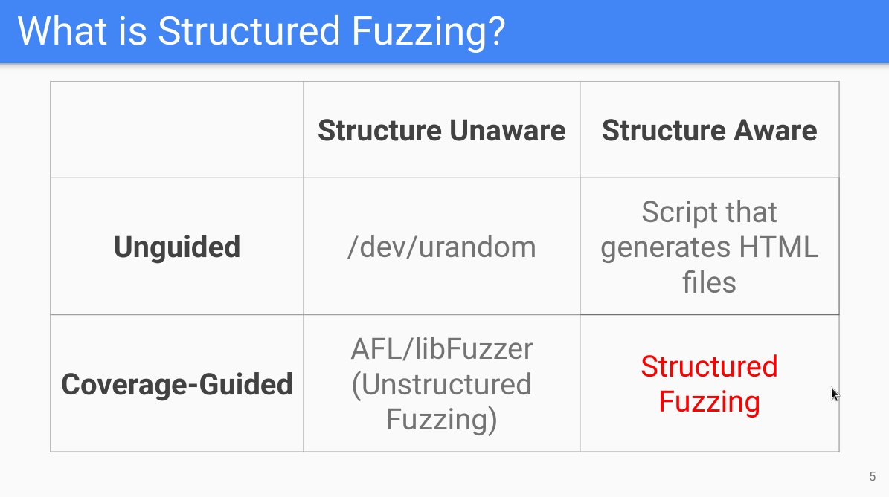
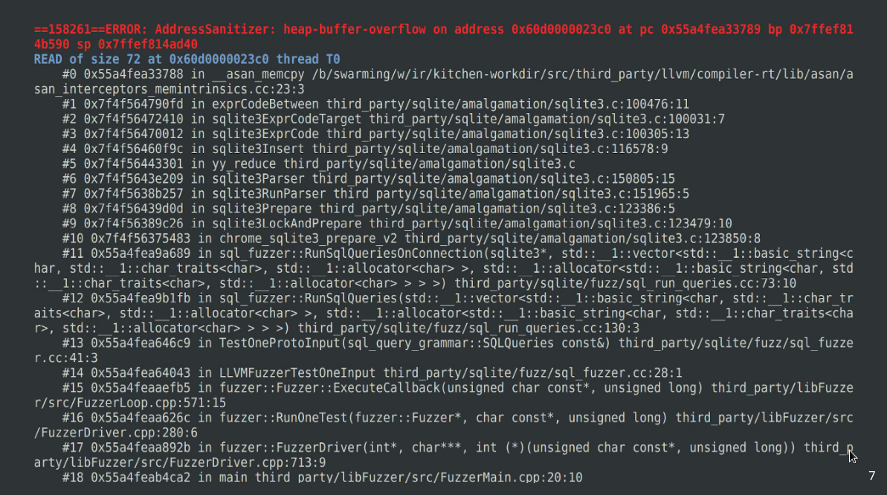
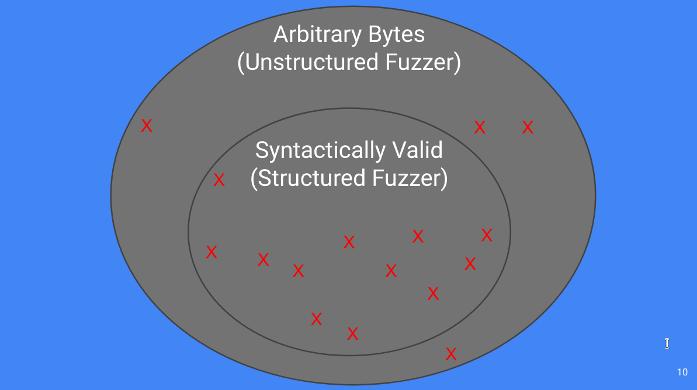
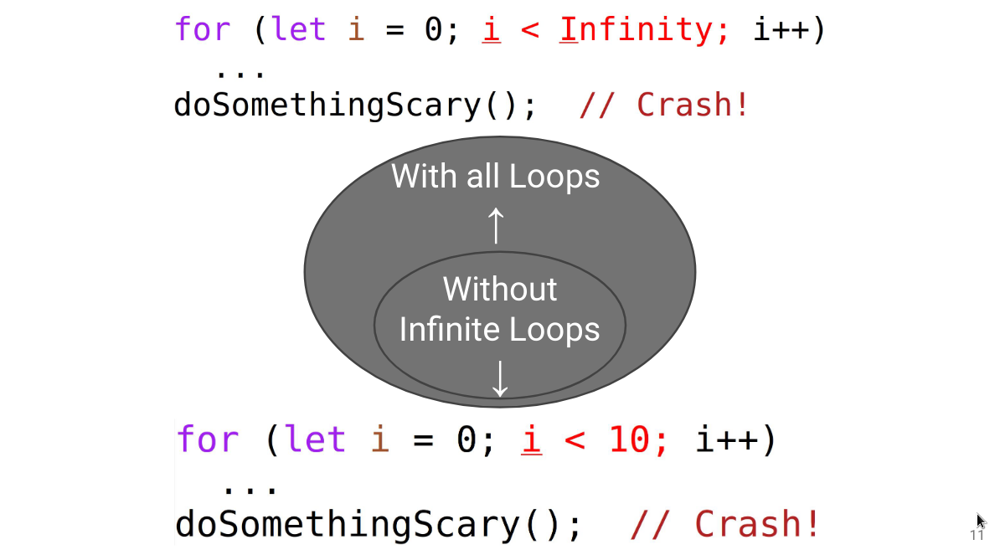
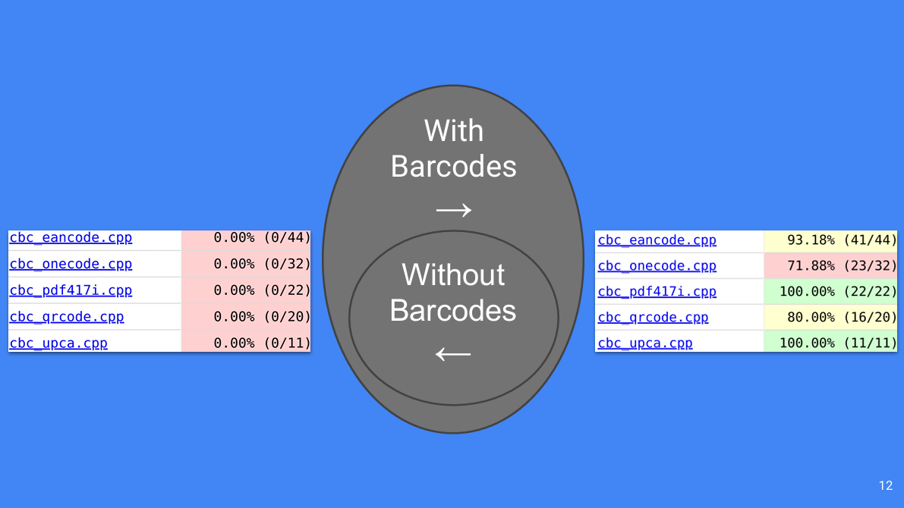
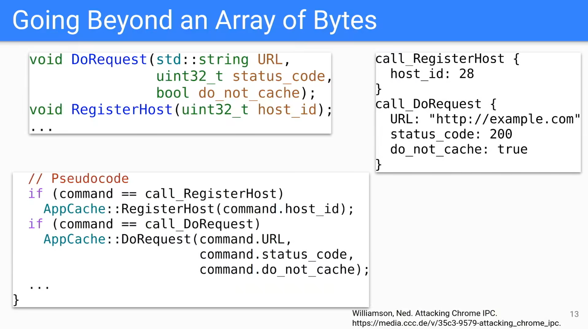
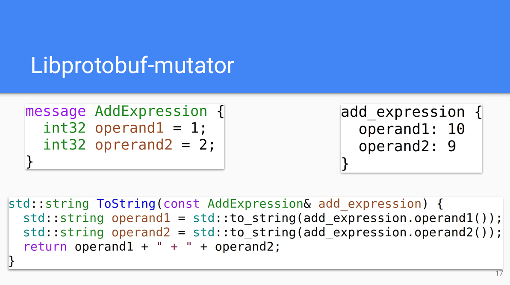

## 什么是结构化感知

模糊测试从最初发展到现在，经历了4个阶段：
1. 无覆盖率引导的，非结构化感知的，通过/dev/urandom生成输入，与魔法无异。
2. 无覆盖率引导的，结构化感知的，基于生成的方法。
3. 覆盖率引导的，非结构化感知的，基于通用变异，虽然无法感知结构，但是由于覆盖率反馈，仍然表现良好。
4. 覆盖率引导的，结构化感知的，基于结构变异，是下一代fuzzer方案。

## 为什么需要结构化感知

fuzz的初心是挖掘漏洞，结构化感知的方案可以挖出更多漏洞。对于下面的 sqlite 堆溢出，非结构化感知的oss-fuzz经过了多年的持续fuzz，输入了数百亿的测试用例，仍然无法发现。然而结构化fuzz很快就找到了。 

结构化fuzzer主要有以下4个方面的优势。
## 一、大多数bug不在表面
在下图中，非结构化感知的fuzzer获取输入用例，进行任意字节变异。比如对chrome的v8进行fuzz ，javascript代码作为输入，else可能变异成el0se。这会引入语义错误，导致解析失败。这些语义错误的测试用例停留在对解析器的测试（两个圈非重叠部分），无法对v8进行深层次的测试。
如果是结构化感知的fuzzer，可以保证测试用例的语义正确性，专注于后续的代码逻辑分支，进行深层次的测试（重叠部分）。 

这里需要注意2点：
1. 理论上非结构化感知的fuzzer也可以发现深层逻辑的bug（重叠部分）。这本质上是概率问题，但是在时间维度上，可能到fuzz到宇宙的尽头。
2. 大多数的bug都在语义正确的逻辑代码中，而不是停留在解析层面。
## 二、死循环和有限循环
为了实现高效的结构化fuzz，不仅要生成语义正确的javascript代码，还需要考虑约束测试用例空间，识别死循环，转而生成有限循环。例如，下图中的代码中存在bug，有限循环就可以找到bug，不必生成死循环，无法覆盖后续分支。 

## 三、特性fuzz
结构化fuzz的优点之一就是可以针对某一个特性进行fuzz。作者给chrome编写barcode测试代码，比如pdf的barcode特性，实现在cbc_pdfs417i.cpp中。从覆盖率信息可以看到，结构化fuzz可以做到对目标的某一个特性进行fuzz。教导fuzzer进行特性fuzz可以更容易，更低成本的找到bug。 

## 四、多维度输入
除了上述优点，结构化fuzz可以生成多维输入，覆盖到更多的分支。如下图所示，DoRequest函数有3个参数，那么就可以定制变异，生成多维的参数组合。 

## 如何实现结构化感知

以libfuzzer为例，首先需要写一个定制变异函数，对于javascript进行fuzz，可能需要写AST解析，在AST之上作变异。更简单的方案是使用libprotobuf-mutator写语法文件，将测试用例序列化，在protobuf结构上作变异。

## 提问环节
Q：你怎么看AFLSmart？
A：AFLSmart是与libprotobuf-mutator相似的方案，它需要写peach pit语法。但是相比于写peach，每个人都会写C++，而不需要学习新的格式。
Q：未来是否考虑使用AFLSmart来替代？
A：目前项目所有样例都采用的libprotobuf-mutator，而且二者都是相似的方案，不考虑替代。

## 样例
[Appcache fuzzer](https://chromium.googlesource.com/chromium/src/+/ada0c8e9c3c7b1ef3d592119688d8e8b9244f69d/content/browser/appcache/appcache_fuzzer.cc) 
[Skia fuzzer](https://chromium.googlesource.com/chromium/src/+/ada0c8e9c3c7b1ef3d592119688d8e8b9244f69d/testing/libfuzzer/fuzzers/skia_image_filter_proto_fuzzer.cc) 
[SQLite fuzzer](https://cs.chromium.org/chromium/src/third_party/sqlite/fuzz/?q=sqlite+fuzzer&dr=C) 

