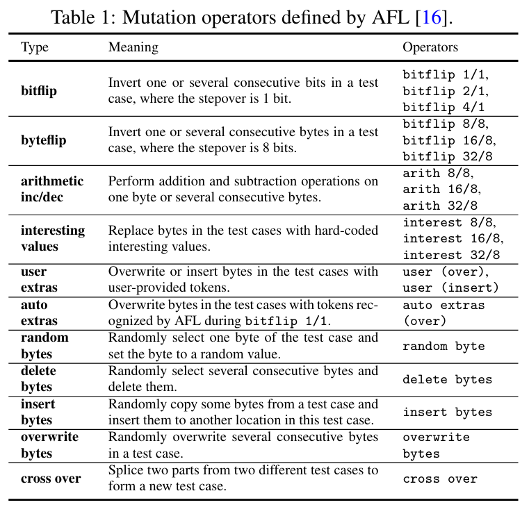
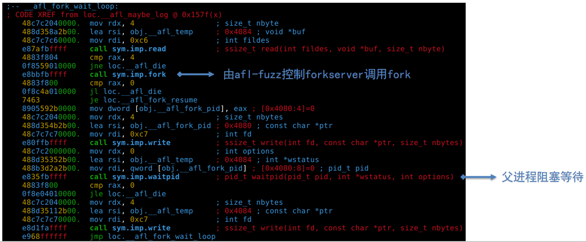
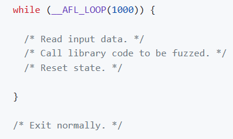

## SOTA

AFL是当前模糊测试研究的基线，本节讨论了AFL和过去几年为改进AFL的各种方面做出的研究。
### 一、AFL
AFL是American Fuzzy Lop的简称，是一种基于遗传算法的模糊测试方案。它对一组测试用例进行变异，以达到程序中以前未探索的边或使计数桶产生变化。当这种情况发生时，使覆盖率发生变化的测试用例将被保存到测试用例队列中。

**1.覆盖率引导的反馈**

AFL的覆盖率反馈是一种混合度量，混合了边覆盖率与一次运行中执行相应边的计数。此计数被粗粒度地分桶统计，如下列桶。
1，2，3，4-7，8-15，16-31，32-127，128+。
如果一个输入执行的边以一个新桶来统计，则被认为是interesting的，保存到队列中。这些桶或称命中计数(hitcount)在执行期间被记录到一个共享位图(bitmap)中，其中每个字节代表一个边的计数。
由于AFL位图的大小是有限的(64KB)，所以当一个程序的边数大于2^16时会发生碰撞，同时由于统计边时的映射方式同样可能存在碰撞。


__afl_store代码段将代表该桩的随机数rcx与上一个桩的随机数__afl_prev_loc异或运算存入rcx，当前桩的随机数右移1位(目的是对于A->B、B->A这种情况，可以将A->B和B->A区分出来)赋值到新的__afl_prev_loc，*[__afl_area_ptr+rcx]是在位图中将该边的计数加0x01。adc指令将CF上的进位值也相加，达到NeverZero的目的。
最后，AFL中当有新的边 (BB->BB)出现或记录的边出现新的命中桶则视为产生新状态。每次执行程序后，对比位图有无产生新状态来决定是否保存测试用例。

**2.变异**

在覆盖率统计过后，interesting的testcase会被保留，等待下一轮的变异。AFL的变异分为三类：
1. 确定性变异deterministic
确定性变异包括在测试用例的内容上进行单个的确定性变异，如位翻转、加法、用一组常见值（例如-1、INT_MAX…）进行整数代换等。
2. 破坏性变异havoc
在破坏性变异中，变异是随机叠加的，还包括改变测试用例的大小（例如添加或删除部分输入）。
3. 拼接splicing

AFL可能会将两个测试用例合并为一个，并执行破坏性变异。


**3.forkserver**

为了避免execve()的开销，AFL使用了forkserver。AFL把通过进程间通信机制IPC控制的forkserver插桩到目标中。每当AFL需要执行一个测试用例时，它就会写入输入，然后告诉目标进行fork，子进程将执行测试用例，父进程阻塞等待。forkserver稍后继续在目标中fork。在这种方案下，AFL不需要每次调用execve()浪费昂贵的初始化和启动进程时间。
afl将一个循环__afl_fork_wait_loop插桩到目标中，每当AFL需要执行一个测试用例时，由afl-fuzz控制forkserver调用fork，子进程进行模糊测试的覆盖率统计，父进程阻塞等待。


**4.持久模式**

正常情况下，对于每一个测试用例，都会fork()出一个新的目标进程进行处理，而大量fork()无疑会带来大量开销。为此，将一个loop patch到测试目标中，每次fork()得到的进程，会对一批而非单个测试用例进行处理，从而减少了开销，提高了执行速度。


使用宏定义__AFL_LOOP(NUM)来决定单进程处理多少测试用例。需要注意的是每次fuzz过程都会改变一些进程或线程的状态变量，因此，在复用这个fuzz子进程的时候需要将这些变量恢复成初始状态。

### 二、智能调度

一个覆盖率引导的模糊测试工具，应有不同的优先级算法来调度模糊测试流水线中的测试用例。调度器的目标是：通过智能的测试用例选择来提高总体覆盖率和bug检测效率。

**1.AFLFast**

Marcel Böhme等人提出的AFLFAST：相比于向高频路径倾斜过多的AFL，作了几项改进，转而强调低频路径。低频的路径是指，在模糊测试中测试用例很难或者是很少到达的路径。以探索更多分支进而发现更多bug。

**2.MOpt**

作为种子调度的一个横向问题，MOPT引入了变异调度。在这项工作中，Lyu等人以粒子群优化算法为灵感，对候选变异算子的效率进行动态评估，并将其选择概率调整到最优分布。这种优化提高了模糊测试工具快速发现interesting种子的能力。

### 三、障碍绕过

很多时候，覆盖率引导的模糊测试会遇到障碍，无法探索障碍背后的路径。典型的障碍是大规模的比较，如字符串比较和校验和检查。为了解决这个问题，进行了一系列的研究。

**1.LAF-Intel**

LAF-INTEL是一项旨在绕过多字节困难比较的工作，它将多字节比较拆分为多个单字节比较。这样，这些比较可以逐字节传递，覆盖率引导的模糊测试器便可以接收每个部分的反馈。详细地来说，LAF Intel作了以下工作：

1. 将>=(<=)运算符简化为 >(<) 和==比较的链。
2. 将有符号整数比较更改为仅比较符号和无符号比较的链。
3. 将所有位宽为64、32或16位的无符号整数比较拆分为8位的多重比较链。

LAF-intel列出了针对多字节困难比较、字符串比较两种情况的拆分方法。

**针对多字节困难比较：**
对于左图这样的代码，只有当变量input的值等于0xabad1dea时，才会执行bug代码。每当AFL生成一个不符合的输入，都不会使覆盖率产生变化，即使输入是几乎正确的0xabad1deb，也不会产生有作用的反馈。


如果像右图这样将其以单字节拆分，相比之前的四字节比较容易产生新的边，便可以引导AFL生成正确的输入，进而探索到bug代码。

**同理，针对字符串比较：**
调用了strcmp函数的左图，可修改为单字符比较的右图。


**2.RedQueen**

REDQUEEN在KAFL的基础上，探索了绕过困难比较和(嵌套)校验和检查的方案，但不使用诸如污点跟踪或符号执行之类的昂贵技术。该模糊测试方案专注于Input-to-State（I2S）的比较，这是一种与至少一个操作数中的输入直接相关的比较类型。作者表明，许多障碍都是这种类型的，并开发了一种定位和绕过它们的技术。
I2S关联的例子如下图所示。对cmp指令进行hook，运行指令时可以观察到eax的值为VALU，0x44434241则为ABCD(均为小端序)。

input中同样有VALU出现，由此推断：如果将输入中的VALU替换为ABCD，就有较大可能绕过这个障碍。

## AFL++

除了集成并优化智能调度、绕过障碍方面的研究成果之外，AFL++相比于AFL还有更多有用的功能。
### 一、定制变异器API
AFL++可以很容易地在新的模糊测试场景中进行扩展，适用于发现指定目标的漏洞。定制变异器允许模糊测试研究在AFL++之上构建新的调度、突变和修剪，而无需对AFL进行fork、patch，就像当前的许多工具一样。

对此的支持最初是在Holler fork的AFL中独立开发的，但后来得到了扩展，具有许多新功能。插件可以用C/C++编写，也可以用Python进行原型化。

以C/C++编写的变异器库为例，要在AFL++中单独使用该库，需要先设置环境变量：
``` shell
export AFL_CUSTOM_MUTATOR_ONLY=1
export AFL_CUSTOM_MUTATOR_LIBRARY="/path/to/libmutator.so"
```
### 二、插桩相关

**1.NeverZero**

AFL++对AFL的命中计数机制进行了优化。在位图中用一个字节保存命中计数的问题是，边执行的计数可能会溢出。如果边计数是256的倍数时，相应的字节将溢出到0。我们试图用两种解决方案来解决这个问题：NeverZero和饱和计数器。

NeverZero方案：为了避免溢出到0，将进位标志添加到位图项，因此，如果边至少执行一次，则该项永远不会为0。
饱和计数器方案：在边计数达到255时冻结计数器。

在所有项都饱和(255)之后的情况下，NeverZero比饱和计数器更好，因为NeverZero可以以非常低的成本区分具有不同计数的不同输入。
总之，AFL++选择将NeverZero作为大多数插桩后端的默认值。饱和计数器方案仍然存在于AFL++源码的一个分支中，用于进一步研究或复制。

**2.插桩后端**

AFL++支持以下五种插桩后端：LLVM，GCC、QEMU、Unicorn和QBDI。

**LLVM后端：**
LLVM是编译器后端，常搭配clang使用，若想使用LLVM模式，需要使用afl-clang-fast来编译目标文件。在LLVM模式下，除了支持AFL方案外，AFL++还支持一系列覆盖率度量：

1. Ctx coverage(上下文敏感的边覆盖率)：与AFL统计边覆盖率不同，Ctx方案把栈状态也加入了边覆盖率的映射运算。因为上下文改变之后，程序到达同一个分支可能触发新的栈状态，这种方案在代码覆盖率方面似乎是有效的，但会带来更多的碰撞和更低的速度。

2. Ngram：在记录边时不止异或当前块和目的块，还异或当前块的前N-1个块(其中N是2到16之间的数字)这样虽然增加了异或操作，但是能提高性能。

**GCC编译器：**
除了旧的afl-gcc封装外，afl++还提供了一个gcc插件。它包括对延迟初始化和持久模式的支持，如AFL LLVM模式。支持的功能与LLVM不一样，但AFL++正在计划提供其他功能，目标是实现功能的均等。

**QEMU模式：**
在AFL++中，AFL-QEMU补丁得到了升级。与其他二进制插桩相比(如基于RetroWrite的插桩)，QEMU模式在模拟时动态插桩，好处是可以在程序运行的过程中修改、插入代码，但这也使得模糊测试的效率极大降低。最近，QAsan等扩展了AFL++的QEMU模式，以支持对堆冲突的清理，并结合了ASan的基于动态二进制翻译的实现。
1. CompareCoverage：为了缩小源码级和二进制级模糊测试之间的功能差距，AFL++ QEMU模式可以使用CompareCoverage以类似于LAF INTEL的方式拆分比较。与LLVM pass不同，该代码不会被修改，但是会hook所有比较，并会比较每个操作数的每个字节，如果相等，则在位图上分别进行记录。
2. Persistent模式：与旧的AFL-QEMU模式不同，AFL ++的QEMU模式支持持久模式。此模式最高可以达到10倍加速，因此AFL++建议尽可能使用此模式。

有两种主要方法可以实现QEMU模式的Persistent模式：
1. 循环一个函数：用户指定一个函数的地址，模糊器会自动在while(__AFL_LOOP(NUM))循环中使用该函数，修改其返回地址。该地址也可以不是函数的第一条指令，但是在这种配置下，用户必须提供栈上的偏移量，以正确定位要修改的返回地址。
2. 指定入口点和出口点：用户可以指定循环的第一条指令和最后一条指令的地址，QEMU将在运行时修改代码以在这些地址之间生成循环；


**3.RetroWrite**

RetroWrite是一个静态二进制重写器，可以与AFL++和ASan组合使用。如果x86_64或arm64二进制文件不包含C++异常，仍有其符号表并使用位置无关代码（PIC/PIE）编译，则很适合使用RetroWrite进行静态插桩。它将二进制文件反编译为ASM文件，然后可以使用afl-gcc对其进行插桩。
使用基于RetroWrite的静态插桩，在性能上接近源码编译时插桩，并且优于基于QEMU的插桩。
该项目开源在[github](https://github.com/HexHive/retrowrite)。