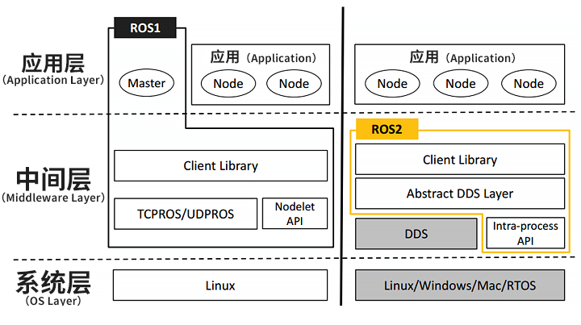
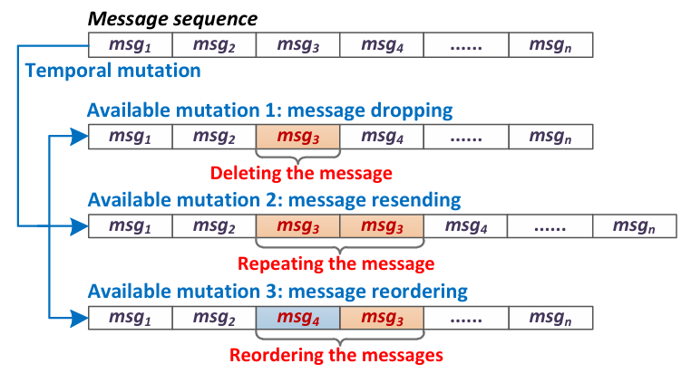
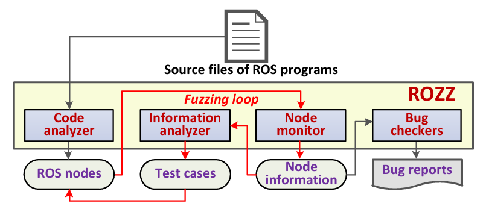
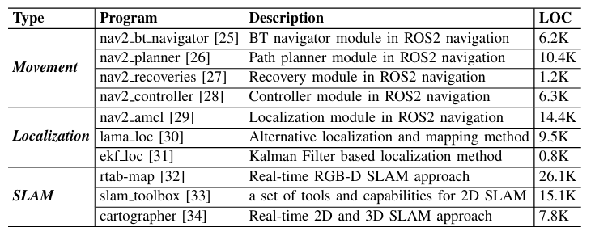

## ROZZ的挑战

### 一、ROS

ROS程序的测试需求：
1. ROS在机器人软件开发中广泛应用，但其程序复杂且需处理多种异常，开发可靠安全的ROS程序面临挑战。
2. ROS程序控制机器人与物理世界和人类交互，安全漏洞可能被攻击者利用，导致危险后果。

ROS架构：
从ROS1到ROS2，ROS实现了去中心化的架构设计。

### 二、模糊测试在ROS程序中的挑战

在ROS中实施模糊测试，会面临以下三种挑战：
1. ROS程序接收多维输入，如用户数据、配置参数和传感器消息。
但是现有的模糊测试方法只从一个维度生成测试用例，即用户输入。
2. 每个ROS程序作为一个ROS节点运行，与其他ROS节点通信以协作执行机器人任务。因此，测试单独的ROS节点通常是没有意义的。
3. 每个ROS节点发送的消息是顺序的，这种消息序列会由于网络中断或USB断开导致的通信不稳定而乱序。现有方法不能测试处理时序的代码。

## ROZZ的关键技术

针对上述的三种挑战，论文分别提出对应的三种技术来解决。

### 一、多维测试用例生成方法

ROZZ从三个维度生成测试用例，作为输入同时作用于目标ROS节点。
1. 用户数据：来自GUI，命令行，ROS服务。
2. 配置参数：从特定的配置文件中读取，对机器人进行配置，如最大移动速度和最小旋转角度。
3. 传感器信息：从各种传感器，如激光雷达生成的消息。

### 二、分布式分支覆盖统计

针对ROS程序的分布式节点模型，ROZZ提出了一种分布式分支覆盖方法，用于描述多个ROS节点在机器人任务中的整体代码覆盖率。

### 三、时序变异策略

针对ROS程序输入的时序特性，ROZZ设计了一种时序变异策略，通过改变传感器消息序列的顺序来生成具有时序信息的测试用例。

时序变异策略提供了三种可用的时间变异模式，以模拟通信不稳定的情况：
1. 消息丢弃
2. 消息重发
3. 消息重排序

### 四、ROZZ的设计与实现

使用Clang9.0，对被测的ROS程序的LLVM字节码进行代码插桩和动态分析，其架构包括代码分析器、信息分析器、节点监控器和漏洞检查器。

ROZZ的工作流程：
1. ROZZ通过代码分析器对ROS程序进行代码插桩，生成可执行的ROS节点。
2. 节点监控器执行插桩代码，收集每个ROS节点覆盖的代码分支，并计算分布式分支覆盖。
3. 信息分析器检查分布式分支覆盖，识别有趣的种子测试用例。
4. 漏洞检查器分析收集到的运行时信息以检测漏洞并生成漏洞报告。

## ROZZ评估与结果

**测试对象：**
10个ROS2机器人程序，涵盖导航（如nav2_planner、nav2_controller）、定位（如nav2_amcl）和SLAM（如slam_toolbox、rtab-map）等核心功能模块。

**虚拟环境：**
使用Gazebo 11.5仿真平台，模拟机器人TurtleBot3 Waffle，配备激光雷达、里程计、IMU和2D摄像头等传感器，以复现真实场景。

**漏洞类型：**
内存漏洞，空指针解引用（6）、释放后使用（5）、缓冲区溢出（3）、无效指针访问（11）。
逻辑漏洞，未捕获异常（18），由被测程序、第三方库、api调用引发。

**漏洞分析：**
并发问题，5个UAF漏洞由数据竞争引发（如线程A释放内存后，线程B仍尝试访问）。
未验证输入，11个漏洞发生在程序初始化阶段，例如未校验用户输入的无效参数。
第三方依赖，7个漏洞源自ROS核心组件（如rclcpp）或库（如OpenCV）。

**漏洞样例：**
UAF（a）发生在并发处理中，未捕获异常（b）逻辑未对隐式异常进行处理，栈越界（c）同样发生在并发处理中。

## 总结

**优势：**
在覆盖分支统计上，ROZZ明显优于ROS2-fuzz和ASTAA-like。在ROS场景，ROZZ提出的多维生成方法、分布式分支覆盖和时序变异策略具有相当大的优势。
**局限性：**
ROZZ目前只能测试C/C++程序，且在覆盖特殊执行情况（如异常处理和线程交织）方面存在限制。
ROZZ目前只能检测内存漏洞，无法检测语义漏洞，比如异常的机器人行为。
