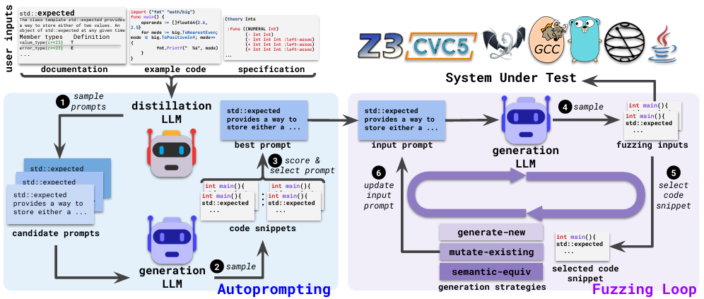
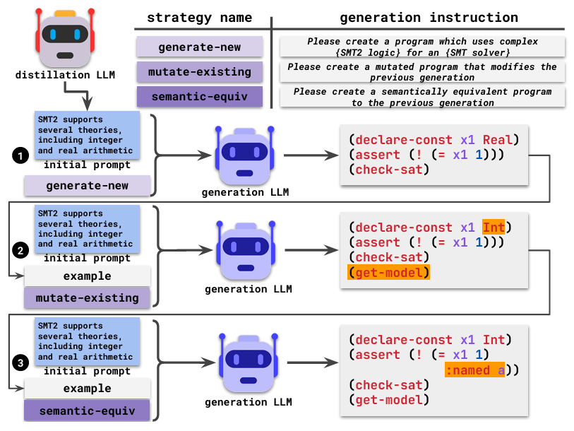
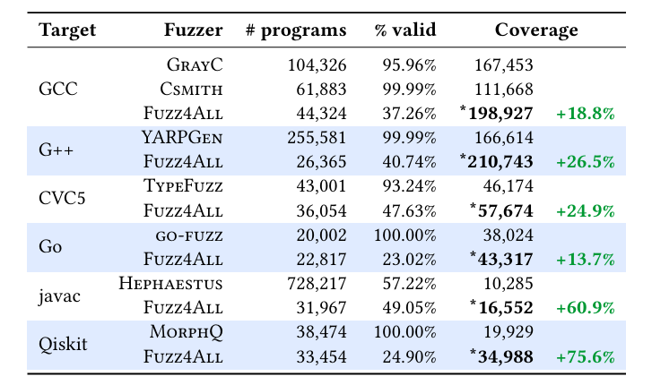
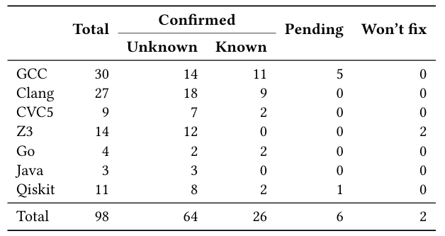

 
## 简介

Fuzz4All开源在[github](https://github.com/fuzz4all/fuzz4all)。
简介从以下两点介绍该论文：1. 目前模糊测试（下文以fuzz代替）存在的问题。 2. Fuzz4All作的工作。

### 一、fuzz存在的问题

首先概括一下fuzz的概念。fuzz是常用的自动化漏洞挖掘方案，它生成大量输入，测试SUT(被测系统)的安全边界。其中有一个重要的SUT族，它们使用代码作为输入：
1. 编译器，比如Clang
2. 运行时引擎，比如Go-runtime
3. 约束求解器，比如Z3

以下列出的问题，针对的是上面的SUT族：
1. **fuzz工具不能通用。**
针对特定语言、特定系统，需要投入成本开发新的fuzz工具，即结构感知的fuzz。比如测试JVM的jazzer，测试go的go-fuzz，当然无法使用jazzer来测试go。
2. **无法与时俱进。**
SUT是发展的，不断进行版本迭代的，当前的基线工具很难跟上版本。比如Csmith只支持c++ 11特性，在论文作者使用它进行fuzz的6个月期间，未能在新版本编译器中发现bug，表明新版本的编译器对Csmith是免疫的。
3. **生成的测试用例质量低。**
基于生成的fuzz严重依赖语法、语义规则，但是基线工具往往只配备了规则的一个子集。而基于变异的fuzz受到变异算法、高质量初始用例的约束。

### 二、Fuzz4All的工作

为了解决上述问题，提出了Fuzz4All，第一个通用的fuzzer。它可以针对所有编程语言，覆盖所有特性进行fuzz。
1. **核心思想**
LLM是经过数十亿代码训练的，LLM高度理解编程语言的语义和语法，那么可以利用LLM作为测试用例的生成器、变异器。
2. **Fuzz4All的输入**
被测语言的信息作为输入，比如官方文档、示例代码、规范文件。同时工具提供了**自动提示词引擎**，可以把输入转换成LLM的提示词。
（提示词：引导LLM生成高质量的输出的文本片段。）
3. **测试循环**
为了实现高效的迭代测试，工具设计了**LLM驱动的测试循环**，它可以迭代更新提示词，以生成高质量的测试用例。具体而言，通过将前几次迭代中生成的模糊测试输入与自然语言指令相结合来实现。

## 实现

Fuzz4All的整体框架如下图所示，实现有两大组成部分：自动提示引擎、测试循环。

### 一、自动提示引擎

首先，需要一个蒸馏LLM，它负责把冗长的输入凝练成适合fuzz的若干提示词①。对蒸馏LLM说“*请用简洁的方式总结上述信息，以描述目标的用途和功能。*”
还要有一个生成LLM②，根据若干提示词生成fuzz输入，即每个提示词生成一些代码片段。根据代码片段对提示词打分，选出最合适的提示词③。默认的打分函数：以生成的有效输入数量作为指标。

### 二、测试循环

根据自动提示引擎得到的提示词，生成fuzz的测试用例④，输入给SUT。在循环过程中，选择一个策略，对提示词进行更新⑤。论文提出三个策略：基于生成、基于变异、相同语义。
后续，使用更新后的提示词⑥，再次生成fuzz输入，形成测试循环。

### 三、提示词更新策略

在测试循环中，迭代测试的关键是三个更新策略，它可以保证LLM不断生成高质量的测试用例。下图是应用三个更新策略的例子。

1. 基于生成，主要用于初始提示词。对LLM说“*请为SMT求解器创建一个使用复杂逻辑的程序。*”
2. 基于变异，用于迭代测试，生成高质量测试用例。对LLM说“*请修改前一个输入，创建一个变异后的输入。*”
3. 语义相同，可以进一步提高覆盖率。对LLM说“*请创建一个语义上等价于上一个的输入。*”

### 四、LoC方面

LoC方面Fuzz4All有巨大的优势，由于工作重心在提示词和LLM上，Fuzz4All仅由872行Python代码组成。而前面提到的Csmith，为了支持所有规则的一个子集，就编写了80k+行C++代码。

## 实验评估

### 一、实验设计

1. 实验时间，每次实验持续24小时。
2. 实验次数，对fuzz4all和基线工具实验5次。
3. LLM，GPT4作为蒸馏模型，StarCoder作为生成模型。
4. 实验环境， 64核工作站、256GB内存、NVIDIA RTX A6000 GPU，运行Ubuntu 20.04.5 LTS。
5. 三个评估标准，代码覆盖率、命中率、bug数量。

### 二、实验对象
实验涉及六种编程语言（C、C++、Go、SMT、Java和Python）和九个对象（如GCC、Clang、Z3等）。

### 三、实验评估

在命中率方面，fuzz4all普遍低于基线工具，然而在相同的测试时间内（24小时），覆盖率却高于基线工具。说明fuzz4all更符合模糊测试的目的，命中率本质上是为覆盖率服务的，LLM以低命中率实现了高覆盖率，表明fuzz4all的有效用例具有很高的质量。

### 四、实验结果

fuzz4all总共复现、新发现了98个漏洞，其中包括64个未知漏洞，每个漏洞都向项目提交了issue。

### 五、实例

fuzz4all向go提交了一个[段错误](https://github.com/golang/go/issues/61158)，该漏洞发生在runtime模块的ReadMemStats函数中，向该函数传递参数nil会触发runtime的段错误，而不是runtime处理的panic。

对ReadMemStats函数打补丁，检测nil。
