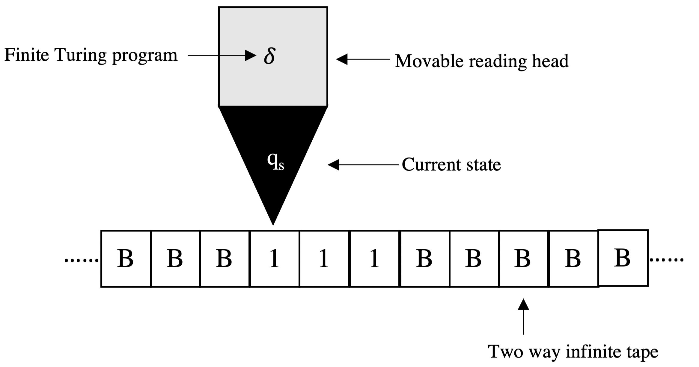

## 算法思想

算法思想是为解决特定计算问题而提出的方法论，在于为数据结构的操作提供理论指导和实践框架。典型应用场景包括：高效排序算法的设计，查询操作的加速实现。需强调的是，针对同一计算问题往往存在多种可行的算法思想，其适用性高度依赖于具体问题的约束条件与性能需求。

### 一、枚举

枚举思想（Enumeration）的核心是：系统性遍历问题解空间的所有候选解，通过预设条件对每个候选解执行可行性判定，保留满足约束的有效解而排除无效解。与之形成辩证统一的是筛选思想（Siltration），通过建立约束规则集，主动消除解空间中不满足问题条件的无效解，使剩余解集自然收敛至目标解。

枚举思想的应用：
- 字典攻击
  
筛选思想的应用：
- Euler筛法

### 二、递推

递推思想（Recursion）的核心是：通过初始条件与递推关系式的迭代运算。其推导过程存在两种范式：顺向推导，从初始状态逐步演算出后续状态；逆向推导，则从目标状态反向推导前置依赖条件。

递推思想的应用：
- 彩虹表攻击

### 三、递归

递归思想（Recursion）的核心是：通过自相似结构将原问题分解为同构子问题，借助函数自我调用实现子问题的迭代求解，最终通过回归（Return）操作逐层整合局部解以构造全局解。

递归思想的应用：
- 分治思想
- 回溯思想
- 分支限界思想
- 动态规划思想

### 四、分治

分治思想（Divide and Conquer）的核心是：把求解过程分成三个阶段，划分、求解、合并。首先将原问题分解为若干个互斥独立子问题；其次通过递归链对子问题进行逐层规约，直至达到可直接求解的阈值规模；最终通过合并函数重构子问题解以形成全局解。

分治思想的应用：
- 归并排序

### 五、回溯

回溯思想（Backtrack）的核心是：通过试探-回溯范式，在解空间树中深度优先构造部分解向量，通过可行解判定函数验证当前路径的可行性，若存在有效扩展则继续前进；当所有候选分支均违反约束时触发状态重置，回退至最近决策点重新选择。

回溯思想的应用：
- 深度优先搜索（DFS）

### 六、分支限界

分支限界思想（Branch Limit）的核心是：与回溯思想的区别在于，当前分支不可行时，转向全局最优潜力分支继续扩展，而非回溯至最近决策点。

分支限界思想的应用：
- 广度优先搜索（BFS）

### 七、动态规划

动态规划思想（Dynamic Programming）的核心是：与分治思想的区别在于子问题的处理机制，当问题具有最优子结构且子问题解存在重复计算时，分治法因自顶向下递归导致时间复杂度呈指数爆炸；动态规划则通过建立N维的dp状态转移方程，自底向上迭代将递归树优化为多项式复杂度。

动态规划思想的应用：
- 最长公共子串（LCS）
- 最优二叉搜索树（Optimal BST）

### 八、贪心

贪心思想（Greedy）的核心是：通过局部最优性准则,在每一步选择中即时选取当前最优解,将局部解序列收敛至全局最优解。其优势在于快速求解，理论局限性在于无法保证全局最优性。

贪心思想的应用：
- 页最佳置换（OPT）
- 最小生成树（MST）

### 九、模拟

模拟思想（Simulation）的核心是：通过计算模型抽象现实系统，利用计算机的并行处理与数值计算能力实现映射关系。

模拟思想的应用：
- 虚拟化技术
- 神经网络

### 十、有限状态机

有限状态机思想（FSM）的核心是：定义为五元组$<Q,q0,Σ,δ,F>$，
- $Q$ 为有限状态集
- $q0 ∈ Q$ 为初始状态
- $Σ$ 为输入
- $δ$ 为状态转移函数
- $F ∈ Q$ 为终止状态

显式建模对象生命周期，通过状态转换图将复杂行为逻辑抽象为确定性规则，显著优于传统条件分支（if-else）的复杂度。

有限状态机思想的应用：
- 图灵机
- 硬布线的电路设计
- 进程调度

## 数据结构

数据结构是逻辑关系与物理存储的协同抽象，由数据类型、存储结构共同构成。在解决特定计算问题时，本节将分析典型数据结构的应用场景。

### 一、数据类型

#### 1.数值数据类型

数值包括有三种：带符号整数、无符号整数和浮点数。同时，根据字节、字、双字和四字划分，各自又可分为四种。

**1.1 带符号整数**

对带符号整数的所有运算都采用补码表示，符号位位于字节整数的第7位、字整数的第15位、双字整数的31位和四字整数的63位，负整数时符号位置1，正整数时置零。整数值的范围从–128到+127（字节整数，int8_t），从–32768到+32767（字整数，int16_t），从$–2^{31}$到$+2^{31}–1$（双字整数，int32_t）和从$–2^{63}$到$+2^{63}–1$（四字整数，int64_t）。

**1.2 无符号整数**

无符号整数的值范围从0到255（无符号字节整数，uint8_t），从0到65535（无符号字整数，uint16_t），0到$2^{32}–1$（无符号双字整数，uint32_t）和0到$2^{64}–1$（无符号四字整数，uint64_t）。无符号整数有时被称为序数。

**1.3 浮点数**

四种浮点数据类型：半精度浮点（half）、单精度浮点（float）、双精度浮点（double）和双扩展精度浮点（extended double）,直接对应于浮点运算的IEEE标准754中指定的格式。

对于半精度、单精度和双精度格式，只对有效位的小数部分进行编码。对于除0和非规范化有限数之外的所有数，假设整数为1。对于双扩展精度格式，整数包含在位63中，最高有效分数位是位62。这里，对于规范化数字、无穷大和NaN，整数显式设置为1，对于零和非规范化数字，整数设置为0。
  
#### 2.指针数据类型

指针是内存中位置的地址。以32位体系结构为例，定义了两种类型的指针：近指针和远指针。

- 近指针是段内的32位偏移量（也称为有效地址）。近指针用于平面内存模型中的所有内存引用，或用于分段模型中的引用，其中隐含了要访问的段的标识。
- 远指针是一个逻辑地址，由16位段选择器和32位偏移量组成。远指针用于分段内存模型中的内存引用，其中必须显式指定要访问的段的标识。具有32位偏移的近指针和远指针如下图所示。

#### 3.比特域数据类型

比特域是一个连续的比特序列。它可以从内存中任何字节的任何位位置开始,最多可以包含64位。

#### 4.字符串数据类型

字符串是位、字节、字或双字的连续序列。比特串可以从任何字节的任何比特位置开始，最多可以包含$2^{64}–1$个比特。字节字符串可以包含字节、字或双字，范围从0到$2^{64}–1$字节。

### 二、物理结构

数据的物理结构表示其在计算机硬件中的存储方式，通常有顺序存储、链式存储、索引存储和哈希存储。

### 三、逻辑结构

逻辑结构从逻辑关系上描述数据，分为线性表和非线性集合。

### 1.线性表

线性结构大致包括四种结构：一般线性表、栈和队列、串和数组。

**1.1 一般线性表**

一般线性表可以根据3种存储方式来分类：顺序存储、链式存储和哈希存储。

**顺序存储，顺序表**

顺序表存储在地址连续的单元中，特点是可以随机存取数据，插入操作和删除操作的时间耗费在数据移动上。

**链式存储，单链表、双链表、循环链表和静态链表**

链式存储插入和删除操作不需要移动数据，但失去了随机存取的特点。
- 单链表，插入操作和删除操作的时间耗费在查找数据上。
- 双链表，与单链表相比，双链表优势在于访问前驱。
- 循环链表，优势在于可以从任何节点出发遍历。
- 静态链表，是借助数组让没有指针的高级语言也能够实现链表功能，也可以在内存受限设备中不使用malloc/free实现链表功能。
  
**哈希存储，哈希表**

跟据Hash函数映射的一般线性表称为Hash表。通过顺序表存储的Hash表会存在较大的冲突问题，因此通常采用Hashmap（链表搭配指针数组）存储Hash表。

**1.2 栈和队列**

栈和队列是操作受限的线性结构，它们被设计来满足特定的操作特性。

- 栈被设计满足LIFO特性，只能在栈顶进行插入和删除操作。操作系统下，通过顺序表实现栈，栈的最大容量由操作系统规定。算法场景下，通过单链表实现栈，是为了满足栈容量不确定的场景需要。
- 队列被设计满足FIFO特性，只能在一端插入，另一端删除。通过顺序表实现的循环队列，被应用于时间片轮转调度、缓冲区、线程池等场景。

**动态队列**

动态插入和删除的队列都称为动态队列，通常采用链式存储而不是顺序表。

**优先队列**

优先队列通过堆实现，队列里的任务有不同的优先级，根据优先级的高低，分为两种类型：最大优先队列和最小优先队列，分别基于最大堆和最小堆。以最大优先队列为例，支持四个操作：
- 插入一个任务，时间复杂度O(lgn)
- 返回拥有最大优先级的任务，时间复杂度为O(1)
- 删除并返回拥有最大优先级的任务，时间复杂度O(lgn)
- 增加一个任务的优先级，时间复杂度O(lgn)

基于以上，可以使用最大优先队列调度一个共享计算机上的任务，当一个工作完成或中断时，调度器选择优先级最高的任务。

**1.3 串**

串是用来存储字符串的线性结构，存储在顺序表中的字符串，约定结束符为’\0’，其时间复杂度与顺序表等同。

**1.4 数组**

数组是由n个相同数据类型的数据构成的有限线性结构，是顺序表在高维度上的推广。二维数组可以用来存储一般矩阵，三维数组可以用来存储三维空间中的位置或状态，如三维元胞自动机的存储。

**1.5 (二叉)堆**

堆，一般指二叉堆，区分于垃圾回收处理的堆空间，是算法使用的一种数据结构，每个数据存储在数组中，且对应于一棵完全二叉树，根据层序遍历顺序对完全二叉树节点进行编号，其中根节点下标为 1 。堆分为最大堆和最小堆，二者都用于堆排序和构造优先队列。

**1.6 bloom过滤器**

bloom过滤器是一种概率型数据结构，优点是大规模存储和不存在判定，由一个位数组和多个无偏hash映射函数组成。
对于k个hash函数计算出的k个位数组索引，如果在位数组上的k个位置都为0，说明一定不存在；如果都为1，也不一定存在，以误判率为衡量标准。

### 2.树

树是n个节点的有限集，是一种递归的非线性结构，在任意一棵非空树中：
- 有且仅有一个称为根root的节点。
- 当n>1时，其余节点可分为若干个互不相交的有限子集，称为根的子树。

多棵树构成一个森林，森林F中有树V(F)-E(F)棵。

**2.1 二叉树**

二叉树是特殊的树，它的特点是每个节点至多只有两棵子树，且有左右之分。对于一般二叉树，采用链表来存储合适，而对于特殊的二叉树(满二叉树、完全二叉树)采用顺序表来存储更合适。

**2.2 线索二叉树**

线索二叉树在链式二叉树的基础上，通过先序/中序/后序线索化在空指针中存储节点需要的前驱和后继，加快了查找节点前驱和后继的速度。

**2.3 二叉排序树**

二叉排序树（BST）同样是递归的结构，具有以下特性：
- 左子树节点值 < 根节点值 < 右子树节点值。
- 左右子树也分别是一棵二叉排序树。
  
对一棵BST使用中序遍历，会得到一个递增的有序序列。

**2.4 平衡二叉树**

平衡二叉树（AVL）在BST的基础上，通过旋转操作满足以下特性：
- 左子树和右子树的高度差的绝对值小于1
- 左右子树也分别是一棵平衡二叉树。

**2.5 红黑树**

红黑树（RBtree）在AVL的标准上放宽了条件，减少了平衡调整的频率。具有以下性质：
- 每个节点不是黑就是红
- root节点是黑
- null节点是黑
- 如果一个节点是红，那它的孩子都是黑
- 对于每个节点，所有从该节点到其叶子的简单路径都有相同数量的黑色节点
  
定理：n个节点的红黑树最高的高度为2lg(n+1)，红黑树的插入、删除、搜索操作的时间复杂度均为O(lgn)

**2.6 顺序统计树**

顺序统计树是扩展的红黑树，每个节点有额外的属性size，该属性表示以该节点为根节点的子树中内部节点的数量。顺序统计树适用于找到第i小的数据，时间复杂度O(lgn)。

**2.7 区间树**

区间树是扩展的红黑树，每个节点有额外的两个属性：区间信息和max，适用于区间查询：区间求和、区间最大值、区间最小值，时间复杂度O(lgn)。

**2.8 败者树**

败者树是完全二叉树，k个叶子节点对应于k路归并中归并段的输入。

**2.9 B树**

B树，即多路平衡查找树，实现为k叉平衡树，每个节点存放关键字和该关键字的卫星数据或该关键字的卫星数据的指针。

**2.10 B+树**

B+树，是B树的变形，内部节点只存放关键字和孩子指针，卫星数据存放在叶节点中，这样能够使得内部节点的分枝因子最大化。
在文件系统中，通常使用二者，因为k叉树相比于二叉树可以避免大量的磁盘访问。B 树和 B+ 树中的关键字一般用作文件索引，卫星数据一般用作文件数据。

**2.11 决策树**

决策树是完全二叉树，它可以直观反映基于比较的排序算法过程中的数据比较，比如快速排序和堆排序。其中，控制、数据移动等其他操作都被忽略。

**2.12 支配树**

支配树用来描述有向图节点的支配关系，对于一个可能存在环的有向图，我们规定一个起点root，从root到图上另一个点node可能存在多条路径，对于从root到node的任意路径中，都存在一个点mid，即从root到node必须经过mid，那么我们称mid为node的支配点。

我们将任意一个结点k的支配点中，除自身外与自己距离最近的结点 v 称作k的直接支配点，记作 idom(k) = v。显然除了root 没有直接支配点外，每个结点都有唯一一个直接支配点。我们考虑对于除root外每一个结点k从 idom(k) 向 k 连边，便构成了一个支配树。
支配树广泛应用于控制流分析中。

**2.13 树堆**

树堆Treap(Tree+heap)是一种修改了排序方法的二叉搜索树，对于每个节点x，被标记为x.key:x.priority，有以下性质：
- 对key建立二叉搜索树
- 对同key的priority建立最小堆

**2.14 基数树**

基数树易于存储键值对，例如<0101,"abc"> <010,"abcd"> <001,"bcde">，对于高度为h的基数树，插入、修改、搜索操作时间复杂度为O(h)。

**2.15 Huffman树**

Huffman树是所有带权叶节点二叉树中，带权路径长度WPL最小的二叉树。Huffman树的构造应用了贪心算法和最小堆。常见用于Huffman编码。

**2.16 并查集**

并查集是一种用于管理数据所属集合的树结构，实现为森林。其中每棵树表示一个集合，树中的节点表示对应集合中的数据。并查集支持两种操作：
- 合并，合并两个数据所属集合（合并对应的树）。
- 查询，查询某个数据所属集合（查询对应的树的根节点），这可以用于判断两个数据是否属于同一集合。

#### 3.图

图G由顶点集V和边集E组成，记作G=(V, E)。顶点的数量记作  V ，边的数量记作  E  。根据边有无方向，可以分为有向图和无向图；根据边上是否带有权值，可以分为无权值图和网。

**3.1 无向图**

两个顶点在边的两端，称为邻接的，顶点作为端点的边数量称为度。所有顶点的度degrees=2*edges，等于边的两倍。
- 四色定理，无向图中每两个连通的顶点都着不同的颜色，那么需要四个颜色即可。着色问题可用于解决基站信道分配、给程序变量分配寄存器。
- 哈密顿(Hamiltonian)路径，只访问图中每个顶点一次，闭合则称为回路。旅行商问题TSP即寻找权值和最小的哈密顿回路。

**3.2 有向图**

若一个有向图中不存在环，则称为有向无环图DAG。在DAG中，顶点表示活动的网称为AOV网，边表示活动的网称为AOE网。

有向图和无向图都可以通过二维数组存储邻接矩阵，或者单链表搭配一维指针数组存储邻接表。

邻接矩阵中，0和1代表是否邻接。邻接矩阵的k次方的状态可以表示顶点之间长度是否有k；如果C是长度为k的邻接矩阵，D是长度为m，则C*D是长度为k+m的邻接矩阵。

十字链表专用于有向图，邻接多重表专用于无向图。

## 排序、查找

排序是重新排列数据集使其满足某种规则的有序；查找是在数据集中寻找满足某种条件的的数据子集。二者是计算机领域最常见的问题，通过应用最优算法思想指导最优的数据结构，期望得到问题的最优解。

### 一、排序

排序可以分为两大类，一类是基于数据的值之间的比较的排序，另一类是其它方法的排序。

#### 1.比较排序

**1.1 堆排序**

堆排序在堆上操作，应用递归思想进行最大/小堆的调整操作，时间复杂度O(nlgn)，空间复杂度O(1)。

**1.2 快速排序**

快速排序在数组上操作，应用分治思想：
- 划分子问题：划分数组成两个子数组
- 治理：对于两个子数组，递归使用快速排序两个子数组
- 合并：因为子数组都是原地排序，最终数组排序完毕

时间复杂度O(nlgn)，空间复杂度O(nlgn)

**1.3归并排序**

类似于快速排序，归并排序也应用了分治思想，区别在于归并排序先划分lgn次，再将各个子数组归并到一起，归并时使用插入排序。时间复杂度O(nlgn)，空间复杂度O(nlgn)。

二路归并是内部排序算法，适用于小容量数据的排序；k路归并是外部排序算法，适用于大容量磁盘文件，通常引入败者树、置换-选择排序、最佳归并树来提高效率。

#### 2.非比较排序

**2.1计数排序**

设由 n个数据组成的输入序列每个数据都是 0 到k区间内的一个整数，计数排序(Countingsort)时间复杂度O(n+k)，空间复杂度O(k+n)。
使用了大小为k的临时数组作为计数表，同时通过前缀和计算得到每个整数的位置。最后枚举每个数据，根据其位置排列即可。

**2.2基数排序**

基数排序基于“分配与收集”的思想，因为没有递归，没有合并，所以不能称之为分治思想。
设对d个维度的数据进行排序，每个数据都是 0 到k区间内的一个整数。根据每一个维度，可基于计数排序来实现每个维度的排序，实现最低位优先基数排序。例如对日期信息进行排序，有三个关键字，年：月：日。
使用计数排序的基数排序时间复杂度O(d*(n+k))，空间复杂度O(n)。

**2.3桶排序**

桶排序(Bucketsort)在hashmap上应用了插入排序，链表特性很适合插入排序。桶长度为k，每个桶存储一定范围(<=max)的数值。时间复杂度O(n)~O(n2)，空间复杂度O(k)。

### 二、查找

#### 1.在一般线性表中查找

顺序查找，通用于顺序表和链表。
二分查找，适用于有序的顺序表。

#### 2.在串中查找

串模式匹配KMP应用了动态规划的思想。

#### 3.在树中查找

**3.1普通树和森林**

二叉树的查找有三种：先序、中序和后序。序指的是根节点在何时被遍历。
树的查找有两种：先根、后根。森林的查找也有两种：先序、中序。树、森林的查找可以转换为二叉树的先序、中序查找。

**3.2二叉搜索树**

在高度为h的BST树中查找，时间复杂度O(h)，在AVL树中查找，可以保持时间复杂度O(lgn)。

#### 4.在图中查找

**4.1广度优先搜索BFS**

BFS既可以用于有向图，也可以用于无向图。在搜索算法实现上，BFS借助了辅助队列，应用了分支限界思想。BFS是许多重要的图算法原型，Prim最小生成树算法和Dijkstra单源最短路径算法都使用了类似广度优先搜索的思想。

对队列操作的时间为O( V )，每个邻接表只会被扫描一次，所有 V 个邻接表长度之和为O( E )，综上，BFS 过程的时间复杂度 O( V + E ) 。

**4.2深度优先搜索DFS**

DFS既可以用于有向图，也可以用于无向图。在搜索算法实现上，DFS借助了递归结构，应用了回溯思想。

DFS过程的时间复杂度 O( V + E ) 

**4.3拓扑排序**

DAG的拓扑排序是该图的所有顶点的一种线性排序，若图中有一条有向边 (u,v) ，则 u 排在v 的前面。在输出拓扑排序时，需要先判断图中是否有环。

查找拓扑排序有很多方法：
- BFS或DFS
- 重复寻找入度为 0 的顶点，输出该顶点并将该顶点及从该顶点发出的边从图中删除。

上述方法的时间复杂度 均为O(V+E) 。

**4.4 最小生成树MST**

对于一个无向图，存在一个能够连接所有顶点的无环子集，被称为生成树，无向图的所有生成树都恰有 V-1 条边。所有生成树中权重最小的生成树被称为最小生成树。

查找MST有两种方法，二者都应用了贪心的思想：
- Prim从任意顶点出发，每次选择与顶点集连接的最小权值边。
- Kruskal从最小权值边出发，每次选择次小权值边加入边集，同时需要判断无环。权值边的选择建立最小优先队列，判断无环采用并查集。

二者时间复杂度取决于图是稀疏还是稠密，Kruksal常用于稀疏图，而Prim常用于稠密图。

**4.5最短路径**

查找单源最短路径常用Dijkstra，可以看作是将广度优先搜索推广到非负加权图，时间复杂度O($V^{2}$)。

查找全源最短路径常用Floyd，输入图中可以存在权重为负的边，但不能存在权重为负的环路。时间复杂度O($V^{3}$)。

**4.6最大流**

最大流问题包括AOE网的关键路径问题，不同在于一个最大流问题可能有若干个源点和若干个汇点。但是可以将在有多个源点和多个汇点的网络中确定最大流的问题归约为一个只有一个源点和一个汇点的普通的最大流问题。