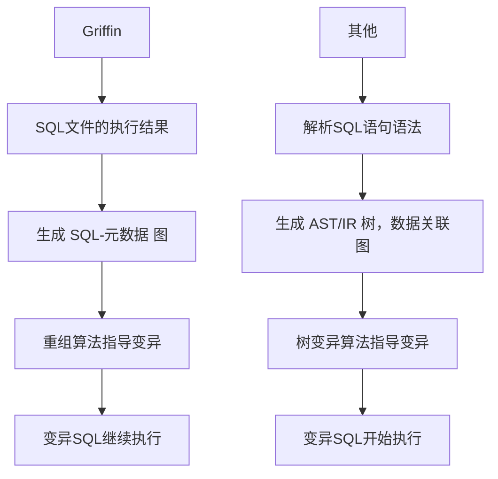

## Griffin的优势
Griffin开源在[github](https://github.com/Griffin-2022/Griffin)。

### 一、数据库适配

在数据库适配层面，Griffin不需要语法解析，它是基于用例重排的。由于DBMS的SQL语法不统一，其他的方案适配各种数据库开销大，且语法不完整。
下图列出了其他DBMS fuzzer为了适配各种数据库，需要的额外代码量巨大。


## 二、指导变异

在指导变异层面，Griffin对比其他fuzzer有显著的不同。比如Griffin先执行SQL语句，基于图的变异。



## 三、语法/语义正确性

由 **二、指导变异**的区别可以看出，在语法正确性方面，Griffin：
1. SQL执行在变异之前，进行了初筛。
2. 基于SQL语句重排，具有天然的正确性、复杂度优势。

其他fuzzer：
1. 语法正确性依赖于AST/IR的正确性。
2. 语法复杂度依赖于语法解析模块。
3. SQL执行在变异之后，无法进行初筛。

在语义正确性方面，Griffin基于 <SQL-元数据> 图进行语义的修复；其他fuzzer需要额外维护数据关联图。

## 四、总结

总的来说，Griffin是一种动态变异方案，基于SQL语句的结果来指导变异；其他fuzzer是静态变异方案，基于SQL语句本身的结构进行变异。

Griffin摒弃了语法解析，提出重排算法，优点：

1. 工作重心进行转移，语法解析 → 元数据分析
2. 测试用例更复杂，一条语句 → 一个sql文件
3. 很容易适配到任何的DBMS

## Griffin的实现
### 一、元数据的分析
在关系型数据库中，元数据是关于数据的数据。DBMS使用元数据检查语义。下图展示了一个表的元数据结构。


一个表被创建出来，会生成四种元数据：
``` c
// 表名
table_name(
  primary_key,  // 主键
  column_name,  // 列名
  index_name,   // 索引名
)
```
为了收集元数据，需要编写一条SQL获取元数据，适用于ANSI标准DBMS。

据此可以建立起元数据之间的映射关系。

| name | type | parentname |
| :--: | :--: | :--: |
| table_name | TABLE | null |
| column_name | column_type | table_name |
| trigger_name | TRIGGER | table_name |
| index_name | INDEX | (table_name,column_name) |

### 二、构建 <SQL-元数据> 图
基于元数据的分析结果，设计出图构建算法。如下图所示，执行的两条SQL语句在收集好元数据之后，可以构建出一个有向无环图。

构建出的 <SQL-元数据> 图中有两种节点：语句节点和元数据节点，它们之间可以反映出三种依赖关系：
1. <SQL语句，元数据>，元数据依赖于SQL语句。
2. <元数据，SQL语句>，SQL语句依赖于元数据。
3. <元数据，元数据>，元数据依赖于元数据。
### 三、用例重组算法
在建立的<SQL-元数据> 图之上，用例重组阶段可以使用语义修复来确保变异的正确性。如下图所示，两个选择出来的测试用例进行重组，在r3进行语义修复之后，r3的依赖得到满足。

简单而言，Griffin的语义修复策略由以下两条构成：
1. 元数据类型匹配，b(table) → a(table)；u(column) → x(column)
2. 元数据之间关系匹配，b(u) → a(x)

符合语义修复条件，因此b替换为a，u替换为x。这里存在另一种修复方案，在图中以红色箭头标注。

### 4四、整体流程图


## 实验评估
Griffin漏洞挖掘情况，在四个流行的开源DBMS上均有产出。漏洞类型聚集在段错误、断言失败和内存损坏上。

| DBMS | 个数 | 类型 | 个数 |
| :--: | :--: | :--: | :--: |
| SQLite | 16 | 段错误 | 21 |
| DuckDB | 12 | 断言失败 | 15 |
| MariaDB | 24 | 内存损坏 | 15 |
| PostgreSQL | 3 |

论文以SQLite中发现的一个断言失败作为例子，说明了Griffin的优越性。该断言失败自2009年SQLite 3.6.19版本就存在，当SQLite在外键约束上使用无效的虚拟触发器时，就会触发断言失败。

SQLancer、SQLsmith和Squirrel对SQLite进行了多年的模糊测试，为什么直到Griffin才被发现？
1. SQLancer不能生成DELETE语句。
2. SQLsmith只能生成SELECT语句。
3. Squirrel不支持解析和生成ON DELETE CASCADE语法。
4. Griffin调用了三个表、表上的三种操作和表上的两种键，其中包含丰富的组合和语义信息。

基于用例重组的方案保留了测试用例语法、语义的丰富性，让Griffin可以挖掘出更多的漏洞。

项目仓库开源了若干漏洞PoC，可以指导攻击面的确定、漏洞模式的学习。一个SQLite段错误的PoC：


触发段错误：
