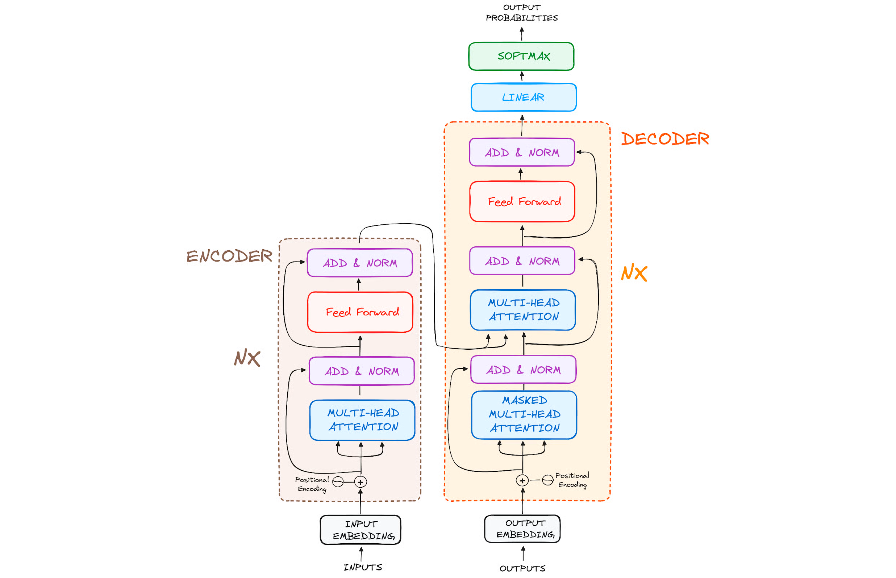
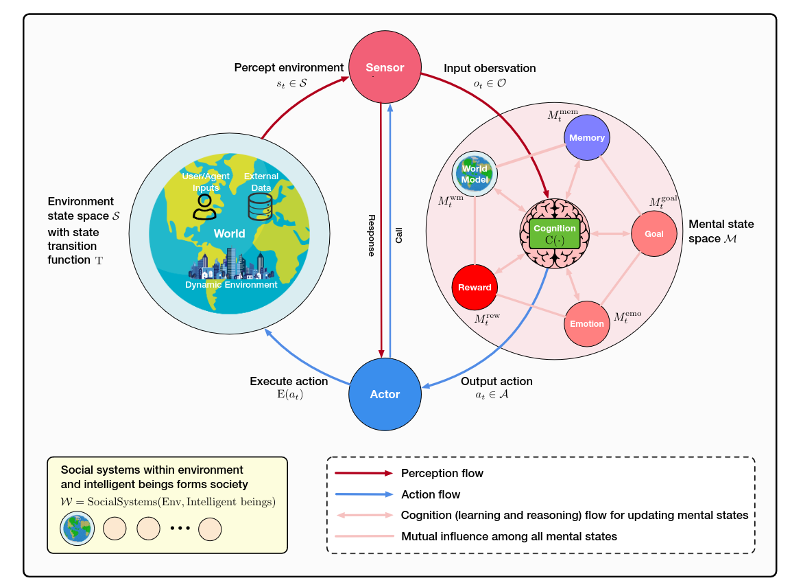
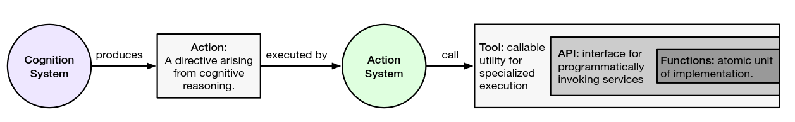

## agent的组件

在行动阶段，agent发展出了一套完整的系统，其中包括4个组件：
1. 认知核心，是agent的大脑，集成学习、推理、规划、决策和反思的能力。
2. 记忆系统，记忆系统为认知核心服务，有缓冲区和数据库两种存储类型。
3. 感知系统，从环境中获取文本，视觉、听觉、触觉等多模态数据，作为训练数据或者作为生成时的输入。
4. 行动系统，实现与环境的交互，这包括生成自然语言、执行代码、控制机器人肢体、在虚拟世界中导航等。将认知核心的决策转化为具体的、可在环境中执行的操作序列。

完整系统的agent关键在于，通过上述四个模块的协作。agent能够通过与环境的交互和自我反思（强化学习），持续学习（模型的训练）确保决策的不断改进，最终实现准确的行动。

### 一、认知核心

**1.学习模块**

在学习（Learning）阶段，agent发展出了生成式模型，还没有一个认知核心，生成式模型具有学习的能力，从多模态的输入中学习，通过反向传播和梯度下降调整模型的参数，为agent的推理、规划和决策提供了知识基础。
- LLM，大语言模型，输入文本，输出预测的文本。
- SLM，小语言模型，输入文本，输出预测的文本。
- VLM，视觉语言模型，输入图像视频，输出预测的文本，或者反过来。
- WM，世界模型，输入环境状态，输出预测的未来状态。

要想构建一个高可用性的生成式模型，要有一个学习范式，还要有工程上实现的架构，在架构上运行学习范式，构建出一个落地的生成式模型。

学习范式：
- SSL，自监督学习，首先无监督学习，设计假托任务生成隐式标签，然后迁移到监督学习、强化学习（等下游任务）上训练生成式模型。
- RL，强化学习，在环境中采取行动并根据获得的奖励来学习最优的策略。
- SFT，监督微调，在预训练后对模型进行监督学习。

架构：
- transformer架构，将学习范式转换为序列建模问题，提供自注意机制学习输入间的关系。
- GPT、BERT架构，transformer的改良版。

以LLM为例，预训练时，transformer架构的自注意机制保留了每个token级别的上下文信息，自监督学习将最后一个token作为掩码，预测该token形成标签。
训练好生成式模型后，输入一段文本用作生成，预测输入的下一个token，然后附加该token再进行预测。

**2.推理模块**

推理（Reasoning）是增强模型生成效果的手段，它充分激发了模型学习的上下文信息，预测出的token准确性提高。
- ReAct框架，循环进行 推理-行动-反馈，提高了准确性。
- CoT框架，演化出CoVE，提高了可解释性。

**3.规划模块**

与直接推理不同，规划涉及在执行之前生成假设的动作序列，在部署之前保持惰性。

llm通常缺乏对世界动态的深入理解，依赖于模式识别而不是真正的因果推理，这妨碍了它们管理子目标交互和环境变化的能力。

**4.决策模块**

区别于规划模块，决策模块需要具备即时性。决策模块通常处理的是规划通过任务分解，得到的当前执行的动作序列。

**5.反思模块**

强化学习是实现反思的一个方案。指定奖励方案：
- 外部奖励
- 内部奖励
- 混合奖励
- 分层模型

### 二、记忆系统

记忆系统为认知核心服务，其核心功能如下：
- 维护上下文
- 从经验中学习
- 随着时间的推移，保持行动的一致性
- 结构化检索
- 选择性遗忘

记忆系统的类型：
- 记忆缓冲区，缓存短期的工作记忆。
- 矢量数据库，存储长期记忆。

### 三、感知系统

agent从环境中获取文本，视觉、听觉、触觉等多模态数据，作为训练数据或者作为生成时的输入。

模态数据：
- 文本
- 图像，视频，音频
- 其他，如受到嗅觉、触觉启发

### 四、行动系统

agent实现与环境的交互，这包括生成自然语言、执行代码、控制机器人肢体、在虚拟世界中导航等。将认知核心的决策转化为具体的、可在环境中执行的操作序列。

## google实例

一个具体的google agent系统如下图所示，编排层、模型层实现了认知核心和记忆系统，感知系统和行动系统则通过工具层实现。

从最简单到最复杂：
最简单：
单机系统级agent
切分决策蹭点所有任务，行动层通过脚本执行，感知层感知到任务的执行情况，反馈层反馈给决策层，分析是否成功？
缺点：
1.没有错误回滚，错误的决策引发的错误是不可逆的。
2.简单的 决策–行动 模型，对于复杂行为，脚本的实现效率低。