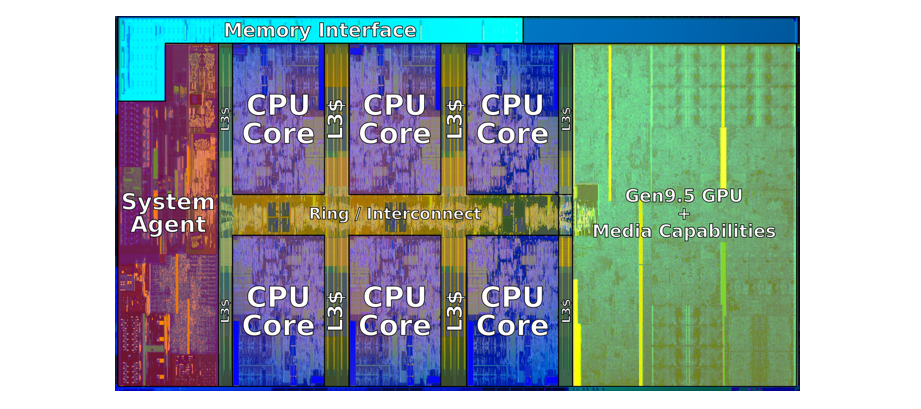

## 计算机系统

一个计算机系统应该是模块化的，通过总线，可以让任意基于不同ISA的多核CPU、内存与外设的引脚连接起来，运行指令。

## CPU

### 一、指令集

指令集架构ISA(Instruction Set Architecture)分为私有和开源两种类型，一个ISA标准代表一个生态，例如ARM指令集必须得到授权才可以使用，而RISC-V这种指令集是开源的，在其ISA之上可以自主扩展，自主研发CPU。

不论是什么指令集，都会有以下几种类型的指令，他们体现了改进图灵机[^1]的基本功能：
- 运算指令，针对不同数据类型(有符号整数、无符号整数、浮点数等)，执行加减乘除、位运算等操作的指令，如add、div、mul。
- 分支指令，有限状态机相关的指令，如test、jmp、je、call、syscall等。可以看出，在状态改变指令的基础上，改进增加了函数调用，它实现了状态间的高级行为。
- 交互指令，与cache硬布线交互不同，需要软件执行交互的指令，如访存指令、I/O指令。
- 特殊指令，在图灵机计算的基础上改进，以x86为例：添加了诸如nop、hlt、原子指令、特权指令这些现代计算机体系结构相关的指令。

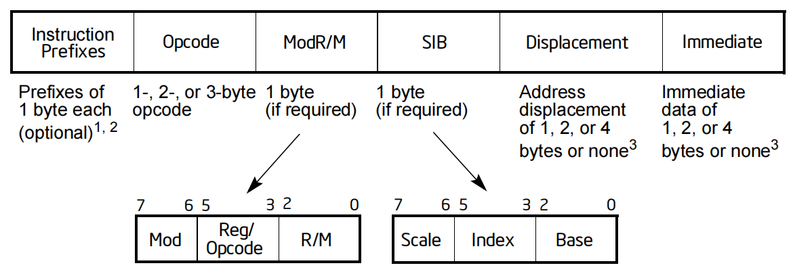

Intel Core i7[^2]是CISC指令系统，采用可变长指令格式，一条指令有以下6个组成部分：
- 指令前缀（Prefix）。可选项，用于修改指令的默认行为，每个指令前缀占用一个字节，且在一条指令中可以有0到4个前缀。
- 操作码（Opcode）。长度分为1、2或3个字节，指定了指令的操作类型。
- 寻址模式说明符（ModR/M）。用于编码操作数的寻址模式和寄存器的选择。
- 额外寻址信息（SIB）。用于补充ModR/M，处理复杂的内存寻址模式
- 地址偏移量（Displacement）。用于计算内存地址的常数值。
- 立即数（Immediate）。作为指令相关操作的常数值。

#### 1.指令前缀

指令前缀分为四组，每组中只能选一个前缀，各组所选前缀可以任意顺序排列。
- 第一组。1.锁定前缀0xF0，强制在多处理器情况下独占并使用共享内存，LOCK指令常用；2.重复前缀，可用于字符串和I/O指令以重复指令或作为一些指令的强制前缀以区分不同的功能。
- 第二组。1.段覆盖前缀，与其他任何分支指令一起使用；2.分支提示前缀，0x2E表示未采用分支，0x3E表示采用分支。
- 第三组。操作数大小覆盖前缀0x66，SSE2/SSE3/SSSE3/SSE4类指令和占用操作码三个字节的指令可使用此作为强制前缀以区分不同的功能。
- 第四组。地址大小覆盖前缀0x67，操作系统为64位，则模拟寻址空间为32位。

#### 2.操作码

操作码的长度可以是1、2或3个字节。两字节的通用指令和SIMD指令格式由以下内容之一组成：
- 一个转义操作码字节0FH后跟操作码字节。
- 强制前缀（66H、F2H或F3H）、转义操作码字节0FH后跟操作码字节。

三字节的通用指令和SIMD指令格式由以下内容之一组成：
- 一个转义操作码字节0FH作为主操作码，再加上两个额外的操作码字节。
- 一个强制性前缀（66H、F2H或F3H）、转义操作码字节0FH，加上两个额外的操作码字节。例如，XMM寄存器的PHADDW操作码为：66 0F 38 01。第一个字节是强制前缀。

#### 3.ModR/M和SIB

ModR/M于操作码之后，用于引用内存，共有三个字段：
- Mod字段：00b，则使用间接寻址或相对寻址方式；01b及10b，则使用间接移位寻址模式，区别是01代表8位disp、10代表32位disp，在原地址的基础上增加移位字段的偏移量(补码)；11b为寄存器寻址模式。
- Reg/Opcode字段：其值可以是三位寄存器编号(8个，在无指令前缀的情况下，依次是
RAX	RCX	RDX	RBX	RSP	RBP	RSI	RDI)或是三位操作码的额外信息(例如test、imul、mul这些指令主操作码相同，在这三位区分)。
- R/M字段：与Mod字段组合为24种寻址方式。当Mod不是寄存器寻址模式，且R/M字段为100时则指定SIB。

SIB用于补充ModR/M，其包含三个字段：
- Index和Base字段用于指定索引和基址寄存器。
- Scale字段用于指定比例因子。

寻址方式为Base + $Index*2^{Scale}$。

详细来说，寻址模式有：立即寻址、寄存器寻址、间接寻址、相对寻址、间接移位寻址和使用SIB的寻址方式。寻址方式之间有相互组合。

立即寻址组合间接移位寻址，以mov dword [rbp-0x54], 1指令为例，其机器码为c745ac01000000，其中：主操作码c7代表立即寻址,ModR/M为01000101,Mod为01代表8位disp,Reg/Opcode指定为0，R/M为101代表rbp，而disp为ac即负0x54的补码，imm立即数4个字节小端序，值为1。

#### 4.地址偏移量

用于计算内存地址的常数值。偏移量是可选的，且它的长度可以为 0、1、2 或 4 个字节，具体取决于寻址模式和指令的要求。偏移量通常用于以下几种寻址方式：
- 直接寻址：直接指定内存地址。
- 基址寻址：结合基址寄存器和偏移量计算地址。
- 基址 + 索引寻址：结合基址寄存器、索引寄存器以及偏移量计算地址。

#### 5.立即数

在指令中直接给出的常数值，它的大小可为 0、1、2 或 4 个字节，具体取决于指令的需求和操作数的大小。

#### 6.指令后缀

指令后缀只是用来区分指令操作数的形式，指令本身的操作由操作码确定。例如数字类型：b代表字节、w代表字（2字节）、l代表长/双字（4字节）、q代表四字（8字节）。

#### 7.寄存器

下面列出了Intel x64寄存器以及由应用程序二进制接口（ABI）所定义的寄存器用途。

**7.1 通用寄存器**

| 寄存器 | 用途 |
| :---: | :---: |
|%rip |指令指针寄存器 |
|%rsp |栈寄存器
|%rax |返回值寄存器
|%rdi |第一个参数
|%rsi |第二个参数
|%rdx |第三个参数
|%rcx |第四个参数
|%r8 |第五个参数
|%r9 |第六个参数
|%r10,%r11 |被调用函数支配
|%rbx,%rbp, %r12-%15 |调用函数支配

如果参数和局部变量太多，在寄存器中存不下，函数会在栈中分配空间来存放。

**7.2 特殊寄存器**

**段寄存器(CS, DS, SS, ES, FS, 和 GS)**

在32位模式下，内存需要分段，CS指向代码段，DS指向数据段。ES、FS、GS作为数据段的附加基寄存器。

而在64位模式下：CS, DS, ES, SS被视为每个段基为0。这为代码、数据和堆栈创建了一个平面地址空间，线性地址等于有效地址。FS和GS两个段寄存器都可以用作线性地址计算中的附加基寄存器(比如指向进程环境块、线程信息块的偏移量的指针)。

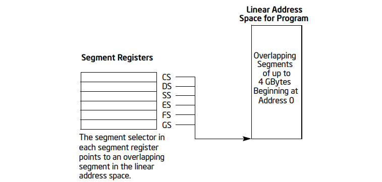

在64位模式下，分段被禁用，但段其中的字段还有其他作用，例如特权模型在CS寄存器上的CPL。并且段描述符中的DPL和其中的段选择子中的RPL都在工作。

**标志寄存器(EFLAGS)**

在标志寄存器中，有三种类型，S表示状态寄存器CF、OF等；C表示控制寄存器DF，用来控制字符串指令；X表示系统寄存器。

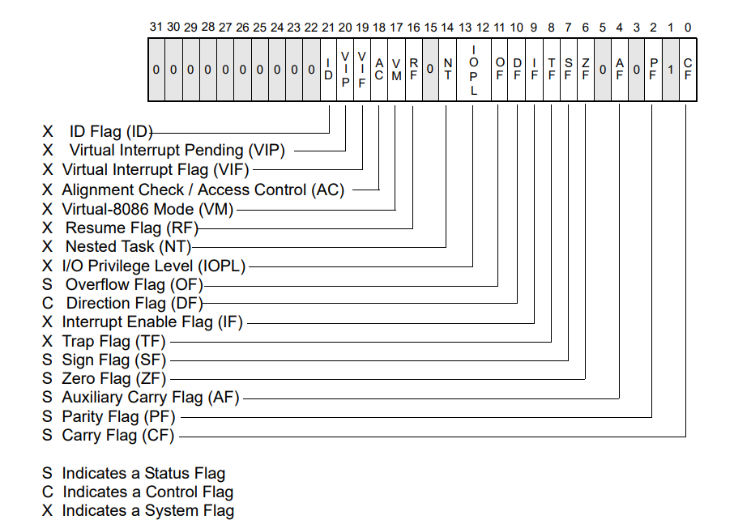

**控制寄存器(CR0, CR2, CR3, 和 CR4)**

- CR0包含控制处理器运行模式和状态的系统控制标志。

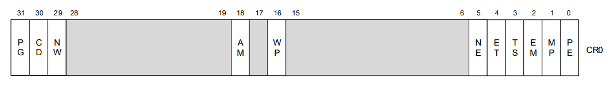

CR0.PG控制分页，CR0.CD控制cache，CR0.NW控制回写，CR0.AM控制对齐掩码，CR0.WP控制写保护。

- CR1预留。
- CR2包含导致缺页异常的线性地址。
- CR3包含分页目录基址的物理地址，和两个标志(PCD和PWT)。

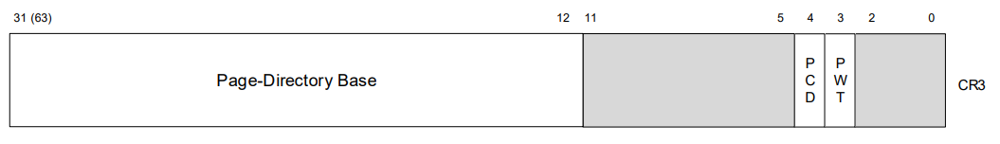

只指定基地址的最高有效位(减去低12位);地址的低12位假定为0。因此，第一个分页结构必须对齐到一个页（4KB）边界。PCD和PWT标志控制该分页结构在处理器内部数据高速缓存中的高速缓存(它们不控制页目录信息的TLB高速缓存)。

- CR4包含一组标志，用于启用几个体系结构扩展，并表示操作系统或执行机构对特定处理器功能的支持。

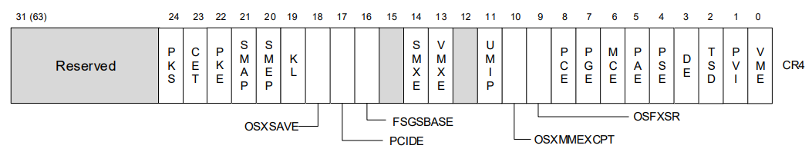

CR4.PSE控制页大小扩展，CR4.PAE控制页物理地址扩展，CR4.UMIP控制SGDT, SIDT, SLDT, SMSW,  STR不会在CPL>0时执行，CR4.VMXE控制VMX指令，CR4.SMEP和CR4.SMAP用于保护特权模式，CR4.CET控制CET。

**系统表寄存器(GDTR，IDTR，TR)**

- GDTR提供寄存器保存全局描述符表GDT的入口地址，LGDT和SGDT指令分别加载和存储GDTR寄存器。GDT中存放段描述符，以供段选择子索引。段选择符用来描述一个段的类型、基地址、描述符权限（DPL）等。

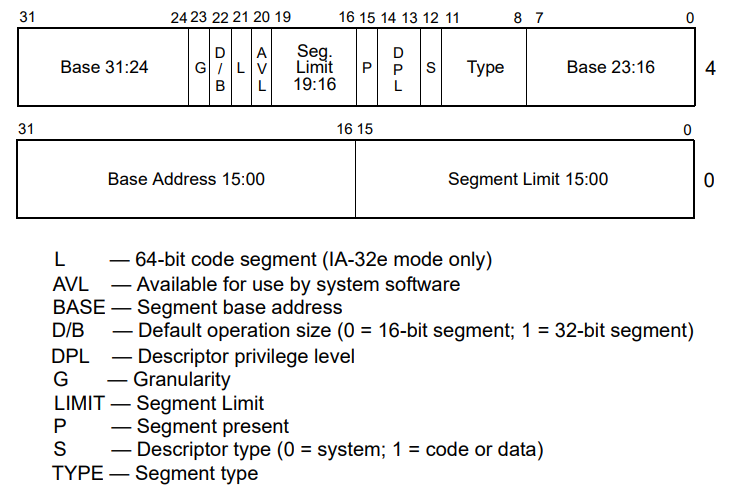

段选择子由三个字段组成，索引、表指示符（指示GDT还是LDT索引）和请求权限（RPL）。简化系统下，RPL等于其索引的描述符的DPL。

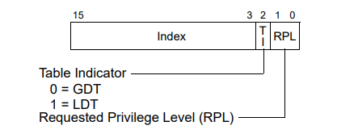

- IDTR寄存器保存中断描述符表IDT的入口地址，LIDT和SIDT指令分别加载和存储IDTR寄存器。

在处理器上电或复位时，基址设置为默认值0，限制设置为0FFFFH。在处理器初始化过程中，可以改变寄存器中的基址和限制。

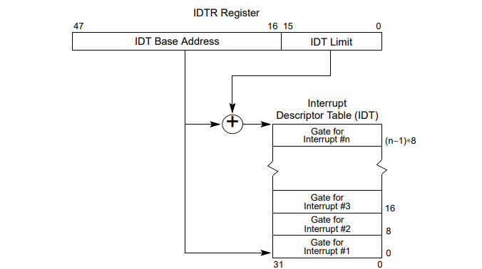

IDT中的每一项都是一个门描述符，根据分类，可以是中断门描述符、陷阱门描述符，每一项由8字节组成。

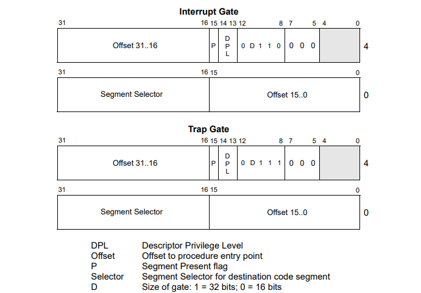

在发生中断/陷入时，

1. 根据中断号在IDT中索引门描述符(注意与段描述符区分开)，获取段选择子和偏移值
2. 根据段选择子在GDT中索引段描述符
3. 根据段描述符索引到代码段基址，再根据偏移值索引中断处理程序的地址。

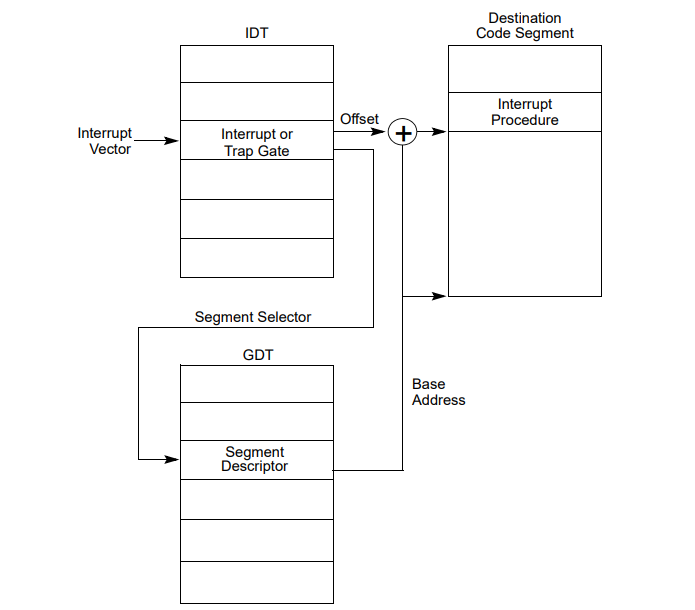

- TR提供寄存器保存当前进程TSS的选择子，在GDT中索引TSS描述符获取TSS地址。

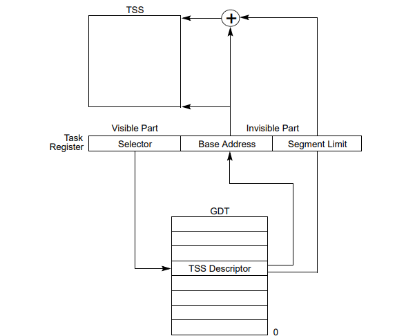

除此之外，还有其他特殊寄存器：

- 调试寄存器(DR0, DR1, DR2, DR3, DR6, 和DR7)
- MSR寄存器
- ...

#### 8.典型指令

**8.1 运算指令**

|主操作码|指令|描述|
|:-:|:-:|:-:|
|01	|add reg/m,reg 	|加法
|0FAF	|imul reg,reg/m	|带符号乘
|D3	|shl reg/m,cl	|逻辑左移
|33	|xor reg,reg/m	|异或操作
|F7	|not reg/m	|逻辑取反
|F7	|neg reg/m	|算术取反

运算时会改变flag寄存器ZF，SF，CF，OF。

**8.2 分支指令**

|主操作码|指令|描述|
|:-:|:-:|:-:|
|85	|test reg,reg	|与操作，设置flag
|FF	|call reg/m	|push rip，jmp reg/m
|c3	|ret 	|pop rip
|0F 05	|syscall	|快速系统调用
|CD	|int imm	|中断
|CF	|iret	|中断返回

**8.3 交互指令**

|主操作码|指令|描述|
|:-:|:-:|:-:|
|B8+reg	|mov reg,imm	|立即寻址
|89	|mov reg/m,reg	|间接移位寻址
|63	|movsxd reg,reg/m	|带符号扩展
|50+reg	|push reg	|压栈
|58+reg	|pop reg	|出栈
|E4	|in al,imm8	|从端口输入
|E6	|out imm8,al	|输出到端口
|8D	|lea r,m	|载入有效地址

**8.4 特殊指令**

intel特殊指令有很多类型：支持并行的原子指令、支持权限管理的特权指令、查询处理器信息的指令、扩展指令。

|主操作码|指令|描述|
|:-:|:-:|:-:|
|FA	|cli	|清除中断flag
|FB	|stl	|置位中断flag
|90	|nop	|不操作
|F4	|hlt	|HALT
|0F B1	|cmpxchg reg1/m,rax,reg2	|原子的比较-交换CAS，intel同步原语实现。将rax值与reg/m比较，相等则reg2载入reg1/m，否则载入rax。
|0F A2	|CPUID IA32_BIOS_SIGN_ID,EAX,ECX	|返回处理器标识（identification）和功能信息（feature information）。返回值存放在EAX、EBX、ECX、EDX中。返回信息由EAX和ECX来决定。
|87	|xchg reg,reg/m	|原子指令，值交换

### 二、异常与中断

#### 1.异常的分类

异常可以分为同步异常和异步异常，按Intel的说法，将异步异常称为中断，将同步异常称为异常。
- 中断：异步异常是由处理器外部的 I/O 设备中的事件产生的。
- 异常：陷阱、故障和终止都是同步异常，它们是执行一条指令（称为故障指令）的直接产物。因为指令是按时钟周期执行的，所以由指令造成的异常必然是同步的。如缺页时引起缺页故障，调用系统调用时进入陷阱。

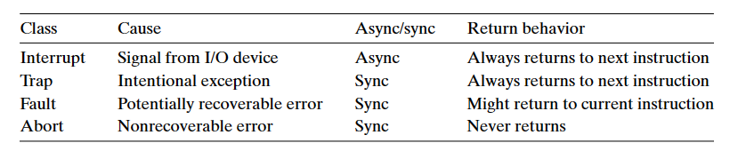

简单而言，异常可以分为异步和同步两类，其中异步的异常是来自外部的 I/O 设备，同步的异常则都是指令的产物。

#### 2.Intel硬件中断的管理模型

CPU上只有有限多的脚针，负责与外部通讯，比如有数据线，地址线等，也有中断线，简单的CPU有两条NMI(不可屏蔽中断线)和INTR(可屏蔽中断线)，而目前的CPU则采用LINT0和LINT1脚针。

就目前我们使用的SMP多核架构里，我们经常使用的是APIC(高级可编程中断控制器)，来管理众多接收的中断信号。

Local APIC 是在CPU内部的，每个逻辑处理核心都配有一的对应的local APIC。Local APIC 能产生、发送和接受中断，多处理器CPU之间的通讯也是通过Local APIC来实现的。
LINT0、LINT1引脚一般和INTR引脚、NMI引脚共享，禁用Local APIC时作为INTR引脚、NMI引脚使用。

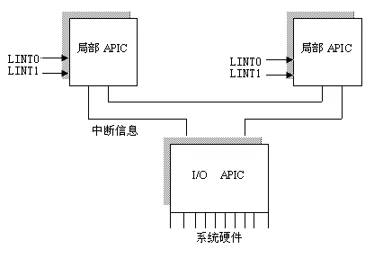

#### 3.Intel异常类型

x86-64 系统中有 256 种不同的异常类型，其中 0~31 号是 Intel 架构师定义的异常，剩下的是操作系统定义的中断和陷阱。

简单而言，0-31 号是故障或终止，32~255 号提供给不同操作系统，定义中断或系统调用。例如，异常号0描述除法故障，异常号13描述通用保护故障，异常号14描述页故障，异常号18描述机器检查终止。

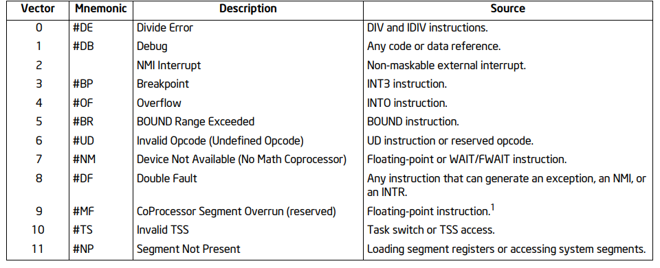
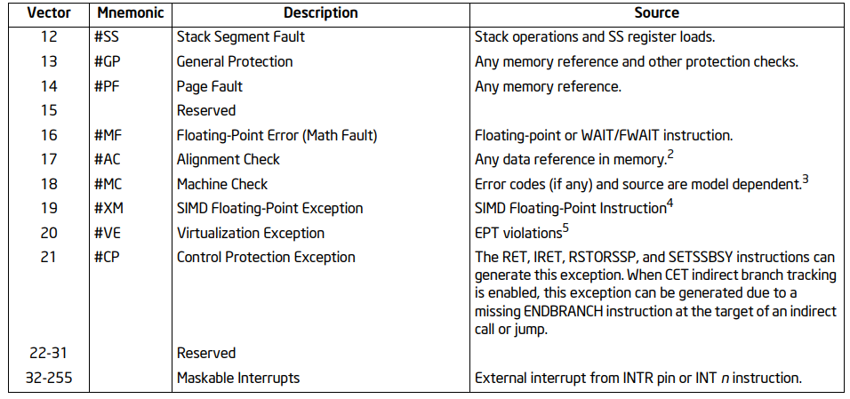

具体来说，故障和终止有以下几种：
- 除法错误。当应用试图除以零时，或者当一个除法指令的结果对目标操作数来说太大了，就会发生除法错误。
当发生除法错误时，由操作系统决定如何处理：Unix 会直接终止程序，Linux shell 通常把除法错误报告为“浮点异常(Floating Exception)”。
- 一般保护故障。有许多原因，通常是因为一个程序引用了一个未定义的虚拟内存区域，或试图写一个只读的文本段。
此类故障也不会恢复，Linux shell 通常会把一般保护故障报告为“段故障(Segmentation fault)”。
- 缺页异常。此类故障会尝试恢复并重新执行产生故障的指令。
- 机器检查。在告知故障的指令执行中检测到致命的硬件错误时发生。此类故障从不返回控制给应用程序。

### 三、安全模型

CPU 的安全模型是上层软件和操作系统安全机制的根本保证，一旦 CPU 的实现违背了安全模型，则上层信息系统的安全机制无法得到保证。目前CPU的安全模型主要分为特权模型和隔离模型。

#### 1.特权模型

特权模型是指 CPU 在对资源进行操作过程(访问存储器或执行指令)中，分为不同的权限级。
特权代表了在CPU 的不同工作模式下，拥有不同的权限，能够操作的资源也是不一样的。按照安全设定，低特权无法访问或修改高特权的资源。

以intel CPU为例，在 80286 系列处理器之前，CPU 并不存在特权模型，访存采用的是简单的分段模型，操作系统无法判断是否应该允许当前程序执行某些危险的指令，即实模式。从 80286 处理器开始，Intel 引入了保护模式，特权模型是保护模式中的一个重要概念。

在保护模式下，x86有4个保护级别，从0(最高权限)到3(最低权限)。实际上，大多数操作系统只使用2个级别：0和3，它们分别被称为内核模式和用户模式。

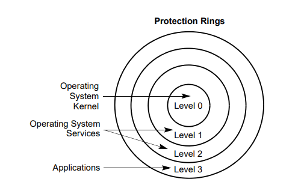

处理器使用特权级别来阻止以较低特权级别运行的程序或任务访问拥有更大特权的部分，除了在受控情况下。当处理器检测到违反特权级别时，它会生成一个通用保护异常(#GP)。

为在代码段和数据段之间进行特权级别检查，处理器识别以下3种特权级别：
- 当前特权级别（CPL）。CPL是当前执行的程序或任务的特权级别。它存储在CS和SS段寄存器的比特0和1中。CPL被用于很多权限控制的地方，例如页表项存在一位U/S，对应CPL=3和0，表示页表项的访问权限。
- 描述符特权级别（DPL）——DPL是段或门的特权级别。它存储在段或门描述符的DPL字段中。当前执行的代码段试图访问一个段或门时，将段或门的DPL与段或门选择子的CPL和RPL进行比较。
- 请求的权限级别（RPL）——RPL是一个被分配给段选择子的覆盖权限级别。它存储在段选择子的0和1位中。处理器检查RPL和CPL，以确定是否允许访问某个段。RPL用来动态刷新CS中的CPL。

综上，CPL存储在寄存器中，DPL存储在GDT的段描述符中，RPL存储在段选择子中。

特权检查会发生在以下几种场景：
1. 访问数据时进行特权检查。
2. 加载SS寄存器时进行特权检查。
3. 在代码之间传输程序控制时进行特权检查。
4. 页级别保护。

#### 2.隔离模型

隔离模型是指 CPU 在处理不同的对象时，对于资源的操作是相互隔离的。按照安全设定，不同的对象之间的操作在未授权下是互相不可见的。根据对象层次的不同，可分为进程间的隔离、虚拟机间的隔离以及超线程之间的隔离。

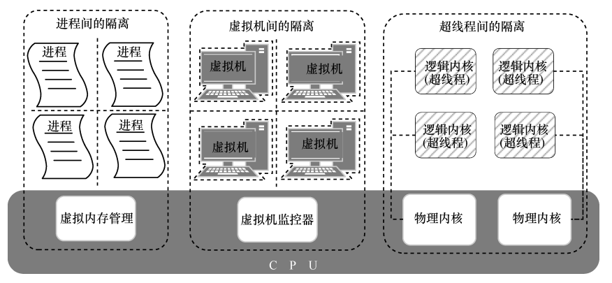

CPU 能够支持多任务同步，其基础是 CPU的隔离模型。CPU 隔离模型负责保证任务之间相互隔离、互不影响。

隔离模型的实现依赖于内存系统、特殊指令和硬件支持扩展：
- 自 80386 处理器引入虚拟内存后，通过内存管理机制使每个进程拥有独立的虚拟地址，相互隔离、互不影响。
- 在虚拟化扩展下，通过提供虚拟机陷入和陷出的机制，保证各个虚拟机之间也是互相隔离的。
- Intel 在 2002 年引入超线程技术后，利用特殊的硬件指令，把一个物理内核模拟成 2 个逻辑内核，可同时执行 2 个线程，这 2 个线程之间也是相互隔离的。

## 内存系统

Intel Core i7 CPU 中封装了 4 个核、一个所有核共享的 L3 高速缓存，一个 DDR3 内存控制器。

每个核除了包含 L1、L2 高速缓存外，还包含具有两层结构的 TLB 缓存、一组基于QuickPath 技术的快速的点到点链路。点到点链路是为了让一个核与其他核、外部 I/O 桥直接通信。

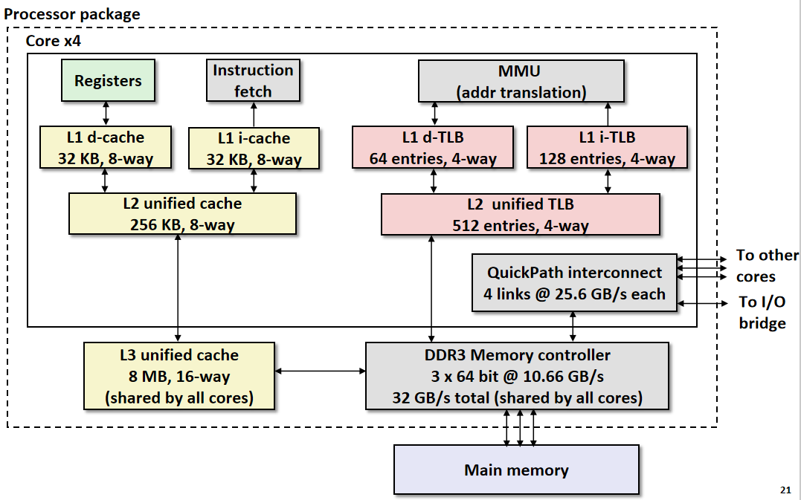

### 一、四级页表

Core i7的1-3级页表项格式如下：

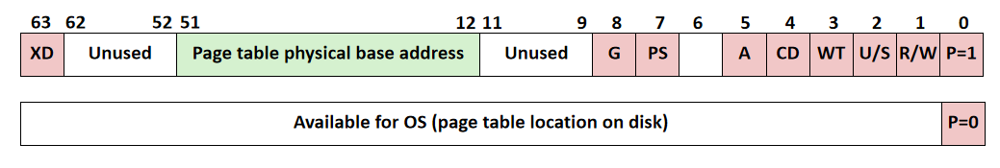

每项索引一个4KB的虚拟页表，重要字段：
- P： 物理内存中是否存在子页表（1）（0）。
- R/W：所有可访问页面的只读或读写访问权限。
- U/S：所有可访问页面的用户或内核模式访问权限。
- WT：子页表的直写或回写缓存策略。
- A： 参考位（由MMU在读取和写入时设置，由软件清除）。
- PS：页面大小为4 KB或4 MB（仅为1级 PTE定义）。
- 页表物理基址：页表物理地址最高40位
- XD：禁用或启用从该PTE可访问的所有页面获取指令。

Core i7的4级页表项格式如下：

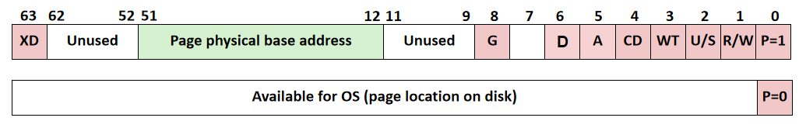

每项索引一个4KB的物理页。重要字段：
- P： 内存中是否存在子页（1）（0）
- R/W：子页的只读或读写访问权限
- U/S：用户或主管模式访问
- WT：此页面的直写或回写缓存策略
- A： 参考位（由MMU在读写时设置，由软件清除）
- D： 脏位（写入时由MMU设置，由软件清除）
- G： 全局页（不从任务交换机上的TLB中逐出）
- 物理页基址：最高40位
- XD：禁用或启用从该页面获取指令。

PTE 有三个权限位，控制对页的访问。R/W 控制是只读还是读写；U/S 控制用户模式是否可以访问；XD 用来禁止从某些页读指令。
- 每次访问一个页，MMU 都会设置 A 位，称为引用位。内核可以利用这个引用位实现它的页替换算法。
- 每次写了一个页后，MMU 都会设置 D 位，称为修改位。修改位告诉内核在替换该页前是否必须写回牺牲页。

内核可以通过调用一条特殊的内核模式指令来清除引用位或修改位。

### 二、地址翻译

四级页表将虚拟地址翻译为物理地址的过程如下，36 位 VPN 划分为 4 个 9 位的片，每个片用作某一级页表查询时的偏移量。每个页表大小4 KB，每个页表项大小8B，64位。

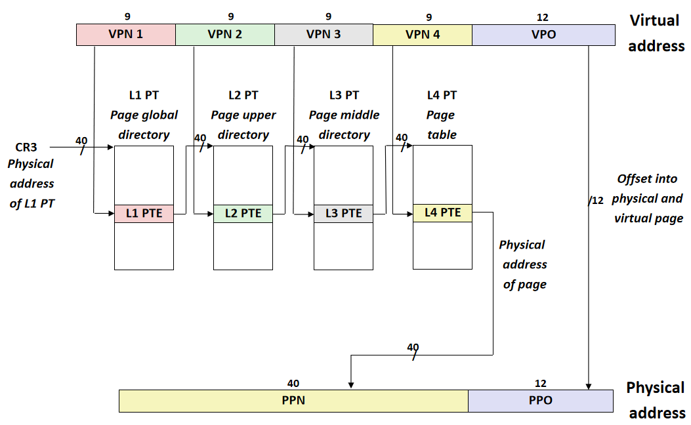

### 三、字节序

字节序有两种：大端序、小端序。x86系列CPU都是Little-endian字节序，PowerPC通常是Big-endian字节序。网络协议也都是采用Big-endian方式传输数据的，所以有时也把Big-endian方式称为网络字节序。
- 单字节编码的数据，如ascii编码的字符串yes的字节串：0x796573，以单字节存储不分端序，因此看起来像大端序。
- 多字节类型的数据，如机器指令lea rax,[rip+0xec0]的字节流：0x488d05c00e0000，指令中的偏移值0xec0以小端序的形式存储，这样从低位开始读取，计算机电路先处理低位字节，运算效率更高。

寄存器中的值，假如rbp=0x7fff和rip=0x4000，那么push入栈后，旧栈帧和返回地址就会以小端序存储在内存栈中，即0xff7f和0x0040。pop时低地址放入寄存器的低位，高地址放入寄存器的高位。

故在编写的shellcode中，要以小端序赋值给rax，push rax后在栈中才是”/bin/sh”字符串。

## 硬件支持扩展

软件快速发展和安全需要的同时，也在推动着硬件的发展。硬件支持在高并发、虚拟化、安全保护领域有重要的作用，通过硬件支持可以充分利用资源达到期望的效果。

### 一、多处理器管理

#### 1.多处理器/多核系统

每个处理器/核都访问一个公共的内存，会出现多个处理器/核访问同一个变量的情况，因此需要软件结合硬件实现同步控制。

同时，由于每个处理器/核的Cache存放的是内存的副本，会出现Cache一致性问题。最流行的是Cache监听协议，所有核1~8的Cache控制器监听着总线，对于核1读操作，不会发生问题；而对于核1写操作，其他核2~8可以使用clflush对相应的副本执行Cache擦除。

特别的，对于多核系统，同时多线程技术被发明出来。它利用CPU的多发射和多核特性实现指令级并行和线程级并行。区分出多核系统的原因是：多处理器的每一个处理器都可以是多核的。

#### 2.锁定原子操作

指令集支持对系统内存中的位置进行锁定原子操作。这些操作通常用于管理共享数据结构(如信号量、段描述符、系统段或页表)，其中两个或多个处理器可能同时尝试修改相同的字段或标志。处理器使用三种相互依赖的机制来执行锁定的原子操作：
1. 保证原子操作，例如读1个字是原子的。
2. 总线锁定，使用lock#信号和LOCK指令前缀，跟在其后的原子操作指令，例如XCHG。
3. Cache一致性协议，确保可以在缓存的数据结构上执行原子操作。

### 二、Intel CET

CET(Control-flow Enforcement Technology)即控制流保护技术，针对ROP以及类似的COP/JOP攻击方式，CET提供了以下功能来保护：
1. 影栈(Shadow Stack)，保护返回地址来防止ROP。
2. 间接分支跟踪(IBT)，自由分支保护，以防止COP和JOP。
上述两种功能都有指令集扩展，且CET在异常表中引入了控制保护异常#CP，异常号21。

#### 1.影栈

影栈由操作系统或VMM从内存中分配的辅助栈，应用程序不能直接修改它。当执行CALL指令时（控制传输指令/流，如近调用，远调用，调用中断/异常处理程序等），处理器将返回地址push正常栈和影栈(注意，影栈只保存返回地址，而不保存传递给调用指令的参数)。通过页表保护确保影栈免受篡改，从而使常规存储指令不能修改影栈的内容。为了提供这种保护，页表保护被扩展为支持页的附加属性，将它们标记为“影栈”页。

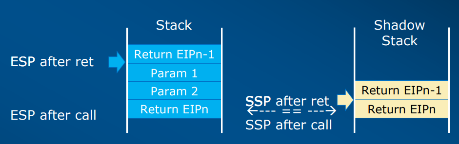

在函数返回时，处理器弹出影栈副本，并将其与正常栈副本进行比较。如果两者不一致，处理器将引发控制保护故障#CP。

影栈特性可以在用户模式(CPL == 3)或管理员模式下单独启用(CPL < 3)。影栈仅在保护模式下运行。

在一些应用场景，例如：栈展开和用户线程切换，需要安全的指令来操作影栈的SSP指针。在栈展开下，需要RDSSP和INCSSP指令进行读取SSP和pop操作。在用户线程切换下，需要RSTORSSP，SAVEPREVSSP指令对影栈指针SSP指针进行切换。同时，SETSSBSY和CLRSSBSY用于标记影栈正在使用中。

#### 2.IBT

ENDBR指令用于标记间接调用的合法跳转目标地址，在处理器上解码为NOP，主要用作处理器流水线的标记指令，用于检测违反控制流的情况。同时声明下一个指令必须也是ENDBR，否则触发#CP异常。

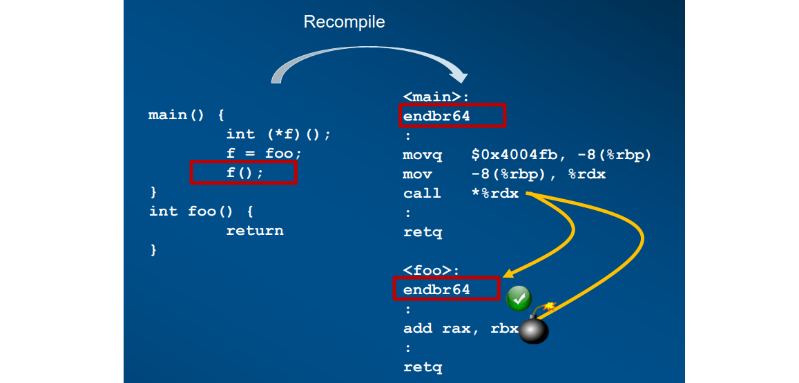

### 三、Intel VMX

Intel VMX定义了对IA-32处理器上的虚拟机的处理器级支持。两个主要支持的软件类别为：
1. 虚拟机监视器(VMM)，VMM充当主机，完全控制处理器和其他平台硬件。VMM为Guest软件提供虚拟处理器的抽象，并允许它直接在逻辑处理器上执行。VMM能够保留对处理器资源、物理内存、中断管理和I/O的选择性控制。
2. Guest软件，每个虚拟机都是一个Guest软件环境，支持由操作系统和应用软件组成的栈。每个虚拟机都独立于其他虚拟机运行，并且使用物理平台提供的处理器、内存、存储、图形和I/O的相同接口。软件栈就像在没有VMM的平台上运行一样。在虚拟机中执行的软件必须以较低的权限运行，以便VMM可以保留对平台资源的控制。

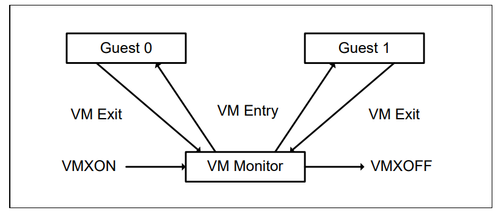

VMX操作分为两种:VMX root操作和VMX no-root操作。通常，VMM将在VMX root操作下运行，而Guest机软件将在VMX no-root操作下运行。VMX no-root操作中软件功能是有限的，正是这种限制使VMM能够保留对处理器资源的控制。在各自的操作里，CPL均可以从ring0到ring3变换。

### 四、Intel SGX

SGX是一组添加到Intel处理器中的用于内存访问的指令和机制。Intel SGX可以包含两组指令扩展，分别称为SGX1和SGX2。

SGX1扩展允许应用程序实例化一个受保护的容器，称为enclave/飞地。飞地是一个受信任的内存区域，其中应用程序功能的关键方面具有硬件增强的机密性和完整性保护。新的访问控制也被引入，以限制对不在飞地内的软件的访问。

SGX2扩展在飞地资源的运行时管理和飞地内的线程执行方面提供了额外的灵活性。
一个应用程序虚拟地址空间的飞地如下图所示。

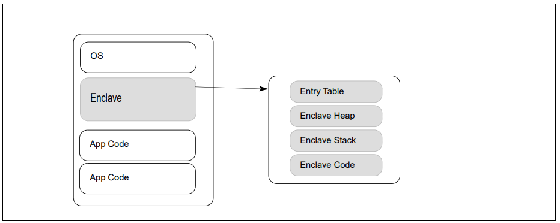

[^1]: Variation of Turing Machine https://www3.cs.stonybrook.edu/~cse350/slides/turing3.pdf
[^2]: Intel® 64 and IA-32 Architectures Software Developer Manuals https://www.intel.com/content/www/us/en/developer/articles/technical/intel-sdm.html
[^3]: CSAPP https://csapp.cs.cmu.edu/

