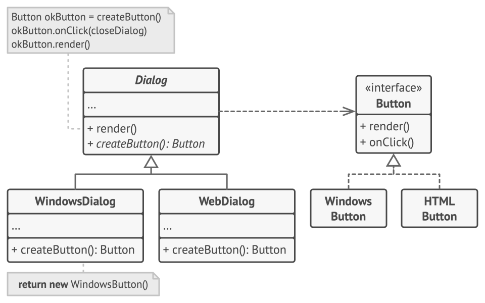

### 创建型模式

创建型模式提供了创建对象的机制， 能够提升已有代码的灵活性和可复用性。

### 一、工厂模式

**定义：**

在父类中提供一个创建对象的方法，允许子类决定实例化对象的类型。

**示例：**

以下示例演示了如何使用工厂方法开发跨平台 UI （用户界面） 组件， 并同时避免客户代码与具体 UI 类之间的耦合。



基础对话框类使用不同的 UI 组件渲染窗口。 在不同的操作系统下， 这些组件外观或许略有不同， 但其功能保持一致。 Windows系统中的按钮在Web系统中仍然是按钮。如果使用工厂方法，就不需要为每种操作系统重写对话框逻辑。

父类和子类：
``` c
// 父类
class Dialog is
    // 工厂方法
    abstract method createButton():Button
    // 父类方法
    method render() is
        // 调用工厂方法创建一个产品对象。
        Button okButton = createButton()
        // 现在使用产品。
        okButton.onClick(closeDialog)
        okButton.render()

// 子类，重写工厂方法以改变其所返回的产品类型
class WindowsDialog extends Dialog is
    method createButton():Button is
        return new WindowsButton()

class WebDialog extends Dialog is
    method createButton():Button is
        return new HTMLButton()
```
工厂方法的具体实现：
``` c
class WindowsButton implements Button is
    method render(a, b) is
        // 根据 Windows 样式渲染按钮。
    method onClick(f) is
        // 绑定本地操作系统点击事件。

class HTMLButton implements Button is
    method render(a, b) is
        // 返回一个按钮的 HTML 表述。
    method onClick(f) is
        // 绑定网络浏览器的点击事件。
```
客户端代码：
``` c
class Application is
    field dialog: Dialog

    // 程序根据当前配置或环境设定选择创建者的类型。
    method initialize() is
        config = readApplicationConfigFile()

        if (config.OS == "Windows") then
            dialog = new WindowsDialog()
        else if (config.OS == "Web") then
            dialog = new WebDialog()
        else
            throw new Exception("错误！未知的操作系统。")

    // 当前客户端代码会与具体创建者的实例进行交互，但是必须通过其基本接口
    // 进行。只要客户端通过基本接口与创建者进行交互，你就可将任何创建者子
    // 类传递给客户端。
    method main() is
        this.initialize()
        dialog.render()
```

### 二、抽象工厂模式

**定义：**

创建一系列相关的对象， 而无需指定其具体类。

**示例：**

下面例子通过应用抽象工厂模式， 使得客户端代码无需与具体 UI 类耦合， 就能创建跨平台的 UI 元素， 同时确保所创建的元素与指定的操作系统匹配。


跨平台应用中的相同 UI 元素功能类似， 但是在不同操作系统下的外观有一定差异。 此外， 你需要确保 UI 元素与当前操作系统风格一致。 你一定不希望在 Windows 系统下运行的应用程序中显示 macOS 的控件。

接口：
``` c
// GUI 接口
interface GUIFactory is
    method createButton():Button
    method createCheckbox():Checkbox
// 控件接口
interface Button is
    method paint()
// 复选框接口
interface Checkbox is
    method paint()
```

接口的具体实现：
``` c
// Windows具体工厂
class WinFactory implements GUIFactory is
    method createButton():Button is
        return new WinButton()
    method createCheckbox():Checkbox is
        return new WinCheckbox()

class WinButton implements Button is
    method paint() is
        // 根据 Windows 样式渲染按钮。

class WinCheckbox implements Checkbox is
    method paint() is
        // 根据 Windows 样式渲染复选框。

// Mac具体工厂
class MacFactory implements GUIFactory is
    method createButton():Button is
        return new MacButton()
    method createCheckbox():Checkbox is
        return new MacCheckbox()

class MacButton implements Button is
    method paint() is
        // 根据 macOS 样式渲染按钮

class MacCheckbox implements Checkbox is
    method paint() is
        // 根据 macOS 样式渲染复选框。
```

客户端代码：
``` c
class Application is
    private field factory: GUIFactory
    private field button: Button
    constructor Application(factory: GUIFactory) is
        this.factory = factory
    method createUI() is
        this.button = factory.createButton()
    method paint() is
        button.paint()

class ApplicationConfigurator is
    method main() is
        config = readApplicationConfigFile()

        if (config.OS == "Windows") then
            factory = new WinFactory()
        else if (config.OS == "Mac") then
            factory = new MacFactory()
        else
            throw new Exception("错误！未知的操作系统。")

        Application app = new Application(factory)
```

### 三、生成器模式

**定义：**

使用相同的创建代码生成不同类型和形式的对象。

**示例：**

下面关于生成器模式的例子演示了你可以如何复用相同的对象构造代码来生成不同类型的产品——例如汽车 （Car）——及其相应的使用手册 （Manual）。


汽车是一个复杂对象， 有数百种不同的制造方法。 我们没有在 汽车类中塞入一个巨型构造函数， 而是将汽车组装代码抽取到单独的汽车生成器类中。 

生成的类和生成器接口：
``` c
// 需要根据生成器生成的类
class Car is
    // 一辆汽车可能配备有 GPS 设备、行车电脑和几个座位。不同型号的汽车（
    // 运动型轿车、SUV 和敞篷车）可能会安装或启用不同的功能。

class Manual is
    // 用户使用手册应该根据汽车配置进行编制，并介绍汽车的所有功能。

// 生成器接口
interface Builder is
    method reset()
    method setSeats(……)
    method setEngine(……)
    method setTripComputer(……)
    method setGPS(……)
```

生成器的具体实现：
``` c
// 具体生成器类将遵循生成器接口并提供生成步骤的具体实现。你的程序中可能会
// 有多个以不同方式实现的生成器变体。
class CarBuilder implements Builder is
    private field car:Car

    // 一个新的生成器实例必须包含一个在后续组装过程中使用的空产品对象。
    constructor CarBuilder() is
        this.reset()

    // reset（重置）方法可清除正在生成的对象。
    method reset() is
        this.car = new Car()

    // 所有生成步骤都会与同一个产品实例进行交互。
    method setSeats(……) is
        // 设置汽车座位的数量。

    method setEngine(……) is
        // 安装指定的引擎。

    method setTripComputer(……) is
        // 安装行车电脑。

    method setGPS(……) is
        // 安装全球定位系统。

    // 具体生成器需要自行提供获取结果的方法。
    method getProduct():Car is
        product = this.car
        this.reset()
        return product

class CarManualBuilder implements Builder is
    private field manual:Manual

    constructor CarManualBuilder() is
        this.reset()

    method reset() is
        this.manual = new Manual()

    method setSeats(……) is
        // 添加关于汽车座椅功能的文档。

    method setEngine(……) is
        // 添加关于引擎的介绍。

    method setTripComputer(……) is
        // 添加关于行车电脑的介绍。

    method setGPS(……) is
        // 添加关于 GPS 的介绍。

    method getProduct():Manual is
        // 返回使用手册并重置生成器。
```

可选的主管类和客户端代码：
``` c
// 由于客户端可以直接控制生成器，所以严格意义上来说，主管类并不是必需的。
class Director is
    // 主管可同由客户端代码传递给自身的任何生成器实例进行交互。
    method constructSportsCar(builder: Builder) is
        builder.reset()
        builder.setSeats(2)
        builder.setEngine(new SportEngine())
        builder.setTripComputer(true)
        builder.setGPS(true)

    method constructSUV(builder: Builder) is
        // ……

// 客户端代码
class Application is

    method makeCar() is
        director = new Director()

        CarBuilder builder = new CarBuilder()
        director.constructSportsCar(builder)
        Car car = builder.getProduct()

        CarManualBuilder builder = new CarManualBuilder()
        director.constructSportsCar(builder)

        // 最终产品通常需要从生成器对象中获取，因为主管不知晓具体生成器和
        // 产品的存在，也不会对其产生依赖。
        Manual manual = builder.getProduct()
```

### 四、原型模式

**定义：**

能够复制已有对象， 而又无需使代码依赖它们所属的类。

**示例：**

在本例中， 原型模式能让你生成完全相同的几何对象副本， 同时无需代码与对象所属类耦合。


所有形状类都遵循同一个提供克隆方法的接口。 在复制自身成员变量值到结果对象前， 子类可调用其父类的克隆方法。

抽象类（基础原型）：
``` c
abstract class Shape is
    field X: int
    field Y: int
    field color: string

    // 常规构造函数。
    constructor Shape() is
        // ……

    // 原型构造函数。使用已有对象的数值来初始化一个新对象。
    constructor Shape(source: Shape) is
        this()
        this.X = source.X
        this.Y = source.Y
        this.color = source.color

    // clone（克隆）操作会返回一个形状子类。
    abstract method clone():Shape
```

子类（具体原型）：
``` c
class Rectangle extends Shape is
    field width: int
    field height: int

    constructor Rectangle(source: Rectangle) is
        // 需要调用父构造函数来复制父类中定义的私有成员变量。
        super(source)
        this.width = source.width
        this.height = source.height

    method clone():Shape is
        return new Rectangle(this)


class Circle extends Shape is
    field radius: int

    constructor Circle(source: Circle) is
        super(source)
        this.radius = source.radius

    method clone():Shape is
        return new Circle(this)
```
客户端代码：
``` c
class Application is
    field shapes: array of Shape

    constructor Application() is
        Circle circle = new Circle()
        circle.X = 10
        circle.Y = 10
        circle.radius = 20
        shapes.add(circle)

        Circle anotherCircle = circle.clone()
        shapes.add(anotherCircle)
```

### 五、单例模式

**定义：**

保证一个类只有一个实例， 并提供一个访问该实例的全局节点。

**示例：**

在本例中， 数据库连接类即是一个单例。 该类不提供公有构造函数， 因此获取该对象的唯一方式是调用 获取实例方法。 该方法将缓存首次生成的对象， 并为所有后续调用返回该对象。

单例类：
``` c
/ 数据库类会对`getInstance（获取实例）`方法进行定义以让客户端在程序各处
// 都能访问相同的数据库连接实例。
class Database is
    // 保存单例实例的成员变量必须被声明为静态类型。
    private static field instance: Database

    // 单例的构造函数必须永远是私有类型，以防止使用`new`运算符直接调用构
    // 造方法。
    private constructor Database() is
        // 部分初始化代码（例如到数据库服务器的实际连接）。
        // ……

    // 用于控制对单例实例的访问权限的静态方法。
    public static method getInstance() is
        if (Database.instance == null) then
            acquireThreadLock() and then
                // 确保在该线程等待解锁时，其他线程没有初始化该实例。
                if (Database.instance == null) then
                    Database.instance = new Database()
        return Database.instance

    // 最后，任何单例都必须定义一些可在其实例上执行的业务逻辑。
    public method query(sql) is
        // 比如应用的所有数据库查询请求都需要通过该方法进行。因此，你可以
        // 在这里添加限流或缓冲逻辑。
        // ……
``` 
客户端代码：
``` c
class Application is
    method main() is
        Database foo = Database.getInstance()
        foo.query("SELECT ……")
        // ……
        Database bar = Database.getInstance()
        bar.query("SELECT ……")
        // 变量 `bar` 和 `foo` 中将包含同一个对象。
```
### 结构型模式

结构型模式介绍如何将对象和类组装成较大的结构， 并同时保持结构的灵活和高效。

### 一、适配器模式

**定义：**

使接口不兼容的对象能够相互合作。


**示例：**

下列适配器模式演示基于经典的 “方钉和圆孔” 问题。


适配器假扮成一个圆钉 （Round­Peg）， 其半径等于方钉 （Square­Peg） 横截面对角线的一半 （即能够容纳方钉的最小外接圆的半径）。

兼容类和不兼容类：
``` c
// 假设你有两个接口相互兼容的类：圆孔（Round­Hole）和圆钉（Round­Peg）。
class RoundHole is
    constructor RoundHole(radius) { …… }

    method getRadius() is
        // 返回孔的半径。

    method fits(peg: RoundPeg) is
        return this.getRadius() >= peg.getRadius()

class RoundPeg is
    constructor RoundPeg(radius) { …… }

    method getRadius() is
        // 返回钉子的半径。


// 但还有一个不兼容的类：方钉（Square­Peg）。
class SquarePeg is
    constructor SquarePeg(width) { …… }

    method getWidth() is
        // 返回方钉的宽度。
```

适配器类：
``` c
// 适配器类让你能够将方钉放入圆孔中。它会对 RoundPeg 类进行扩展，以接收适
// 配器对象作为圆钉。
class SquarePegAdapter extends RoundPeg is
    // 在实际情况中，适配器中会包含一个 SquarePeg 类的实例。
    private field peg: SquarePeg

    constructor SquarePegAdapter(peg: SquarePeg) is
        this.peg = peg

    method getRadius() is
        // 适配器会假扮为一个圆钉，其半径刚好能与适配器实际封装的方钉搭配
        // 起来。
        return peg.getWidth() * Math.sqrt(2) / 2
```

客户端代码：
``` c
hole = new RoundHole(5)
rpeg = new RoundPeg(5)
hole.fits(rpeg) // true

small_sqpeg = new SquarePeg(5)
large_sqpeg = new SquarePeg(10)
hole.fits(small_sqpeg) // 此处无法编译（类型不一致）。

small_sqpeg_adapter = new SquarePegAdapter(small_sqpeg)
large_sqpeg_adapter = new SquarePegAdapter(large_sqpeg)
hole.fits(small_sqpeg_adapter) // true
hole.fits(large_sqpeg_adapter) // false
```

### 二、组合模式

**定义：**

使用它将对象组合成树状结构， 并且能像使用独立对象一样使用它们。

**示例：**

在本例中， 我们将借助组合模式帮助你在图形编辑器中实现一系列的几何图形。


组合图形自身并不完成具体工作， 而是将请求递归地传递给自己的子项目， 然后 “汇总” 结果。

组件类：
``` c
/ 组件接口会声明组合中简单和复杂对象的通用操作。
interface Graphic is
    method move(x, y)
    method draw()

// 叶节点类代表组合的终端对象。叶节点对象中不能包含任何子对象。叶节点对象
// 通常会完成实际的工作，组合对象则仅会将工作委派给自己的子部件。
class Dot implements Graphic is
    field x, y

    constructor Dot(x, y) { …… }

    method move(x, y) is
        this.x += x, this.y += y

    method draw() is
        // 在坐标位置(X,Y)处绘制一个点。

// 所有组件类都可以扩展其他组件。
class Circle extends Dot is
    field radius

    constructor Circle(x, y, radius) { …… }

    method draw() is
        // 在坐标位置(X,Y)处绘制一个半径为 R 的圆。
```

组合类：
``` c
/ 组合类表示可能包含子项目的复杂组件。组合对象通常会将实际工作委派给子项
// 目，然后“汇总”结果。
class CompoundGraphic implements Graphic is
    field children: array of Graphic

    // 组合对象可在其项目列表中添加或移除其他组件（简单的或复杂的皆可）。
    method add(child: Graphic) is
        // 在子项目数组中添加一个子项目。

    method remove(child: Graphic) is
        // 从子项目数组中移除一个子项目。

    method move(x, y) is
        foreach (child in children) do
            child.move(x, y)

    // 组合会以特定的方式执行其主要逻辑。它会递归遍历所有子项目，并收集和
    // 汇总其结果。由于组合的子项目也会将调用传递给自己的子项目，以此类推，
    // 最后组合将会完成整个对象树的遍历工作。
    method draw() is
        // 1. 对于每个子部件：
        //     - 绘制该部件。
        //     - 更新边框坐标。
        // 2. 根据边框坐标绘制一个虚线长方形。
```

客户端代码：
``` c
class ImageEditor is
    field all: CompoundGraphic

    method load() is
        all = new CompoundGraphic()
        all.add(new Dot(1, 2))
        all.add(new Circle(5, 3, 10))
        // ……

    // 将所需组件组合为复杂的组合组件。
    method groupSelected(components: array of Graphic) is
        group = new CompoundGraphic()
        foreach (component in components) do
            group.add(component)
            all.remove(component)
        all.add(group)
        // 所有组件都将被绘制。
        all.draw()
```

### 三、装饰模式

**定义：**

通过将对象放入包含行为的特殊封装对象中来为原对象绑定新的行为。

**示例：**

在本例中， 装饰模式能够对敏感数据进行压缩和加密， 从而将数据从使用数据的代码中独立出来。


程序使用一对装饰来封装数据源对象。 这两个封装器都改变了从磁盘读写数据的方式：
- 当数据即将被写入磁盘前， 装饰对数据进行加密和压缩。 在原始类对改变毫无察觉的情况下， 将加密后的受保护数据写入文件。
- 当数据刚从磁盘读出后， 同样通过装饰对数据进行解压和解密。

装饰类和数据源类实现同一接口， 从而能在客户端代码中相互替换。

装饰类和数据源类：
``` c
interface DataSource is
    method writeData(data)
    method readData():data

// 具体组件提供操作的默认实现。这些类在程序中可能会有几个变体。
class FileDataSource implements DataSource is
    constructor FileDataSource(filename) { …… }

    method writeData(data) is
        // 将数据写入文件。

    method readData():data is
        // 从文件读取数据。

// 装饰基类和其他组件遵循相同的接口。该类的主要任务是定义所有具体装饰的封
// 装接口。封装的默认实现代码中可能会包含一个保存被封装组件的成员变量，并
// 且负责对其进行初始化。
class DataSourceDecorator implements DataSource is
    protected field wrappee: DataSource

    constructor DataSourceDecorator(source: DataSource) is
        wrappee = source

    // 装饰基类会直接将所有工作分派给被封装组件。具体装饰中则可以新增一些
    // 额外的行为。
    method writeData(data) is
        wrappee.writeData(data)

    // 具体装饰可调用其父类的操作实现，而不是直接调用被封装对象。这种方式
    // 可简化装饰类的扩展工作。
    method readData():data is
        return wrappee.readData()
```

具体装饰类：
``` c
/ 具体装饰必须在被封装对象上调用方法，不过也可以自行在结果中添加一些内容。
// 装饰必须在调用封装对象之前或之后执行额外的行为。
class EncryptionDecorator extends DataSourceDecorator is
    method writeData(data) is
        // 1. 对传递数据进行加密。
        // 2. 将加密后数据传递给被封装对象 writeData（写入数据）方法。

    method readData():data is
        // 1. 通过被封装对象的 readData（读取数据）方法获取数据。
        // 2. 如果数据被加密就尝试解密。
        // 3. 返回结果。

// 你可以将对象封装在多层装饰中。
class CompressionDecorator extends DataSourceDecorator is
    method writeData(data) is
        // 1. 压缩传递数据。
        // 2. 将压缩后数据传递给被封装对象 writeData（写入数据）方法。

    method readData():data is
        // 1. 通过被封装对象的 readData（读取数据）方法获取数据。
        // 2. 如果数据被压缩就尝试解压。
        // 3. 返回结果。
```

客户端代码：
``` c
class Application is
    method dumbUsageExample() is
        source = new FileDataSource("somefile.dat")
        source.writeData(salaryRecords)
        // 已将明码数据写入目标文件。

        source = new CompressionDecorator(source)
        source.writeData(salaryRecords)
        // 已将压缩数据写入目标文件。

        source = new EncryptionDecorator(source)
        // 源变量中现在包含：
        // Encryption > Compression > FileDataSource
        source.writeData(salaryRecords)
        // 已将压缩且加密的数据写入目标文件。
```
### 四、外观模式

**定义：**

为程序库、 框架或其他复杂类提供一个简单的接口。

**示例：**

在本例中， 外观模式简化了客户端与复杂视频转换框架之间的交互。


你可以创建一个封装所需功能并隐藏其他代码的外观类， 从而无需使全部代码直接与数十个框架类进行交互。该结构还能将未来框架升级或更换所造成的影响最小化， 因为你只需修改程序中外观方法的实现即可。

不知晓的一些类：
``` c
// 这里有复杂第三方视频转换框架中的一些类。我们不知晓其中的代码，因此无法对其进行简化。

class VideoFile
// ……

class OggCompressionCodec
// ……

class MPEG4CompressionCodec
// ……

class CodecFactory
// ……

class BitrateReader
// ……

class AudioMixer
// ……
```

外观类：
``` c
/ 为了将框架的复杂性隐藏在一个简单接口背后，我们创建了一个外观类。它是在
// 功能性和简洁性之间做出的权衡。
class VideoConverter is
    method convert(filename, format):File is
        file = new VideoFile(filename)
        sourceCodec = (new CodecFactory).extract(file)
        if (format == "mp4")
            destinationCodec = new MPEG4CompressionCodec()
        else
            destinationCodec = new OggCompressionCodec()
        buffer = BitrateReader.read(filename, sourceCodec)
        result = BitrateReader.convert(buffer, destinationCodec)
        result = (new AudioMixer()).fix(result)
        return new File(result)
```

客户端代码：
``` c
// 应用程序的类并不依赖于复杂框架中成千上万的类。同样，如果你决定更换框架，
// 那只需重写外观类即可。
class Application is
    method main() is
        convertor = new VideoConverter()
        mp4 = convertor.convert("funny-cats-video.ogg", "mp4")
        mp4.save()
```

### 五、代理模式

**定义：**

提供对象的替代品或其占位符。 代理控制着对于原对象的访问， 并允许在将请求提交给对象前后进行一些处理。

**示例：**

本例演示如何使用代理模式在第三方腾讯视频 （TencentVideo， 代码示例中记为 TV） 程序库中添加延迟初始化和缓存。


代理类实现和原下载器相同的接口， 并将所有工作委派给原下载器。 不过， 代理类会保存所有的文件下载记录， 如果程序多次请求同一文件， 它会返回缓存的文件。

服务端代码：
``` c
// 远程服务接口。
interface ThirdPartyTVLib is
    method listVideos()
    method getVideoInfo(id)
    method downloadVideo(id)

// 服务连接器的具体实现。该类的方法可以向腾讯视频请求信息。请求速度取决于
// 用户和腾讯视频的互联网连接情况。如果同时发送大量请求，即使所请求的信息
// 一模一样，程序的速度依然会减慢。
class ThirdPartyTVClass implements ThirdPartyTVLib is
    method listVideos() is
        // 向腾讯视频发送一个 API 请求。

    method getVideoInfo(id) is
        // 获取某个视频的元数据。

    method downloadVideo(id) is
        // 从腾讯视频下载一个视频文件。
```

缓存类和代理类：
``` c
// 缓存类
class CachedTVClass implements ThirdPartyTVLib is
    private field service: ThirdPartyTVLib
    private field listCache, videoCache
    field needReset

    constructor CachedTVClass(service: ThirdPartyTVLib) is
        this.service = service

    method listVideos() is
        if (listCache == null || needReset)
            listCache = service.listVideos()
        return listCache

    method getVideoInfo(id) is
        if (videoCache == null || needReset)
            videoCache = service.getVideoInfo(id)
        return videoCache

    method downloadVideo(id) is
        if (!downloadExists(id) || needReset)
            service.downloadVideo(id)

// 代理类
class TVManager is
    protected field service: ThirdPartyTVLib

    constructor TVManager(service: ThirdPartyTVLib) is
        this.service = service

    method renderVideoPage(id) is
        info = service.getVideoInfo(id)
        // 渲染视频页面。

    method renderListPanel() is
        list = service.listVideos()
        // 渲染视频缩略图列表。

    method reactOnUserInput() is
        renderVideoPage()
        renderListPanel()
```

客户端代码：

``` c
// 程序可在运行时对代理进行配置。
class Application is
    method init() is
        aTVService = new ThirdPartyTVClass()
        aTVProxy = new CachedTVClass(aTVService)
        manager = new TVManager(aTVProxy)
        manager.reactOnUserInput()
```

### 行为模式

行为模式负责对象间的高效沟通和职责委派。

### 一、责任链模式

**定义：**

将请求沿着处理者链进行发送。 收到请求后， 每个处理者均可对请求进行处理， 或将其传递给链上的下个处理者。

**示例：**

在本例中， 责任链模式负责为活动的 GUI 元素显示上下文帮助信息。


当用户将鼠标指针移动到某个元素并按下 F1键时， 程序检测到指针下的组件并对其发送帮助请求。 该请求不断向上传递到该元素所有的容器， 直至某个元素能够显示帮助信息。

简单类和容器类：

``` c
// 处理者接口声明了一个创建处理者链的方法。还声明了一个执行请求的方法。
interface ComponentWithContextualHelp is
    method showHelp()


// 简单组件的基础类。
abstract class Component implements ComponentWithContextualHelp is
    field tooltipText: string

    // 组件容器在处理者链中作为“下一个”链接。
    protected field container: Container

    // 如果组件设定了帮助文字，那它将会显示提示信息。如果组件没有帮助文字
    // 且其容器存在，那它会将调用传递给容器。
    method showHelp() is
        if (tooltipText != null)
            // 显示提示信息。
        else
            container.showHelp()


// 容器可以将简单组件和其他容器作为其子项目。链关系将在这里建立。该类将从
// 其父类处继承 showHelp（显示帮助）的行为。
abstract class Container extends Component is
    protected field children: array of Component

    method add(child) is
        children.add(child)
        child.container = this
```

具体组件类：

``` c
// 原始组件应该能够使用帮助操作的默认实现……
class Button extends Component is
    // ……

// 但复杂组件可能会对默认实现进行重写。如果无法以新的方式来提供帮助文字，
// 那组件总是还能调用基础实现的（参见 Component 类）。
class Panel extends Container is
    field modalHelpText: string

    method showHelp() is
        if (modalHelpText != null)
            // 显示包含帮助文字的模态窗口。
        else
            super.showHelp()

// ……同上……
class Dialog extends Container is
    field wikiPageURL: string

    method showHelp() is
        if (wikiPageURL != null)
            // 打开百科帮助页面。
        else
            super.showHelp()
```

客户端代码：
``` c
// 客户端代码。
class Application is
    // 每个程序都能以不同方式对链进行配置。
    method createUI() is
        dialog = new Dialog("预算报告")
        dialog.wikiPageURL = "http://……"
        panel = new Panel(0, 0, 400, 800)
        panel.modalHelpText = "本面板用于……"
        ok = new Button(250, 760, 50, 20, "确认")
        ok.tooltipText = "这是一个确认按钮……"
        cancel = new Button(320, 760, 50, 20, "取消")
        // ……
        panel.add(ok)
        panel.add(cancel)
        dialog.add(panel)

    // 想象这里会发生什么。
    method onF1KeyPress() is
        component = this.getComponentAtMouseCoords()
        component.showHelp()
```

### 二、命令模式

**定义：**

将请求转换为一个包含与请求相关的所有信息的独立对象。 该转换让你能根据不同的请求将方法参数化、 延迟请求执行或将其放入队列中， 且能实现可撤销操作。

**示例：**

在本例中， 命令模式会记录已执行操作的历史记录， 以在需要时撤销操作。


有些命令会改变编辑器的状态 （例如剪切和粘贴）， 它们可在执行相关操作前对编辑器的状态进行备份。 命令执行后会和当前点备份的编辑器状态一起被放入命令历史 （命令对象栈）。 此后， 如果用户需要进行回滚操作， 程序可从历史记录中取出最近的命令， 读取相应的编辑器状态备份， 然后进行恢复。

命令基类和具体命令：
``` c
// 命令基类会为所有具体命令定义通用接口。
abstract class Command is
    protected field app: Application
    protected field editor: Editor
    protected field backup: text

    constructor Command(app: Application, editor: Editor) is
        this.app = app
        this.editor = editor

    // 备份编辑器状态。
    method saveBackup() is
        backup = editor.text

    // 恢复编辑器状态。
    method undo() is
        editor.text = backup

    // 执行方法被声明为抽象以强制所有具体命令提供自己的实现。该方法必须根
    // 据命令是否更改编辑器的状态返回 true 或 false。
    abstract method execute()


// 这里是具体命令。
class CopyCommand extends Command is
    // 复制命令不会被保存到历史记录中，因为它没有改变编辑器的状态。
    method execute() is
        app.clipboard = editor.getSelection()
        return false

class CutCommand extends Command is
    // 剪切命令改变了编辑器的状态，因此它必须被保存到历史记录中。只要方法
    // 返回 true，它就会被保存。
    method execute() is
        saveBackup()
        app.clipboard = editor.getSelection()
        editor.deleteSelection()
        return true

class PasteCommand extends Command is
    method execute() is
        saveBackup()
        editor.replaceSelection(app.clipboard)
        return true

// 撤销操作也是一个命令。
class UndoCommand extends Command is
    method execute() is
        app.undo()
        return false
```

全局操作类：

``` c
// 全局命令历史记录就是一个堆桟。
class CommandHistory is
    private field history: array of Command

    // 后进……
    method push(c: Command) is
        // 将命令压入历史记录数组的末尾。

    // ……先出
    method pop():Command is
        // 从历史记录中取出最近的命令。


// 编辑器类包含实际的文本编辑操作。它会担任接收者的角色：最后所有命令都会
// 将执行工作委派给编辑器的方法。
class Editor is
    field text: string

    method getSelection() is
        // 返回选中的文字。

    method deleteSelection() is
        // 删除选中的文字。

    method replaceSelection(text) is
        // 在当前位置插入剪贴板中的内容。
```

客户端代码：

``` c
// 应用程序类会设置对象之间的关系。它会担任发送者的角色：当需要完成某些工
// 作时，它会创建并执行一个命令对象。
class Application is
    field clipboard: string
    field editors: array of Editors
    field activeEditor: Editor
    field history: CommandHistory

    // 将命令分派给 UI 对象的代码可能会是这样的。
    method createUI() is
        // ……
        copy = function() { executeCommand(
            new CopyCommand(this, activeEditor)) }
        copyButton.setCommand(copy)
        shortcuts.onKeyPress("Ctrl+C", copy)

        cut = function() { executeCommand(
            new CutCommand(this, activeEditor)) }
        cutButton.setCommand(cut)
        shortcuts.onKeyPress("Ctrl+X", cut)

        paste = function() { executeCommand(
            new PasteCommand(this, activeEditor)) }
        pasteButton.setCommand(paste)
        shortcuts.onKeyPress("Ctrl+V", paste)

        undo = function() { executeCommand(
            new UndoCommand(this, activeEditor)) }
        undoButton.setCommand(undo)
        shortcuts.onKeyPress("Ctrl+Z", undo)

    // 执行一个命令并检查它是否需要被添加到历史记录中。
    method executeCommand(command) is
        if (command.execute())
            history.push(command)

    // 从历史记录中取出最近的命令并运行其 undo（撤销）方法。请注意，你并
    // 不知晓该命令所属的类。但是我们不需要知晓，因为命令自己知道如何撤销
    // 其动作。
    method undo() is
        command = history.pop()
        if (command != null)
            command.undo()
```

### 三、迭代器模式

**定义：**

能在不暴露集合底层表现形式 （列表、 栈和树等） 的情况下遍历集合中所有的元素。

**示例：**

在本例中， 迭代器模式用于遍历一个封装了访问微信好友关系功能的特殊集合。 该集合提供使用不同方式遍历档案资料的多个迭代器。


客户端仅通过接口与集合和迭代器交互， 也就不会同具体类耦合。 如果你决定将应用连接到全新的社交网络， 只需提供新的集合和迭代器类即可， 无需修改现有代码。

具体集合：
``` c
// 集合接口必须声明一个用于生成迭代器的工厂方法。如果程序中有不同类型的迭
// 代器，你也可以声明多个方法。
interface SocialNetwork is
    method createFriendsIterator(profileId):ProfileIterator
    method createCoworkersIterator(profileId):ProfileIterator


// 每个具体集合都与其返回的一组具体迭代器相耦合。但客户并不是这样的，因为
// 这些方法的签名将会返回迭代器接口。
class WeChat implements SocialNetwork is
    // ……大量的集合代码应该放在这里……

    // 迭代器创建代码。
    method createFriendsIterator(profileId) is
        return new WeChatIterator(this, profileId, "friends")
    method createCoworkersIterator(profileId) is
        return new WeChatIterator(this, profileId, "coworkers")
```

迭代器类：
``` c
// 具体迭代器类。
class WeChatIterator implements ProfileIterator is
    // 迭代器需要一个指向其遍历集合的引用。
    private field weChat: WeChat
    private field profileId, type: string

    // 迭代器对象会独立于其他迭代器来对集合进行遍历。因此它必须保存迭代器
    // 的状态。
    private field currentPosition
    private field cache: array of Profile

    constructor WeChatIterator(weChat, profileId, type) is
        this.weChat = weChat
        this.profileId = profileId
        this.type = type

    private method lazyInit() is
        if (cache == null)
            cache = weChat.socialGraphRequest(profileId, type)

    // 每个具体迭代器类都会自行实现通用迭代器接口。
    method getNext() is
        if (hasMore())
            result = cache[currentPosition]
            currentPosition++
            return result

    method hasMore() is
        lazyInit()
        return currentPosition < cache.length
```

### 四、观察者模式

**定义：**

定义一种订阅机制， 可在对象事件发生时通知多个 “观察” 该对象的其他对象。

**示例：**

在本例中， 观察者模式允许文本编辑器对象将自身的状态改变通知给其他服务对象。


订阅者列表是动态生成的： 对象可在运行时根据程序需要开始或停止监听通知。

在本实现中， 编辑器类自身并不维护订阅列表。 它将工作委派给专门从事此工作的一个特殊帮手对象。 你还可将该对象升级为中心化的事件分发器， 允许任何对象成为发布者。

发布者：
``` c
// 发布者基类包含订阅管理代码和通知方法。
class EventManager is
    private field listeners: hash map of event types and listeners

    method subscribe(eventType, listener) is
        listeners.add(eventType, listener)

    method unsubscribe(eventType, listener) is
        listeners.remove(eventType, listener)

    method notify(eventType, data) is
        foreach (listener in listeners.of(eventType)) do
            listener.update(data)

// 具体发布者包含一些订阅者感兴趣的实际业务逻辑。我们可以从发布者基类中扩
// 展出该类，但在实际情况下并不总能做到，因为具体发布者可能已经是子类了。
// 在这种情况下，你可用组合来修补订阅逻辑，就像我们在这里做的一样。
class Editor is
    public field events: EventManager
    private field file: File

    constructor Editor() is
        events = new EventManager()

    // 业务逻辑的方法可将变化通知给订阅者。
    method openFile(path) is
        this.file = new File(path)
        events.notify("open", file.name)

    method saveFile() is
        file.write()
        events.notify("save", file.name)

    // ……
```

订阅者：

``` c
// 这里是订阅者接口。如果你的编程语言支持函数类型，则可用一组函数来代替整
// 个订阅者的层次结构。
interface EventListener is
    method update(filename)

// 具体订阅者会对其注册的发布者所发出的更新消息做出响应。
class LoggingListener implements EventListener is
    private field log: File
    private field message: string

    constructor LoggingListener(log_filename, message) is
        this.log = new File(log_filename)
        this.message = message

    method update(filename) is
        log.write(replace('%s',filename,message))

class EmailAlertsListener implements EventListener is
    private field email: string
    private field message: string

    constructor EmailAlertsListener(email, message) is
        this.email = email
        this.message = message

    method update(filename) is
        system.email(email, replace('%s',filename,message))

```

客户端代码：

``` c
// 应用程序可在运行时配置发布者和订阅者。
class Application is
    method config() is
        editor = new Editor()

        logger = new LoggingListener(
            "/path/to/log.txt",
            "有人打开了文件：%s");
        editor.events.subscribe("open", logger)

        emailAlerts = new EmailAlertsListener(
            "admin@example.com",
            "有人更改了文件：%s")
        editor.events.subscribe("save", emailAlerts)
```

### 五、策略模式

**定义：**

定义一系列算法， 并将每种算法分别放入独立的类中， 以使算法的对象能够相互替换。

**示例：**

在本例中， 上下文使用了多个策略来执行不同的计算操作。

策略：

``` c
// 策略接口声明了某个算法各个不同版本间所共有的操作。上下文会使用该接口来
// 调用有具体策略定义的算法。
interface Strategy is
    method execute(a, b)

// 具体策略会在遵循策略基础接口的情况下实现算法。该接口实现了它们在上下文
// 中的互换性。
class ConcreteStrategyAdd implements Strategy is
    method execute(a, b) is
        return a + b

class ConcreteStrategySubtract implements Strategy is
    method execute(a, b) is
        return a - b

class ConcreteStrategyMultiply implements Strategy is
    method execute(a, b) is
        return a * b
```

上下文：

``` c
// 上下文定义了客户端关注的接口。
class Context is
    // 上下文会维护指向某个策略对象的引用。上下文不知晓策略的具体类。上下
    // 文必须通过策略接口来与所有策略进行交互。
    private strategy: Strategy

    // 上下文通常会通过构造函数来接收策略对象，同时还提供设置器以便在运行
    // 时切换策略。
    method setStrategy(Strategy strategy) is
        this.strategy = strategy

    // 上下文会将一些工作委派给策略对象，而不是自行实现不同版本的算法。
    method executeStrategy(int a, int b) is
        return strategy.execute(a, b)
```

客户端代码：

``` c
// 客户端代码会选择具体策略并将其传递给上下文。客户端必须知晓策略之间的差
// 异，才能做出正确的选择。
class ExampleApplication is
    method main() is

        创建上下文对象。

        读取第一个数。
        读取最后一个数。
        从用户输入中读取期望进行的行为。

        if (action == addition) then
            context.setStrategy(new ConcreteStrategyAdd())

        if (action == subtraction) then
            context.setStrategy(new ConcreteStrategySubtract())

        if (action == multiplication) then
            context.setStrategy(new ConcreteStrategyMultiply())

        result = context.executeStrategy(First number, Second number)
```

### 六、状态模式

**定义：**

在一个对象的内部状态变化时改变其行为， 使其看上去就像改变了自身所属的类一样。

**示例：**

在本例中， 状态模式将根据当前回放状态， 让媒体播放器中的相同控件完成不同的行为。


播放器的主要对象总是会连接到一个负责播放器绝大部分工作的状态对象中。 部分操作会更换播放器当前的状态对象， 以此改变播放器对于用户互动所作出的反应。

具体类，其中包含状态类：

``` c
// 音频播放器（Audio­Player）类即为上下文。它还会维护指向状态类实例的引用，
// 该状态类则用于表示音频播放器当前的状态。
class AudioPlayer is
    field state: State
    field UI, volume, playlist, currentSong

    constructor AudioPlayer() is
        this.state = new ReadyState(this)

        // 上下文会将处理用户输入的工作委派给状态对象。由于每个状态都以不
        // 同的方式处理输入，其结果自然将依赖于当前所处的状态。
        UI = new UserInterface()
        UI.lockButton.onClick(this.clickLock)
        UI.playButton.onClick(this.clickPlay)
        UI.nextButton.onClick(this.clickNext)
        UI.prevButton.onClick(this.clickPrevious)

    // 其他对象必须能切换音频播放器当前所处的状态。
    method changeState(state: State) is
        this.state = state

    // UI 方法会将执行工作委派给当前状态。
    method clickLock() is
        state.clickLock()
    method clickPlay() is
        state.clickPlay()
    method clickNext() is
        state.clickNext()
    method clickPrevious() is
        state.clickPrevious()

    // 状态可调用上下文的一些服务方法。
    method startPlayback() is
        // ……
    method stopPlayback() is
        // ……
    method nextSong() is
        // ……
    method previousSong() is
        // ……
    method fastForward(time) is
        // ……
    method rewind(time) is
        // ……
```

状态类：

``` c
// 所有具体状态类都必须实现状态基类声明的方法，并提供反向引用指向与状态相
// 关的上下文对象。状态可使用反向引用将上下文转换为另一个状态。
abstract class State is
    protected field player: AudioPlayer

    // 上下文将自身传递给状态构造函数。这可帮助状态在需要时获取一些有用的
    // 上下文数据。
    constructor State(player) is
        this.player = player

    abstract method clickLock()
    abstract method clickPlay()
    abstract method clickNext()
    abstract method clickPrevious()


// 具体状态会实现与上下文状态相关的多种行为。
class LockedState extends State is

    // 当你解锁一个锁定的播放器时，它可能处于两种状态之一。
    method clickLock() is
        if (player.playing)
            player.changeState(new PlayingState(player))
        else
            player.changeState(new ReadyState(player))

    method clickPlay() is
        // 已锁定，什么也不做。

    method clickNext() is
        // 已锁定，什么也不做。

    method clickPrevious() is
        // 已锁定，什么也不做。


// 它们还可在上下文中触发状态转换。
class ReadyState extends State is
    method clickLock() is
        player.changeState(new LockedState(player))

    method clickPlay() is
        player.startPlayback()
        player.changeState(new PlayingState(player))

    method clickNext() is
        player.nextSong()

    method clickPrevious() is
        player.previousSong()


class PlayingState extends State is
    method clickLock() is
        player.changeState(new LockedState(player))

    method clickPlay() is
        player.stopPlayback()
        player.changeState(new ReadyState(player))

    method clickNext() is
        if (event.doubleclick)
            player.nextSong()
        else
            player.fastForward(5)

    method clickPrevious() is
        if (event.doubleclick)
            player.previous()
        else
            player.rewind(5)
```
### 七、模板方法模式

**定义：**

在超类中定义了一个算法的框架， 允许子类在不修改结构的情况下重写算法的特定步骤。

**示例：**

本例中的模板方法模式为一款简单策略游戏中人工智能的不同分支提供 “框架”。


游戏中所有的种族都有几乎同类的单位和建筑。 因此你可以在不同的种族上复用相同的 AI 结构， 同时还需要具备重写一些细节的能力。 

抽象类：
``` c
// 抽象类定义了一个模板方法，其中通常会包含某个由抽象原语操作调用组成的算
// 法框架。具体子类会实现这些操作，但是不会对模板方法做出修改。
class GameAI is
    // 模板方法定义了某个算法的框架。
    method turn() is
        collectResources()
        buildStructures()
        buildUnits()
        attack()

    // 某些步骤可在基类中直接实现。
    method collectResources() is
        foreach (s in this.builtStructures) do
            s.collect()

    // 某些可定义为抽象类型。
    abstract method buildStructures()
    abstract method buildUnits()

    // 一个类可包含多个模板方法。
    method attack() is
        enemy = closestEnemy()
        if (enemy == null)
            sendScouts(map.center)
        else
            sendWarriors(enemy.position)

    abstract method sendScouts(position)
    abstract method sendWarriors(position)
```

具体类：

``` c
// 具体类必须实现基类中的所有抽象操作，但是它们不能重写模板方法自身。
class OrcsAI extends GameAI is
    method buildStructures() is
        if (there are some resources) then
            // 建造农场，接着是谷仓，然后是要塞。

    method buildUnits() is
        if (there are plenty of resources) then
            if (there are no scouts)
                // 建造苦工，将其加入侦查编组。
            else
                // 建造兽族步兵，将其加入战士编组。

    // ……

    method sendScouts(position) is
        if (scouts.length > 0) then
            // 将侦查编组送到指定位置。

    method sendWarriors(position) is
        if (warriors.length > 5) then
            // 将战斗编组送到指定位置。

// 子类可以重写部分默认的操作。
class MonstersAI extends GameAI is
    method collectResources() is
        // 怪物不会采集资源。

    method buildStructures() is
        // 怪物不会建造建筑。

    method buildUnits() is
        // 怪物不会建造单位。
```

### 八、访问者模式

**定义：**

将算法与其所作用的对象隔离开来。

**示例：**

在本例中， 访问者模式为几何图像层次结构添加了对于 XML 文件导出功能的支持。


具体元素类：

``` c
// 元素接口声明了一个`accept（接收）`方法，它会将访问者基础接口作为一个参
// 数。
interface Shape is
    method move(x, y)
    method draw()
    method accept(v: Visitor)

// 每个具体元素类都必须以特定方式实现`accept`方法，使其能调用相应元素类的
// 访问者方法。
class Dot implements Shape is
    // ……

    // 注意我们正在调用的`visitDot（访问点）`方法与当前类的名称相匹配。
    // 这样我们能让访问者知晓与其交互的元素类。
    method accept(v: Visitor) is
        v.visitDot(this)

class Circle implements Shape is
    // ……
    method accept(v: Visitor) is
        v.visitCircle(this)

class Rectangle implements Shape is
    // ……
    method accept(v: Visitor) is
        v.visitRectangle(this)

class CompoundShape implements Shape is
    // ……
    method accept(v: Visitor) is
        v.visitCompoundShape(this)
```

访问者类：

``` c
// 访问者接口声明了一组与元素类对应的访问方法。访问方法的签名能让访问者准
// 确辨别出与其交互的元素所属的类。
interface Visitor is
    method visitDot(d: Dot)
    method visitCircle(c: Circle)
    method visitRectangle(r: Rectangle)
    method visitCompoundShape(cs: CompoundShape)

// 具体访问者实现了同一算法的多个版本，而且该算法能与所有具体类进行交互。
//
// 访问者模式在复杂对象结构（例如组合树）上使用时能发挥最大作用。在这种情
// 况下，它可以存储算法的一些中间状态，并同时在结构中的不同对象上执行访问
// 者方法。这可能会非常有帮助。
class XMLExportVisitor implements Visitor is
    method visitDot(d: Dot) is
        // 导出点（dot）的 ID 和中心坐标。

    method visitCircle(c: Circle) is
        // 导出圆（circle）的 ID 、中心坐标和半径。

    method visitRectangle(r: Rectangle) is
        // 导出长方形（rectangle）的 ID 、左上角坐标、宽和长。

    method visitCompoundShape(cs: CompoundShape) is
        // 导出图形（shape）的 ID 和其子项目的 ID 列表。
```

客户端代码：

``` c
// 客户端代码可在不知晓具体类的情况下在一组元素上运行访问者操作。“接收”操
// 作会将调用定位到访问者对象的相应操作上。
class Application is
    field allShapes: array of Shapes

    method export() is
        exportVisitor = new XMLExportVisitor()

        foreach (shape in allShapes) do
            shape.accept(exportVisitor)
```