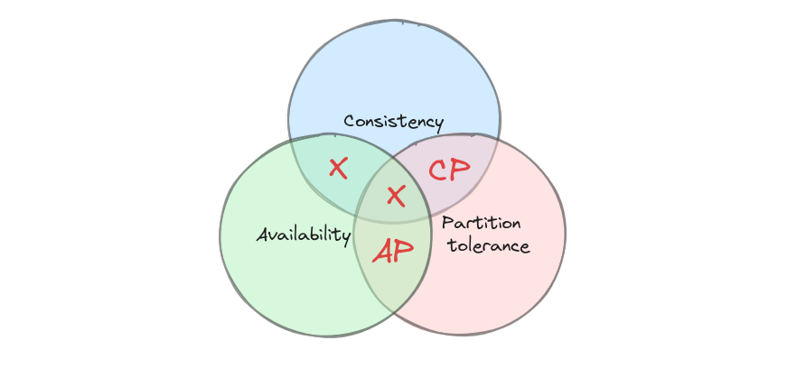

## 数据库的定义

数据库是结构化信息或数据的有序集合，以云、分布式等形式存储。

### 一、场景

- 分布式
- 物联网
- 区块链
- AI服务
- 机器人

### 二、业务部分

明确研究的对象，以数据库确实使用的东西为中心，展开工作。

专注于数据库在其应用领域中的业务，比如redis防失效的持久化机制、热点数据的string结构相关命令，而不是lua脚本。

总结中间件的攻击面，在redis作为缓存中间件时，用到了哪些命令。命令有何安全问题。

### 三、数据安全

数据库有哪些漏洞？
解析漏洞在数据库中最典型的表现就是 SQL 注入。
反序列化漏洞则更多地与数据库客户端驱动或某些特定功能的数据处理方式有关。

## 数据库的分类

### 一、主力存储

核心任务：在云，分布式上，存储业务数据，如用户信息、订单、交易记录等；存储AI数据。
核心要求：强一致性、事务安全（ACID）、持久化。
代表：
- 关系型数据库：TiDB，MySQL
- AI数据库：Milvus

### 二、缓存中间件

核心任务：存放热点数据，减轻主力存储的负载。
核心要求：内存模型，高并发、支持过期策略。
代表：
- 键值型数据库：Redis, Memcached

### 三、数据仓库

核心任务：专门负责处理复杂的搜索请求和海量数据的分析查询，为主力数据库分担不擅长的任务。
核心要求：强大的全文检索能力或高效的大数据分析能力。
代表：
- 搜索引擎：Elasticsearch
- 分析数据库（OLAP）：ClickHouse

### 四、分布式协调中间件

核心任务：用于管理分布式系统的状态、配置和服务发现。
核心要求：强一致性（对于协调系统）、持久化。
代表：
- 分布式协调方案：etcd，zookeeper

## 数据库中间件

**分库分表**

ShardingSphere

**最终一致性**

Canal