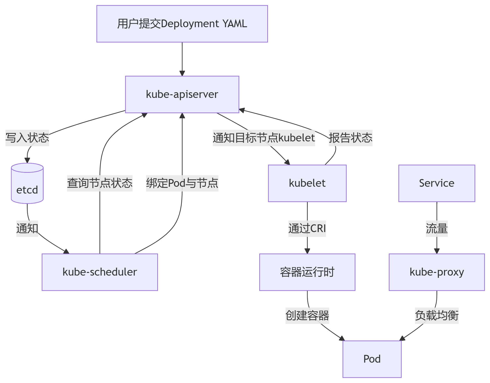

## 网络协议

### 一、TCP/UDP

TCP、UDP都在传输层，TCP全称传输控制协议，UDP全称用户数据协议。

**1.TCP和UDP的区别？**

- 区别在于可靠性保证，TCP面向连接，确保可靠性。
- TCP实现可靠传输，提供校验和、SYN/ACK、超时重传、最大消息长度、滑动窗口控制。
- UDP头部字段：端口号、校验和，TCP头部多了SYN、ACK、滑动窗口大小字段。

**2.TCP为什么是三次握手，四次挥手？**

为什么不是两次或者是四次握手？
- 两次握手，服务端无法区分历史报文、新的连接。
- 三次握手，区分历史报文，确认双方都具备发送、接收能力。
- 四次握手，无价值。

为什么是四次挥手，比握手多一次？
- 四次挥手，服务端处理完剩余数据，才发送FIN给客户端。
- 比握手多一次，因为握手时SYN-ACK合并发送，挥手时FIN、ACK分开发送。

**3.TCP三次握手的过程？**
- 一次握手，客户端发送SYN，请求建立C-S连接。
- 二次握手，服务端发送SYN-ACK，确认C-S连接，请求建立S-C连接。
- 三次握手，客户端发送ACK，确认建立S-C连接。

**4.TCP四次挥手中的等待时间？**
- 二次挥手、三次挥手之间，服务端等待时间close_wait，目的是处理剩余数据。
- 四次挥手之后，客户端等待时间time_wait，目的是确保TCP关闭，留下ACK重传时间。

**5.UDP如何实现可靠性，如何实现重传？**
- 使用QUIC实现。
- QUIC计算RTT，超时重传；基于QUIC的包编号机制，实现快速重传。

### 二、HTTP/HTTPS

HTTP全称超文本传输协议。

**1.HTTP和HTTPS 的区别？**
- HTTPS的S代表SSL/TLS协议，使用TLS确保数据安全。

**2.SSL/TLS三次握手的过程？**
- 一次握手，客户端发送密钥参数。
- 二次握手，服务端选择对称加密套件，发送CA签发的证书（包含公钥）。
- 三次握手，客户端校验证书，使用公钥加密主密钥，发送。
- 双方使用主密钥，建立对称加密通道。

**3.HTTP不同版本的区别？**
- HTTP/1.1，广泛使用的。
- HTTP/2.0，在1.1之上解决队头阻塞，头部压缩，仍然使用TCP协议。
- HTTP/3.0，基于QUIC，UDP协议可靠性传输。

**4.HTTP协议常见的请求方法？**
1. GET，场景：获取电子产品列表、加载网页。
2. POST，场景：提交用户名密码登录、执行支付操作。
3. PUT，场景：更新用户的全部信息、上传新版本pdf。
4. PATCH，场景：更新用户的邮箱、修改订单状态为“已发货”。
5. DELETE，场景：删除指定ID的商品、移除用户购物车中的第k项商品。
6. HEAD，场景：检查文件是否存在及大小、判断本地缓存是否有效。
7. OPTIONS，场景：浏览器询问服务器是否允许跨域请求、查询api支持哪些HTTP方法。

**5.HTTP协议的状态码？**
- 1xx，请求已接收，需要继续处理。
- 2xx，请求成功。
- 3xx，重定向，需要进一步操作，比如未登录。
- 4xx，客户端错误。
- 5xx，服务端错误。

高频状态码：
- 302，跳转新地址，下次仍请求原URL。
- 400，缺失参数，或者json格式错误。
- 403，无访问权限。
- 500，代码未处理异常，或者配置错误。
- 502，网关错误。
- 504，网关超时。

### 三、其他协议

WebSocket和SSE都用于解决HTTP实时性通信不足的问题，RPC用于解决HTTP跨进程/跨网络服务调用困难的问题。

**1.为什么LLM网站使用SSE而不是WebSocket？**
- SSE基于HTTP长连接，特点是服务端单向推送，场景：LLM流式文本输出。
- WebSocket基于TCP，特点是双向通信，场景：多人在线、物联网远控。

**2.WebSocket断开连接怎么办？**
- 断连的原因：网络波动、服务重启、认证过期。
- 实时检测心跳，自动重连。

**3.RPC相比于HTTP的优势？**
- 基于服务注册发现，可以实现自动IP感知。
- 自动序列化。

**4.Ping命令的执行过程？**
- 基于 ICMP 协议，收到响应后计算RTT。
- 收不到响应，原因有：目标不可达、超时

## 操作系统

### 一、进程和线程

**1.进程和线程的区别？**
- 进程至少有一个主线程，线程是CPU调度的基本单元。
- 进程间通过虚拟地址空间隔离，线程间共享进程的整个地址空间。
- 进程fork()、进程调度开销大，线程pthread_create()、线程调度开销小。

**2.进程/线程的状态？**
- 5种进程状态：运行态、睡眠态（可中断）、磁盘休眠态（不可中断）、暂停态（或者被ptrace）、僵尸态。
- 4种线程状态，复用task_struct：可运行态、等待态、超时等待态、阻塞态。

**3.进程/线程间通信的方式？**

进程间通信方式：
- 管道，匿名管道（父子进程/兄弟进程间使用）、命名管道（通过文件系统路径访问）。
- **消息队列**，支持多进程、异步通信。
- 共享内存，多个进程映射同一块物理内存，需同步机制（信号量）。
- 套接字，通常用于跨网络通信，也可用于本机。
- 信号，不能传输数据，仅作进程事件的通知。

线程间通信方式：
- 共享内存，多线程直接读写全局变量/堆内存，需同步机制（互斥锁、条件变量）。

**4.多进程/多线程的优缺点？**
- 多进程，优点：地址空间隔离、避免崩溃影响；缺点：开销大，需要进程间通信。适用于CPU密集型。
- 多线程，优点：共享内存、开销小；缺点：崩溃互相影响。适用于I/O密集型。

**5.死锁如何产生的？如何解决？**
- 单线程、多个进程/线程因争夺资源而陷入相互等待。
- 产生死锁的4个必要条件：互斥访问、持有并等待、不可剥夺、循环等待。
``` python
import threading
import time

# 创建两把锁
lockA = threading.Lock()
lockB = threading.Lock()

def task1():
    
    lockA.acquire()
    time.sleep(1)
    lockB.acquire()  # 将在此处死锁
    
    # 临界区代码（实际不会执行到这里）
    lockB.release()
    lockA.release()

def task2():

    lockB.acquire()
    time.sleep(1)
    lockA.acquire()  # 将在此处死锁
    
    # 临界区代码（实际不会执行到这里）
    lockA.release()
    lockB.release()

# 创建并启动线程
t1 = threading.Thread(target=task1)
t2 = threading.Thread(target=task2)
t1.start()
t2.start()
```
- 锁超时机制：超时回退，随机时间后重试。
- 死锁检测：在资源图中DFS判环，选择最小代价回退。
- 可重入锁同步机制：避免单线程死锁，go不支持可重入锁。

### 二、I/O多路复用

**1.什么是I/O多路复用，复用的是什么？**
- 利用操作系统机制（select，poll，epoll）实现单个进程/线程，同时监控多个I/O通道（如文件描述符、网络套接字）。
- 复用的是，执行I/O的进程/线程。

**2.select，poll，epoll，kqueue实现的优缺点？**
- select，优点：全平台支持；缺点：文件描述符上限1024，fd集合全复制。
- poll，优点：无文件描述符上限，缺点：连接数增长时性能线性下降，pollfd全复制。
- epoll，优点：内核事件驱动，零拷贝优化（无重复复制）；缺点：仅支持linux。
- kqueue，macOS中的epoll。

### 三、linux命令

**1.进程操作命令**
- ps，进程快照（如排查Nginx是否运行），参数 aux，--sort。
- top，实时进程监控（如定位CPU飙高问题），参数 -d，-p，-u。
- kill，pkill，终止进程，kill参数 -2，-9；pkill参数 -f，-u。
- pgrep，查找进程ID，参数 -u，-x。
- netstat，检查端口占用或网络连接状态，参数 -tulnp。
- xargs，搭配管道杀java进程 pgrep -f java | xargs kill -9

**2.文件操作命令**
- cat，文件内容查看。
- awk，日志分析、统计数据。
- grep，通常伴随管道符 | ，搜索过滤。
- rm，删除文件、目录。
- chmod，文件权限管理，参数 -R，ugo。

## 设计模式

**1.go项目用到哪些设计模式？**
- 生成器模式，接口定义：初始化客户端、初始化测试用例集。
- 组合模式，将客户端、快照、测试用例集组合起来。
- 策略模式，接口定义：快照收集方法、变异策略方法。

**2.策略模式和工厂模式的区别？**
- 工厂模式，目的是创建一个接口对象。
- 策略模式，目的是给接口对象指定策略。

**3.单例模式的两种实现？**
- 饿汉式，go执行时即创建单例。
```go
var singleInstance *single = &single{}

func getInstance() *single {
  return singleInstance
}
```
- 懒汉式，go使用sync.Once延迟创建单例。
```go
var singleInstance *single
var once sync.Once

func getInstance() *single {
  if singleInstance == nil {
    once.Do(
      func() {
        singleInstance = &single{}
      })
  }
  return singleInstance
}
```
python重写__new__来实现懒汉式。
```python
class Singleton:
    _instance = None  # 类变量，用于保存唯一的实例
    _lock = threading.Lock() # 创建一个锁对象

    def __new__(cls, *args, **kwargs):
        # 获取锁。只有一个线程能成功进入下面的代码块，其他线程会在此等待。
        with cls._lock:
            if cls._instance is None:
                cls._instance = super().__new__(cls)
                # 这里可以进行其他初始化操作
            return cls._instance
    def __init__(self, value):
        # 对于单例，__init__ 可能会被多次调用（每次 Singleton() 都会调用）
        # 所以这里我们可能希望只初始化一次，或者允许更新值
        self.value = value
```

**4.多线程下的观察者模式？**
- 观察者模式，一个主题维护一个观察者列表，在状态发生变化时通知它们。
- 多线程下，三个核心操作（注册、注销、通知）都要考虑同步问题。

**5.适配器模式的场景？**
- 设计一个解码器接口，可以解码不同格式的视频流。
- 设计一个格式转换接口，在不同数据格式之间进行转换。

## 算法

1. 考虑到 做法
2. 考虑到 初始条件，边界条件

### 一、数组

**1.两数之和**
- map
- 1）first = 0，`first == N`
- 2）num = Nums[first]，`map[Target-num] == ok`

**2.三数之和**
- 排序 + 双指针
- 1）first = 0，`first == N`
- 2）second = 0，`second == N` 
- 3）third = N-1，`second == third`

**3.买卖股票的最佳时机**
- 一次遍历
- 1）i = 0，`i == N`

**4.搜索旋转排序**
- 二分查找
- 1）left = 0，right = N-1，`left > right`
- 2）mid = (right-left)/2 + left，`Nums[mid] == Target`

**5.全排列**
- 回溯
- 1）first = 0，`first == N`
- 2）i = first，`i == N`

**6.前K个最大元素**
- map
- 1）i = 0，`i == K`

**7.第K个最大元素**
- 快排 + 选择
- 1）pivot = partition(Nums, left, right)，`pivot == K`

**8.合并区间**
- 排序
- 1）i = 0，`i == N`

**9.合并两个有序**
- 双指针
- 1）p1 = 0，`p1 == N1`
- 2）p2 = 0，`p2 == N2`

**10.最大子序和**
- 动态规划
```
dp[i] = max{dp[i−1] + nums[i], nums[i]}
```
- 1）i = 1，`i == N`

**11.最长递增子序列**
- 动态规划
```
dp[i] = max{dp[j]} + 1, 其中 0 ≤ j < i 且num[j] < num[i]
```
- 1）i = 0，`i == N`
- 2）j = 0，`j == i`

### 二、图

**1.岛屿数量**
- DFS
- 1）row = 0，`row == NR`
- 2）col = 0，`col == NC`
- 3）DFS中，`row == 0 || row == NR || Grid[row][col] == '0'`
- 4）DFS中，`col == 0 || col == NC || Grid[row][col] == '0'`

**2.岛屿最大面积**
- DFS
- 1）row = 0，`row == NR`
- 2）col = 0，`col == NC`
- 3）DFS中，`row == -1 || row == NR || Grid[row][col] == '0'`
- 4）DFS中，`col == -1 || col == NC || Grid[row][col] == '0'`

### 三、链表

**1.反转**
- 一次遍历
- 1）cur = head，`cur == null`

**2.局部反转**
- 一次遍历
- 1）i = 0，`i == left`
- 2）i = 0，`i == right-left+1`
  
**3.K个一组反转**
- 递归
- 1）cnt = 0，`cnt < K`
- 2）i = 0，`i == K`

**4.返回入环点**
- map
- 1）cur = head，`cur == null`
- 2）`map[cur] == ok`
  
**5.合并有序**
- 递归
- 1）cur1 = head1，cur2 = head2，`cur1 == null || cur2 == null`

**6.删除倒数第K个节点**
- 栈
- 1）cur = dummy，`cur == null`
- 2）nodes = append(nodes，cur)，`len(nodes) < K`

**7.删除存在重复的元素（有序）**
- 一次遍历
- 1）cur = dummy，`cur.next == null || cur.next.next = null`
- 2）val = cur.next.val，`cur.next == null || cur.next.val != val`

**8.LRU缓存**
- 双向链表 + map

### 四、字符串

**1.复原IP地址**
- DFS
- 1）`segID == 4 && segBegin == len(str)` 
- 2）`segID != 4 && segBegin == len(str)`

**2.无重复字符的最长子串**
- 双指针（滑动窗口）+ map
- 1）i = 0，`i == N`
- 2）left = -1，char = str[left+1]，`left+1 == N || map[char] != 0`

**3.最长公共子序列**
- 动态规划，
```
dp[i][j] = { dp[i−1][j−1] + 1 ，当text1[i−1] = text2[j−1]
           { max(dp[i−1][j], dp[i][j−1]) ，当text1[i−1] != text2[j−1]
```
- 1）i = 0，`i == N1`
- 2）j = 0，`j == N2`

**4.最长回文子串**
- 动态规划
```
dp[i][j] = dp[i+1][j−1] ∧ (str[i] == str[j])
```
- 1）j = 0，`j == N`
- 2）i = 0，`i > j`

**5.有效的括号**
- 栈
- 1）i = 0，`i == N`

**6.比较版本号**
- 双指针
- 1）i = 0，j = 0，`i == N1 && j == N2`
- 2）`version1 != version2`

**7.两串相加**
- 模拟
- 1）i = N1-1，j = N2-1，carry = 0，`i == -1 && j == -1 && carry == 0`

### 五、树

**1.中序遍历**
- 递归
- 1）node = root，`node == null`

**2.层序遍历**
- 队列
- 1）`len(queue) == 0`
- 2）j = 0，`j == len(queue)`

**3.锯齿形层序遍历**
- 队列 + 奇数反转
- 同上

**4.右视图**
- 层序遍历
- 同上

**5.最近的公共祖先**
- 递归
- 1）node = root，`node == null`
- 2）`node.val == p.val || node.val == q.val`

### 六、多线程

**1.三个线程分别打印A、B、C，交替打印出ABCABCABC**
```go
// 创建三个通道用于goroutine间的同步
aChan := make(chan struct{})
bChan := make(chan struct{})
cChan := make(chan struct{})
	
// 使用WaitGroup等待所有goroutine完成
var wg sync.WaitGroup
wg.Add(3)
	
// 控制打印次数
count := 9
	
// goroutine A: 打印A
go func() {
	defer wg.Done()
	for i := 0; i < count/3; i++ {
		// 等待C的通知
		<-cChan
		fmt.Print("A")
		// 通知B打印
		aChan <- struct{}{}
	}
}()
	
// goroutine B: 打印B
go func() {
	defer wg.Done()
	for i := 0; i < count/3; i++ {
		// 等待A的通知
		<-aChan
		fmt.Print("B")
		// 通知C打印
		bChan <- struct{}{}
	}
}()
	
// goroutine C: 打印C
go func() {
	defer wg.Done()
	for i := 0; i < count/3; i++ {
		// 等待B的通知
		<-bChan
		fmt.Print("C")
		// 通知A打印(下一轮)
		if i < count/3-1 {
			cChan <- struct{}{}
		}
	}
}()
	
// 启动打印循环
cChan <- struct{}{}
	
// 等待所有goroutine完成
wg.Wait()
```

## 分布式

### 一、分布式理论基础

**1.分布式系统的CAP定理？**
- 分布式系统中，3个属性无法同时满足，只能同时实现2个。
1. C（一致性）： 所有节点在同一时间看到的数据是相同的（强一致性）。
2. A（可用性）： 每个请求都能得到响应（不保证是最新数据）。
3. P（分区容错性）： 系统在遇到网络分区（节点间无法通信）时仍然能够继续运行。
- P是必选的，因此只有2种分布式系统：CP、AP。

**2.CP、AP的系统有哪些？**
- CP，保证强一致性（C），在网络分区发生时，拒绝用户的请求，直到数据一致为止。
- 例如：ZooKeeper，etcd。
- AP，保证高可用性（A），在网络分区发生时，允许节点提供可能过期的数据。
- 例如，默认配置的redis。

**3.共识协议有哪些？**
- 共识协议，是CP系统实现强一致性的算法。
raft和paxoes

**4.分布式锁的实现？**
- 分布式锁，是用于在分布式中协调多个进程/服务对共享资源进行互斥访问的机制。
- 强一致性的分布式锁，必须基于共识协议来实现。

分布式锁自动续费的底层逻辑，你有没有关注过它是怎么实现的？ 

1. 基于缓存访问中间件的实现，AP系统，容易发生锁失效问题，无法满足强一致性。
Redis `SETNX`
锁失效的场景与解决方案：主从复制与故障转移、锁过期时间（TTL）设置不当
解决锁失效：更换CP系统实现、Redisson看门狗机制自动续期。
2. 基于服务注册与发现中间件的实现，CP系统，基于共识协议，满足强一致性。
锁不会失效。
通过锁服务查询哪个节点持有锁？

基于缓存访问的分布式锁实现。

```
代表：Redis（Redlock 算法）、Memcached。

原理：

通过 SET key value NX PX timeout 命令（Redis）实现原子性加锁。
lua脚本怎么保证原子性？
基于Lua脚本，使用原子SET命令和Lua脚本的事务性，但仍存在锁续期困难和业务超时锁释放风险
基于Redisson的分布式锁，支持可冲入锁和自动续期，提供公平锁、联锁和红锁
Redisson与redis实现分布式锁区别
非公平与公平的redis分布式锁？
利用 Key 的过期时间避免死锁。

优点：

性能极高（内存操作，微秒级响应）。

实现简单，社区支持完善（如 Redisson 客户端）。

缺点：

非强一致性（主从切换可能导致锁失效）。

需自行处理锁续期、可重入等问题。
```
基于服务注册与发现的分布式锁实现。
```
代表：ZooKeeper、etcd。

原理：

创建临时有序节点（ZooKeeper）或租约（etcd）。

通过节点序号最小判断是否获得锁，利用 Watch 机制监听锁释放。

优点：

强一致性（基于 Paxos/Raft 协议）。

原生支持锁释放（会话断开自动删除节点）。

缺点：

性能低于缓存（毫秒级）。

部署复杂度较高。
```

**5.分布式系统的幂等性问题？**

分布式系统中，多次请求导致数据重复修改怎么办
超卖问题？商品库存里加锁？乐观锁与悲观锁？加锁的原理？怎么实现？
介绍一下乐观锁和悲观锁，什么情况下用乐观锁或者悲观锁？答：写多，并发量高，容易产生冲突的时候用悲观锁，接着问：并发高的情况下悲观锁会影响效率，拿不到锁的线程会阻塞等待该怎么办？（不知道，只答了tryLock，失败就直接返回）。
介绍一下幂等？为什么要幂等？哪些方式实现幂等？

**6.分布式系统的一致性模型？**
- CP系统，强一致性
- AP系统，最终一致性，如果没有新的写操作，经过一段时间后，所有副本最终会达成一致状态。
读写分离的时候，读的数据库同步不及时导致读了旧数据怎么办?
读写分离架构通常是主从复制（Master-Slave Replication），数据从主库异步地同步到从库。这种异步性必然会导致一个时间窗口，在此窗口内主库有最新数据，而从库是旧数据。
你提出的“读了旧数据”正是最终一致性模型下的一种正常但需要管理的状态。解决方案不是消除延迟（这在物理上不可能），而是如何根据业务场景规避或忍受这种不一致。

**7.分布式id有哪些方法？**

### 二、分布式版本控制

**1. git的常见命令？**
- commit，创建一个新的提交，保存到本地分支。
- push，将本地分支的提交推送到远程分支。
- pull，从远程分支拉取更新并立即合并到本地分支（git fetch + git merge）。
- fetch，从远程分支下载所有最新的提交和分支引用，但不会自动合并。
- reset，在本地分支上，撤销一系列提交。
1. --soft： 撤销提交，保留工作区、暂存区的修改。
2. --mixed： 撤销提交、暂存区，保留工作区的更改。
3. --hard： 撤销提交、暂存区、工作区的修改，彻底回到那个提交的状态。
- revert，创建一个新的提交来“撤销”指定提交的更改，撤销已经推送到远程分支的提交。
- switch，切换分支，或者创建并立即切换到新分支。
- merge，将指定分支的更改合并到本地分支。
- rebase，变基，将本地分支的提交“移动”到另一个分支的最新提交之后，即线性合并。不要在公共分支上使用 rebase。

**2.git没提交就删除了怎么办？**
- git reflog获取被删除的提交的hash。
- git reset --hard [hash]恢复提交。

**3.多个开发分支要合并，该怎么处理？**
- git rebase首先保持主分支历史的线性。
- 逐个开发分支git merge合并到主分支。
- 逐个开发分支git push推送到远程主分支。

### 三、分布式部署

**1.介绍一下CI/CD？**
- 持续集成（CI），开发人员频繁地将代码更改合并到共享的主干分支中。
1. 开发者向代码仓库（如 GitHub/GitLab）推送（push）代码，触发CI流水线。
2. CI服务器（如 Jenkins/GitLab CI）执行代码编译、单元测试、代码质量检查。
3. 根据Dockerfile构建一个新的Docker镜像，运行容器化的集成测试。
4. 测试通过后，将镜像推送到私有镜像仓库（如 Harbor），并打上唯一的标签（如 git-commit-id）。
- 持续部署（CD），代码在通过CI后生成镜像，自动地部署到生产环境。
1. CD工具（如 Jenkins/GitLab Agent）从镜像仓库拉取镜像，K8S部署到测试环境。
2. 容器通过全面、高级的测试后，部署到生产环境中。

**2.Docker的镜像、容器？**
- 镜像，是软件包，包含：代码、运行时环境、系统工具、系统库和配置。
- 容器，是镜像运行起来的若干个进程。

**3.Docker容器、虚拟机之间的区别？**
- 隔离性，容器是进程级隔离，通过 Namespace 和 Cgroups 实现；虚拟机是系统级隔离，由 Hypervisor 实现。
- 速度、性能，容器非常快，损耗极小；虚拟机慢，损耗大。
- 集成性，容器适合微服务架构，每个服务一个容器；虚拟机适合运行完整的、异构的应用堆栈。

**4.Docker的常见命令？**
- pull，拉取镜像。
- build，根据Docker file构建镜像。
- run，创建并启动一个新容器。
- start、stop，启动停止的容器、安全地停止容器。
- logs，查看容器的日志输出。

**5.Dockerfile和Docker Compose的区别？**
- Dockerfile用于构建一个新的Docker镜像。
1. FROM: 指定基础镜像，如 ubuntu:20.04, node:16。
2. RUN: 执行命令（如 apt-get install）。
3. COPY / ADD: 将文件从主机复制到镜像中。
4. WORKDIR: 设置工作目录。
5. EXPOSE: 声明容器运行时监听的端口。
6. ENV: 设置环境变量。
7. CMD / ENTRYPOINT: 指定容器启动时运行的命令。
- Docker Compose与K8S一样，都是用于多个容器的编排，常见于微服务架构。
1. services：各个容器服务（每个服务通常对应一个容器，背后可能由一个镜像支持）。
2. networks：定义自定义网络，让容器之间可以通过服务名相互通信。
3. volumes：定义数据卷，用于数据持久化。

**6.K8S的组件有哪些？**



- kube-apiserver，内外部请求的唯一接口，提供 RESTful API。
- etcd，持久化存储集群数据（节点、Pod、配置、状态等），而非缓存
- kube-scheduler，调度工作节点，绑定节点与Pod。
- kubelet，管理本节点上 Pod 的生命周期（创建、销毁、监控）。
- kube-proxy，转发服务请求到具体Pod上。

### 四、微服务

**1.介绍一下微服务架构？**
- 微服务架构是分布式系统，通常采用分布式的容器部署实现。
- 微服务架构有3个组成部分。


1. 微服务，通常根据业务领域划分。
2. 中间件，支撑微服务的基础设施。
3. CI/CD平台，自动化流程。

## 数据库

### 一、主力存储

1. mysql 事务特性
2. 隔离性如何实现
3. 隔离级别有哪些，解决哪些问题
4. 默认隔离级别

数据库的 Join 有几种？
数据库事务的 ACID 指的是什么？
MySql的隔离级别？
数据库的隔离级别有哪些，分别解决什么问题
如何实现的可重复读？
MVCC原理？
数据库的事务如何实现的
实现一个hash join的算子？执行算子有哪些？
select * from table where id ＞10上了什么锁，数据库线程模型讲一下（元数据锁的读锁）
MySQL有哪些隔离级别？分别有什么问题？
如何通过非命令方式测试数据库的隔离级别？
什么是数据库索引？
为什么用索引能加快查询速度？
MySQL的索引失效场景
聚簇索引和唯一索引的区别
按什么样的原则设计表中用聚簇索引还是唯一索引
从数据结构分类讲讲数据库的索引类型；为什么MySQL用B+树索引，不用B树、红黑树
慢SQL如何排查并优化
一条 SQL 语句在数据库中是怎么执行的？（从 Client, Server, Engine 协作关系角度）
ORDER BY 语句在执行过程中是如何实现的？
MySQL联合索引的最左匹配原则原理？
数据库读写分离后主从同步延迟如何处理？
MySQL的MVCC机制是如何保证隔离性的？
一次Insert操作，MySQL的几种Log的写入顺序？
表中有大量删除操作时还会走联合索引吗？
binlog日志是什么？主要作用是什么？
MySQL有好多存储引擎，你们有没有做过这些存储引擎的比较？它们之间有什么特征？在选型时会有什么考虑？
你有MySQL调优的经历吗？
MySQL的InnoDB存储引擎下面有四种隔离级别
MySQL如果对一个不存在的记录进行当前读，那么会加锁吗？如果加了的话是什么锁
mysql的慢sql是怎么样去定位的排查的
mysql的死锁场景，举例说明什么时候会出现死锁
请说明数据库的优化方式、索引设计原则以及索引失效的场景

### 二、缓存中间件

**1.Redis为什么速度快？**
- 基于内存操作。
- 高效的数据结构。
- 单线程模型、I/O 多路复用。

**2.Redis基本数据结构的底层实现、应用场景？**
1. string，整型、字符串。
- 底层实现：int（字符串为64位int）、embstr（短字符串）、sds（长字符串）。
- 应用场景：缓存热点数据（如 Refresh Token）、计数器（如 库存统计）、分布式锁。
2. hash，存储对象。
- 底层实现：ziplist（字段较少，双向链表实现）、hashtable（通用实现，数组+链表）。
- 应用场景：存储对象信息（用户的name, age, email 等）、购物车（field 为商品ID）。
3. list，字符串列表。
- 底层实现：quicklist（大链表拆分成多个节点，每个节点是一个ziplist）。
- 应用场景：最新列表（例如朋友圈的最新动态、新闻网站的最新文章）。
4. set，无序、不重复的集合。
- 底层实现：intset（集合中的所有元素都是整数）、hashtable（集合中包含非整数元素）。
- 应用场景：共同关注、抽奖。
5. zset，有序、不重复的集合，关联分数。
- 底层实现：ziplist（元素少时使用）、skiplist + hashtable（跳表维持元素顺序）。
- 应用场景：排行榜（key 是排行榜名称，member 是用户ID，score 是排序依据）、延时任务（任务的执行时间作为 score）。

**3.Redis的线程模型、I/O模型？**

多路复用的系统调用？

**4.Redis持久化策略？**
- 两种持久化策略，RDB和AOF，二者通常混合使用。
1. RDB (Redis Database)
- 是什么：在指定的时间间隔内，生成内存数据的一个快照（Snapshot）。
- 持久化到哪里：一个二进制的压缩文件，默认名为 dump.rdb。
- 触发方式：
  - 手动触发：执行 SAVE（阻塞）或 BGSAVE（后台异步）命令
  - 自动触发：在配置文件中设置规则，如 save 900 1（900秒内至少有1个key发生变化）。
- 优点：
  - 性能高：父进程fork子进程进行持久化，主进程不进行任何I/O操作。
  - 恢复快：大数据集恢复速度远快于AOF。
  - 文件紧凑：RDB文件是压缩的二进制文件，非常适合做灾难恢复和备份。
- 缺点：
  - 可能丢失较多数据：如果服务器宕机，最后一次快照之后的数据会丢失。
2. AOF (Append Only File)
- 是什么：记录每一次写操作命令，以日志的形式追加到文件末尾。
- 持久化到哪里：一个文本命令日志文件，默认名为 appendonly.aof。
- 如何工作？客户端写入命令 -> 追加到AOF缓冲区 -> 根据策略同步到磁盘（appendfsync配置），同步策略：
  - everysec：每秒同步一次。是默认策略，在安全性和性能之间取得了平衡（最多丢失1秒数据）。
  - always：每个命令都同步到磁盘。最安全，但性能最差。
  - no：由操作系统决定何时同步。性能最好，但可能丢失大量数据。
- 优点：
  - 数据更安全：everysec策略下最多只丢失1秒的数据。持久性更强。
  - 可读性强：AOF文件是纯文本，可以手动处理或修复。
-缺点：
  - 文件更大：记录的是命令，通常比RDB文件大。
  - 恢复慢：回放所有命令来恢复数据，比RDB慢。

**5.Redis高可用性保证？**
讲讲 Redis 主从复制？主从复制之间有差距怎么解决？
讲讲 Redis 哨兵机制？哨兵模式与集群模式区别？
Redis集群模式？答：redis通过16384个哈希槽，集群中的每个节点拥有一段自己的哈希槽index范围，读写数据时，通过hash函数%16384得到key位于那个槽中，并且集群中每个节点间都会通过redis发布订阅机制彼此之间交换自己所拥有的hash槽范围，客户端只需要向集群中某一个节点发送请求，如果请求对应该节点，即可执行成功，否则，redis会发送一个重定向命令响应客户端，客户端再向正确的节点发送请求。
Redis被大量访问导致压力过大如何解决？利用Redis集群，集群中每一个节点部署以一主多从。

**6.Redis缓存穿透、雪崩、击穿？**
解决方案。。。
Redis热点key问题怎么解决？答：本地缓存、redis集群，主从架构、限流
高并发下，热点key优化思路？介绍兼容性测试？

**7.Redis过期键的删除策略？**
- 惰性删除
- 

**8.Redis的内存淘汰策略？**
- 相比于过期键的删除，Redis内存淘汰策略在到maxmemory限制时，会主动删除键（包括未过期的键）来释放空间。

Redis中的hot key是什么，如何处理hot key问题
Redis中的big key问题是什么，如何处理；大key中如果是map结构，其value如何进行压缩
Redis做缓存数据不一致如何解决？
你使用Redis时，只用了value结构吗？有没有了解过Redis能存储其他类型的结构？
你了解Redis中value大小有什么限制吗？ 

### 三、数据仓库

**3.介绍一下Elasticsearch倒排索引？**
- 倒排索引，记录的是哪个词在哪些文档中出现。
- 词条字典，包含了所有唯一、有序关键词（Term）的列表。
- 倒排列表，每个关键字对应一个列表，包含文档 ID、词频、位置、偏移量。

### 四、分布式协调中间件

**1.介绍一下选主机制？**
- 选举出Leader，处理所有写请求，采用多数派（Quorum）原则避免集群脑裂导致的数据不一致（比如 服务状态不一致）。
- etcd使用 Raft 共识算法实现选主。
- zookeeper使用 Zab 协议实现选主。

**2.节点存活状态如何判定？**
- 心跳机制，Leader节点定期向所有Follower节点发送心跳消息，接收方收到后需要回复一个确认（ACK）。
- 租约机制，服务注册时，会获得一个租约，并在租约的有效期内定期续约，租约超时即认为服务宕机。

**3.介绍一下watch机制？**
- watch 机制是一种典型的 发布-订阅模型（Pub/Sub）。
- 应用场景：服务注册与发现。

### 五、数据库中间件

**1.Canal如何保证缓存、数据库的最终一致性？**
- 伪装成 MySQL 的从库，订阅并解析数据库的 binlog，当数据库发生任何增删改操作时，binlog 会记录这些变更。
- Canal 获取到 binlog 的变化后，通知到一个消息队列（如 Kafka/RocketMQ）。
- 一个专门的数据同步服务消费 MQ 里的消息，根据key删除或更新Redis中的缓存。

**2.ShardingSphere如何实现分库、分表？**
- 垂直分库，按业务模块，将不同表分散到不同数据库。
- 水平分片，将同一个表中的不同行数据，分散到不同的数据库或表中。
- 选择分片键，选择分片算法，映射到具体的数据库和表中。

3.分库分表的查询一致性如何保证？

mysql的分库分表如何进行分？具体什么样的数据量需要分？

4.分库分表数据如何打散的？

分库分表怎么保证主键的正确有序

数据库分库分表后全局ID生成方案？

分片集群后怎么对请求分流使每个分片的请求数量差不多