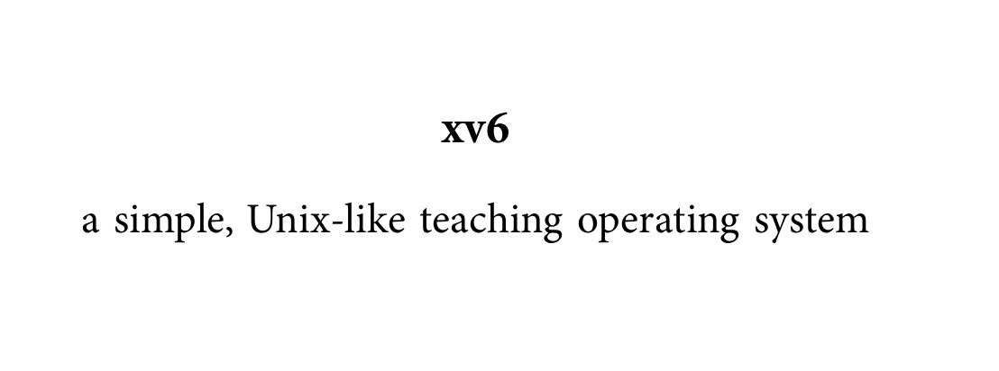
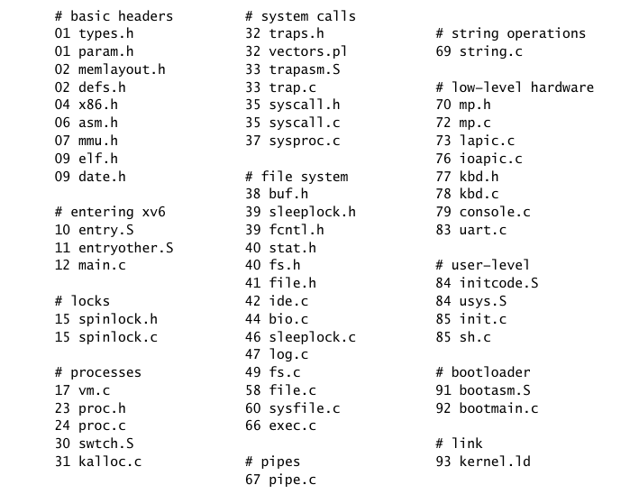
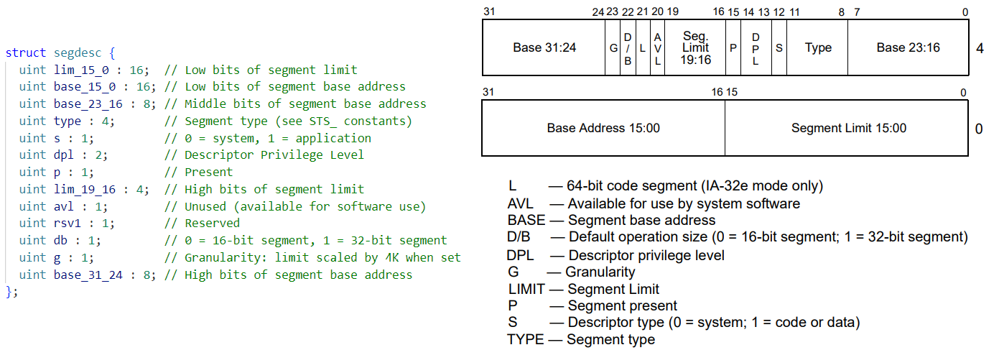
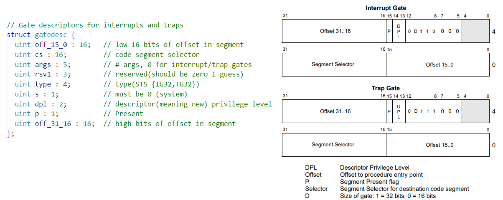
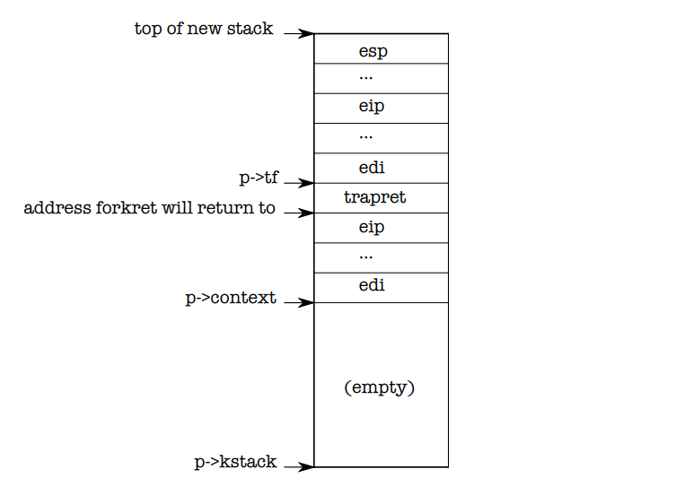
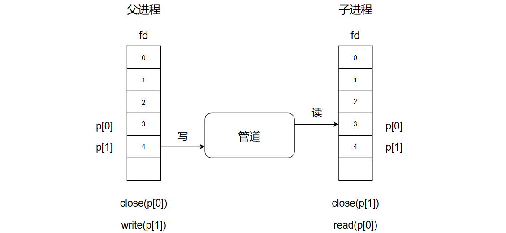
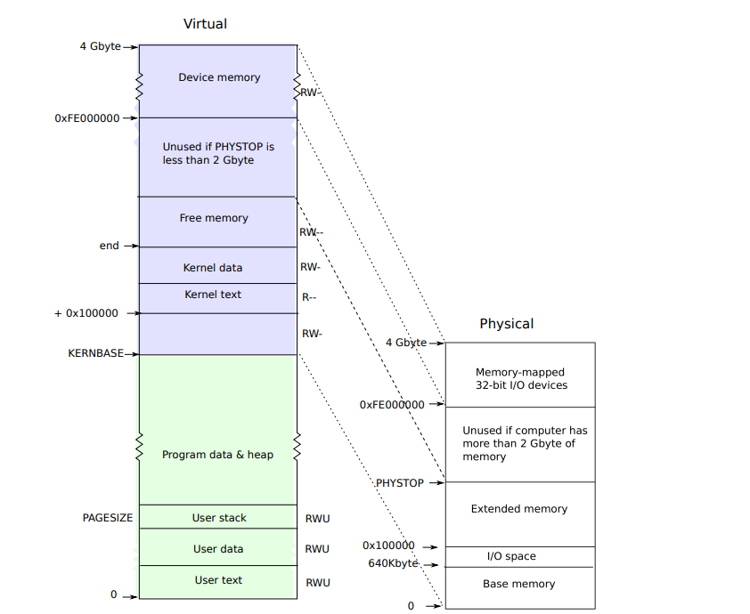
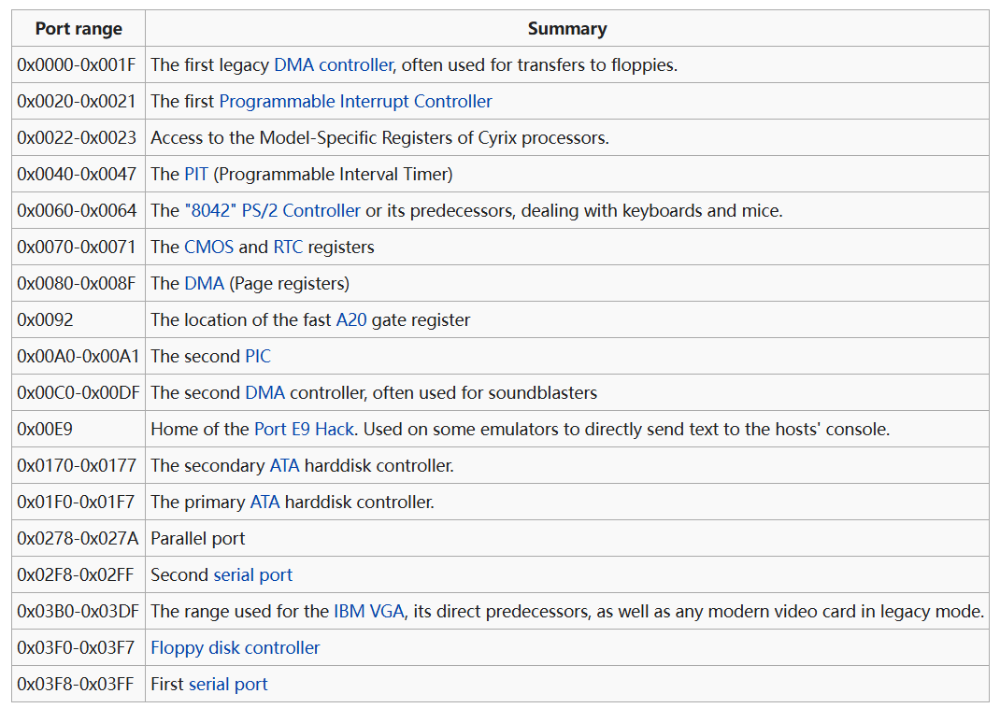

### xv6

操作系统需要实现启动引导、进程管理、系统调用、文件系统等功能，存储在外存中，当启动引导配置完毕后，将正式接管硬件并向用户提供一个交互接口。



xv6是MIT开发的用于教学的类UNIX操作系统，拥有完整的启动引导、文件系统、内核，支持多处理器，还包括一些提供给用户的sh程序。

在xv6 Makefile中，以下规则制作了一个xv6.img，存储着xv6的bootloader和kernel。

``` makefile
xv6.img: bootblock kernel
	dd if=/dev/zero of=xv6.img count=10000
	dd if=bootblock of=xv6.img conv=notrunc
	dd if=kernel of=xv6.img seek=1 conv=notrunc

bootblock: bootasm.S bootmain.c
	$(CC) $(CFLAGS) -fno-pic -O -nostdinc -I. -c bootmain.c
	$(CC) $(CFLAGS) -fno-pic -nostdinc -I. -c bootasm.S
	$(LD) $(LDFLAGS) -N -e start -Ttext 0x7C00 -o bootblock.o bootasm.o bootmain.o
	$(OBJDUMP) -S bootblock.o > bootblock.asm
	$(OBJCOPY) -S -O binary -j .text bootblock.o bootblock
	./sign.pl bootblock

entryother: entryother.S
	$(CC) $(CFLAGS) -fno-pic -nostdinc -I. -c entryother.S
	$(LD) $(LDFLAGS) -N -e start -Ttext 0x7000 -o bootblockother.o entryother.o
	$(OBJCOPY) -S -O binary -j .text bootblockother.o entryother
	$(OBJDUMP) -S bootblockother.o > entryother.asm

initcode: initcode.S
	$(CC) $(CFLAGS) -nostdinc -I. -c initcode.S
	$(LD) $(LDFLAGS) -N -e start -Ttext 0 -o initcode.out initcode.o
	$(OBJCOPY) -S -O binary initcode.out initcode
	$(OBJDUMP) -S initcode.o > initcode.asm

kernel: $(OBJS) entry.o entryother initcode kernel.ld
	$(LD) $(LDFLAGS) -T kernel.ld -o kernel entry.o $(OBJS) -b binary initcode entryother
	$(OBJDUMP) -S kernel > kernel.asm
	$(OBJDUMP) -t kernel | sed '1，/SYMBOL TABLE/d; s/ .* / /; /^$$/d' > kernel.sym
```
其中，bootblock作为xv6的bootloader，通过链接器设置其虚拟地址为0x7c00，在x86虚拟环境下，会从该地址处开始执行。
kernel使用xv6的链接脚本kernel.ld为内核定义段空间，首先设置内核起始的虚拟地址为0x80100000。

xv6 Makefile中，以下规则首先编译了mkfs工具，使用该工具制作文件系统fs.img。

``` makefile
mkfs: mkfs.c fs.h
	gcc -Werror -Wall -o mkfs mkfs.c

UPROGS=\
	_cat\
	_echo\
	_forktest\
	_grep\
	_init\
	_kill\
	_ln\
	_ls\
	_mkdir\
	_rm\
	_sh\
	_stressfs\
	_usertests\
	_wc\
	_zombie\

fs.img: mkfs README $(UPROGS)
	./mkfs fs.img README $(UPROGS)
```
按照以下磁盘布局

| boot block | superblock block | log | inode blocks | free bit map | data blocks |


制作文件系统。将README和几个可执行文件布局在fs.img中。

make时取消-Werror，使用make qemu选项启动xv6.img，挂载fs.img。

``` makefile
QEMUOPTS = -drive file=fs.img，index=1，media=disk，format=raw -drive file=xv6.img，index=0，media=disk，format=raw -smp $(CPUS) -m 512 $(QEMUEXTRA)

qemu: fs.img xv6.img
	$(QEMU) -serial mon:stdio $(QEMUOPTS)
```

### 启动引导

xv6的启动过程有三个阶段：引导阶段、内核阶段和内核主函数阶段

### 1.引导阶段

引导处理器BP运行BIOS将bootblock加载到固定物理地址0x7c00处；运行bootasm.S从实模式进入32位保护模式；bootblock中bootmain.c加载内核elf到固定物理地址0x100000处，然后转入内核入口点_start即elf->entry运行。

``` c
(bl/bootmain.c)
void bootmain(void) {
  struct elfhdr *elf;
  struct proghdr *ph, *eph;
  void (*entry)(void);
  uchar* pa;

  elf = (struct elfhdr*)0x10000;  // 缓冲区

  // 从扇区1读 4KB 到elf
  readseg((uchar*)elf, 4096, 0);

  // 校验内核文件格式
  if(elf->magic != ELF_MAGIC)
    return;  // let bootasm.S handle error

  // 加载每一个elf段，从pa=0x100000(1MB)开始
  ph = (struct proghdr*)((uchar*)elf + elf->phoff);
  eph = ph + elf->phnum;
  for(; ph < eph; ph++){
    pa = (uchar*)ph->paddr;
    readseg(pa, ph->filesz, ph->off);
    if(ph->memsz > ph->filesz)
      stosb(pa + ph->filesz, 0, ph->memsz - ph->filesz);
  }

  // 进入内核的entry
  // 不返回
  entry = (void(*)(void))(elf->entry);
  entry();
}
```
### 2.内核阶段

entry通过操作CR0、CR3、CR4寄存器开启分页，设置临时页表entrypgdir，4MB大小；建立内核栈，esp指向0x2000；转到主函数main。
``` x86asm
.globl entry
entry:
  # 开启4MB的临时页表
  movl    %cr4, %eax
  orl     $(CR4_PSE), %eax
  movl    %eax, %cr4
  # 设置页表
  movl    $(V2P_WO(entrypgdir)), %eax
  movl    %eax, %cr3
  # 开启分页
  movl    %cr0, %eax
  orl     $(CR0_PG|CR0_WP), %eax
  movl    %eax, %cr0

  # 设置栈指针
  movl $(stack + KSTACKSIZE), %esp

  # 跳转到main()
  mov $main, %eax
  jmp *%eax

# 内核栈大小 = 4096
.comm stack, KSTACKSIZE
```

其中，CR0配置了三个选项，CR4配置了一个选项，CR3被赋值为临时页表的地址。
``` c
(include/mmu.h)
// Control Register flags
#define CR0_PE          0x00000001      // Protection Enable
#define CR0_WP          0x00010000      // Write Protect
#define CR0_PG          0x80000000      // Paging
#define CR4_PSE         0x00000010      // Page size extension
```
临时页表entrypgdir(main.c)定义为uint数组，容纳1024个表项。其中初始化了两项虚拟内存到物理内存的映射,KERNBASE=2GB：
- VA[0，4MB] -> PA[0，4MB]，
- VA[2GB，2GB+4MB]-> PA[0，4MB]，
``` c
(kernel/main.c)
__attribute__((__aligned__(PGSIZE)))
pde_t entrypgdir[NPDENTRIES] = {
  // Map VA's [0, 4MB) to PA's [0, 4MB)
  [0] = (0) | PTE_P | PTE_W | PTE_PS,
  // Map VA's [KERNBASE, KERNBASE+4MB) to PA's [0, 4MB)
  [KERNBASE>>PDXSHIFT] = (0) | PTE_P | PTE_W | PTE_PS,
};
```
### 3.内核主函数阶段

此时已经开启分页，进行各种初始化工作。
``` c
(kernel/main.c)
extern char end[]; // 内核后面的地址
int main(void) {
  // 初始化end到2GB+4MB的虚拟空间
  kinit1(end, P2V(4*1024*1024)); 
  // 为该处理器的调度进程分配页表，并切换
  kvmalloc();      // kernel page table
  mpinit();        // detect other processors
  lapicinit();     // interrupt controller
  // 初始化全局描述符表
  seginit();       // segment descriptors
  picinit();       // disable pic
  ioapicinit();    // another interrupt controller
  consoleinit();   // console hardware
  uartinit();      // serial port
  pinit();         // process table
  tvinit();        // trap vectors
  binit();         // buffer cache
  fileinit();      // file table
  ideinit();       // disk 
  // 启动其他处理器
  startothers();   
  kinit2(P2V(4*1024*1024), P2V(PHYSTOP)); // must come after startothers()
  // 启动第一个用户进程init
  userinit();      // first user process
  mpmain();        // finish this processor's setup
}
```

**3.1 cpu结构体初始化**

cpu结构体的初始化发生在整个main函数中。

cpu结构体描述一个CPU运行状态和运行必要的环境，比如TSS、GDT、调度进程的上下文、当前运行的进程。

``` c
(kernel/process/proc.h)
struct cpu {
  uchar apicid;                // Local APIC ID
  struct context *scheduler;   // swtch() 调度进程上下文
  struct taskstate ts;         // 保存TSS
  struct segdesc gdt[NSEGS];   // 保存GDT
  volatile uint started;       // cpu运行状态
  int ncli;                    // pushcli的深度
  int intena;                  // Were interrupts enabled before pushcli?
  struct proc *proc;           // cpu上运行的进程
};
```

xv6支持多处理器工作，cpu结构体被内核管理在数组cpus中，最多支持8个cpu。

``` c
(kernel/hardware/mp.c)
struct cpu cpus[NCPU];
```

**3.2 全局描述符表GDT和任务状态段描述符TSS初始化**

GDT中需要存储两种描述符：存储段描述符和任务状态段描述符TSS。xv6中GDT数组有5个描述符，对应段选择子中的Index：
``` c
(include/mmu.h)
#define SEG_KCODE 1  // kernel code
#define SEG_KDATA 2  // kernel data+stack
#define SEG_UCODE 3  // user code
#define SEG_UDATA 4  // user data+stack
#define SEG_TSS   5  // this process's task state
```
基于x86段描述符类型，构建段描述符结构体segdesc：


xv6分别在不同阶段对两种GDT进行初始化：
- 存储段(代码段、数据段)描述符，4个

在主函数中，seginit()执行时初始化内核存储段描述符2个，描述段的类型(可执行/可写)和DPL(0)，代表内核空间；用户存储段描述符2个，同样描述段类型和DPL_USER(3)，代表用户空间。最后加载到gdtr寄存器上。
``` c
(kernel/process/vm.c)
void seginit(void) {
  struct cpu *c;

  // Map "logical" addresses to virtual addresses using identity map.
  // Cannot share a CODE descriptor for both kernel and user
  // because it would have to have DPL_USR, but the CPU forbids
  // an interrupt from CPL=0 to DPL=3.
  c = &cpus[cpuid()];
  c->gdt[SEG_KCODE] = SEG(STA_X|STA_R, 0, 0xffffffff, 0);
  c->gdt[SEG_KDATA] = SEG(STA_W, 0, 0xffffffff, 0);
  c->gdt[SEG_UCODE] = SEG(STA_X|STA_R, 0, 0xffffffff, DPL_USER);
  c->gdt[SEG_UDATA] = SEG(STA_W, 0, 0xffffffff, DPL_USER);
  lgdt(c->gdt, sizeof(c->gdt));
}
```
xv6不采用分段机制，因此设置所有段的基址都是0，范围都是4GB-1，绕过逻辑地址到线性地址(虚拟地址)的映射。

在指令执行时，对于段的访问，CPU设定指令遵守%cs寄存器里KCODE/UCODE段的权限：只读R、执行X。设定访问的内存数据遵守%ds寄存器里KDATA/UDATA段的权限：读写W。

同时，页机制也会进一步检测页的RWX权限，因为往往需要在DATA段权限之上，特别设定RO页。

- 任务状态段描述符TSS，1个

在切换进程时(vm.c函数switchuvm)，覆写SEG_TSS处的描述符，使其指向cpu结构体存储的taskstate，在其中保存内核栈的esp0，和段ss0。最后加载到tr寄存器上。

``` c
(kernel/process/vm.c)
void switchuvm(struct proc *p)
{
  ...
  mycpu()->gdt[SEG_TSS] = SEG16(STS_T32A, &mycpu()->ts,
                                sizeof(mycpu()->ts)-1, 0);
  mycpu()->gdt[SEG_TSS].s = 0;
  mycpu()->ts.ss0 = SEG_KDATA << 3;
  mycpu()->ts.esp0 = (uint)p->kstack + KSTACKSIZE;
  // setting IOPL=0 in eflags *and* iomb beyond the tss segment limit
  // forbids I/O instructions (e.g., inb and outb) from user space
  mycpu()->ts.iomb = (ushort) 0xFFFF;
  ltr(SEG_TSS << 3);
  ...
}
```

**3.3 进程表初始化**

进程表ptable结构体包含一个自旋锁、大小64的进程PCB数组。
``` c
(kernel/process/proc.c)
struct {
  struct spinlock lock;
  struct proc proc[NPROC];
} ptable;
```

xv6在pinit()中对进程表的锁进行初始化。

``` c
(kernel/process/proc.c)
void pinit(void) {
  initlock(&ptable.lock, "ptable");
}
```

**3.4 启动cpu**

BP和AP都需要调用mpmain()完成CPU的启动，配置中断向量表IDT，将cpu状态设置为started，调用scheduler()进入调度死循环，因为前一行userinit()建立了初始进程init，调度进程会切换到初始进程init开始执行。

``` c
(kernel/main.c)
static void mpmain(void) {
  cprintf("cpu%d: starting %d\n", cpuid(), cpuid());
  idtinit();       // load idt register
  xchg(&(mycpu()->started), 1); // tell startothers() we're up
  scheduler();     // start running processes
}
```

### 内核

xv6内核是宏内核，主要有5个核心功能：中断处理、进程管理、内存管理、锁机制和硬件驱动。

### 1.中断处理

**1.1 基本数据结构和定义**

对应IA-32门描述符的结构，构造结构体gatedesc(mmu.h)。其中type字段用来区分中断STS_IG32和陷入STS_TG32两种类型。



为门描述符每个字段设置的宏定义SETGATE及参数的意义如下：

``` c
(include/mmu.h)
// 设置中断/陷阱 门描述符
// - istrap: 1 for a trap (= exception) gate, 0 for an interrupt gate.
//   interrupt gate clears FL_IF, trap gate leaves FL_IF alone
// - sel: Code segment selector for interrupt/trap handler
// - off: Offset in code segment for interrupt/trap handler
// - dpl: Descriptor Privilege Level -
//        the privilege level required for software to invoke
//        this interrupt/trap gate explicitly using an int instruction.
#define SETGATE(gate, istrap, sel, off, d)                \
{                                                         \
  (gate).off_15_0 = (uint)(off) & 0xffff;                \
  (gate).cs = (sel);                                      \
  (gate).args = 0;                                        \
  (gate).rsv1 = 0;                                        \
  (gate).type = (istrap) ? STS_TG32 : STS_IG32;           \
  (gate).s = 0;                                           \
  (gate).dpl = (d);                                       \
  (gate).p = 1;                                           \
  (gate).off_31_16 = (uint)(off) >> 16;                  \
}
```

xv6定义了256个门描述符组成IDT，CPU会根据中断号在IDT中检索。在xv6中，中断号定义在kernel/syscall/traps.h中，其中：
1. 1.0~19是IA-32处理器预定义的中断号

``` c
// Processor-defined:
#define T_DIVIDE         0      // divide error
#define T_DEBUG          1      // debug exception
#define T_NMI            2      // non-maskable interrupt
#define T_BRKPT          3      // breakpoint
#define T_OFLOW          4      // overflow
#define T_BOUND          5      // bounds check
#define T_ILLOP          6      // illegal opcode
#define T_DEVICE         7      // device not available
#define T_DBLFLT         8      // double fault
// #define T_COPROC      9      // reserved (not used since 486)
#define T_TSS           10      // invalid task switch segment
#define T_SEGNP         11      // segment not present
#define T_STACK         12      // stack exception
#define T_GPFLT         13      // general protection fault
#define T_PGFLT         14      // page fault
// #define T_RES        15      // reserved
#define T_FPERR         16      // floating point error
#define T_ALIGN         17      // aligment check
#define T_MCHK          18      // machine check
#define T_SIMDERR       19      // SIMD floating point error
```
2. 64为系统调用中断号，500是默认中断号

``` c
// These are arbitrarily chosen, but with care not to overlap
// processor defined exceptions or interrupt vectors.
#define T_SYSCALL       64      // system call
#define T_DEFAULT      500      // catchall
```

3. 32、33、36、46分别是时钟、键盘串口1和IDE中断号。采用T_IRQ0+偏移的方式区分。

```c
#define T_IRQ0          32      // IRQ 0 corresponds to int T_IRQ

#define IRQ_TIMER        0
#define IRQ_KBD          1
#define IRQ_COM1         4
#define IRQ_IDE         14
#define IRQ_ERROR       19
#define IRQ_SPURIOUS    31
```

CPU预定义的8、10~14、17号中断会产生错误码，由CPU在跳转到中断处理程序前pushl入栈，为了统一中断处理，设计了陷阱帧（trapframe），其他中断vector都要pushl一个特殊的错误码0。

``` c
(include/x86.h)
// Layout of the trap frame built on the stack by the
// hardware and by trapasm.S, and passed to trap().
struct trapframe {
  // registers as pushed by pusha
  uint edi;
  uint esi;
  uint ebp;
  uint oesp;      // useless & ignored
  uint ebx;
  uint edx;
  uint ecx;
  uint eax;

  // rest of trap frame
  ushort gs;
  ushort padding1;
  ushort fs;
  ushort padding2;
  ushort es;
  ushort padding3;
  ushort ds;
  ushort padding4;
  uint trapno;

  // below here defined by x86 hardware
  uint err;
  uint eip;
  ushort cs;
  ushort padding5;
  uint eflags;

  // below here only when crossing rings, such as from user to kernel
  uint esp;
  ushort ss;
  ushort padding6;
};
```

陷阱帧是为了保存被中断进程的执行状态，在中断处理过程由CPU、vector n和alltraps共同在栈上构建，保存现场。

**1.2 IDT初始化**

在内核main()函数阶段，首先调用tvinit()初始化IDT，IDT各项门描述符中的段选择子设置为SEG_KCODE<<3，根据段选择子结构可知，Index=SEG_KCODE，TI=0，DPL=GDT[SEG_KCODE].DPL=0。

系统调用中断在用户特权下可以使用，因此系统调用门描述符的DPL设置为DPL_USER(3)，其他必须在内核特权下才能使用。

``` c
(kernel/syscall/trap.c)
void tvinit(void) {
  int i;

  for(i = 0; i < 256; i++)
    SETGATE(idt[i], 0, SEG_KCODE<<3, vectors[i], 0);
  // 系统调用，DPL = 3
  SETGATE(idt[T_SYSCALL], 1, SEG_KCODE<<3, vectors[T_SYSCALL], DPL_USER);

  initlock(&tickslock, "time");
}
```

然后在mpmain()中会调用idtinit()加载IDT到idtr寄存器上，完成IDT的配置。

**1.3 中断响应、处理和返回**

中断可能由硬件发起，CPU从总线读入中断号；可能由CPU一些异常发起，CPU自己产生中断号；或者用户使用了系统调用，中断号为64。

**中断响应过程如下(CPU执行)：**
1. 根据中断号n，从IDT获取第n个门描述符
2. 如果中断由int指令触发，CPU额外检查CS.CPL<=门描述符.DPL(避免应用程序使用硬件设备的中断号)，进一步检查CS.CPL>段描述符.DPL，表示发生了特权级转换：为了系统安全，内核不能使用用户栈，所以下一步切换到内核栈。
   
	2.1 CPU内部寄存器先保存原esp和ss，从TSS中加载esp0和ss0，esp0指向内核栈顶。

	2.2 原ss和esp入内核栈
3. EFLAGS入栈
4. CS入栈
5. EIP入栈
6. 如果有错误码，错误码入栈
7. 清除EFLAGS一些位
8. 设置CS为描述符中的值，提升权限到ring 0
9.  设置EIP为描述符中的值，转入中断处理程序

**中断处理过程如下(xv6代码执行)：**

跳转到vector n后(vectors.S)，错误码0入栈(可选)，中断号入栈，跳转到alltraps(trapasm.S)统一中断处理程序执行，搭配CPU和vector n在当前栈上构建trapframe，设置DS和ES，将trapframe指针即esp作为传入参数入栈，跳转执行trap函数(trap.c)。
``` x86asm
alltraps:
  # 建立陷阱帧
  pushl %ds
  pushl %es
  pushl %fs
  pushl %gs
  pushal
  
  # 内核数据段
  movw $(SEG_KDATA<<3), %ax
  movw %ax, %ds
  movw %ax, %es

  # Call trap(tf), where tf=%esp
  pushl %esp
  call trap
```

trap函数中，根据tf中的中断号，分别调用不同的中断处理程序，如果中断使进程killed，需要调用exit()切换进程：
1. tf->trapno == T_SYSCALL，调用syscall()，查询eax保存的系统调用号，调用对应的系统调用。
``` c
(kernel/syscall/syscall.c)
void syscall(void) {
  int num;
  struct proc *curproc = myproc();

  num = curproc->tf->eax;
  if(num > 0 && num < NELEM(syscalls) && syscalls[num]) {
    curproc->tf->eax = syscalls[num]();
  } else {
    cprintf("%d %s: unknown sys call %d\n",
            curproc->pid, curproc->name, num);
    curproc->tf->eax = -1;
  }
}
```
xv6定义了21个不同的系统调用，他们都是内核代码段SEG_KCODE中函数的封装，以sys_kill系统调用为例，它通过tf->esp获取传入参数，调用proc.c的kill函数完成系统调用的执行，执行结果保存到tf->eax。
``` c
(kernel/syscall/sysproc.c)
int sys_kill(void) {
  int pid;

  if(argint(0, &pid) < 0)
    return -1;
  return kill(pid);
}
```
2. tf->trapno == T_IRQ0+IRQ_*，转而执行硬件中断(时钟中断、IDE中断、键盘中断、串口1中断)的处理函数。以键盘中断为例，调用kbdintr中断处理函数，调用lapiceoi中断应答。

**中断返回过程如下：**

从trap函数返回后，清除传参，继续执行trapret函数，使用pop和iret指令恢复寄存器。
``` x86asm
trapret:
  popal
  popl %gs
  popl %fs
  popl %es
  popl %ds
  addl $0x8, %esp  # trapno and errcode
  iret
```

### 2.进程管理

**2.1 基本数据结构和定义**

xv6进程由两部分组成：
1. 用户内存空间，包含指令、数据和栈。
2. 内核中的进程控制块PCB

xv6支持多任务，一个进程让出CPU时保存各种寄存器的内容，当进程再次执行时恢复，这些信息称为进程的上下文context，结构体context(proc.h)保存这些寄存器。
``` c
(kernel/process/proc.h)
struct context {
  uint edi;
  uint esi;
  uint ebx;
  uint ebp;
  uint eip;
};
```

1. 不需要保存段寄存器 %cs，%ds等，因为它们是跨内核上下文的常量。
2. 不需要保存%eax，%ecx，%edx，因为按照x86规范，调用者保存它们。
3. %eip寄存器swtch函数使用call指令隐式保存。

结构体proc定义进程控制块PCB，其中的每个成员都很重要。

``` c
(kernel/process/proc.h)
struct proc {
  uint sz;                     // Size of process memory (bytes)
  pde_t* pgdir;                // Page table
  char *kstack;                // Bottom of kernel stack for this process
  enum procstate state;        // Process state
  int pid;                     // Process ID
  struct proc *parent;         // Parent process
  struct trapframe *tf;        // Trap frame for current syscall
  struct context *context;     // swtch() here to run process
  void *chan;                  // If non-zero, sleeping on chan
  int killed;                  // If non-zero, have been killed
  struct file *ofile[NOFILE];  // Open files
  struct inode *cwd;           // Current directory
  char name[16];               // Process name (debugging)
};
```

procstate枚举定义了进程的6个状态：
``` c
enum procstate { UNUSED, EMBRYO, SLEEPING, RUNNABLE, RUNNING, ZOMBIE };
```

1. 未使用UNUSED，表示进程PCB未被使用
2. 孵化态EMBRYO，fork函数生成子进程时调用allocproc函数从UNUSED状态的进程中选择一个进行初始化，初始化过程中状态设置为EMBRYO，完成后设置为可执行态RUNNABLE。
3. 可执行态RUNNABLE，进程等待sheduler分配CPU。
4. 运行态RUNNING，进程被sheduler函数选中，正在某个CPU上运行。
5. 睡眠态SLEEPING，进程在等待IO、子进程、外部中断等原因正在睡眠，由sleep函数进入，由wakeup函数唤醒。
6. 僵尸态ZOMBIE，进程已经退出但是还在内存中。

**2.2 进程的切换和调度**

进程切换函数swtch是进程调度的核心函数，swtch函数(swtch.S)完成当前进程(nproc)到目标进程(tproc)的切换。nproc调用swtch函数，参数1指向nproc->context的地址，参数2指向tproc->context。于是nproc->context.eip先入栈，ebp、ebx等入栈，切换栈，nproc->context=esp，esp=tproc->context，将上下文依次修改为tproc的上下文。

``` x86asm
(kernel/process/swtch.S)
swtch:
  movl 4(%esp), %eax
  movl 8(%esp), %edx

  # Save old callee-saved registers
  pushl %ebp
  pushl %ebx
  pushl %esi
  pushl %edi

  # Switch stacks
  movl %esp, (%eax)
  movl %edx, %esp

  # Load new callee-saved registers
  popl %edi
  popl %esi
  popl %ebx
  popl %ebp
  ret
```

swtch结果是，保存当前进程nproc的上下文，nproc->context=esp；切换到目标进程tproc继续执行。

每一个处理器都在初始化完成后执行sheduler函数，又可称为调度进程，当它占有CPU时，总是在锁机制下循环着寻找可执行态的进程，首先调用switchuvm切换到进程页表upgdir，设置进程状态执行中，调用swtch切换到进程执行：c->scheduler保存scheduler函数的上下文，切换到p->context上下文。

切换到进程后需要释放ptable.lock，否则其他CPU忙等。

``` c
(kernel/process/proc.c)
void scheduler(void) {
  struct proc *p;
  struct cpu *c = mycpu();
  c->proc = 0;
  
  for(;;){
    // Enable interrupts on this processor.
    sti();

    // Loop over process table looking for process to run.
    acquire(&ptable.lock);
    for(p = ptable.proc; p < &ptable.proc[NPROC]; p++){
      if(p->state != RUNNABLE)
        continue;

      // Switch to chosen process.  It is the process's job
      // to release ptable.lock and then reacquire it
      // before jumping back to us.
      c->proc = p;
      switchuvm(p);
      p->state = RUNNING;

      swtch(&(c->scheduler), p->context);
      switchkvm();

      // Process is done running for now.
      // It should have changed its p->state before coming back.
      c->proc = 0;
    }
    release(&ptable.lock);

  }
}
```

当需要调度进程时，切换回scheduler，调用switchkvm切换回内核页表kpgdir，当前进程清零，继续循环。

shed函数负责切换回scheduler，很多情况下会调用shed函数，比如进程调用了exit函数来退出进程，exit函数中会调用shed函数，使用c->scheduler切换回scheduler。

``` c
(kernel/process/proc.c)
void sched(void) {
  int intena;
  struct proc *p = myproc();

  if(!holding(&ptable.lock))
    panic("sched ptable.lock");
  if(mycpu()->ncli != 1)
    panic("sched locks");
  if(p->state == RUNNING)
    panic("sched running");
  if(readeflags()&FL_IF)
    panic("sched interruptible");
  intena = mycpu()->intena;
  swtch(&p->context, mycpu()->scheduler);
  mycpu()->intena = intena;
}
```

**2.3 初始进程**

首先，了解进程分配allocproc函数(proc.c)的工作原理：
``` c
static struct proc* allocproc(void) {
  struct proc *p;
  char *sp;

  acquire(&ptable.lock);

  for(p = ptable.proc; p < &ptable.proc[NPROC]; p++)
    if(p->state == UNUSED)
      goto found;

  release(&ptable.lock);
  return 0;

found:
  p->state = EMBRYO;
  p->pid = nextpid++;

  release(&ptable.lock);

  // Allocate kernel stack.
  if((p->kstack = kalloc()) == 0){
    p->state = UNUSED;
    return 0;
  }
  sp = p->kstack + KSTACKSIZE;

  // Leave room for trap frame.
  sp -= sizeof *p->tf;
  p->tf = (struct trapframe*)sp;

  // Set up new context to start executing at forkret,
  // which returns to trapret.
  sp -= 4;
  *(uint*)sp = (uint)trapret;

  sp -= sizeof *p->context;
  p->context = (struct context*)sp;
  memset(p->context, 0, sizeof *p->context);
  p->context->eip = (uint)forkret;

  return p;
}
```
1. 函数首先在锁机制下查询未使用状态的进程PCB，都在使用则返回0。
2. 接下来设置孵化态，根据全局变量nextpid赋值pid；调用kalloc获取一个空闲页4KB，建立起内核栈kstack，经过kalloc分配的空闲页起始地址为KERNBASE，即内核空间。
3. 内核栈为陷阱帧、上下文提供空间；考虑到新进程的调度，存放trapret函数指针，上下文的eip设置为forkret。

内核栈的布局如下图所示：



userinit函数建立初始进程：
``` c
(kernel/process/proc.c)
void userinit(void) {
  struct proc *p;
  extern char _binary_initcode_start[], _binary_initcode_size[];

  p = allocproc();
  
  initproc = p;
  if((p->pgdir = setupkvm()) == 0)
    panic("userinit: out of memory?");
  inituvm(p->pgdir, _binary_initcode_start, (int)_binary_initcode_size);
  p->sz = PGSIZE;
  memset(p->tf, 0, sizeof(*p->tf));
  p->tf->cs = (SEG_UCODE << 3) | DPL_USER;
  p->tf->ds = (SEG_UDATA << 3) | DPL_USER;
  p->tf->es = p->tf->ds;
  p->tf->ss = p->tf->ds;
  p->tf->eflags = FL_IF;
  p->tf->esp = PGSIZE;
  p->tf->eip = 0;  // beginning of initcode.S

  safestrcpy(p->name, "initcode", sizeof(p->name));
  p->cwd = namei("/");

  // this assignment to p->state lets other cores
  // run this process. the acquire forces the above
  // writes to be visible, and the lock is also needed
  // because the assignment might not be atomic.
  acquire(&ptable.lock);

  p->state = RUNNABLE;

  release(&ptable.lock);
}
```
1. 首先调用allocproc获取一个建立好内核栈的PCB，调用setupkvm为PCB建立页表，然后调用inituvm从_binary_initcode_start将initcode(initcode.S)加载到虚拟地址0，这里的_binary_initcode_start是链接器将initcode.o链接到内核.text时生成的符号。
2. 接下来，为初始进程配置陷阱帧，等待调度时完成scheduler->forkret->trapret配置陷阱帧中的寄存器，这里p->tf->cs指向段UCODE和p->tf->ds指向段UDATA，二者DPL=DPL_USER，对应于inituvm函数对用户空间页标志位PTE_U的设置，保证了用户空间和内核空间的隔离。
3. 最后，设置好路径，进程状态。

initcode.S保存初始进程的代码，它在用户空间运行，寻找/init程序执行，否则不断调用exit退出进程。

``` x86asm
(user/initcode.S)
# exec(init, argv)
.globl start
start:
  pushl $argv
  pushl $init
  pushl $0  // where caller pc would be
  movl $SYS_exec, %eax
  int $T_SYSCALL

# for(;;) exit();
exit:
  movl $SYS_exit, %eax
  int $T_SYSCALL
  jmp exit

# char init[] = "/init\0";
init:
  .string "/init\0"

# char *argv[] = { init, 0 };
.p2align 2
argv:
  .long init
  .long 0
```
init程序由init.c编译，在需要的情况下创建新的控制台设备文件，即标准输入描述符0从控制台设备文件读，再通过dup函数创建标准输出描述符1，标准错误描述符2，这三个文件描述符被复制到每一个进程。循环创建子进程，调用exec加载sh。

``` c
(user/init.c)
char *argv[] = { "sh", 0 };
int main(void) {
  int pid, wpid;

  if(open("console", O_RDWR) < 0){
    mknod("console", 1, 1);
    open("console", O_RDWR);
  }
  dup(0);  // stdout
  dup(0);  // stderr

  for(;;){
    printf(1, "init: starting sh\n");
    pid = fork();
    if(pid < 0){
      printf(1, "init: fork failed\n");
      exit();
    }
    if(pid == 0){
      exec("sh", argv);
      printf(1, "init: exec sh failed\n");
      exit();
    }
    while((wpid=wait()) >= 0 && wpid != pid)
      printf(1, "zombie!\n");
  }
}
```

**2.4 管道**

管道是重要的进程间通信方式，它是一个固定大小的FIFO的内核缓冲区，以文件描述符对的形式提供给进程，一端读，一端写。文件结构体file中有字段指向pipe，对FD_PIPE类型文件的操作就是对pipe的操作。

``` c
(kernel/pipe.c)
#define PIPESIZE 512
struct pipe {
  struct spinlock lock;
  char data[PIPESIZE];
  uint nread;     // number of bytes read
  uint nwrite;    // number of bytes written
  int readopen;   // read fd is still open
  int writeopen;  // write fd is still open
};
```

管道结构体pipe固定大小512字节，当管道写满时写端进程会阻塞等待读取，直到有空闲空间写而被唤醒。当管道空时会阻塞等待写入，直到被唤醒、或者写端已关闭。

一个文件调用pipe和fork即可得到一个单向的通信模型。



### 3.内存管理

**3.1 页表结构和标志**

首先xv6对内存布局定义了几个重要参数，内核空间的虚拟地址KERNBASE=0x80000000，2GB；内核的虚拟地址KERNLINK=0x80100000；由xv6启动引导可知0x100000空间内保存着bios、bootblock和IO空间；最大物理内存定义为0xE000000，MMIO类型的设备地址从0xFE000000开始。

``` c
(include/memlayout.h)
#define EXTMEM  0x100000            // Start of extended memory
#define PHYSTOP 0xE000000           // Top physical memory
#define DEVSPACE 0xFE000000         // Other devices are at high addresses

// Key addresses for address space layout (see kmap in vm.c for layout)
#define KERNBASE 0x80000000         // First kernel virtual address
#define KERNLINK (KERNBASE+EXTMEM)  // Address where kernel is linked
```

**一级页表结构阶段：**

在前文中的内核entry函数中，采用一级页表结构，高10位是页表索引，低22位是偏移，建立临时页表entrypgdir(main.c)，定义为uint数组，容纳1024个表项。其中初始化了两项映射：
- VA[0，4MB] -> PA[0，4MB]，
- VA[2GB，2GB+4MB]-> PA[0，4MB]，KRERNBASE=2GB

对于映射VA[2GB，2GB+4MB]-> PA[0，4MB]，物理地址和虚拟地址之间的转换很简单，加减KERNBASE（2GB）作转换。
``` c
(include/memlayout.h)
#define V2P(a) (((uint) (a)) - KERNBASE)
#define P2V(a) ((void *)(((char *) (a)) + KERNBASE))

#define V2P_WO(x) ((x) - KERNBASE)    // same as V2P, but without casts
#define P2V_WO(x) ((x) + KERNBASE)    // same as P2V, but without casts
```

**二级页表结构阶段：**

后续main函数调用kvmalloc后，xv6重新初始化内存管理，采用二级页表结构管理内存(mmu.h)，32位虚拟内存地址中，10位页目录索引，10位页表索引，，12位偏移即每页大小PGSIZE=4KB。

``` c
(include/mmu.h)
// A virtual address 'la' has a three-part structure as follows:
//
// +--------10------+-------10-------+---------12----------+
// | Page Directory |   Page Table   | Offset within Page  |
// |      Index     |      Index     |                     |
// +----------------+----------------+---------------------+
//  \--- PDX(va) --/ \--- PTX(va) --/

// page directory index
// PDXSHIFT = 22
#define PDX(va)         (((uint)(va) >> PDXSHIFT) & 0x3FF)

// page table index
// PTXSHIFT = 12
#define PTX(va)         (((uint)(va) >> PTXSHIFT) & 0x3FF)
```
因此，虚拟地址构建函数如下(mmu.h)，d对应PD索引，t对应PT索引，o对应Offset。
``` c
#define PGADDR(d, t, o) ((uint)((d) << PDXSHIFT | (t) << PTXSHIFT | (o)))
```
在虚拟地址VA到物理地址PA转换时：
1. 根据d=PDX(VA)，可知页表物理地址PT=PD[d] & ~0xfff，再由t=PTX(VA)可知页物理地址p=PT[t]& ~0xfff，二者有相同的函数实现：
``` c
#define PTE_ADDR(pte)   ((uint)(pte) & ~0xFFF)
```
2. 由此计算出物理地址PA=p | o。

**页目录、页表标志：**

对应于x86 MMU硬件机制，标志有可见性、写保护、用户空间、页大小。
``` c
// Page table/directory entry flags.
#define PTE_P           0x001   // Present
#define PTE_W           0x002   // Writeable
#define PTE_U           0x004   // User
#define PTE_PS          0x080   // Page Size
```
**3.2 虚拟地址空间映射**

xv6每个进程虚拟空间地址0~4GB，可以划分成三个部分：
1. 0~KERNBASE(2GB)，用户空间虚拟地址范围。
2. KERNBASE~DEVSPACE，内核空间虚拟地址范围，+1MB处保存着bios、bootblock和IO空间。
3. DEVSPACE~4GB，MMIO设备虚拟地址范围。

其中KERNBASE~4GB映射到物理地址0~4GB。



**3.3 内存空间初始化**

首先，setupkvm函数用来创建一个进程的内核空间，首先调用kalloc分配一页，存储页目录，调用mappages完成kmap[]描述的内核空间映射。调度进程和用户进程内存空间的创建都调用了该函数。

``` c
(kernel/process/vm.c)
pde_t* setupkvm(void) {
  pde_t *pgdir;
  struct kmap *k;

  if((pgdir = (pde_t*)kalloc()) == 0)
    return 0;
  memset(pgdir, 0, PGSIZE);
  if (P2V(PHYSTOP) > (void*)DEVSPACE)
    panic("PHYSTOP too high");
  for(k = kmap; k < &kmap[NELEM(kmap)]; k++)
    if(mappages(pgdir, k->virt, k->phys_end - k->phys_start,
                (uint)k->phys_start, k->perm) < 0) {
      freevm(pgdir);
      return 0;
    }
  return pgdir;
}
```

kmap[]相比于临时页表中内核空间的映射，将内核划分成各个段分别映射，指定了VA、PA转换和页PTE_W权限，即内核空间只有在CS.DPL=0时才能访问。

``` c
static struct kmap {
  void *virt;
  uint phys_start;
  uint phys_end;
  int perm;
} kmap[] = {
 { (void*)KERNBASE, 0,             EXTMEM,    PTE_W}, // I/O space
 { (void*)KERNLINK, V2P(KERNLINK), V2P(data), 0},     // kern text+rodata
 { (void*)data,     V2P(data),     PHYSTOP,   PTE_W}, // kern data+memory
 { (void*)DEVSPACE, DEVSPACE,      0,         PTE_W}, // more devices
};
```

至此将entrypgdir更新成了kpgdir，二级结构且内核空间映射完整。然后，inituvm函数用于初始化进程的用户空间。

``` c
void
inituvm(pde_t *pgdir, char *init, uint sz)
{
  char *mem;

  if(sz >= PGSIZE)
    panic("inituvm: more than a page");
  mem = kalloc();
  memset(mem, 0, PGSIZE);
  mappages(pgdir, 0, PGSIZE, V2P(mem), PTE_W|PTE_U);
  memmove(mem, init, sz);
}
```

初始化时只分配一页，首先分配了一个空闲页，求其物理地址V2P(mem)，调用mappages在该进程的pgdir上作映射，权限需要设置PTE_U：

VA[0， 4KB] -> PA[V2P(mem)，V2P(mem)+4KB]

最后把initcode从init复制到mem处，这里mem会自动通过kpgdir转换。

容易混淆的地方是：
物理地址[kernel.end, PHYSTOP]空闲表在kmem中是虚拟地址，在kpgdir中索引其物理地址等价于V2P。

**3.4 内存空间切换**

在BP处理器(当前)上调用switchkvm完成切换，通过赋值cr3寄存器为内核页表kpgdir，切换到调度进程内存空间。
``` c
void
switchkvm(void)
{
  lcr3(V2P(kpgdir));   // switch to the kernel page table
}
```

switchuvm函数负责切换到进程内存空间，除了赋值cr3寄存器，还需要为中断处理设置TSS结构体设置内核栈顶指针，GDT[SEG_TSS]，TSS段选择子赋值给tr寄存器。

### 4.锁机制

xv6支持多任务并发，因此需要互斥机制避免竞争。

**4.1 自旋锁**

**自旋锁结构体spinlock：**

locked保存锁的状态，初始为0，cpu保存持有锁的cpu，pcs[10]数组保存加锁者的调用栈。
``` c
(kernel/lock/spinlock.h)
struct spinlock {
  uint locked;       // Is the lock held?

  // For debugging:
  char *name;        // Name of lock.
  struct cpu *cpu;   // The cpu holding the lock.
  uint pcs[10];      // The call stack (an array of program counters)
                     // that locked the lock.
};
```
在需要互斥访问的结构体中，比如内存相关kmem、日志相关log等，都使用了自旋锁。自旋锁实现的核心是原子交换。

**原子交换函数xchg()：**

使用了x86特殊指令lock;xchg。
``` c
(include/x86.h)
static inline uint xchg(volatile uint *addr, uint newval) {
  uint result;

  // The + in "+m" denotes a read-modify-write operand.
  asm volatile("lock; xchgl %0, %1" :
               "+m" (*addr), "=a" (result) :
               "1" (newval) :
               "cc");
  return result;
}
```

**持有锁状态检查：**

需要包裹在pushcli和popcli中。
``` c
int holding(struct spinlock *lock) {
  int r;
  pushcli();
  r = lock->locked && lock->cpu == mycpu();
  popcli();
  return r;
}
```

**锁的获取和释放：**

获取锁，忙等。pushcli每执行一次，计数加1，如果加之前是0，则关中断。如果请求前已经获取了该锁，系统panic。
``` c
void acquire(struct spinlock *lk) {
  pushcli(); // disable interrupts to avoid deadlock.
  if(holding(lk))
    panic("acquire");

  // The xchg is atomic.
  while(xchg(&lk->locked, 1) != 0)
    ;

  // Tell the C compiler and the processor to not move loads or stores
  // past this point, to ensure that the critical section's memory
  // references happen after the lock is acquired.
  __sync_synchronize();

  // Record info about lock acquisition for debugging.
  lk->cpu = mycpu();
  getcallerpcs(&lk, lk->pcs);
}
```
释放锁，popcli每执行一次，计数减1，到0时恢复中断。
``` c
void release(struct spinlock *lk) {
  if(!holding(lk))
    panic("release");

  lk->pcs[0] = 0;
  lk->cpu = 0;

  // Tell the C compiler and the processor to not move loads or stores
  // past this point, to ensure that all the stores in the critical
  // section are visible to other cores before the lock is released.
  // Both the C compiler and the hardware may re-order loads and
  // stores; __sync_synchronize() tells them both not to.
  __sync_synchronize();

  // Release the lock, equivalent to lk->locked = 0.
  // This code can't use a C assignment, since it might
  // not be atomic. A real OS would use C atomics here.
  asm volatile("movl $0, %0" : "+m" (lk->locked) : );

  popcli();
}
```

**4.2 睡眠锁**

自旋锁是忙等的，请求锁的进程会占用大量睡眠锁被设计来避免该问题。睡眠锁结构体中，locked保存锁状态，lk自旋锁使得locked互斥。

``` c
(fs/sleeplock.h)
struct sleeplock {
  uint locked;       // Is the lock held?
  struct spinlock lk; // spinlock protecting this sleep lock
  
  // For debugging:
  char *name;        // Name of lock.
  int pid;           // Process holding lock
};
```

**持有锁状态检查：**

包裹在自旋锁的请求和释放中。

``` c
int holdingsleep(struct sleeplock *lk) {
  int r;
  
  acquire(&lk->lk);
  r = lk->locked && (lk->pid == myproc()->pid);
  release(&lk->lk);
  return r;
}
```

**请求锁和释放锁：**

请求锁，同样包裹在自旋锁的请求和释放中。如果睡眠锁被占有，调用proc.c中的sleep函数调度进程，释放自旋锁，其他进程即可检查和释放睡眠锁。

``` c
void acquiresleep(struct sleeplock *lk) {
  acquire(&lk->lk);
  while (lk->locked) {
    sleep(lk, &lk->lk);
  }
  lk->locked = 1;
  lk->pid = myproc()->pid;
  release(&lk->lk);
}
```
释放锁，同样包裹在自旋锁的请求和释放中。唤醒在该睡眠锁上睡眠的进程。
``` c
void releasesleep(struct sleeplock *lk) {
  acquire(&lk->lk);
  lk->locked = 0;
  lk->pid = 0;
  wakeup(lk);
  release(&lk->lk);
}
```

### 5.硬件驱动

**5.1 I/O端口寻址**

对于数据端口、命令端口、状态端口的I/O编址，xv6有独立编址和统一编址两种。
1. 独立编址模式使用x86保留的1KB I/O地址空间，如0x3C0~0x3CF分配给彩色CGA显示控制器。



2. 2.统一编址模式又称内存映射I/O，即MMIO。访问IO如同访问内存，简化了IO接口的复杂度。xv6涉及以下三个设备的MMIO：
1)CGA映射到了内存地址0xB8000
2)I/O APIC默认基地址0xFEC00000
3)LAPIC默认基地址0xFEE00000

**5.2 字符设备驱动**

以字符设备驱动(键盘、串口、控制台)为例，中断控制器、定时器、块设备原理类似。

键盘：
键盘驱动硬件有Intel 8042芯片和Intel 8048芯片。
i8048在键盘中，当键盘被按下，获取扫描码，和i8042通信将扫描码传送给它，CPU不必和i8048通信，只需和i8042通信。
i8042在主板上，有4个8位寄存器，分别是状态寄存器、输出缓冲、输入缓冲、控制寄存器。i8042使用0x60和0x64两个端口，0x60是数据端口，0x64是命令端口。
i8042对端口和状态码的定义在kbd.h：
``` c
(kernel/hardware/kbd.h)
#define KBSTATP         0x64    // kbd controller status port(I)
#define KBS_DIB         0x01    // kbd data in buffer
#define KBDATAP         0x60    // kbd data port(I)
```

函数kbdgetc在键盘中断处理函数kbdintr中调用，获取键盘输入，通过consoleintr函数输出到控制台。

``` c
void
kbdintr(void)
{
  consoleintr(kbdgetc);
}
```

其中，kbdgetc函数获取输入的逻辑如下，从端口KBSTATP读取字节。

``` c
int kbdgetc(void) {
  static uint shift;
  static uchar *charcode[4] = {
    normalmap, shiftmap, ctlmap, ctlmap
  };
  uint st, data, c;

  st = inb(KBSTATP);
  if((st & KBS_DIB) == 0)
    return -1;
  data = inb(KBDATAP);

  if(data == 0xE0){
    shift |= E0ESC;
    return 0;
  } else if(data & 0x80){
    // Key released
    data = (shift & E0ESC ? data : data & 0x7F);
    shift &= ~(shiftcode[data] | E0ESC);
    return 0;
  } else if(shift & E0ESC){
    // Last character was an E0 escape; or with 0x80
    data |= 0x80;
    shift &= ~E0ESC;
  }

  shift |= shiftcode[data];
  shift ^= togglecode[data];
  c = charcode[shift & (CTL | SHIFT)][data];
  if(shift & CAPSLOCK){
    if('a' <= c && c <= 'z')
      c += 'A' - 'a';
    else if('A' <= c && c <= 'Z')
      c += 'a' - 'A';
  }
  return c;
}
```

### 文件系统

xv6将文件系统抽象为8层，本节仅关注上2层：
1. 文件描述符层，将资源，管道、设备、磁盘文件抽象成文件。
2. 系统调用层，将文件系统的功能封装成系统调用。

### 1.文件描述符层

**1.1 文件描述符**

文件描述符是整数类型，它代表进程可以读写的内核对象，比如磁盘文件、设备、管道的一端，每个进程都有一个文件表struct file *ofile[NOFILE]，最多同时打开16个文件。
文件描述符就是ofile的索引。

按照惯例，0作为标准输入，1作为标准输出，2作为标准错误，这在init函数中实现，再通过创建sh子进程复制到每一个进程。

**1.2 文件结构体**

文件结构体file保存文件的属性，管道类型是FD_PIPE，设备和磁盘文件类型是FD_INODE。
``` c
(fs/file.h)
struct file {
  enum { FD_NONE, FD_PIPE, FD_INODE } type; // {空，管道，i节点}
  int ref; // reference count
  char readable;
  char writable;
  struct pipe *pipe;
  struct inode *ip;
  uint off;
};
```
在并发情况下，多个进程可能独立打开同一个i节点、管道指向的文件，off指示了各个进程在文件中的偏移。

### 2.系统调用层

文件系统调用主要有以下类型：
1. 文件指针复制dup
2. 文件读写、关闭和状态read、write、close、fstat
3. 链接和删除链接link、unlink
4. 打开文件、创建目录和创建设备文件open、mkdir、mknod
5. 改变目录、执行载入和管道chdir、exec、pipe 