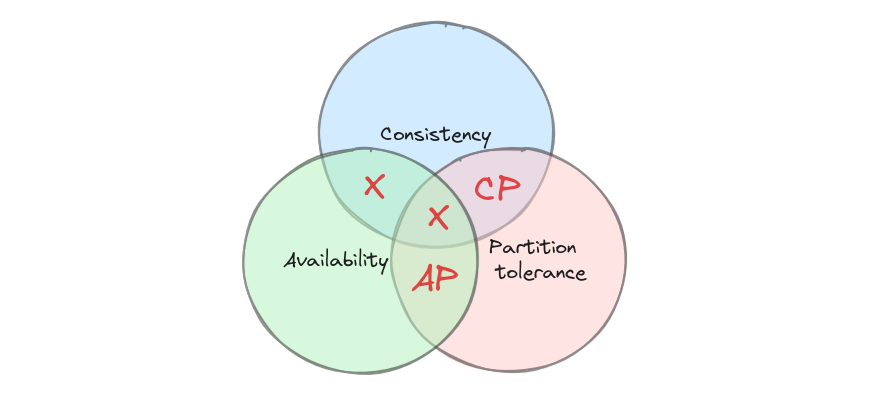

## 中间件

中间件是给业务提供服务的代码、程序。

### 一、分类

1. 框架内置
- 是实现了中间件功能的库，专为当前进程提供服务。
2. 独立部署，以进程/容器的形式提供服务。
- 传统意义上的中间件，是独立运行的进程，通过端口提供服务。
3. 云服务托管，以云服务的形式提供服务。
- 云中间件部署在云端，通过云接口提供服务。

### 二、场景

- 微服务框架（go-zero，spring cloud）
- web服务框架（gin）
- iot服务框架（...）
- 区块链平台（Ethereum）
- llm服务框架（langchain）
- 机器人框架（rmf）

### 三、任务

1.路由转发

2.服务注册发现

3.缓存访问

REdis 的 RESP协议

4.数据访问

5.消息分发

RESTful
openfeign
gRPC

序列化，如Protobuf在中间件通信中发挥重要作用。

6.分布式事务

7.流量治理

8.其他

日志记录...

## 中间件安全

专注于中间件的业务角度，比如redis防失效的持久化机制、热点数据的string结构相关命令。

可能的方向：
数据库实现XA功能的代码库，可以认为是中间件。
从哪里出发来研究XA的安全？

总结中间件的攻击面
在redis作为缓存中间件时，用到了哪些命令。命令有何安全问题。
明确安全研究的对象，以中间件确实使用的东西为中心，展开工作。

5.中间件有哪些漏洞？
web容器（中间件）有哪些解析漏洞与原理
知道哪些组件或中间件包含反序列化漏洞？
中间件的依赖库是fastjson、log4j2，反序列漏洞
中间件有鉴权功能的，有JWT&Oauth的常见漏洞
云原生中间件的云上漏洞？

- 中间件的安全
- 安全中间件