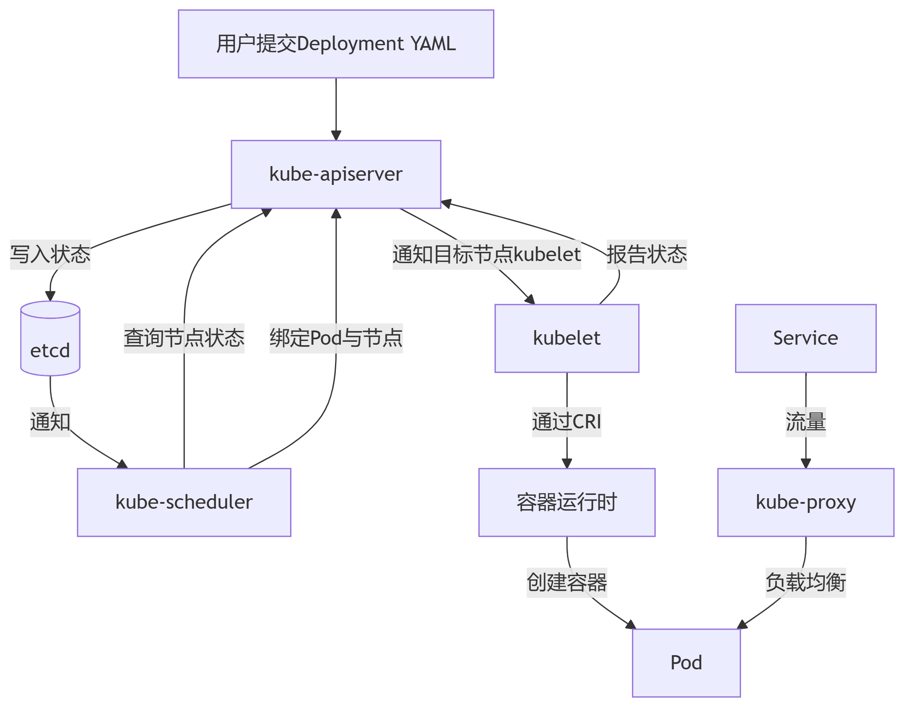
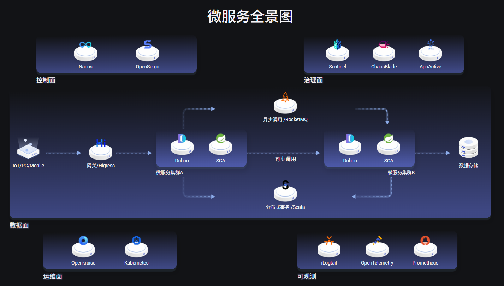
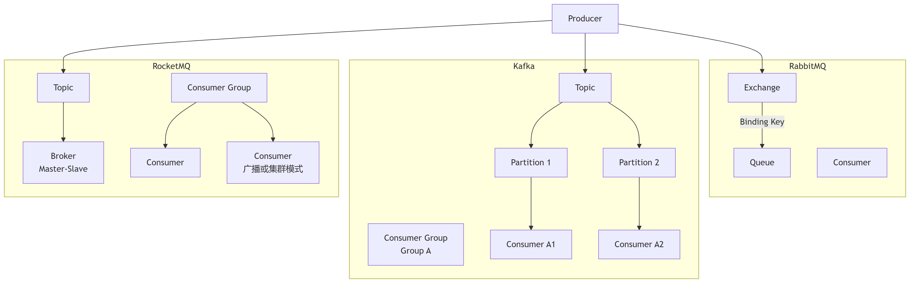

## 分布式

### 一、分布式理论基础

**1.分布式系统的CAP定理？**
- 分布式系统中，3个属性无法同时满足，只能同时实现2个。
1. C（一致性）： 所有节点在同一时间看到的数据是相同的（强一致性）。
2. A（可用性）： 每个请求都能得到响应（不保证是最新数据）。
3. P（分区容错性）： 系统在遇到网络分区（节点间无法通信）时仍然能够继续运行。
- P是必选的，因此只有2种分布式系统：CP、AP。

**2.CP、AP的系统有哪些？**
- CP，保证强一致性（C），在网络分区发生时，拒绝用户的请求，直到数据一致为止。
- 例如：ZooKeeper，etcd。
- AP，保证高可用性（A），在网络分区发生时，允许节点提供可能过期的数据。
- 例如，默认配置的redis。

**3.共识协议有哪些？**
- 共识协议，是CP系统实现强一致性的算法。
raft和paxoes

**4.分布式锁的实现？**
- 分布式锁，是用于在分布式中协调多个进程/服务对共享资源进行互斥访问的机制。
- 强一致性的分布式锁，必须基于共识协议来实现。
1. 基于缓存访问中间件的实现，AP系统，容易发生锁失效问题，无法满足强一致性。
Redis `SETNX`
锁失效的场景与解决方案：主从复制与故障转移、锁过期时间（TTL）设置不当
解决锁失效：更换CP系统实现、Redisson看门狗机制自动续期。
2. 基于服务注册与发现中间件的实现，CP系统，基于共识协议，满足强一致性。
锁不会失效。
通过锁服务查询哪个节点持有锁？

基于缓存访问的分布式锁实现。

```
代表：Redis（Redlock 算法）、Memcached。

原理：

通过 SET key value NX PX timeout 命令（Redis）实现原子性加锁。
lua脚本怎么保证原子性？
基于Lua脚本，使用原子SET命令和Lua脚本的事务性，但仍存在锁续期困难和业务超时锁释放风险
基于Redisson的分布式锁，支持可冲入锁和自动续期，提供公平锁、联锁和红锁
Redisson与redis实现分布式锁区别
非公平与公平的redis分布式锁？
利用 Key 的过期时间避免死锁。

优点：

性能极高（内存操作，微秒级响应）。

实现简单，社区支持完善（如 Redisson 客户端）。

缺点：

非强一致性（主从切换可能导致锁失效）。

需自行处理锁续期、可重入等问题。
```
基于服务注册与发现的分布式锁实现。
```
代表：ZooKeeper、etcd。

原理：

创建临时有序节点（ZooKeeper）或租约（etcd）。

通过节点序号最小判断是否获得锁，利用 Watch 机制监听锁释放。

优点：

强一致性（基于 Paxos/Raft 协议）。

原生支持锁释放（会话断开自动删除节点）。

缺点：

性能低于缓存（毫秒级）。

部署复杂度较高。
```

**5.分布式系统的幂等性问题？**

分布式系统中，多次请求导致数据重复修改怎么办
超卖问题？商品库存里加锁？乐观锁与悲观锁？加锁的原理？怎么实现？
介绍一下乐观锁和悲观锁，什么情况下用乐观锁或者悲观锁？答：写多，并发量高，容易产生冲突的时候用悲观锁，接着问：并发高的情况下悲观锁会影响效率，拿不到锁的线程会阻塞等待该怎么办？（不知道，只答了tryLock，失败就直接返回）。
介绍一下幂等？为什么要幂等？哪些方式实现幂等？

**6.分布式系统的一致性模型？**
- CP系统，强一致性
- AP系统，最终一致性，如果没有新的写操作，经过一段时间后，所有副本最终会达成一致状态。
读写分离的时候，读的数据库同步不及时导致读了旧数据怎么办?
读写分离架构通常是主从复制（Master-Slave Replication），数据从主库异步地同步到从库。这种异步性必然会导致一个时间窗口，在此窗口内主库有最新数据，而从库是旧数据。
你提出的“读了旧数据”正是最终一致性模型下的一种正常但需要管理的状态。解决方案不是消除延迟（这在物理上不可能），而是如何根据业务场景规避或忍受这种不一致。

### 二、分布式版本控制

**1. git的常见命令？**
- commit，创建一个新的提交，保存到本地分支。
- push，将本地分支的提交推送到远程分支。
- pull，从远程分支拉取更新并立即合并到本地分支（git fetch + git merge）。
- fetch，从远程分支下载所有最新的提交和分支引用，但不会自动合并。
- reset，在本地分支上，撤销一系列提交。
1. --soft： 撤销提交，保留工作区、暂存区的修改。
2. --mixed： 撤销提交、暂存区，保留工作区的更改。
3. --hard： 撤销提交、暂存区、工作区的修改，彻底回到那个提交的状态。
- revert，创建一个新的提交来“撤销”指定提交的更改，撤销已经推送到远程分支的提交。
- switch，切换分支，或者创建并立即切换到新分支。
- merge，将指定分支的更改合并到本地分支。
- rebase，变基，将本地分支的提交“移动”到另一个分支的最新提交之后，即线性合并。不要在公共分支上使用 rebase。

**2.git没提交就删除了怎么办？**
- git reflog获取被删除的提交的hash。
- git reset --hard [hash]恢复提交。

**3.多个开发分支要合并，该怎么处理？**
- git rebase首先保持主分支历史的线性。
- 逐个开发分支git merge合并到主分支。
- 逐个开发分支git push推送到远程主分支。

### 三、分布式部署

**1.介绍一下CI/CD？**
- 持续集成（CI），开发人员频繁地将代码更改合并到共享的主干分支中。
1. 开发者向代码仓库（如 GitHub/GitLab）推送（push）代码，触发CI流水线。
2. CI服务器（如 Jenkins/GitLab CI）执行代码编译、单元测试、代码质量检查。
3. 根据Dockerfile构建一个新的Docker镜像，运行容器化的集成测试。
4. 测试通过后，将镜像推送到私有镜像仓库（如 Harbor），并打上唯一的标签（如 git-commit-id）。
- 持续部署（CD），代码在通过CI后生成镜像，自动地部署到生产环境。
1. CD工具（如 Jenkins/GitLab Agent）从镜像仓库拉取镜像，K8S部署到测试环境。
2. 容器通过全面、高级的测试后，部署到生产环境中。

**2.Docker的镜像、容器？**
- 镜像，是软件包，包含：代码、运行时环境、系统工具、系统库和配置。
- 容器，是镜像运行起来的若干个进程。

**3.Docker容器、虚拟机之间的区别？**
- 隔离性，容器是进程级隔离，通过 Namespace 和 Cgroups 实现；虚拟机是系统级隔离，由 Hypervisor 实现。
- 速度、性能，容器非常快，损耗极小；虚拟机慢，损耗大。
- 集成性，容器适合微服务架构，每个服务一个容器；虚拟机适合运行完整的、异构的应用堆栈。

**4.Docker的常见命令？**
- pull，拉取镜像。
- build，根据Docker file构建镜像。
- run，创建并启动一个新容器。
- start、stop，启动停止的容器、安全地停止容器。
- logs，查看容器的日志输出。

**5.Dockerfile和Docker Compose的区别？**
- Dockerfile用于构建一个新的Docker镜像。
1. FROM: 指定基础镜像，如 ubuntu:20.04, node:16。
2. RUN: 执行命令（如 apt-get install）。
3. COPY / ADD: 将文件从主机复制到镜像中。
4. WORKDIR: 设置工作目录。
5. EXPOSE: 声明容器运行时监听的端口。
6. ENV: 设置环境变量。
7. CMD / ENTRYPOINT: 指定容器启动时运行的命令。
- Docker Compose与K8S一样，都是用于多个容器的编排，常见于微服务架构。
1. services：各个容器服务（每个服务通常对应一个容器，背后可能由一个镜像支持）。
2. networks：定义自定义网络，让容器之间可以通过服务名相互通信。
3. volumes：定义数据卷，用于数据持久化。

**6.K8S的组件有哪些？**



- kube-apiserver，内外部请求的唯一接口，提供 RESTful API。
- etcd，持久化存储集群数据（节点、Pod、配置、状态等），而非缓存
- kube-scheduler，调度工作节点，绑定节点与Pod。
- kubelet，管理本节点上 Pod 的生命周期（创建、销毁、监控）。
- kube-proxy，转发服务请求到具体Pod上。

### 四、微服务

**1.介绍一下微服务架构？**
- 微服务架构是分布式系统，通常采用分布式的容器部署实现。
- 微服务架构有3个组成部分。



1. 微服务，通常根据业务领域划分。
2. 中间件，支撑微服务的基础设施。
3. CI/CD平台，自动化流程。

## 中间件

### 一、缓存访问

**1.Redis为什么速度快？**
- 基于内存操作。
- 高效的数据结构。
- 单线程模型、I/O 多路复用。

**2.Redis基本数据结构的底层实现、应用场景？**
1. string，整型、字符串。
- 底层实现：int（字符串为64位int）、embstr（短字符串）、sds（长字符串）。
- 应用场景：缓存热点数据（如 Refresh Token）、计数器（如 库存统计）、分布式锁。
2. hash，存储对象。
- 底层实现：ziplist（字段较少，双向链表实现）、hashtable（通用实现，数组+链表）。
- 应用场景：存储对象信息（用户的name, age, email 等）、购物车（field 为商品ID）。
3. list，字符串列表。
- 底层实现：quicklist（大链表拆分成多个节点，每个节点是一个ziplist）。
- 应用场景：最新列表（例如朋友圈的最新动态、新闻网站的最新文章）。
4. set，无序、不重复的集合。
- 底层实现：intset（集合中的所有元素都是整数）、hashtable（集合中包含非整数元素）。
- 应用场景：共同关注、抽奖。
5. zset，有序、不重复的集合，关联分数。
- 底层实现：ziplist（元素少时使用）、skiplist + hashtable（跳表维持元素顺序）。
- 应用场景：排行榜（key 是排行榜名称，member 是用户ID，score 是排序依据）、延时任务（任务的执行时间作为 score）。

**3.Redis的线程模型、I/O模型？**

多路复用的系统调用？

**4.Redis持久化策略？**
如果服务器挂了，Redis数据丢了咋办？持久策略？
持久策略各自的优劣？介绍一下缓存雪崩？怎么避免？
存储策略是？持久化到哪里？
redis持久化策略？背景和优劣？

**5.Redis高可用性保证？**
讲讲 Redis 主从复制？主从复制之间有差距怎么解决？
讲讲 Redis 哨兵机制？
Redis集群模式？答：redis通过16384个哈希槽，集群中的每个节点拥有一段自己的哈希槽index范围，读写数据时，通过hash函数%16384得到key位于那个槽中，并且集群中每个节点间都会通过redis发布订阅机制彼此之间交换自己所拥有的hash槽范围，客户端只需要向集群中某一个节点发送请求，如果请求对应该节点，即可执行成功，否则，redis会发送一个重定向命令响应客户端，客户端再向正确的节点发送请求。
Redis被大量访问导致压力过大如何解决？利用Redis集群，集群中每一个节点部署以一主多从。

**6.Redis缓存穿透、雪崩、击穿？**
解决方案。。。
Redis热点key问题怎么解决？答：本地缓存、redis集群，主从架构、限流
高并发下，热点key优化思路？介绍兼容性测试？

### 二、消息分发

**1.RPC和消息队列的区别是什么？**
- RPC的同步通信，消息队列是异步通信。
- 消息队列需要持久化，所以通常是中间件。

**2.消息队列中间件的组成部分？**



1. 消息（Message）
- kafka，消息结构主要包括键（Key）、值（Value）和时间戳（Timestamp）。
- rocketmq，消息结构类似Kafka，包含一些扩展属性，如用于消息过滤的Tag（标签）。
- rabbitmq，消息结构复杂，支持AMQP协议定义的大量头信息（如priority, headers, expiration）。
2. 生产者（Producer）
- kafka、rocketmq，生产者直接将消息发送到指定的Topic，并可选择性地提供一个key用于分区。
- rabbitmq，生产者将消息发送到Exchange，并指定一个routing key。
3. 消费者（Consumer）
- kafka，Pull模型，消费者自己控制消费速度和节奏，更利于批量处理和流量控制，但可能带来更高的延迟。
- rocketmq，支持Pull模型，同时也提供了类Push的长轮询机制。
- rabbitmq，Push模型，Broker有消息时主动推送给消费者。这种方式延迟低，但容易导致消费者过载。
4. 代理服务器（Broker Server）
- kafka，Broker是集群中的一个节点。每个Broker存储一部分分区的数据。集群依赖ZooKeeper（旧版本）或KRaft（新版本）进行元数据管理。
- rocketmq，Broker也是集群节点，概念类似Kafka。其特点是NameServer（一个轻量级的发现服务）来管理元数据，而不是ZooKeeper。
- rabbitmq，Broker是一个整体，所有Exchange、Queue都在其中。
5. 主题/队列（Topic/Queue）
- kafka，核心是Topic。每个Topic被分为多个Partition（分区），每个Partition是一个有序的、不可变的消息序列。
- rocketmq，类似Kafka，核心也是Topic，并且也分为多个Queue。
- rabbitmq，核心是Queue。生产者将消息发送到Exchange，Exchange根据规则路由到一个或多个Queue。消费者直接从Queue消费。
6. 订阅/绑定（Subscription/Binding）
- kafka，通过 Consumer Group 实现。
- rocketmq，也通过 Consumer Group 实现。
- rabbitmq，通过 Exchange 和 Binding 规则实现。
7. 持久化存储（Storage）
- kafka，使用顺序追加写入（Append-Only Log） 的磁盘文件来存储消息。
- rocketmq，存储设计与Kafka类似，也是顺序写文件。
- rabbitmq，使用自定义格式的文件存储消息和元数据。

**3.消息队列中间件的区别、应用场景？**
1. rabbitmq，重心是消息的可靠传递。
- 应用场景：异步任务队列、高可靠性业务。
- 实现：生产、消费者确认机制（解决收发消息丢失）、消息持久化（解决Broker重启或崩溃导致的内存中的消息丢失）。
1. kafka，重心是高吞吐量和持久化存储。
- 应用场景：日志收集、实时流处理、事件溯源。
- 实现：顺序读写、零拷贝、批量发送消息。
1. rocketmq，同时保证高吞吐量、高可靠性。
- 应用场景：业务核心链路、大数据削峰填谷。
- 实现：顺序写、ack确认机制（解决收发消息丢失）。

**4.消息序列化方式的区别、应用场景？**
对比Protocol Buffer、MessagePack和JSON的优缺点及应用场景
看你用了 protobuf，它和 JSON 的区别是什么，为什么使用它？

**5.如何保证消息不丢失、消息消费不重复？**
- 消息不丢失，生产者开启确认模式，消息持久化，消费者手动确认（如ack），集群部署防单点。
- 消费不重复，消息生成全局唯一ID，消费者通过数据库唯一索引等做幂等，业务逻辑设计为幂等操作。

### 三、路由转发

**1.鉴权过程涉及的中间件？**
- 均为内置型中间件。
1. 认证中间件，验证请求者的身份。
- Session-Cookie，缓存中间件存储Session ID，浏览器请求时自动通过Cookie头携带这个 Session ID，需要CSRF Token防御。
- JWT，包含三部分：Header(算法)、Payload(数据，如用户ID、角色)、Signature(签名)，请求时手动写入HTTP头（如 Authorization: Bearer \<token\>）。
- API Key，调用API时，必须通过某种方式（如查询参数 ?api_key=xxx 或请求头 X-API-Key: xxx）提供此Key。
2. 授权中间件，验证已认证的用户，是否有权限执行当前操作。
- OAuth 2.0，授权第三方应用，通过访问令牌（比如JWT）访问你在另一个服务上的资源。
- CASL，将构建好的规则注入到 Ability 实例中，在代码中使用 ability.can()方法来检查权限。

**2.Nginx有哪些负载均衡策略？**
- 轮询，按时间顺序逐一分配请求到不同的后端服务器。
- 加权轮询，根据预设的权重比例分配请求。
- IP哈希，同一IP的客户端会固定访问同一个后端服务器。
- 最少连接数,优先将新请求分发给当前连接数最少的服务器。

### 四、服务注册与发现

**1.介绍一下选主机制？**
- 选举出Leader，处理所有写请求，采用多数派（Quorum）原则避免集群脑裂导致的数据不一致（比如 服务状态不一致）。
- etcd使用 Raft 共识算法实现选主。
- zookeeper使用 Zab 协议实现选主。

**2.节点存活状态如何判定？**
- 心跳机制，Leader节点定期向所有Follower节点发送心跳消息，接收方收到后需要回复一个确认（ACK）。
- 租约机制，服务注册时，会获得一个租约，并在租约的有效期内定期续约，租约超时即认为服务宕机。

**3.介绍一下watch机制？**
- watch 机制是一种典型的 发布-订阅模型（Pub/Sub）。
- 应用场景：服务注册与发现。

### 五、流量治理

**1.Sentinel三大流量治理策略？**
- 限流，控制请求的速率，防止系统因突发流量而过载。
- 熔断，检测到某个依赖服务持续不稳定，暂停服务，避免雪崩效应。
- 服务降级，在系统负荷过高或部分服务不可用时，主动关闭一些非核心服务或功能，或者提供一种备选方案。

**2.Sentinel实现限流的算法？**
- 流量计数器，请求到来时，判断当前时间所在的窗口的计数器是否超过阈值。
- 滑动时间窗口（解决临界问题），当一个新的请求到来时，检查最近一个时间窗口内所有请求的数量。
- 漏桶，以恒定的速率处理请求，平滑的输出流量，但是无法应对突发流量并快速响应。
- 令牌桶（最常用的限流算法），当一个请求到来时，它需要从桶中取出一个令牌，可以应对突发流量。

### 六、数据访问

**1.Canal如何保证缓存、数据库的最终一致性？**
- 伪装成 MySQL 的从库，订阅并解析数据库的 binlog，当数据库发生任何增删改操作时，binlog 会记录这些变更。
- Canal 获取到 binlog 的变化后，通知到一个消息队列（如 Kafka/RocketMQ）。
- 一个专门的数据同步服务消费 MQ 里的消息，根据key删除或更新Redis中的缓存。

**2.ShardingSphere如何实现分库、分表？**
- 垂直分库，按业务模块，将不同表分散到不同数据库。
- 水平分片，将同一个表中的不同行数据，分散到不同的数据库或表中。
- 选择分片键，选择分片算法，映射到具体的数据库和表中。

### 七、分布式事务

**1.分布式事务的解决方案？**
- 两阶段提交 (2PC)，强一致性方案，是XA规范的核心实现方式。
- 三阶段提交 (3PC)，强一致性方案，引入超时机制和预提交阶段来减少2PC阻塞和单点问题。
- TCC，最终一致性方案，每个业务都需要实现Try、Confirm、Cancel三个接口。
- 本地消息表，最终一致性方案，基于消息队列实现。
- Saga 模式，最终一致方案，针对长事务场景，核心思想是将一个长事务拆分为多个本地短事务。

**2.Seata的AT模式与XA规范的区别？**
- XA规范，基于2PC的标准实现，是强一致性方案。
- AT模式，修改2PC，实现的最终一致性方案。