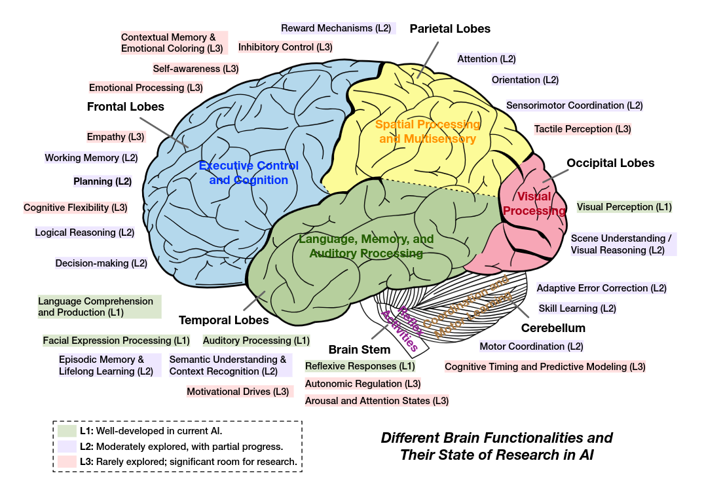

## 前言

人工智能的发展受到人脑研究的启发[^1]，理解人脑功能和人工智能之间的相似之处，揭示了人工智能的优势和当前的局限性，特别是大型语言模型（llm），截至2025年，人工智能的研究状态可以分为三个不同的层次：
- 一级（L1）：目前人工智能发展良好。
- 二级（L2）：适度探索，有部分进展。还可以进一步改进。
- 三级（L3）：很少探索；有很大的研究空间。

从人脑的结构及其功能出发：
- 额叶，执行控制与认知：决策规划（L2）、逻辑推理（L2）、工作记忆（L2）、自我意识（L3）、认知灵活性（L3）和抑制控制（L3）。
- 顶叶，空间处理与多感觉整合：注意力（L2）、空间定向（L2）、感觉运动协调（L2）和细节触觉感知（L3）。
- 枕叶，视觉处理：视觉感知（L1）、场景理解（L2）。
- 颞叶，语言、记忆和听觉处理：听觉处理（L1）、语言理解（L1）、记忆形成（L2）和语义理解（L2）。
- 小脑，协调和运动学习：运动协调（L2）、精确技能学习（L2）、自适应错误纠正（L2）和认知定时（L3）。
- 脑干，自主调节和反射控制：维持生命的基本自主功能（L3）和快速反射反应（L1）。
- 边缘系统，情感、同理心和动机：情绪处理（L3）、奖励机制（L2）、共情（L3）、压力调节（L3）和动机驱动（L3）。

即当前人工智能的发展合并了有研究进展的模块，生物机制作为灵感而不是直接复制：
- 认知核心：语言理解（L1）、语义理解（L2）、注意力（L2）、奖励机制（L2）、决策规划（L2）、逻辑推理（L2）。
- 记忆系统：工作记忆（L2）、记忆形成（L2）。
- 感知系统：视觉感知（L1）、听觉处理（L1）、场景理解（L2）、空间定向（L2）。
- 行动系统：快速反射反应（L1）、运动协调（L2）、精确技能学习（L2）、自适应错误纠正（L2）。

## RobotAgent的进化论

RobotAgent从过去专注于语言理解的学习阶段，发展到现在的行动阶段，未来将达到进化的阶段：
1. ai可以学习（past）
2. ai可以行动（now）
3. ai可以进化（future）

### step1，学习

**关键技术（生成式模型，学习，推理，RAG）**

在学习（Learning）阶段，RobotAgent发展出了生成式模型，还没有一个认知核心，生成式模型具有学习的能力，从多模态的输入中学习，通过反向传播和梯度下降调整模型的参数，为RobotAgent的推理、规划和决策提供了知识基础。成熟的生成式模型如下：
- LLM，大语言模型，输入文本，输出预测的文本，在RobotAgent中效果差。
- SLM，小语言模型，输入文本，输出预测的文本，在RobotAgent中效果差。
- VLM，视觉语言模型，输入图像视频，输出预测的文本，或者反过来，在RobotAgent中有一定的效果。
- VLA，视觉语言行动模型[^2]，输入图像视频、文本，输出预测的行动，在RobotAgent中有很好的效果。

尚有发展空间的模型：
- LMM，多模态大模型，输入多模态，输出预测的多模态，目标不是RobotAgent，而是AGI。
- RFM，机器人基础模型，输入传感器信号，输出预测的机器人控制指令，是RobotAgent的热点研究。
- LAM，大行动模型，输入交互环境，输出预测的可执行行动，是RobotAgent的热点研究。
- WM，世界模型，输入环境状态，输出预测的未来状态，是RobotAgent的热点研究。

要想构建一个高可用性的生成式模型，要有一个学习范式，还要有工程上实现的架构，在架构上运行学习范式，构建出一个落地的生成式模型。

全学习范式：
- SSL，自监督学习，首先无监督学习，设计假托任务生成隐式标签，然后迁移到监督学习、强化学习（等下游任务）上训练生成式模型。
- RL，强化学习，在环境中采取行动并根据获得的奖励来学习最优的策略。
- SFT，监督微调，在预训练后对模型进行监督学习。

部分学习范式：
- ICL，上下文学习，在不修改 M 模型参数 的情况下，有效地增强认知能力。
- TL，工具学习，包括工具发现、工具创造、工具使用。

架构：
- transformer架构，将学习范式转换为序列建模问题，提供自注意机制学习输入间的关系。
- GPT、BERT架构，transformer的改良版。
- RT系列架构，用于机器人控制的transformer的定制版。

以RT-2架构为例，预训练时，架构的自注意机制保留了每个token级别的上下文信息，自监督学习将最后一个token作为掩码，预测该token形成标签。训练好生成式模型后，输入实时图像用作生成，预测对应的行动，然后附加该行动后的图像，再进行预测。

推理（Reasoning）是增强模型生成效果的手段，它充分激发了模型学习的上下文信息，预测出的结果准确性提高。
- ReAct框架，循环进行 推理-行动-反馈，提高了准确性。
- CoT框架，演化出CoVE，提高了可解释性。
- ToT框架，树型结构。

RAG是另一种增强模型生成效果的手段，通过利用外部知识源来增强预测的能力。

### step2，行动

**关键技术（规划，决策，反思，记忆，感知，行动）**

在行动阶段，RobotAgent发展出了一套完整的系统，其中包括4个组件：
1. 认知核心，是RobotAgent的大脑，集成学习、推理、规划、决策和反思的能力。
2. 记忆系统，记忆系统为认知核心服务，有缓冲区和数据库两种存储类型。
3. 感知系统，从环境中获取文本，视觉、听觉、触觉等多模态数据，作为训练数据或者作为生成时的输入。
4. 行动系统，实现与环境的交互，这包括执行代码、控制机器人肢体、在虚拟世界中导航等。将认知核心的决策转化为具体的、可在环境中执行的操作序列。

RobotAgent实现自我行动的关键在于，通过上述四个模块的协作，RobotAgent能够通过与环境的交互和自我反思（强化学习），持续学习（模型的训练）确保决策的不断改进，最终实现准确的行动。

### step3，进化

**关键技术（优化空间，优化目标，优化器）**

在进化阶段，RobotAgent实现了自进化，其中有2个优化空间：
1. 单模块优化空间，其中有3个模块可以被直接优化：
- 提示词优化，在基于llm的RobotAgent优化中起着至关重要的作用。
- 工作流优化，从工作流边缘、工作流节点2个方面优化。
- 工具优化，通过工具学习和工具创造实现。
2. 整体优化空间，专注于优化整个agent系统中的多个组件。

[^1]: Foundation Agents https://arxiv.org/abs/2504.01990
[^2]: VLA model for Robot https://arxiv.org/abs/2307.15818