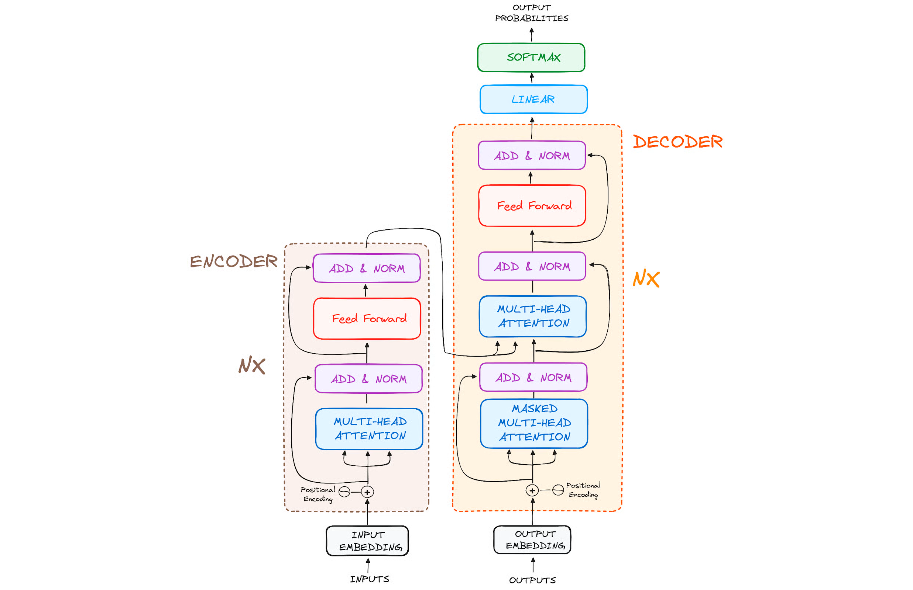
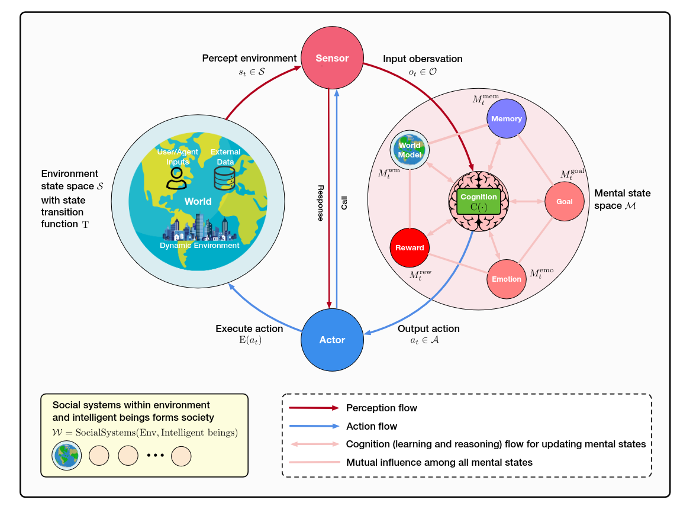
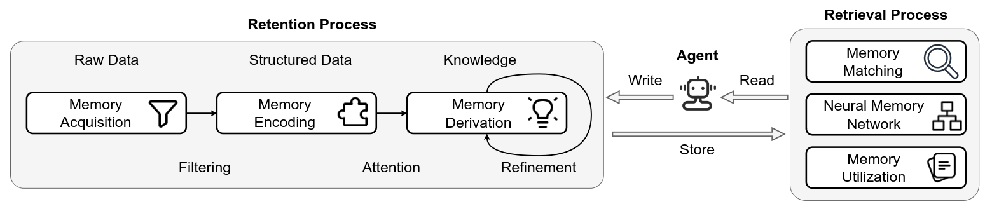
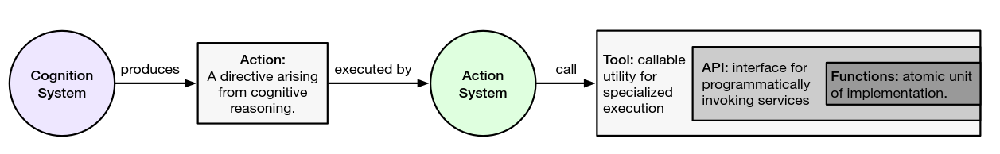

## RobotAgent的组件

在行动阶段，RobotAgent发展出了一套完整的系统，其中包括4个组件[^1]：
1. 认知核心，是RobotAgent的大脑，集成学习、推理、规划、决策和反思的能力。
2. 记忆系统，记忆系统为认知核心服务，有缓冲区和数据库两种存储类型。
3. 感知系统，从环境中获取文本，视觉、听觉、触觉等多模态数据，作为训练数据或者作为生成时的输入。
4. 行动系统，实现与环境的交互，这包括执行代码、控制机器人肢体、在虚拟世界中导航等。将认知核心的决策转化为具体的、可在环境中执行的操作序列。

```
数学模型： 
一个智能体在离散时间步 t 中运行，不断地与其环境相互作用。在每一步中，发生以下过程：
1. 环境状态 (st ∈ S)
2. 感知系统（P），agent感知环境生成观察结果 ot，ot = P(st, Mt−1),其中 Mt−1 引导选择性注意和过滤。
3. 认知核心（C），包含两个流程：
- 学习（L），基于前一个行为和观察，智能体更新心智状态，Mt = L(Mt−1, at−1, ot)，其中心智状态包括：记忆系统，生成式模型，规划的目标和反思需要的奖励，Mt = {Mt 记忆, Mt 模型参数，Mt 规划的目标，Mt 奖励，... }。
- 推理（R），决定接下来的行动，at或者A = R(Mt)，分为内外两种类型的行动：
  - 外部行动，将直接影响环境。
  - 内部行动，包括，1）规划，未来行动的序列；2）决策，从可用的选项中选择最佳的行动。
4. 行动系统，将行动 at 转换为可执行的形式，a′t = E(at)。
5. 环境转变（T），环境对agent的行动做出反应，st+1 = T(st, a′t)。
6. （多智能体场景中）每个智能体 i 维护各自的状态（M it、a it、o it），并且环境根据所有智能体的动作进行集体更新。
```


RobotAgent实现自我行动的关键在于，通过上述四个模块的协作，RobotAgent能够通过与环境的交互和自我反思（强化学习），持续学习（模型的训练）确保决策的不断改进，最终实现准确的行动。

### 一、认知核心

**1.学习模块**

在学习（Learning）阶段，RobotAgent发展出了生成式模型，还没有一个认知核心，生成式模型具有学习的能力，从多模态的输入中学习，通过反向传播和梯度下降调整模型的参数，为RobotAgent的推理、规划和决策提供了知识基础。成熟的生成式模型如下：
- LLM，大语言模型，输入文本，输出预测的文本，在RobotAgent中效果差。
- SLM，小语言模型，输入文本，输出预测的文本，在RobotAgent中效果差。
- VLM，视觉语言模型，输入图像视频，输出预测的文本，或者反过来，在RobotAgent中有一定的效果。
- VLA，视觉语言行动模型[^2]，输入图像视频、文本，输出预测的行动，在RobotAgent中有很好的效果。

尚有发展空间的模型：
- LMM，多模态大模型，输入多模态，输出预测的多模态，目标不是RobotAgent，而是AGI。
- RFM，机器人基础模型，输入传感器信号，输出预测的机器人控制指令，是RobotAgent的热点研究。
- LAM，大行动模型，输入交互环境，输出预测的可执行行动，是RobotAgent的热点研究。
- WM，世界模型，输入环境状态，输出预测的未来状态，是RobotAgent的热点研究。

```
数学模型：
1. 基于前一个行为和观察，智能体更新心智状态 Mt = L(Mt−1, at−1, ot)。
其中，M = {M 记忆, M 模型参数，M 规划的目标，M 奖励，... }
```

要想构建一个高可用性的生成式模型，要有一个学习范式，还要有工程上实现的架构，在架构上运行学习范式，构建出一个落地的生成式模型。

全学习范式，修改整个 M ：
- SSL，自监督学习，首先无监督学习，设计假托任务生成隐式标签，然后迁移到监督学习、强化学习（等下游任务）上训练生成式模型。
- RL，强化学习，在环境中采取行动并根据获得的奖励来学习最优的策略。
- SFT，监督微调，在预训练后对模型进行监督学习。

部分学习范式，修改部分 M：
- ICL，上下文学习，在不修改 M 模型参数 的情况下，有效地增强认知能力。
- TL，工具学习，包括工具发现、工具创造、工具使用。

架构：
- transformer架构，将学习范式转换为序列建模问题，提供自注意机制学习输入间的关系。
- GPT、BERT架构，transformer的改良版。
- RT系列架构，用于机器人控制的transformer的定制版。

以RT-2架构为例，预训练时，架构的自注意机制保留了每个token级别的上下文信息，自监督学习将最后一个token作为掩码，预测该token形成标签。训练好生成式模型后，输入实时图像用作生成，预测对应的行动，然后附加该行动后的图像，再进行预测。

**2.推理模块**

推理（Reasoning）是增强模型生成效果的手段，它充分激发了模型学习的上下文信息，预测出的结果准确性提高。

结构化推理：
- ReAct框架，循环进行 推理-行动-反馈，提高了准确性。
- CoT框架，演化出CoVE，提高了可解释性。
- ToT框架，树型结构。

```
数学模型：
1. 决定接下来的行动，at或者A = R（Mt）
2. 对于结构化推理，Rs = R1 ◦ R2 ◦ ... ◦ Rn，其中每个Ri表示具有明确逻辑依赖关系的离散推理步骤。
3. 对于非结构化推理，Ru = f (Mt)，保持隐式和灵活，允许动态适应上下文。
```

**3.规划模块**

规划模块从推理中来。llm通常缺乏对世界动态的深入理解，依赖于模式识别而不是真正的因果推理，这妨碍了它们管理子目标交互和环境变化的能力。

```
数学模型：
1. 构建从初始状态到期望目标状态的潜在路径的过程 S0 → {a1, a2, . . . , an} → Sg 
其中 S0 是开始状态，A = {a1, a2, . . . , an}表示行动空间，Sg 是规划的目标状态。
```

**4.决策模块**

决策模块通常处理的是规划通过任务分解，得到的当前执行的动作序列，具备即时性。

```
数学模型：
1. 从可用的选项中选择最佳的行动，at = D（ai）
其中 ai 来自规划的当前行动序列 A = {a1, a2, . . . , an}
```

**5.反思模块**

强化学习是实现反思的一个方案，更新奖励状态：
- 外部奖励
- 内部奖励
- 混合奖励
- 分层模型

```
数学模型：
1. M 奖励 = (S, A, r, γ),
其中 S 表示状态空间， A  表示行动空间，r(s, a) 指定奖励函数，γ ∈ [0, 1] 是折现因子。
```

### 二、记忆系统

记忆系统为认知核心服务，其核心功能如下：
- 维护上下文
- 从经验中学习
- 随着时间的推移，保持行动的一致性
- 结构化检索
- 知识蒸馏
- 选择性遗忘

```
数学模型：
1. M 记忆
```

记忆系统的类型：
- 瞬时记忆，
- 记忆缓冲区，缓存短期的工作记忆。
- 矢量数据库，存储长期记忆。



记忆的生命周期：
1. 保留
- 获取、编码和推导
2. 检索
- 记忆匹配、神经记忆网络和记忆利用

### 三、感知系统

RobotAgent从环境中获取文本，视觉、听觉、触觉等多模态数据，作为训练数据或者作为生成时的输入。

模态数据：
- 文本
- 图像，视频，音频
- 其他，如受到嗅觉、触觉启发

```
数学模型：
1. agent感知环境生成观察结果 ot，ot = P(st, Mt−1),其中 Mt−1 引导选择性注意和过滤。
```

### 四、行动系统

系统的核心是建立与环境的交互，这包括生成自然语言、执行代码、控制机器人肢体、在虚拟世界中导航等。将认知核心的决策转化为具体的、可在环境中执行的操作序列，然后通过预定义的奖励函数从收集的动作轨迹中实现学习过程。



```
数学模型：
1. 行动系统将行动 at 转换为可执行的形式，a′t = E(at)。
```

行动系统包括三个主要部分：
1. 行动空间，包括智能体在现实世界场景或下游任务中可以执行的所有类型的行动。
2. 动态环境下的学习。
3. 工具空间，包含了agent可以执行用于利用的工具、接口或中间件，范围从机械臂等物理设备到api等数字接口。

行动空间包括以下3个空间，分别对应各自的工具空间：
- 语言空间，通过语言驱动的行动进行操作，如推理、编程、检索信息、执行API调用或与外部工具交互。
- 数字空间，在数字环境中操作，将行动空间扩展到包括web浏览、GUI交互、移动应用程序和具身系统。
- 物理空间，与真实物理世界交互，智能体能够处理来自真实世界环境的信号，并生成反馈。

[^1]: Foundation Agents https://arxiv.org/abs/2504.01990
[^2]: VLA model for Robot https://arxiv.org/abs/2307.15818