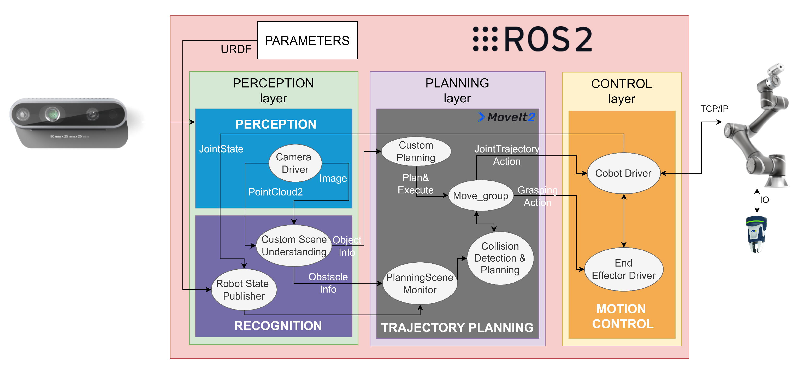

## RobotAgent的组件

在行动阶段，RobotAgent发展出了一套完整的具身系统，其中包括4个核心组件[^1]：
1. 认知核心，是RobotAgent的大脑，集成学习、推理、规划、决策和反思的能力。
2. 记忆系统，为认知核心服务，包括短期记忆和长期记忆，支持终身学习。
3. 感知系统，从环境中获取视觉、听觉、触觉等多模态传感器数据，作为模型的输入。
4. 行动系统，实现与物理环境的交互，这包括执行代码、控制机器人肢体、在物理世界中导航等。将认知核心的决策转化为具体的、可在环境中执行的操作序列。

一个智能体在离散时间步 t 中运行，不断地与其环境相互作用。在每一步中，发生以下过程：

1. 环境状态 (st ∈ S) 
2. 感知系统（P），agent感知环境生成观察结果 $ot， ot = P(st, Mt−1) $,其中 Mt−1 引导选择性注意和过滤。
3. 认知核心（C），包含两个流程：
- 学习（L），基于前一个行为和观察，智能体更新心智状态 $ Mt，Mt = L(Mt−1, at−1, ot)$，其中心智状态包括：记忆系统，生成式模型，规划的目标和反思需要的奖励，Mt = {Mt 记忆, Mt 模型参数，Mt 规划的目标，Mt 奖励，... }。
- 推理（R），决定接下来的行动，at或者A = R(Mt)，分为内外两种类型的行动：
  - 外部行动，将直接影响环境。
  - 内部行动，包括，1）规划，未来行动的序列；2）决策，从可用的选项中选择最佳的行动。
4. 行动系统，将行动 at 转换为可执行的形式，a′t = E(at)。
5. 环境转变（T），环境对agent的行动做出反应，st+1 = T(st, a′t)。
6. （多智能体场景中）每个智能体 i 维护各自的状态（M it、a it、o it），并且环境根据所有智能体的动作进行集体更新。

RobotAgent实现自主行动的关键在于，通过上述四个模块的协作，RobotAgent能够通过与环境的实时交互和自我反思（如通过强化学习更新策略），持续优化其模型和策略，最终实现鲁棒且准确的任务执行。

## 感知系统

感知系统是智能体与环境的接口，负责将物理世界的多模态信号转化为内部可处理的数值表示。

感知模态：
- 文本：来自指令、文档或环境中的文字信息。
- 视觉：图像、视频流，提供丰富的空间和场景信息。
- 听觉：声音、语音指令，提供事件和语言信息。
- 其他传感器：触觉、力觉、本体感觉（关节角度）、深度信息等，为精细操作和物理交互提供关键反馈。

感知环境生成观察结果 ot，ot = P(st, Mt−1),其中 Mt−1 引导选择性注意和过滤。

## 行动系统

行动系统是智能体作用于环境的“执行器”，负责将认知核心的决策转化为具体的、可执行的操作。系统通过与环境交互，收集行动轨迹，并利用预定义的奖励函数完成学习闭环。

行动系统将行动 at 转换为可执行的形式，a′t = E(at)。

行动系统包括三个主要部分：
- 行动空间：定义了智能体在所有可能场景下可以执行的全部行动类型。
- 动态环境下的学习：指智能体在非稳态、不断变化的环境中在线调整和优化其策略的能力。
- 工具空间：包含了智能体可调用的所有物理工具和数字接口，极大地扩展了其能力边界。

行动与工具空间的分类：
- 语言空间：通过生成语言来驱动行动，如链式推理、编写代码、检索信息、执行API调用或与数字助手交互。
  - 对应工具：搜索引擎、代码执行环境、API接口。
- 物理空间：与真实物理世界进行交互，智能体处理来自真实世界的信号（如力觉、视觉伺服），并生成物理反馈（如控制机械臂移动、机器人底盘导航）。
  - 对应工具：机械臂、移动机器人底盘、灵巧手、无人机飞控系统。

[^1]: Embodied AI Agents https://arxiv.org/abs/2506.22355