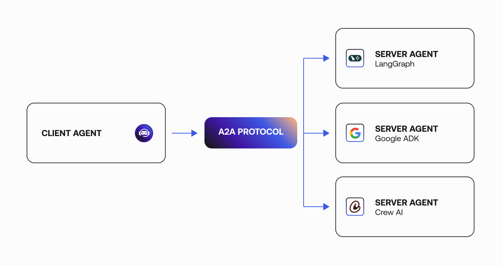

## MAS协作

多agent系统（MAS）适用于RobotAgent的多机智能体协作，利用群体智慧，采用结构化的`工作流`、定义的`协作规范`和统一的`交互协议`来同步他们的行动以实现协作目标。

### 一、工作流

通过结构化的工作流，协调多个智能体朝向一个明确定义的目标。遵循明确定义的角色（例如，“规划者”、“实施者”或“评估者”）和基于阶段的过程，以确保高效和准确的任务完成。

### 二、协作规范

agent-agent协作交互：
- 面向共识的交互，包括各种共识方案：讨论, 辩论, 谈判, 反射和投票。
- 协作学习交互，常用方法：经验分享，同伴讨论，观察学习。
- 教学/指导交互，常用方法：批评和反馈，评估，命令和教学。
- 迭代式教学与强化，教学通常是渐进式的，每个阶段都为学习者提供完成任务和获得反馈的机会。
- 面向任务的交互，agent通过有效的协调和任务分解策略，以及高度的合作和协调，共同工作以实现共同目标，agent主要通过处理上游输出并根据既定的任务依赖关系为下游智能体生成结果
来进行交互，而不是进行复杂的讨论或辩论。。

人类-agent协作交互：
- 一次性任务委托
- 多轮交互指令
- 沉浸式人类-agent协作

### 三、交互协议

消息类型：
- 结构化，常见的有JSON、XML和代码形式。
- 非结构化，自然文本，视觉数据（例如图像、视频）和音频信号（例如语音、环境声音）。

agent-agent通信协议：
- A2A协议

agent-环境通信协议：
- 模型上下文协议 (MCP)
