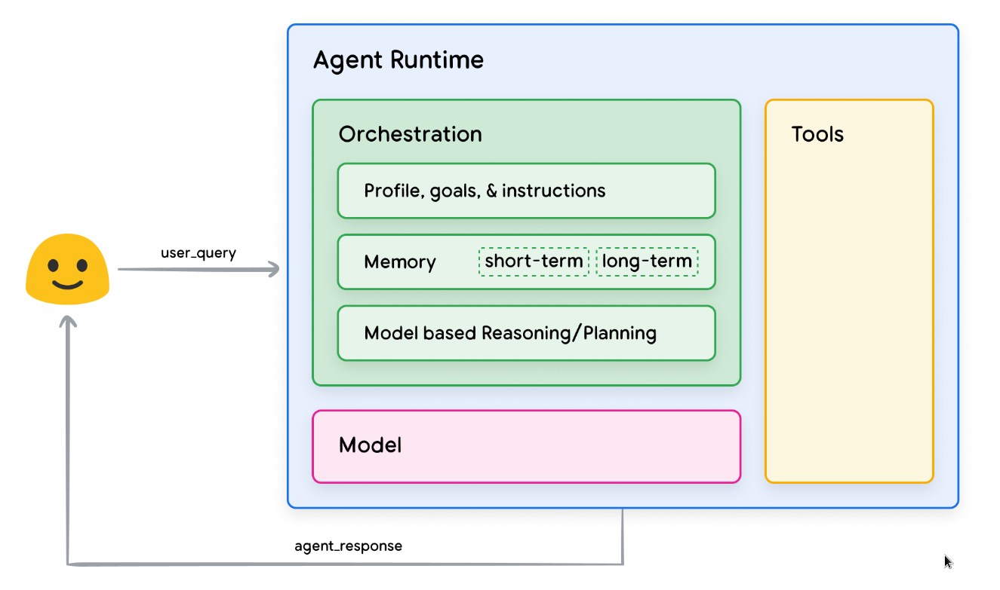
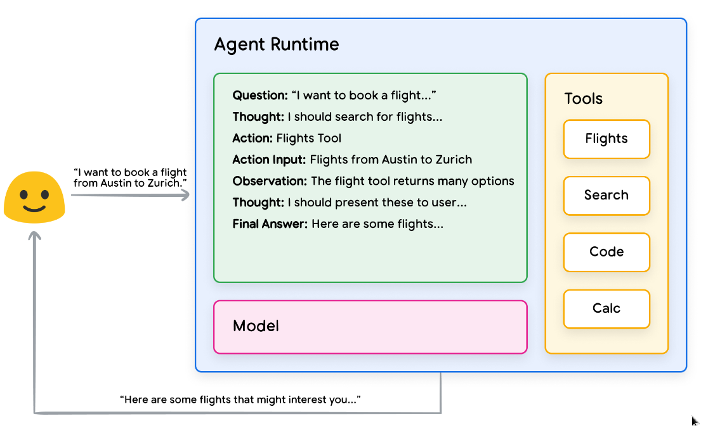
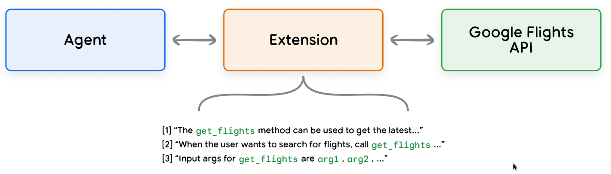
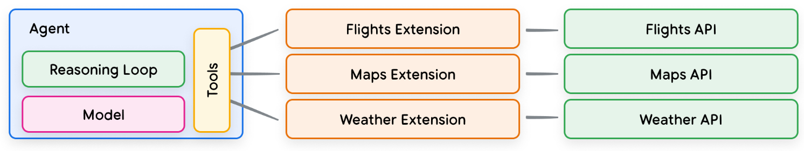
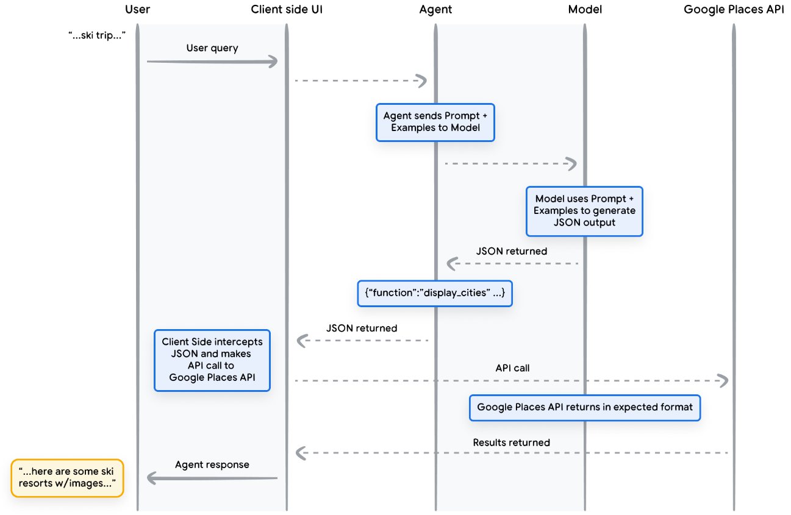
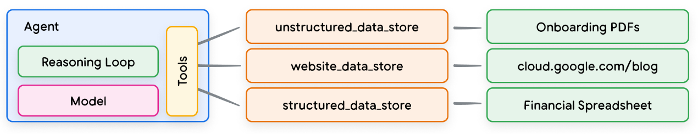
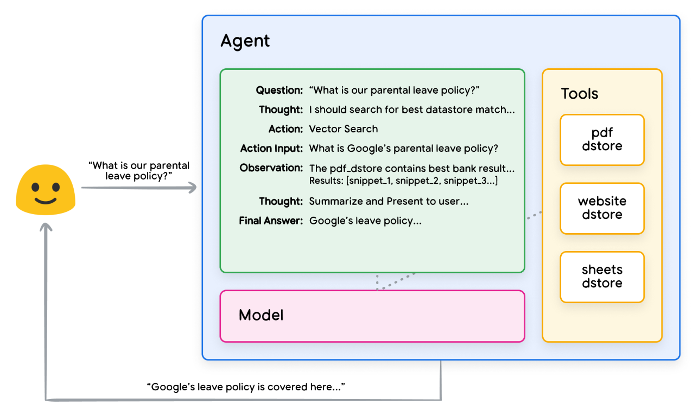

## agent实例

一个具体的google agent系统如下图所示，编排层、模型层实现了认知核心和记忆系统，感知系统和行动系统则通过工具层实现。

### 一、模型层

agent中，模型层指的是 LM（语言模型），作为认知核心，实现学习、推理、规划、决策和反思，模型层可以是一个或多个 LM，大小不限。

### 二、编排层

编排一个循环过程，控制着agent如何接收信息、执行一些内部推理，并利用这些推理为下一步行动或决策提供信息，这个循环一直持续到达到目标或停止点为止。

例如，agent使用 ReAct 框架为用户查询选择合适的行动和工具，那么事件序列如下面发生的：

1. 用户向智能体发送查询。
2. 智能体开始 ReAct 序列。
3. 智能体向模型提供提示，要求其生成下一个 ReAct 步骤及其相应输出：
- a. 问题： 来自用户查询的输入问题，随提示词一同提供。
- b. 思考： 模型关于下一步应做什么的思考。
- c. 行动： 模型对下一步采取何种行动的决策。
  - i. 此处可以进行工具选择。
  - ii. 例如，一个行动可以是 [航班, 搜索, 代码, 无] 中的一个，其中前三个代表模型可以选择的一个已知工具，最后一个代表"无工具选择"。
- d. 行动输入： 模型决定向工具提供什么输入（如果有的话）。
- e. 观察： 行动 / 行动输入序列的结果。
  - i. 这个 思考 / 行动 / 行动输入 / 观察 序列可以根据需要重复 N 次。
- f. 最终答案： 模型为原始用户查询提供的最终答案。
4. ReAct 循环结束，并向用户返回最终答案。

虽然模型可以根据自己的先验知识猜测答案（幻觉），但它却使用了一种工具（航班）来搜索实时的外部信息。这种外部信息，使其能够根据实际数据做出更明智的决定，并将这些信息汇总反馈给用户。

### 三、工具层

AIGC无法与环境交互，工具弥补了这一缺陷，使agent能够与外部数据和服务进行交互，开启更广泛的可能性。如检索增强生成（RAG），用来扩展agent的能力。

google agent可以与三种主要工具类型进行交互：扩展、函数和数据存储。通过为agent配备工具，使其不仅能理解环境，还能根据环境采取行动，从行动中反思。

**1.扩展**

扩展通过以下方式在agent和应用程序接口之间架起了桥梁：
- 使用示例教agent如何使用 API 端点。
- 告诉agent成功调用 API 端点需要哪些参数。

扩展可以独立于agent而设计，但应作为agent配置的一部分提供。agent在运行时使用模型和示例来决定哪个扩展（如果有的话）适合解决用户的查询。

**2.函数**

模型可以接受一组已知函数，并根据其规范决定何时使用每个函数以及函数需要哪些参数。函数与扩展有一些不同之处，其中最明显的是:
- 模型会输出一个函数及其参数，但不会调用实时 API，函数可能调用多个内部 API。
- 函数在客户端执行，而扩展在agent端执行。

这里的函数通常以json等格式化形式存在，被agent生成发送到客户端，客户端负责调用函数。

**3.数据存储**

数据存储通常以矢量数据库的形式实现，数据存储与语言模型结合使用的最多的例子之一是检索增强语言模型（RAG）的实施，旨在通过让模型访问各种格式的数据，从而扩展模型知识的广度和深度，使其超越基础训练数据：
- 网站内容。
- 结构化数据格式，如 PDF、Word 文档、CSV、电子表格等。
- HTML、PDF、TXT 等格式的非结构化数据。

每个用户请求和agent响应循环的基本流程：
1. 用户查询被发送给嵌入模型，以生成该查询的向量嵌入。
2. 随后，使用如 SCaNN 之类的匹配算法，将查询向量与向量数据库中的内容进行匹配。
3. 匹配出的内容以文本格式从向量数据库中检索出来，并发送回智能体。
4. 智能体同时接收到用户查询和检索到的内容，随后制定回应或决定下一步行动。
5. 最终响应被发送给用户。

如下图，展示了ReAct实施RAG的例子。

### 四、快速构建

为了提供真实世界中可执行的agent操作示例，可以使用 LangChain 和 LangGraph 库构建一个快速原型。这些流行的开源库允许用户通过将逻辑、推理和工具调用的序列 “链”在一起来构建客户agent，从而回答用户的询问。