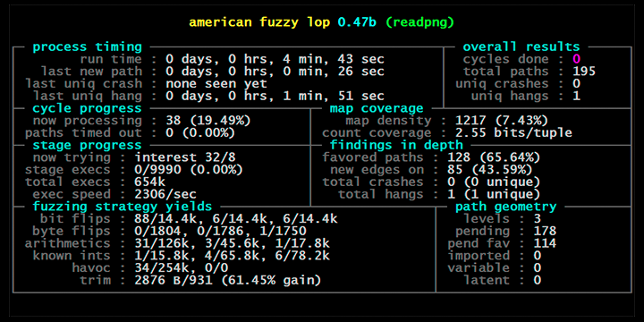
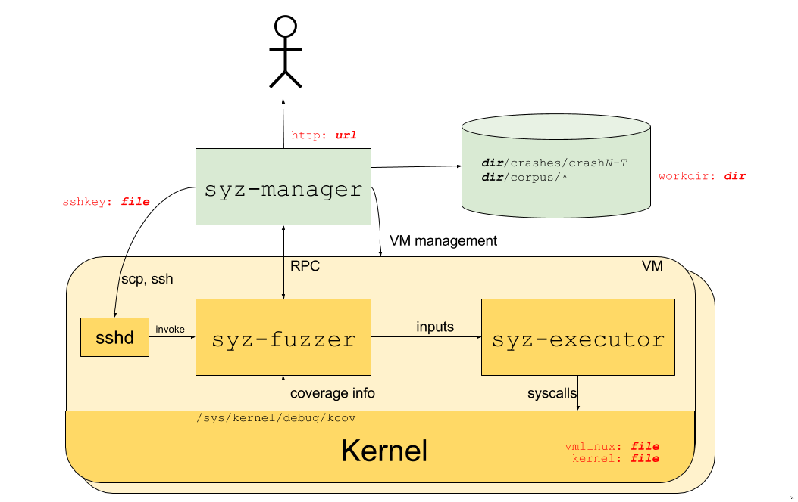
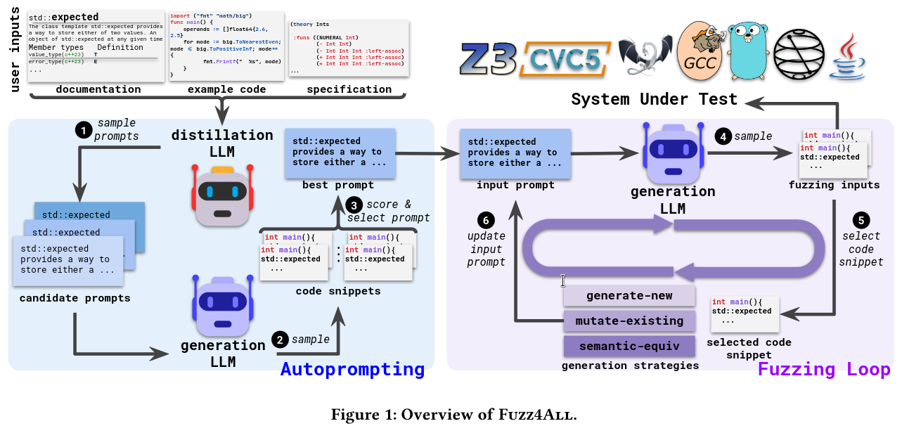

## 1988年

威斯康星大学麦迪逊分校的Bart Miller教授布置了一些项目，旨在指导学生去研究与操作系统相关的特定领域，其中的一个项目首次应用fuzz的概念到程序评估上。

*操作系统应用程序可靠性评估 − Fuzz生成器：* 这个项目的目标是，在给定不可预测的输入流的情况下，评估各种UNIX应用程序的健壮性。这个项目有两个部分：
1. 首先，构建一个fuzz生成器。这是一个输出随机字符流的程序。
2. 其次，使用fuzz生成器攻击尽可能多的UNIX应用程序，目标是崩溃它们。对于崩溃的程序，尝试确定导致崩溃的输入类型。

fuzz生成器需要生成随机字符的输出流，它需要几个选项，使得灵活地测试不同的程序，下面是fuzz支持的功能选项列表。在编写此程序时，使用良好的C和UNIX风格以及良好的结构是很重要的，因为我们希望将此程序分发给其他人。

| 功能选项 | 使用说明 |
| :---: | :---: |
| -p | 只有可打印的ASCII字符 |
| -a | 所有ASCII字符 |
| -0 | 包含空（0 字节）字符 |
| -l | 生成随机长度行（\n作为字符串终止符）|
| -f name | 记录字符到文件"name" |
| -d nnn | 在每个字符之后延迟nnn秒 |
|-r name | 将文件"name"中的字符重放到输出 |

应该使用fuzz程序来测试各种UNIX应用程序，这些应用程序包括vi、mail、cc、make、sed、awk、sort等。首先是查看程序是否会崩溃，其次是了解导致崩溃的输入类型。

**节点说明：**
1. 基于生成的fuzz方法
2. 应用在操作系统程序中
3. 发现崩溃

## 2002年

Immunity安全公司的Dave Aitel在BlackHat USA 2002上作了关于SPIKE介绍的演讲，发表宣言：我曾经嘲笑fuzzer，但后来你改变了我的整个人生观！


SPIKE寻找新的漏洞，通过：
1. 快速重现一个复杂的二进制协议
2. 建立一个知识基础，关于影响类似协议的各种类型bug
3. 在新程序上测试原有的漏洞
4. 让未知协议的适配变得容易

SPIKE提供了一系列工具，包括寻找web漏洞（目录遍历、SQL注入等）的webfuzz和odbcwebfuzz.sh，寻找二进制漏洞（溢出、格式化字符串等）的msrpcfuzz和Closed_source_webserver_fuzz。

**节点说明：**
1. 基于网络协议结构化，基于生成的fuzz方法
2. 应用在web和非web程序中
3. 发现web漏洞、二进制漏洞

## 2004年

Peach由Michael Eddington发布在ph-neutral 0x7d4，通过编写pit文件，可以对web服务、文件解析器等几乎任何目标进行模糊测试。


**节点说明：**
1. 基于文件结构化，基于生成的fuzz方法
2. 应用在web和非web程序中
3. 发现web漏洞、二进制漏洞

## 2007年

Mozilla安全团队的Jesse Ruderman编写了jsfunfuzz，并发表在用于在Firefox中测试JavaScript引擎。


jsfunfuzz测试的是JavaScript语言引擎本身，而不是DOM（这意味着它可以处理函数、对象、操作符和垃圾收集等语言特性，而不是通过"窗口"或"文档"访问DOM对象）。

jsfunfuzz能够发现大量漏洞的原因是：
1. 它知道JavaScript语言的规则，使它能够很好地覆盖语言特性的组合。
2. 它打破了规则，允许它在语法错误处理中发现错误，如<bug 350415>，更普遍地帮助fuzzer避免出现"盲点"。
``` js
// debug模式build
new Function("let /*");
```
3. 它不怕以相当复杂的方式嵌套JavaScript结构，如<bug 353079>。
``` js
for (let a in [1]) let (x) { for(let y in
((function(id2) { return id2; })('')))
{ } }
```
4. 它允许在循环中创建和运行函数来积累状态，如<bug 361346>。
``` js
this.x setter= new Function;
this.watch('x', function(){});
gc();
x = {};
```
5. 它测试js正确性，而不仅仅是测试崩溃和断言。

**节点说明：**
1. 基于编程语言语法结构化，基于生成的fuzz方法
2. 应用在语法解析程序中
3. 发现二进制漏洞

## 2010年

北京大学团队在IEEE 2010发表论文《TaintScope: A Checksum-Aware Directed Fuzzing Tool for Automatic Software Vulnerability Detection》。


该论文具有相当的前瞻性：
1. 应用了定向模糊测试的概念，使用动态污点分析针对敏感函数（比如内存分配函数、字符串操作函数）调用进行分析，得到输入中的热字节。
2. 采用启发式生成方法（即变异方法），对热字节进行修改，例如，可以将影响内存分配函数的热字节设置为小、大或负整数值；流进字符串函数的热字节被替换为畸形字符，%n，%p等。
3. 应用了符号执行指导fuzz，修复校验和字段。

**节点说明：**
1. 基于启发式生成的fuzz方法（即变异方法），定向模糊测试方法，融合动态污点分析和符号执行
2. 应用在C/C++程序中
3. 发现二进制漏洞

## 2013年

lcamtuf.coredump.cx发布了afl-fuzz，它使用一种新型的编译时插桩和遗传算法来自动发现干净、有趣的测试用例，这些测试用例会触发目标二进制文件中新的内部状态。这大大提高了代码的功能覆盖率。



相比于其他fuzzer，afl-fuzz有相当多的优势：
1. 基于覆盖率引导的变异。
2. 附带独特崩溃探索器、测试用例裁剪器、故障触发分配器和语法分析器，使得评估崩溃bug的影响变得极其简单。
3. 模糊测试速度相当的快。
4. 拥有时尚复古风格的UI。

**节点说明：**
1. 基于覆盖率引导的变异方法
2. 应用在任何程序中
3. 发现二进制漏洞

## 2015年

Google开源了syzkaller，用于针对linux内核进行模糊测试；Google启动了sanitizer项目，用于编译时插桩，在运行时发现漏洞。



sanitizer项目包括一系列漏洞检测器（ASAN、TSAN等），可以针对内存损坏、竞态条件等漏洞自动分类。

**节点说明：**
1. 模糊测试在应用场景、漏洞自动分类取得进展
2. syzkaller应用在操作系统内核中，sanitizer应用在编译型语言中
3. 发现二进制漏洞

## 2016年

在当时，模糊测试并没有被广泛使用，而且对开发人员来说很麻烦，需要大量的手工工作。针对该问题，Google提出了OSS-Fuzz，这是一个模糊测试平台，帮助项目创建fuzzer，并提供漏洞报告。


OSS-Fuzz是一个免费的服务，自从发布以来，OSS-Fuzz已经成为开源社区的一项关键服务。

**节点说明：**
1. 模糊测试在项目集成、自动化部署取得进展
2. 应用在任何程序中
3. 发现二进制漏洞

## 2024年

伊利诺伊大学厄巴纳-香槟分校和斯图加特大学团队在ICSE 2024发表论文《Fuzz4All: Universal Fuzzing with Large Language Models》。



fuzz4all借助大语言模型取代变异策略，尝试实现通用的模糊测试框架，相比与其他模糊测试框架，在LoC方面有巨大优势。

**节点说明：**
1. 模糊测试在通用框架取得进展
2. 应用在任何程序中
3. 发现二进制漏洞