## AFL(++)综述

2013年提出的AFL(American Fuzzing Lop)方案，采用遗传编程（GP）作为反馈算法：适应度和进化指标均为边覆盖率(Edge Coverage)，遗传算子采用变异和交叉。

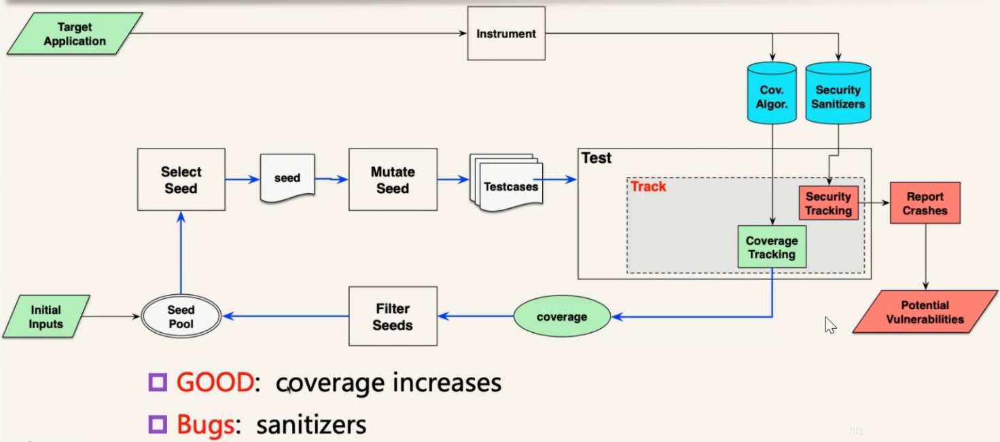

如果一个输入提高了边覆盖率，称为good种子。在迭代测试的过程中，保存good种子，报告bug。

通常采用插桩作边覆盖率的统计，Sanitizer作程序的安全跟踪。

### 一、遗传算法

遗传编程(Genetic Programming)是进化算法中的一种。
GP的工作过程：
1. 初始化
2. 评估适应度
3. 根据适应度进行概率性选择
4. 通过遗传算子生成下一代
5. 判断是否符合终止标准，不符合则继续迭代

**选择：**

基于适应度(fitness)选择个体的过程，被选择的个体在之后会作为父系通过遗传算子繁育下一代程序个体。
AFL中将新状态作为适应度(当有新的 tuple (基本块->基本块)出现或已有 tuple 中出现新的命中组则视为产生新状态)。每次执行程序后，对比位图有无产生新状态来决定是否保存测试用例。

**遗传算子：**

经过一轮选择得到适应性较好的父体后，遗传算子对父体(parent)进行遗传操作，生成子代(child)。遗传算子主要包括以下两种：

1. 变异（Mutation）
一个父体的随机部分变异。常用的一种subtree mutation：在一个父体中随机选择一个突变点(mutation point)，随机生成一个子树，将父体中以突变点为根节点的子树替换为这个随机生成的子树。

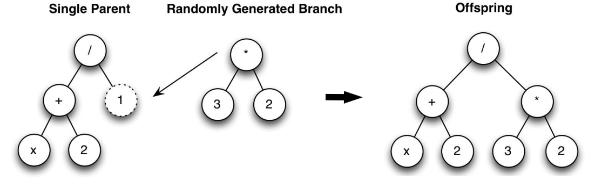

2. 交叉（Crossover）

两个父体基因的混合/交换。常用的一种子树(subtree) crossover过程：在每一个父体中随机选择一个杂交点(crossover point)，复制第二个父体中以杂交点为根节点的子树，将一父体杂交点下的子树替换为二父体下的子树，生成子体。

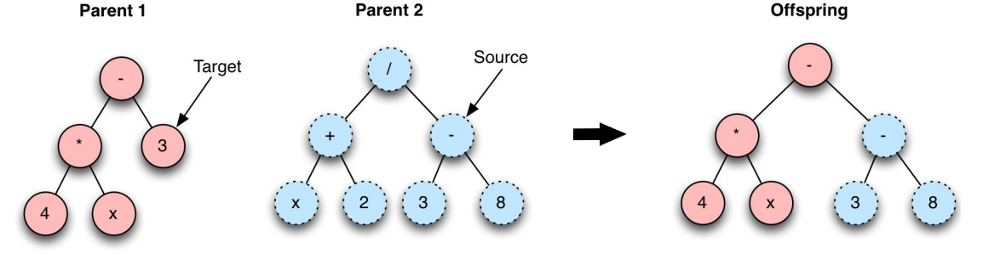

子树crossover由两个父体随机生成了一个子体。其他多种交叉/杂交方法中，也存在由两个父体生成两个子体的种类，如one-point crossover

### 二、插桩

插桩技术是在程序中插入探针和代码段，来收集运行时的信息，常用于安全测试和动态代理。例如Fuzzing、DTA、ASAN都使用插桩来实现相应的功能。根据插桩的方式和目标的不同，插桩技术可以分为：
1. 源码插桩，在已知源码的情况下进行插桩。这种情况下不必考虑重定位的问题，根据编译器技术的不同，有汇编级别插桩(如afl-as)和编译器级别插桩(如LLVM pass)两种方式。
2. 二进制插桩，需要对编译后的二进制程序进行插桩。根据插桩的阶段不同，有静态二进制插桩SBI(如RetroWrite)和动态二进制插桩DBI(如AFL的QEMU模式)两种。其中SBI需要考虑重定位的问题，DBI不需要。

静态和动态二进制插桩使用不同的方法解决了插入和重新定位代码的困难问题。SBI使用二进制重写技术来永久修改磁盘上的二进制文件。DBI不修改磁盘上的二进制文件，而是在二进制文件执行时监视它们的进程，并在指令流中动态插入新指令。这种方法的优点是避免了代码重定位问题，因为：插入代码只注入到指令流中，而不注入到内存中二进制的代码段中，因此它不会破坏引用。然而，代价是DBI的运行时插桩在计算上更昂贵，导致速度比SBI慢。

**1.静态二进制插桩**

SBI需要对二进制程序反汇编，然后按需添加插桩代码，更新二进制程序存入磁盘。SBI需要处理重定位问题，有两种常用的方法：int3和跳板trampoline。
首先来看最朴素的插桩方法，如下图所示。假设要对mov edx，0x1指令插桩，可以使用jmp指令将其覆盖，跳转到插桩代码。在插桩代码中：对寄存器状态进行保存，执行mov edx，0x1和标记代码(用来统计覆盖率等)，恢复寄存器状态，返回到正常指令。

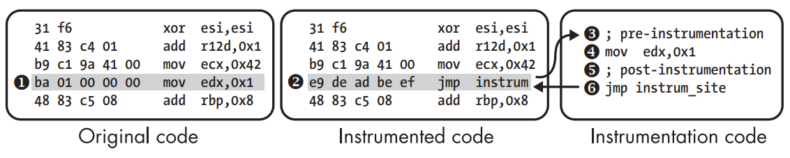

这种方法有两个问题：首先jmp instrum指令是5个字节，如果插桩目标指令小于5字节，会出现覆盖下一条指令的问题；第二，插桩目标指令与标记代码一起执行，会造成寄存器状态的混乱。
1. int3方案，使用x86的int 3指令，调试器用其实现软件断点，SBI库同样可以捕捉SIGTRAP信号，通过ptrace找到中断的地址，从而获取插桩点地址。相比于使用jmp覆盖原来的指令，使用int 3指令来覆盖只有1个字节0xcc，后面可以填充nop平衡相对地址。缺点是：int 3软件中断时间开销大；如果程序本身有很多int 3指令，会和插桩的int 3指令相混淆。
2. 跳板(trampoline)方案，是简单方法的改进，以函数为单位进行插桩。创建所有函数的副本，放在新的代码段.text.instrum中；用jmp指令覆盖原始函数的第一条指令，使其跳转到副本函数。后面使用垃圾字节平衡相对地址。同时，在副本函数中，可以在每条可能的插桩目标指令前插入若干nop指令，方便使用call覆盖跳转到标记代码；为了相对寻址的正确性，重写所有寻址指令。例如，需要对ret指令进行标记，则在ret前覆写指令call hook_ret，hook_ret是标记函数，可以由SBI的动态库提供。在hook_ret中保存寄存器状态，运行相关指令，恢复寄存器状态。

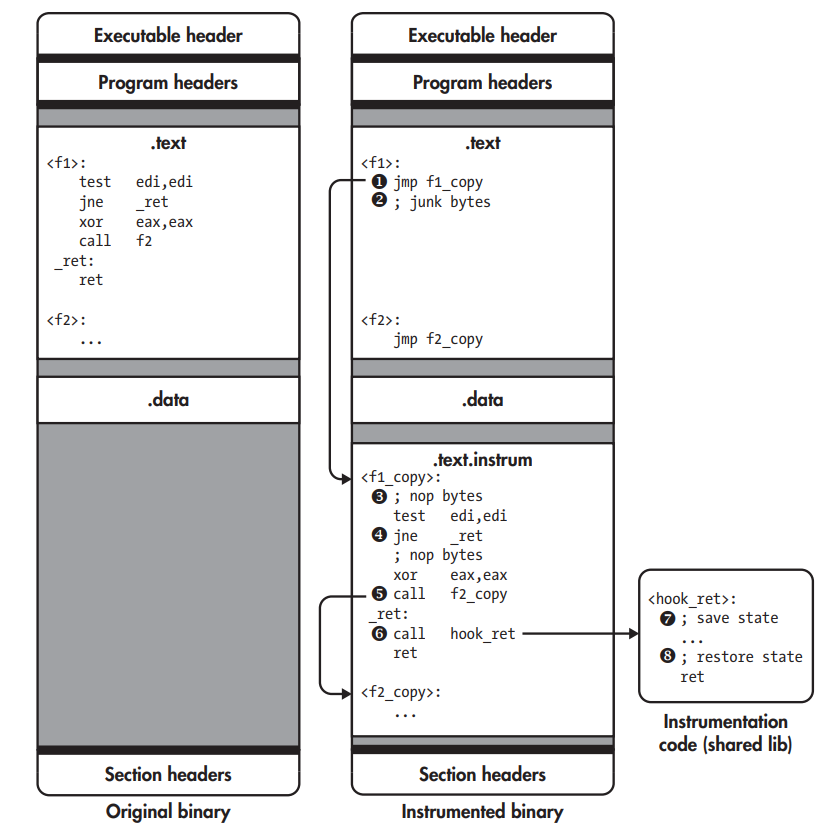

上面的方案适合于直接调用、直接跳转和间接调用。对于间接跳转，以switch的汇编实现为例，需要修改跳转表中case地址，指向副本中的case。

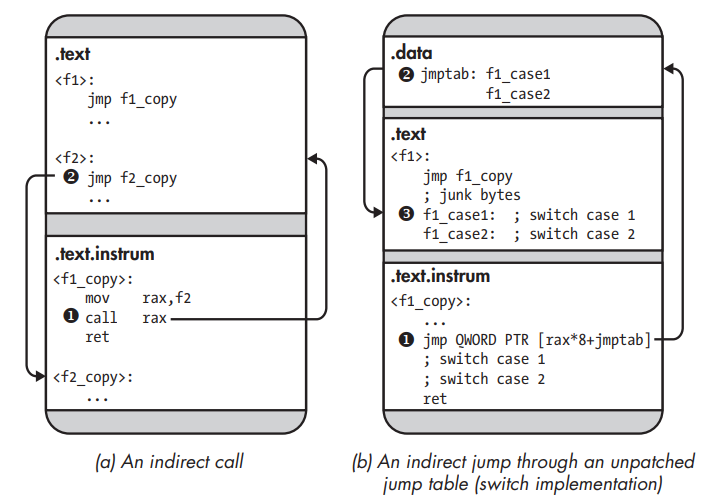

缺点是：复制了所有函数，使得二进制程序占用空间增大；间接跳转需要额外的工作；对于内联数据，可能造成对数据的覆盖。最后，SBI的正确性都建立在反汇编的正确性上，如果反汇编有问题，一切修改都会破坏原来的二进制程序。

**2.动态二进制插桩**

DBI通过监视和控制所有执行的指令来动态插桩进程，不会出现SBI的各种问题，在现代平台上也不比SBI慢太多。
一个DBI系统有很多组成部分，如下图所示。在操作系统上，虚拟机用来实现在指令流中动态插入新指令，而不会破坏主机内存中的进程。DBI工具用来启动DBI系统、与插桩引擎交互。

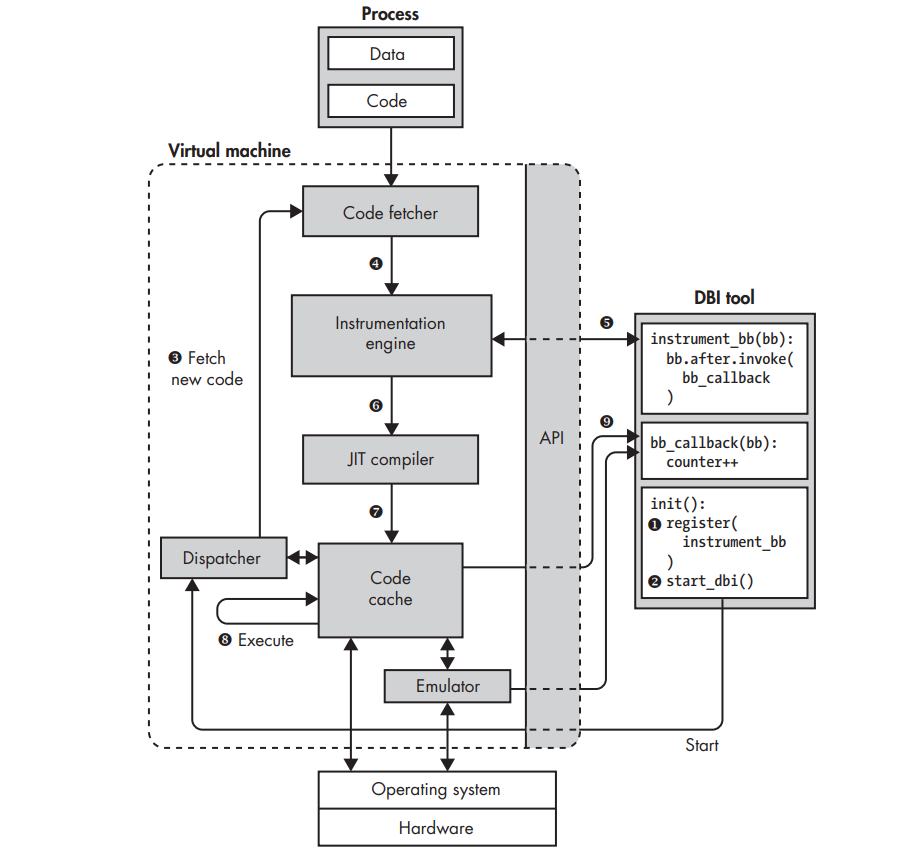

1. DBI工具向DBI系统注册函数instrument_bb，DBI引擎依此对基本块插桩。
2. 初始化函数启动DBI系统。
3. 最初代码缓存是空的，DBI系统从进程中提取代码。
4. DBI系统对其进行插桩。
5. 插桩是根据instrument_bb函数。
6. 插桩后，DBI系统调用JIT编译器编译代码，将机器码编译成机器码，并重新优化插桩。
7. 编译后的代码存储在代码缓存中。
8. 大多数指令在代码缓存中直接执行，特殊处理的系统调用等指令使用仿真器进行仿真。
9. 被插桩的代码基本块在执行时，会调用插入的bb_callback函数，以便DBI系统对基本块的覆盖率统计。

新的代码基本块的插桩和编译只在第一次执行时需要，后续在代码缓存中被重用。

### 三、Sanitizer

sanitizer是目前主流的漏洞挖掘辅助技术，取代DTA搭配模糊测试可以达到很好的效果。sanitizer会在运行时检测漏洞，并对其进行分类。主流编译器GCC、LLVM和MSVC都支持该特性。sanitizer的特点是：若是程序没有任何问题，不会返回错误消息；而当一个程序有多个漏洞触发时，会在第一个漏洞发生后停止。

google的sanitizer项目包括很多子项目，包括有ASAN、MSAN、UBSAN、TSAN、KASAN、QASAN等等。

**1.ASAN**

AddressSanitizer (简称 ASAN) 是C/C++的内存错误检测器 ，它可以发现以下漏洞：
1. Use after free (dangling pointer dereference)
2. Heap buffer overflow
3. Stack buffer overflow
4. Global buffer overflow
5. Use after return
6. Use after scope
7. Initialization order bugs

ASAN非常快速. 对插桩后的程序平均降速~2x，ASAN从LLVM 3.1和GCC 4.8开始是其一部分。使用ASAN需要参数 -fsanitize=address. 添加 -O1或更高来获得合理的表现，添加 -fno-omit-frame-pointer开启栈帧获得更好的栈跟踪。

ASAN包括一个编译器插桩模块和一个替代malloc函数的运行时库。ASAN 的运行时库会使用__asan_malloc来替换掉所有对 malloc 的调用。需要注意的是，目前版本ASAN还不能对jemalloc、tcmalloc等非调用libc的内存管理函数进行替换，所以编译插桩时可以需要参数 `MALLOC=libc`。

区别基于DTA的内存泄露检测，ASAN采用的是检测redzone的方法，优点是在检测越界访问的同时可以检测内存泄露，缺点是无法溯源。

**1.1 插桩模块**

对于每个内存读写指令，进行编译时插桩。IsPoisoned检查被访问的内存是否是可访问的(即not poisoned)，内存是否poisoned的元信息保存在影子内存中。

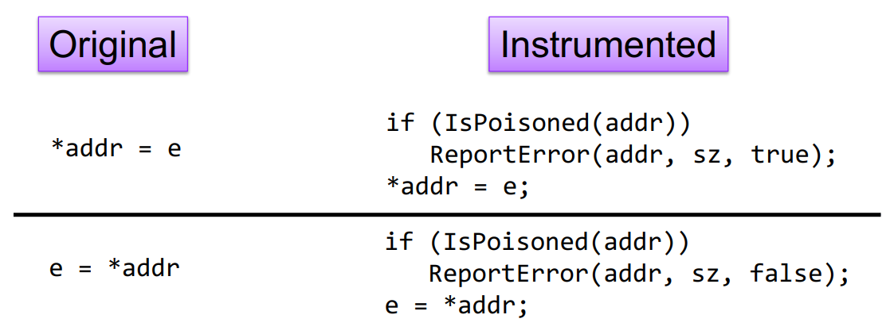

对内存的访问可以分为：栈访问和堆访问，二者都需要在分配的内存周围插入redzone，对redzone进行poison。然后插桩后的内存访问指令再通过IsPoisoned检查。

**1.2 运行时库**

堆访问通过替代malloc调用为__asan_malloc来实现。redzone的插入使用malloc，poison和元信息保存由封装的函数Poison和UnPoison实现。

``` c
void *__asan_malloc(size_t sz) {
    void *rz = malloc(RED_SZ);  // redzone
    Poison(rz, RED_SZ);
    void *addr = malloc(sz);    // 分配的内存
    UnPoison(addr, sz);
    rz = malloc(RED_SZ);        // redzone
    Poison(rz, RED_SZ);
    return addr;                // 返回分配的内存首地址
}
```

对于free的内存进行poison，动态调整redzone的区域。

**1.3 栈访问**

栈访问需要插入若干高级语言代码来实现。以下面的函数foo为例：
``` c
void foo(){
   char a[8]
   //some code
   return;
}
```
插入高级语言代码后：
``` c
void foo_instrumented(){
   char redzone1[32]; // 32-byte aligned
  char a[8]; // 32-byte aligned
  char redzone2[24];
  char redzone3[32]; // 32-byte aligned
  int *shadow_base = MemToShadow(redzone1);
  shadow_base[0] = 0xffffffff; // poison redzone1
  shadow_base[1] = 0xffffff00; // poison redzone2, unpoison 'a'
  shadow_base[2] = 0xffffffff; // poison redzone3
  //some code
  shadow_base[0] = shadow_base[1] = shadow_base[2] = 0; // unpoison all
  return;
}
```
区别于free操作，在函数最后unpoison栈空间。

**1.4 影子内存**

MemToShadow函数返回内存地址shadow_base=addr>>3+0x20000000，从栈的shadow_base操作可以看到，对于1个字节的内存的poison/notpoison情况，使用1个bit来表示。

**2.TSAN**

TSan 用来检查数据争用(data race)、死锁(deadlock)。当多个线程同时操作同一个变量的时候，而至少一个的操作是写操作时，就会发生数据争用；当多个线程因争夺资源而造成的一种互相等待的情况，若无外力介入，它们都无法继续推进，就是死锁。

TSan 需要所有代码都以 -fsanitize=thread 编译参数进行编译。在编译时，TSan 会在每一个内存存取操作、函数的调用、函数的 entry 和 exit 进行插桩。

多线程程序的执行过程中，数据竞争可能引发竞态条件漏洞。TSAN检测数据竞争使用happens-before方法。TSAN检测数据竞争使用的该方法。在两个事件中， 在一个事件发生前能够确定另外一个事件的结果，则称 两个事件满足 happens-before 关系。如果在 程序执行过程中任意两个操作都满足happens-before关 系则认为不存在竞态漏洞，反之则认为存在。

如下图所示，当一个线程对共享资源 v 的操作使用了锁，并且在之后一个 不同的线程中对共享资源 v 再次申请了锁并且使用完 后释放，那么率先使用锁对共享资源 v 操作的线程和后 续使用锁的线程满足 happens-before 关系。通过设置 happens-before 规则，在每个多线程进程中检测任意两 个操作之间是否满足happens-before关系。

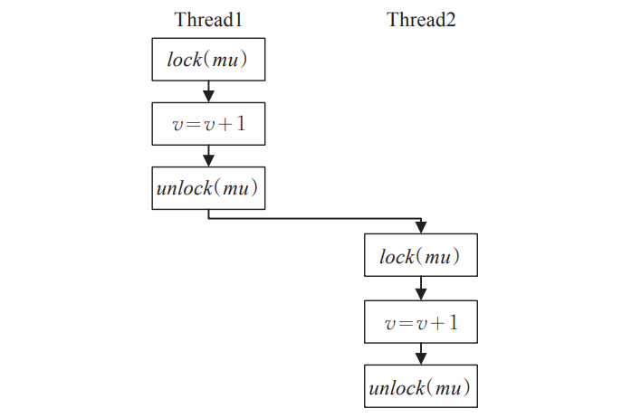

如果存在两 个操作不满足 happens-before 关系，则判定存在竞态漏洞。因为happens-bofore方法能够确保所有操作之间不会存在结果不确定的情况，所以 happens-before 方法误报率低。

## 使用指南

### 一、工作流程

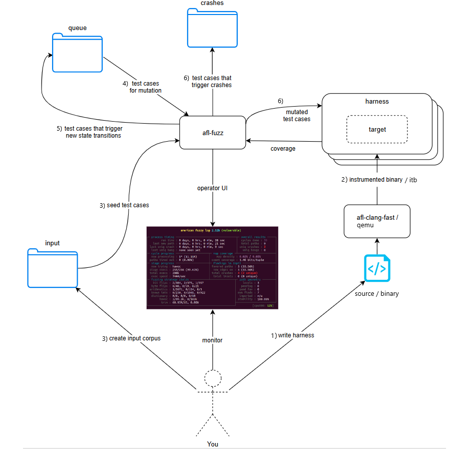

1. 确定模糊测试的对象，是命令行工具、动态库、虚拟机还是数据库等等。模糊测试的对象决定了构造的测试用例怎么输入，是从标准输入、编写harness还是通过驱动程序。
2. 源码插桩/静态重写/qemu插桩，以便跟踪边覆盖率。
3. 编写自定义的变异器，比如针对libxml2库，变异生成的测试用例需要符合xml结构，这就需要自己写变异函数。
(可选)构造字典，提高变异效率。
4. 创建语料库，选择初始种子库作为输入队列。
5. 通过afl-fuzz启动被测程序，循环执行模糊测试流程，检测是否有crash或者ASAN报错。

### 二、环境变量

**1.准备阶段变量**

__AFL_SHM_ID：共享内存shmid传递给被插桩程序，将覆盖率信息存储在其中。
AFL_MAP_SIZE：设置覆盖率统计图的大小。
AFL_SKIP_CPUFREQ：跳过对CPU扩展策略的检查，会有一些性能损失。
AFL_SKIP_BIN_CHECK：跳过插桩检查，需要目标程序自行控制模糊测试流程。

**2.测试阶段变量**

AFL_DEBUG：显示调试信息、目标程序的输出和错误信息。
AFL_DEBUG_CHILD：只显示目标程序的输出和错误信息。
AFL_DISABLE_TRIM：禁用测试用例裁剪。
AFL_FAST_CAL：快速校验，减少校验中的循环次数。

**3.Sanitizer变量**

AFL_USE_ASAN：使用ASAN，进行无冲突源码插桩和afl-fuzz判定bug。
AFL_USE_QASAN：使用QASAN，进行无冲突QEMU运行时插桩，afl-fuzz判定bug。
AFL_USE_KASAN：使用KASAN，进行内核模糊测试时，afl-fuzz判定bug。

**4.变异器变量**

AFL_CUSTOM_MUTATOR_LIBRARY：指定定制变异器。
AFL_CUSTOM_MUTATOR_ONLY：只使用指定的定制变异器。

**5.QEMU模式变量**

AFL_INST_LIBS：使用QEMU对动态链接库进行动态插桩。
AFL_QEMU_PERSISTENT_ADDR：通常是harness函数的偏移，QEMU通过非PIE形式加载目标程序，因此可以定位到harness。
AFL_QEMU_PERSISTENT_HOOK：指定定制的hook.so文件，hook.c需要根据harness参数传递时使用的寄存器来定制，因此需要搭配AFL_QEMU_PERSISTENT_GPR。
AFL_QEMU_PERSISTENT_GPR：持久模式，恢复寄存器。

### 三、插桩工具

编译时修改CC和CXX：
afl-gcc/afl-g++：AFL中使用，被AFL++淘汰。
afl-cc/afl-c++：使用clang编译插桩。
afl-clang/afl-clang++：指向afl-cc/afl-c++。
afl-clang-fast/afl-clang-fast++/：指向afl-cc/afl-c++。
afl-clang-lto/afl-clang-lto++：需要下载llvm和lld，设置LLVM_CONFIG=llvm-config-xx，再编译AFL++，指向afl-cc/afl-c++。


### 四、状态窗口

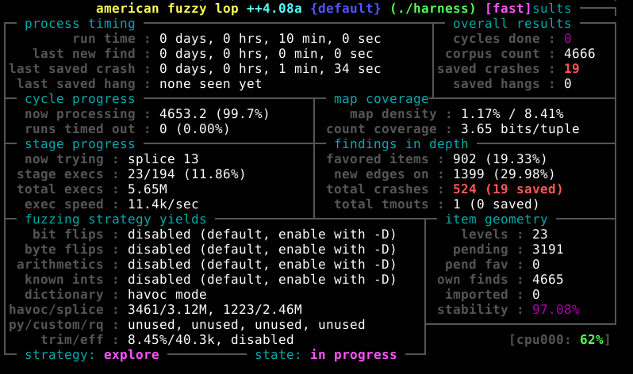

Process timing：Fuzzer运行时长、以及距离最近发现的路径、崩溃和挂起经过了多长时间。
Overall results：Fuzzer当前状态的概述。
Cycle progress：我们输入队列的距离。
Map coverage：目标二进制文件中的插桩代码所观察到覆盖范围的细节。
Stage progress：Fuzzer现在正在执行的变异策略、执行次数和执行速度。
Findings in depth：有关我们找到的执行路径，异常和挂起数量的信息。
Fuzzing strategy yields：关于突变策略产生的最新行为和结果的详细信息。
Item geometry：有关Fuzzer找到的执行路径的信息。
CPU load：CPU利用率

何时终止fuzz：
1. 状态窗口中"cycles done"字段颜色,随着周期数不断增大，其颜色也会由洋红色，逐步变为黄色、蓝色、绿色。当其变为绿色时，继续Fuzzing下去也很难有新的发现了。
2. 距上一次发现新路径（或者崩溃）已经过去很长时间了。
3. 目标程序的代码几乎被测试用例完全覆盖，对于小型项目，可能存在该情况。

### 五、输出目录

queue目录：存放所有具有独特执行路径的测试用例。
crashes目录：导致目标接收致命signal而崩溃的独特测试用例。
hangs目录：导致目标超时的独特测试用例。
fuzz_bitmap文本：当前位图的内容。
fuzzer_stats文本：afl-fuzz的运行状态。
plot_data文本：用于afl-plot绘图。

### 六、处理crash

判断是正常退出还是由于漏洞、ASAN退出，是通过检查子进程状态，即被测进程的状态，进程信号来判断是normal还是abort。

afl-fuzz crash模式：
将crash的例子作为输入，afl-fuzz -C -i -o ./vuln，在已知崩溃的条件下，探索其他代码路径。

crashwalk：
如果你想得到更细致的crashes分类结果，以及导致crashes的具体原因，这个工具基于gdb的exploitable插件，crashwalk支持AFL/Manual两种模式。

基于ASAN/QASAN：
配合harness逻辑触发asan日志。

## 插桩

在AFL(++)中，插桩的目的是统计边覆盖率信息，反馈指导后续的测试过程。AFL(++)提供的插桩功能有以下两种：
1. 源码插桩，有汇编级别和编译器级别两种。汇编级别是在重定位生成PIE文件之前，在汇编文件的.text节中的每个基本块中插桩，插入一段指令调用__afl_maybe_log收集这条边。编译器级别是利用LLVM把统计覆盖率的pass插入每一个基本块。
2. 二进制插桩，有动态插桩和静态重写两种。动态插桩(DBI)是使用动态翻译机制，例如在QEMU翻译时，记录本次翻译块的覆盖率信息，相比于随机数标识，QEMU以翻译块的内存地址作为基本块标识符。静态重写是修改二进制文件，达到源码插桩的效果。

**1.源码插桩**

**1.1 汇编级别**

通过afl-gcc或afl-clang工具进行编译插桩，使用的是跳板方案，在afl-as的add_instrumentation函数中实现。在重定位生成PIE文件之前，在汇编文件的.text节中的每个基本块中插桩。因此，需要检测函数名或条件标签：
1. main函数，入口点。
2. .L<whatever>，GCC跳转标签。
3. .LBB0_0，只在clang模式下的跳转标签。
4. jnz foo，以jnz为例的条件分支。

如下图，插入的代码trampoline_fmt_64，相当于一个inline函数 ，开辟一段栈区，0xe267是调用R(MAP_SIZE)产生的随机数，作为基本块的标识符和参数，传递给记录边覆盖率的函数__afl_maybe_log。该函数存在于afl为所有程序末尾插入的main_payload_64中。

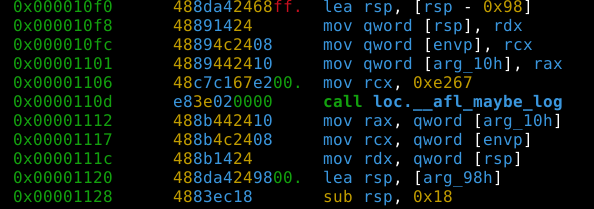

**1.2 编译器级别(LLVM模式)**

LLVM是编译器后端，常搭配clang等前端使用。若想使用LLVM模式，需要使用afl-clang-fast来编译目标文件。

LLVM Pass 是一些中间过程处理 IR 的可以用户自定义的内容，可以用来遍历、修改 IR 以达到插桩、优化、静态分析等目的。

AFL的llvm_mode可以实现编译器级别的插桩，可以替代afl-gcc或afl-clang使用的比较“粗暴”的汇编级别的重写的方法，且具备如下几个优势：
1. 编译器可以进行很多优化以提升效率；
2. 可以实现CPU无关，可以在非 x86 架构上进行fuzz；
3. 可以更好地处理多线程目标。

在AFL的llvm_mode文件夹下包含3个文件：afl-clang-fast.c，afl-llvm-pass.so.cc，afl-llvm-rt.o.c。
afl-llvm-rt.o.c文件主要是重写了afl-as.h文件中的main_payload部分，方便调用；
afl-llvm-pass.so.cc文件主要是当通过afl-clang-fast调用 clang 时，这个pass被插入到 LLVM 中，告诉编译器添加与 ``afl-as.h` 中大致等效的代码；
afl-clang-fast.c文件本质上是 clang 的 wrapper，最终调用的还是 clang 。但是与afl-gcc一样，会进行一些参数处理。
llvm_mode的插桩思路就是通过编写pass来实现信息记录，对每个基本块都插入探针，具体代码在afl-llvm-pass.so.cc文件中，初始化和forkserver操作通过链接完成。

**2.无源码插桩**

**2.1 QEMU模式**

与LLVM模式的源码插桩不同，QEMU模式基于动态翻译进行了动态二进制插桩(DBI)。AFL对QEMU进行了patch来实现DBI，相关patch在AFL-master/qemu_mode/patches。
elfload.diff：在QEMU加载elf文件时，获取入口点地址、代码段起始地址、代码段结束地址，三个变量定义在afl-qemu-cpu-inl.h中。
``` c
abi_ulong afl_entry_point, /* ELF entry point (_start) */
          afl_start_code,  /* .text start pointer      */
          afl_end_code;    /* .text end pointer        */
```
cpu-exec.diff：afl-qemu向qemu的cpu-exec.c中加入了两个宏函数AFL_QEMU_CPU_SNIPPET1和AFL_QEMU_CPU_SNIPPET2。在qemu进程执行一个翻译块tb之前都要调用宏函数AFL_QEMU_CPU_SNIPPET2。

``` c
#define AFL_QEMU_CPU_SNIPPET2 do { \
    if(itb->pc == afl_entry_point) { \
      afl_setup(); \
      afl_forkserver(cpu); \
    } \
    afl_maybe_log(itb->pc); \
  } while (0)
```

如果当前tb指向入口地址，说明是运行的开始。此时qemu进程调用afl_setup来初始化覆盖率位图的共享内存。调用afl_forkserver成为forkserver，同时成为qemu父进程。

qemu父进程循环fork出qemu子进程，qemu子进程信息传递给afl-fuzz。调用afl_wait_tsl接收qemu子进程的翻译块信息：保存tb的PC寄存器、代码段基址和CPU状态(这些信息保存在afl_tsl结构体中)，如果该块不在cache中，调用tb_gen_code翻译它加入cache，让后续fork出的子进程继承cache，避免重复翻译。
``` c
struct afl_tsl {
  target_ulong pc;
  target_ulong cs_base;
  uint64_t flags;
};
```

qemu子进程退出afl_forkserver继续执行，调用afl_maybe_log 记录本次翻译块的覆盖率信息(qemu模式以翻译块的pc作为基本块标识符，而非随机数)，然后退出宏函数回到cpu-exec继续执行下一个翻译块。与afl_wait_tsl相对应的，当没有翻译块可用时，需要生成新块，并调用宏函数AFL_QEMU_CPU_SNIPPET1，调用afl_request_tsl填充afl_tsl结构体发送给qemu父进程。

``` c
#define AFL_QEMU_CPU_SNIPPET1 do { \
    afl_request_tsl(pc, cs_base, flags); \
  } while (0)
```

## 覆盖率信息

对于二进制程序，可将覆盖率信息的概念理解为汇编代码中的某条边/某个函数/某个基本块是否已执行。其计量方式很多，但无论是GCC的GCOV还是LLVM的SanitizerCoverage，都提供函数（function）、基本块（basic-block）、边（edge）三种级别的覆盖率检测。

### 一、覆盖率统计

AFL++使用了边级别的覆盖率信息作为反馈，其覆盖率统计流程以afl-gcc插桩代码为例，插入的__afl_store函数负责统计覆盖率信息，存储到afl_setup开辟的共享内存（hash表）中。覆盖率统计流程分以下三步：
1. 调用__afl_maybe_log前设置的rcx(代表该基本块BB的标识符)与上一个基本块BB_prev的标识符__afl_prev_loc异或运算存入rcx，代表边BB_prev->BB。
2. 当前基本块的标识符shr右移1位(目的是对于A->A和A->B、B->A这三种情况进行区分)赋值到新的__afl_prev_loc。
3. *[__afl_area_ptr+rcx]在统计覆盖率信息的hash表中将该边的计数加0x01，adc指令将CF上的进位值也相加，达到NeverZero的目的。

``` c
cur_location = <COMPILE_TIME_RANDOM>;
shared_mem[cur_location ^ prev_location]++; 
prev_location = cur_location >> 1;
```

### 二、覆盖率统计反馈

AFL(++)的覆盖率反馈使用了边级别的混合度量，混合了边覆盖率与一次运行中执行相应边的计数，此计数被粗粒度地分桶统计，如下列桶所示。
```c
[0]           = 0,
[1]           = 1,
[2]           = 2,
[3]           = 4,
[4 ... 7]     = 8,
[8 ... 15]    = 16,
[16 ... 31]   = 32,
[32 ... 127]  = 64,
[128 ... 255] = 128
```
如果一个输入执行的边以一个新桶来统计，则被认为是interesting的，保存到队列中。这些桶或称命中计数(hitcount)在执行期间被记录到一个共享位图(bitmap)中，其中每个字节代表一个边的计数。

由于AFL(++)位图的大小是有限的(64KB)，所以当一个程序的边数大于2^16时会发生碰撞，同时由于统计边时的映射方式同样可能存在碰撞。

AFL(++)中当有新的边 (BB->BB)出现或记录的边出现新的命中桶则视为产生新状态。每次执行程序后，对比位图有无产生新状态来决定是否保存测试用例。

## 变异

### 一、原生变异器

在覆盖率统计过后，interesting的testcase会被保留，等待下一轮的变异。AFL的变异分为三类：
1. 确定性变异deterministic
2. 破坏性变异havoc
3. 拼接splicing

**1.确定性变异deterministic**

包括在测试用例的内容上进行单个的确定性变异。

**1.1 位翻转**

STAGE_FLIP1 每次翻转一位(1 bit)，按一位步长从头开始。
STAGE_FLIP2 每次翻转相邻两位(2 bit)，按一位步长从头开始。
STAGE_FLIP4 每次翻转相邻四位(4 bit)，按一位步长从头开始。
STAGE_FLIP8 每次翻转相邻八位(8 bit)，按八位步长从头开始，也就是说，每次对一个byte做翻转变化。
STAGE_FLIP16每次翻转相邻十六位(16 bit)，按八位步长从头开始，每次对一个word做翻转变化。
STAGE_FLIP32每次翻转相邻三十二位(32 bit)，按八位步长从头开始，每次对一个dword做翻转变化。

**1.2 加减法**

arith 8/8，每次8bit进行加减运算，8bit步长从头开始，即对每个byte进行整数加减变异；
arith 16/8，每次16bit进行加减运算，8bit步长从头开始，即对每个word进行整数加减变异；
arith 32/8，每次32bit进行加减运算，8bit步长从头开始，即对每个dword进行整数加减变异；

**1.3 兴奋值进行整数代换**

interest 8/8，每次8bit进行加减运算，8bit步长从头开始，即对每个byte进行替换；
interest 16/8，每次16bit进行加减运算，8bit步长从头开始，即对每个word进行替换；
interest 32/8，每次32bit进行加减运算，8bit步长从头开始，即对每个dword进行替换；
以interest32/8为例：
``` c
#define INTERESTING_32 \
  -2147483648LL, /* Overflow signed 32-bit when decremented */ \
  -100663046,    /* Large negative number (endian-agnostic) */ \
  -32769,        /* Overflow signed 16-bit                  */ \
   32768,        /* Overflow signed 16-bit                  */ \
   65535,        /* Overflow unsig 16-bit when incremented  */ \
   65536,        /* Overflow unsig 16 bit                   */ \
   100663045,    /* Large positive number (endian-agnostic) */ \
   2147483647    /* Overflow signed 32-bit when incremented */
```
**1.4 字典**

会把用户提供的token替换、插入到原文件中。

**2.破坏性变异havoc**

变异是随机叠加的，还包括改变测试用例的大小（例如添加或删除部分输入）。

**3.拼接splicing**

将两个差异明显的测试用例，各切一半，合并为一个，并执行破坏性变异。

### 二、定制变异器

在定制变异器中，可以自由使用havoc对特定字段进行变异。
AFL++可以很容易地在新的模糊测试场景中进行扩展，适用于发现指定目标的漏洞。定制变异器允许模糊测试研究在AFL++之上构建新的调度、突变和修剪，而无需对AFL进行fork、patch，就像当前的许多工具一样。
对此的支持最初是在Holler fork的AFL中独立开发的，但后来得到了扩展，具有许多新功能。插件可以用C/C++编写，也可以用Python进行原型化。
以C/C++编写的变异器库为例，要在AFL++中单独使用该库，需要先设置环境变量：
``` c
export AFL_CUSTOM_MUTATOR_ONLY=1
export AFL_CUSTOM_MUTATOR_LIBRARY="full/path/to/libmutator.so"
```
### 三、REDQUEEN

在KAFL的基础上，探索了绕过困难比较和(嵌套)校验和检查的方案，但不使用诸如污点跟踪或符号执行之类的昂贵技术。该模糊测试方案专注于Input-to-State（I2S）的比较，这是一种与至少一个操作数中的输入直接相关的比较类型。作者表明，许多障碍都是这种类型的，并开发了一种定位和绕过它们的技术。

I2S关联的例子如下图所示。对cmp指令进行hook，运行指令时可以观察到eax的值为VALU，0x44434241则为ABCD(均为小端序)。

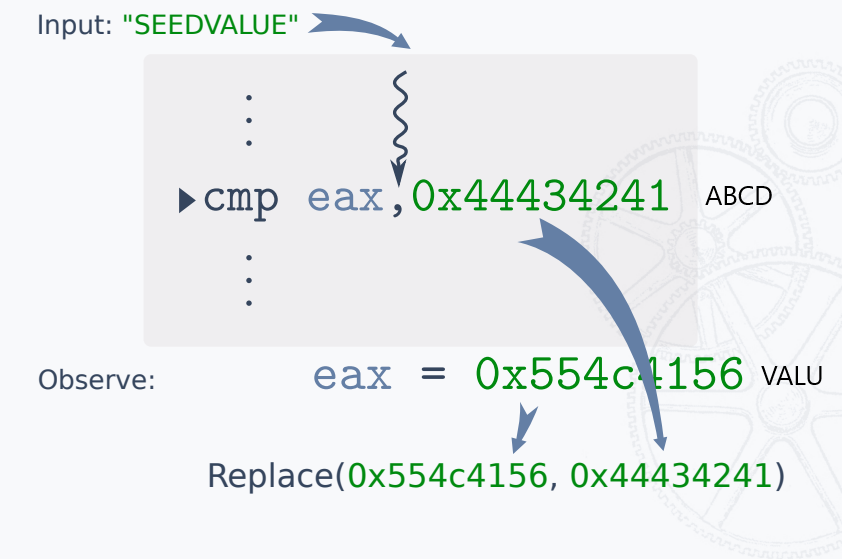

input中同样有VALU出现，由此推断：如果将输入中的VALU替换为ABCD，就有较大可能绕过这个障碍。

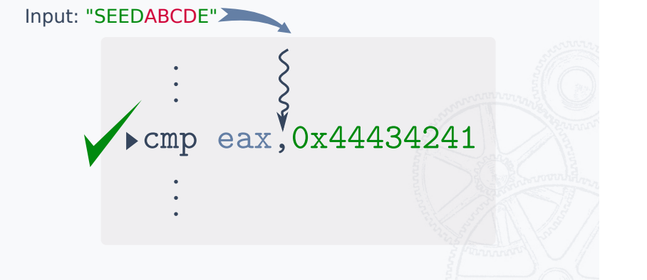

## 循环测试

AFL(++)要达到循环测试，需要配置好四个组成部分：
1. fuzzer进程，由afl-fuzz启动生成。
2. 测试进程，由afl-fuzz创建好管道后，fork生成。
3. 覆盖率统计，共享内存 __AFL_SHM_ID映射的地址__afl_area_ptr。
4. 测试用例传递和反馈。

目前，AFL(++)使用forkserver和持久模式两种机制来支持快速的循环测试。

### 一、forkserver

forkserver是AFL++的一种机制，为了避免从afl-fuzz调用fork启动被测程序，还需要调用execve加载被测程序导致的额外开销。

**1.forkserver的初始化**

afl-fuzz生成了测试进程，由于是第一次运行到插桩代码__afl_maybe_log，检测到了forkserver未启动，它则作为forserver，以后都是从被测程序自己fork，这样省略了execve开销。
由于测试进程是fork出来的，继承了覆盖率信息的共享内存__AFL_SHM_ID，调用shmat将返回地址存储在__afl_area_ptr中，所以测试进程的覆盖率信息fuzzer可以直接访问到。

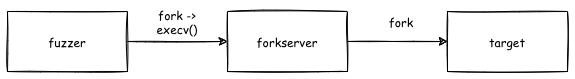

**2.forkserver传递信息**

forkserver作为fuzzer和target的桥梁，调用pipe函数传递以下两种信息：
1. 测试用例。
2. 测试进程的状态。

forkserver从fuzzer接收测试用例，再将测试用例输入测试进程，开始模糊测试，在测试进程结束时有两种状态：
1. normal，测试进程正常退出，forkserver将状态反馈，fuzzer根据覆盖率信息的变化确定是否interesting。
2. abort，测试进程崩溃了，forkserver将状态反馈，fuzzer记录下该crash。

由此，测试进程作为forkserver循环执行fork操作，并将子进程的结束状态通过状态管道传递给fuzzer进程。

### 二、持久模式

正常情况下，对于每一个测试用例，都会fork()出一个新的目标进程进行处理，而大量fork()无疑会带来大量开销。为此，将一个loop patch到测试目标中，每次fork()得到的进程，会对一批而非单个测试用例进行处理，从而减少了开销，提高了执行速度。

**1.LLVM持久模式**

使用宏定义__AFL_LOOP(NUM)来决定单进程处理多少测试用例。需要注意的是每次fuzz过程都会改变一些进程或线程的状态变量，因此，在复用这个fuzz子进程的时候需要将这些变量恢复成初始状态。

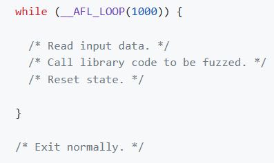

官方建议的数值为1000，循环次数设置过高可能出现较多意料之外的问题，并不建议设置过高。

**2.QEMU持久模式**

此模式最高可以达到10倍加速，因此AFL++建议尽可能使用此模式。有两种主要方法可以实现此目的：
1. 循环一个函数：用户指定一个函数的地址，通常是harness函数的偏移值，模糊器会自动在while(__AFL_LOOP(NUM))循环中使用该函数，修改其返回地址。该地址也可以不是函数的第一条指令，但是在这种配置下，用户必须提供栈上的偏移量，以正确定位要修改的返回地址。
2. 入口点和出口点：用户可以指定循环的第一条指令和最后一条指令的地址，QEMU将在运行时修改代码以在这些地址之间生成循环。


## 智能模糊测试

### 一、定向模糊测试

结合静态分析，叫定向模糊测试，源码中指定一个可能存在漏洞的函数，称为目标点，然后将边覆盖率反馈，变成距离这个目标点最近反馈。使得更快的覆盖到目标点。计算距离有函数级、基本块级两种，有aflgo、UAFuzz。

### 二、结合符号执行

结合符号执行，主要是为了解决魔数匹配导致模糊测试卡住的问题，利用符号执行快速突破条件判断语句。出名的有Driller（angr + afl）。

