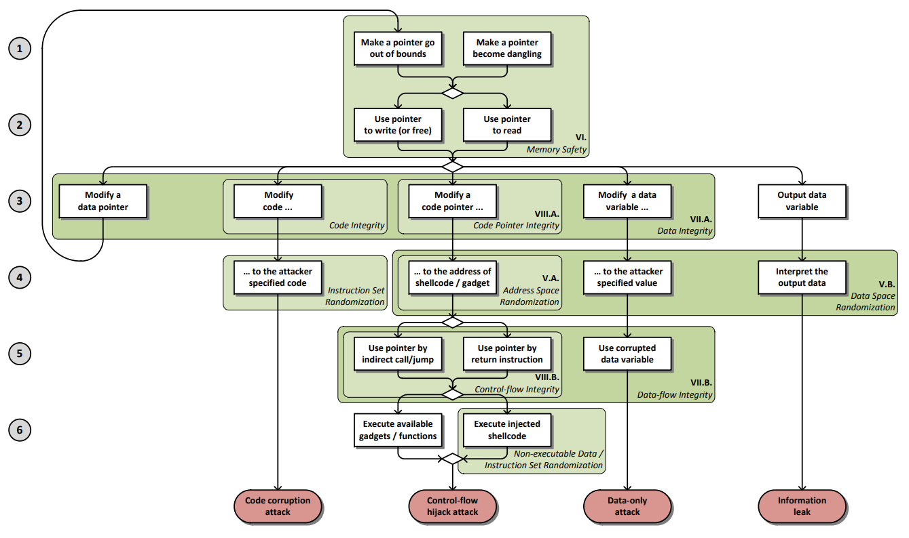

## RobotAgent漏洞

未验证、未正常处理的输入或者操作可能引发漏洞，各种类型的漏洞可能相互引发，形成一条漏洞链，共同造成代码执行等影响。

### 一、漏洞的影响

根据漏洞对程序的影响分类，漏洞的影响有以下4种：
1. DoS/抛出异常
2. 信息泄露
3. 权限提升
4. 代码执行

### 二、漏洞的分类

RobotAgent的漏洞存在2类：
- 代码漏洞，不同的编程语言受到不同漏洞的影响,主要的语言：Python，C++，Go，Java。
- 通用漏洞，在更高的维度存在的漏洞。

## Top 10 代码漏洞

涵盖最常见的代码漏洞[^1]。

### 一、OOB(Out-of-bounds)

OOB类型的漏洞有两种原语：
1. OOB R，越界读，导致泄漏关键信息绕过保护策略、读取到非预期的内存页。
2. OOB W，越界写，导致关键指针、数据和控制结构被覆盖，同时越界写通常可以实现越界读。

**1.栈溢出(OOB R/W)**
> **受影响的语言：Python，C++，Go，Java**

栈溢出是一种 OOB R/W 漏洞，通过构造恶意输入可导致4种影响：
1. 抛出异常，仅内存安全语言。
2. 信息泄露，复用程序代码来泄露信息。
3. 权限提升，利用内核栈溢出提升进程权限。
4. 代码执行，通过覆写rip或者修改栈上的函数指针实现。

当栈溢出发生时，有以下2种情况：
1. 溢出空间可控，在用户态程序或内核调用strcpy(), gets(), sprintf()等不检查是否越界的函数时出现。
- 常见的漏洞利用：通过栈迁移布置ROP链实现代码执行，kROP实现提权。
2. off-by-one，在用户态程序或内核调用strncat(), strncpy(),strlen()时出现。
- 常见的漏洞利用：覆写rip，rbp或者邻接变量实现控制流劫持。

**2.堆溢出(OOB R/W)**
> **受影响的语言：Python，C++，Go，Java**

堆溢出是一种OOB R/W漏洞，通过构造恶意输入可导致4种影响：
1. 抛出异常，仅内存安全语言。
2. 信息泄露，通过堆重叠泄露信息。
3. 权限提升，利用内核堆溢出提升进程权限。
4. 代码执行，覆写堆结构相关信息达到代码执行。

用户态程序的堆溢出发生在用户态堆管理器中，比如ptmaloc2，而内核堆溢出则发生在特定内核的堆管理器中，比如Linux内核的slub。当堆溢出发生时，有以下2种情况：
1. 溢出空间可控，堆溢出类似于栈溢出，都是由于写入的数据没有控制好大小导致的。区别是堆上并不存在返回地址等数据，但是存在堆结构相关信息。
- 常见的漏洞利用：通过覆写后续的used、freed堆块，对于used篡改它的函数指针达到代码执行。或者对于freed通过tcache污染、各种bins篡改达到任意地址读写，在此基础上覆写got表，篡改FSOP、rtld_global上面的函数指针为one_gadget，实现代码执行。
2. off-by-one，类似于栈off-by-one，区别在于堆off-by-one造成代码执行的可利用性与堆溢出相当。
- 常见的漏洞利用：一个例子是用户态程序溢出0x00时，在size为0x100倍数的时，使得prev_in_use位被清，这样前块会被认为是freed块，从而触发特定bin的前向合并造成unsafe unlink，实现任意地址写，在此基础上覆写got表，篡改FSOP、rtld_global上面的函数指针为one_gadget，实现代码执行。

**3.缺陷函数越界访问(OOB R)**
> **受影响的语言：Python，C++，Go，Java**

缺陷函数越界访问是OOB R类型漏洞，造成2种影响：
1. 抛出异常，仅内存安全语言。
2. 信息泄露，越界访问会造成泄漏，导致栈地址、堆基址、libc和ld基址被泄露。常见的类string返回时，其实是把栈地址addr作为参数，传入函数使其把返回的string类存储在addr指向的栈空间当中。据此可以泄漏栈基址。

### 二、UAF(Use-After-Free)

UAF类型的漏洞有4种原语：
1. UAF W，释放后写，导致关键指针、数据和控制结构被篡改。
2. UAF R，释放后读，导致泄漏关键信息绕过保护策略。
3. Double Free，二次释放，达到UAF R/W的效果。
4. UAF变种。

**1.堆UAF(UAF R/W)**
> **受影响的语言：C++**

堆UAF造成的影响：
1. UAF R造成信息泄露，单链表的bins会泄露next chunk地址，利用tcache解密safe link，可以泄露堆基址，右移12位。双链表bins会泄露nextchunk和prechunk地址，可能泄露libc地址。
2. UAF W造成代码执行，使用tcache污染或largebin攻击伪造freelist的指向。再次malloc得到任意地址写。在此基础上覆写got表，篡改FSOP、rtld_global上面的函数指针为one_gadget，实现代码执行。

用户堆UAF：
当一个内存块被free之后再次被使用。此时会出现以下几种情况：
1. 内存块释放后，对应指针设置NULL，造成空指针解引用。
2. 内存块释放后，对应指针非NULL，再次读造成信息泄露、再次写freed chunk元数据造成任意读写。

内核堆UAF：
在内核页管理代码、细粒度的object管理代码中存在UAF漏洞。

**2.堆Double Free(UAF R/W)**
> **受影响的语言：C++**

当一个内存块被2次free后，再1次allocate时，该块会同时处于allocated和freed状态，即该内存块在保存freed状态bins信息的情况下，是可读写的，由此达到UAF R和UAF W的效果。

堆Double Free达到UAF R和UAF W的效果，造成相同的影响。

**3.UAF变种**
> **受影响的语言：Python，C++，Go，Java**

即使使用垃圾回收运行时库，也可能出现UAF漏洞，因为UAF的对象除了chunk，还有文件描述符、网络连接等，比如Use After Close，文件描述符关闭之后仍然访问；Double Close，二次关闭文件描述符。

UAF变种造成的影响：
1. 抛出异常，仅内存安全语言。
2. 信息泄漏。
3. 代码执行。

### 三、未初始化
> **受影响的语言：C++**

一些提供给程序访问的变量，比如指针、数值等，可能存在未初始化的问题，未初始化有两种类型：
1. 该变量未赋值，攻击者可以控制该变量的值，进而间接控制程序的行为。
2. 该变量未清除，攻击者可以泄露该变量的值，或者利用过时的值。

未初始化的影响：
1. 信息泄漏
2. 代码执行

### 四、空指针解引用
> **受影响的语言：C++，Go，Java**

空指针解引用发生在程序解引用一个它认为有效的指针时，但它实际上是NULL。空指针解引用问题可能由于许多漏洞而触发，包括竞争条件和简单的逻辑错误。

空指针解引用的影响：
1. 抛出异常，仅内存安全语言。

### 五、整数类型漏洞
> **受影响的语言：Python，C++，Go，Java**

整数类型的漏洞，可能由整数运算、符号转换产生。

**1.整数运算**

整数溢出是CPU中ALU对(有/无符号)整数之间的运算导致的上溢或下溢。如果一个对象的大小发生整数溢出，会间接影响到栈或堆为该对象分配的空间大小，引发栈溢出和堆溢出，为漏洞利用创造条件。

**1.1 整数上溢**

在OpenSSL 3.3代码中，存在整数上溢。
``` c
int nresp = packet_get_int();

if(nresp > 0){
    response = xmalloc(nresp*sizeof(char*));
    for(int i = 0; i< nresp; i++)
        response[i] = packet_get_string(NULL);
}
```
如果nresp等于UINT_MAX/sizeof(char*)，那么nresp会上溢为0，xmalloc() 分配的堆空间为0，下一行代码的执行会触发堆溢出漏洞。

**1.2 整数下溢**

下面的代码存在整数下溢。
``` c
int num = get_int();
num --;

if(num <= 0) return;
read_buffer(num);
```

如果num等于INT_MIN，符号位作参与运算，会产生下溢，导致其值变成INT_MAX，触发栈越界读。

**2.符号转换**

在无符号整数、带符号整数之间转换时发生了预期之外的数值误差，误差引发栈溢出和堆溢出，为漏洞利用创造条件。

下面的代码存在符号转换误差。
``` c
char buf[512];
int len = get_src_len();
if(len < 512){
    memcpy(buf,src,len);
}
```
get_src_len()接收无符号数大于231，经过符号转换后len变成负数，绕过if判断，造成栈溢出。

### 六、异常未捕获
> **受影响的语言：Python，C++，Go，Java**

抛出了异常却未被捕获，会执行非预期的控制流。

### 七、反序列化
> **受影响的语言：Python，C++，Go，Java**

在没有验证输入有效的情况下，反序列化了不受信任的数据。攻击者通过构造恶意序列化数据，在反序列化（将数据恢复为对象）时触发非预期行为。

某些编程语言或库在反序列化时会自动执行特定方法（如Java的readObject()、Python的__reduce__），攻击者可利用这些特性注入恶意逻辑。

反序列化的影响：
1. 代码执行。

### 八、控制流注入
> **受影响的语言：Python**

控制流注入是对命令注入、代码注入的概括。利用这些漏洞构造的语义化输入，可以直接劫持控制流，导致代码执行。

**1.命令注入**

程序将恶意输入拼接到操作系统命令中，导致代码执行。

**2.代码注入**

代码注入有相当多的变种，比如：XSS、XXE、SSTI、SPEL表达式注入等等。都是通过构造语义化输入，使得程序执行其中的代码。

### 九、文件操作
> **受影响的语言：Python**

1.文件读取
2.文件上传
3.路径穿越

###  十、竞态条件
> **受影响的语言：Python，C++，Go，Java**

竞态条件的影响：
1. 抛出异常
2. 信息泄漏
3. 代码执行

竞态条件（race condition）是指这样一种情形——多个线程或进程在读写一个共享数据时结果依赖于它们执行的相对时间。如果竞态条件危害了程序正确性，就会产生竞态条件漏洞，可以被TSAN明确分类。

**1.数据竞争**
   
定义内存访问操作：e 为一个四元组 (m,t,L,a) ，其中：m 为内存访问操作的内存地址；t 为标识内存访 问操作的线程；L 为操作所属线程拥有的锁集合；a 为 内存访问操作的类型（READ或WRITE）。
数据竞争 IsRace(ei ,ej) 是满足以下条件的两个内存访问操作：
1. 内存访问位置相同，mi=mj；
2. 两者并发执行；
3. 至少有一个为写操作；
4. 未使用“互斥”的同步机制约束。

DirtyCow 漏洞（CVE-2016-5195）是最为典型的数据竞争引发的漏洞。如下图所示，正常的程序流程三次调用了 faultin_ page 函数完成了三个步骤，其中第二次进入 faultin_ page主要是处理写权限的页错误问题，要求的写权限标 志会被去掉，即去掉FOLL_WRITE标志位，第三次调用 faultin_page 时已经成功得到 cow 后的页面，且 flags 已经去掉 FOLL_WRITE，因此不会再产生写错误的处理， 可以直接写入 cow 的页。


但是如果在上述流程即第二 次页错误处理结束时，在一个新的线程调用madvise，会 unmap 掉前面 cow 的页面，又进入缺页处理，这里不同 的是在do_fault调用时，由于没有了写权限的要求，直接 调用了 do_read_fault读取映射文件的内存页，而不是内存页副本，后续即可实现越权写操作。
在 DirtyCow 漏洞中，两个线程竞争的资源是内存页，并且造成了程序 正确性的影响。某些数据竞争发生时 并不会影响程序的正确性，例如当两个进程竞争的内存 共享资源和两个进程的逻辑完全无关，则认为构成数据竞争但是不构成竞态漏洞。DirtyCow正是由于在数据竞争发生之后导致 任意文件被恶意篡改的危害性结果，才被研究人员归结为竞态漏洞。

**2.TOCTTOU**

TOCTTOU（Time Of Check To Time Of Use）指计算机系统中的 资源与权限等状态在检查（安全授权）和使用这个检查 结果之间，因为检查结果（如授权状态）在这段时间发 生了改变而造成的漏洞产生。
TOCTTOU 通常发生 在文件系统的访问时，特别是在 UNIX操作系统中较为 常见，文件系统访问一般会要求对文件先检查再写入， 这就导致检查与读写操作之间存在时间间隔，攻击者 可利用这种时间间隔对文件系统展开攻击。
类 Unix 文件系统中存在 TOCTTOU 缺陷的根本原因在于文件 名和文件对象之间的映射是可变的，如下图所示，TOUCTTOU 的典型例子 Binmail。 Binmail是一个setuid-to-root程序，在普通用户权限下可 以调用执行 root 用户权限的操作。在正常的读取邮件 的过场中，Binmail 首先通过 lstat 函数查看文件 mail 的 信息，如果 mail文件是正常文件，不是符号链接则执行 open函数打开邮件。


但是由于 lstat和 open函数不是原始操作，所以如果在 lstat函数检查完毕后，另外一个线 程或者进程可以通过 unlink和 symlink操作将 mail文件 替换为指向系统关键文件/etc/passwd等文件的链接，那 么 open 的文件将会是替换后的系统关键文件，实现了任意文件读取。
一个基于文件的TOCTTOU例子的exp如下图所示。use在check后面执行而导致的漏洞。


综上，TOCTTOU是竞态漏洞的子集，数据竞争和竞态漏洞存在交集。

**3.Double Fetch**

Double Fetch也是竞态漏洞的一个子集，该漏洞的原理是：内核从用户空间中拷贝复杂数据时，数据在内核中有两次被取用，内核第一次取用数据进行安全检查（如缓冲区大小、指针可用性等），当检查通过后内核第二次取用数据进行实际处理。


在两次取用的时间间隔里，可以对已通过检查的用户态数据进行篡改，在第二次取用时造成访问越界或缓冲区溢出，最终导致内核崩溃或权限提升。Double Fetch通常会出现在以下场景：

1. 类型选择，第一次取数据识别它的类型，然后对数据篡改，第二次取数据进行相应类型处理时产生混淆。
2. 长度检查，第一次取数据计算它的长度，然后对数据篡改，第二次取数据处理时导致溢出、或者信息泄露。
3. 浅拷贝，第一次取数据只是将指向用户数据的指针拷贝到内核中，然后对指针篡改，第二次取的数据将不是原来通过检查的数据。

从原理上来看，Double Fetch和TOCTTOU类似，都是利用时间间隔篡改数据，造成不一致性。也因此是可以被修复的。

## Top 10 通用漏洞

涵盖常见的Agent漏洞[^2]。

### 一、越权

水平、垂直越权

常见的漏洞示例：
1. AI代理暂时继承特定任务的管理权限，但在完成后不会放弃这些权限，从而为利用留下了扩展窗口。
2. 恶意行为者操纵代理的任务队列，欺骗代理在合法操作的幌子下执行特权操作。
3. 通过将多个临时权限分配链接在一起，利用代理的角色继承机制来访问受限制的系统或数据。
4. 攻击者破坏代理的控制系统，发出未经授权的命令，同时保持正常操作的外观。
5. 代理意外地在不同的执行上下文中保留提升的权限，从而导致意外的权限升级。

攻击场景示例：
1. 攻击者识别具有系统维护临时提升权限的AI代理。通过操纵代理的任务队列，他们扩展权限窗口，并在维护操作的幌子下使用代理访问受限制的系统。
2. 恶意行为者利用代理的角色继承机制在多个系统上逐渐积累权限。通过将看似合法的任务链接在一起，它们获得了对敏感数据的未经授权的访问，而看起来像是正常的代理操作。
3. 攻击者在执行关键基础设施维护任务期间破坏代理的控制系统。他们使用代理的合法访问来安装后门，而代理似乎正在执行日常维护。
4. 复杂的攻击利用代理的权限缓存机制来维护跨多个会话的提升访问。攻击者使用这种持久访问，通过代理的合法通信通道慢慢地泄露敏感数据。
5. 内部威胁操纵代理的配置，以保留超出预期持续时间的管理权限。他们使用这些扩展特权执行未经授权的系统更改，同时通过代理的受信任状态逃避检测。
6. 如果同一层的AI代理之间的点对点通信不涉及身份验证或基于JWT的技术，则执行代理1可能受到威胁向量的攻击，然后影响同一层的另一个执行代理2。这是Agent到Agent协作阶段中另一个重要的安全攻击场景。

### 二、危险的系统交互

常见的漏洞示例：
1. 工具链操作：以意想不到的方式链接多个合法的工具调用，以实现超出单个工具验证的未经授权的结果
2. 自修改利用：利用代理的自改进能力来绕过工具使用限制或扩展工具访问。
3. 攻击者操纵控制工业控制系统的代理，造成设备损坏。
4. 恶意利用代理访问智能建筑系统危及物理安全。
5. 控制物联网设备的代理受到威胁，从而造成安全漏洞。
6. 通过受损的代理凭证访问关键基础设施系统。
7. 安全系统是通过操纵代理命令绕过的。

攻击场景示例：
1. 攻击者入侵控制工业设备的人工智能代理，操纵其运行超出安全参数，同时绕过标准安全控制。
2. 对管理智能建筑系统的代理的复杂攻击允许通过操纵访问控制系统未经授权访问安全区域。
3. 攻击者利用代理的物联网设备控制功能来禁用安全系统并创建物理安全漏洞。
4. 恶意行为者利用其合法权限逐步引入系统漏洞，从而危及具有关键基础设施访问权限的代理。
5. 攻击操纵代理的安全监控功能，导致其忽略或错误报告工业流程中的关键安全违规行为。
6. 恶意用户链接多个合法文件访问工具，逐步升级访问并泄漏敏感数据，同时看起来执行正常操作。
7. 攻击者通过请求看似无害的自动化脚本来利用代理的代码生成功能，这些脚本实际上执行未经授权的系统修改。

### 三、目标、指令的操纵

常见的漏洞示例：
1. 通过自然语言注入代码：攻击者将可执行代码嵌入到会话文本中，利用代理的意图解析器来执行未经授权的命令。
2. 意图解析器溢出：制造复杂的嵌套请求，使意图提取系统不堪重负，导致它默认为不安全的执行路径。
3. 提示注入攻击涉及插入精心制作的提示，这些提示通过利用代理的指令遵循特性来覆盖代理的安全控制。
4. 跨上下文命令执行：该技术利用代理的上下文切换在特权上下文中执行命令，同时保持非特权对话流。
5. 语义转换攻击：操纵代理对命令语义的理解，以执行被解释为良性请求的有害操作。
6. 攻击者制作模棱两可的指令，导致代理误解其安全约束。
7. 恶意参与者注入与代理的主要安全目标相冲突的次要目标。
8. 攻击者利用自然语言处理的漏洞故意创建错误的指令。
9. 目标冲突攻击导致代理将有害目标置于安全需求之上。
10. 语义攻击利用代理对上下文的理解来绕过安全控制。

攻击场景示例：
1. 攻击者制作一组看似合法但包含微妙语义歧义的指令。代理误解了这些指令并执行未经授权的数据访问，尽管它认为它遵循的是有效的目标。
2. 复杂的攻击将次要目标注入到代理的任务队列中，这些任务队列逐渐修改其行为模式，同时保持正常操作的外观。随着时间的推移，这些会导致安全问题。
3. 攻击者利用代理的自然语言处理来创建在不同处理级别上具有不同含义的指令，从而导致代理在看似遵循安全控制的同时绕过安全控制。
4. 目标冲突攻击引入了相互竞争的目标，导致代理优先考虑效率而不是安全，从而导致绕过重要的安全检查。
5. 攻击者操纵代理的上下文理解，使其将限制性指令解释为许可指令，从而启用未经授权的操作，同时保持明显的遵从性。

### 四、记忆、上下文的操纵

常见的漏洞示例
1. 攻击者利用代理的上下文重置机制使其忘记安全约束或操作边界。
2. 由于代理系统中内存管理不当，导致敏感信息在不同用户会话之间泄漏。
3. 攻击者用影响未来决策的恶意上下文毒害代理的记忆。
4. 临时攻击利用代理有限的内存窗口来绕过安全控制。
5. 内存溢出攻击会导致代理丢失关键的安全上下文。

攻击场景示例
1. 攻击者利用代理的内存重置功能使其忘记以前的安全约束。然后，它们发出通常会受到限制的命令，但由于丢失了上下文，代理执行了这些命令。
2. 复杂的攻击以代理的会话管理为目标，导致它将敏感信息从一个用户的会话泄露到另一个用户的会话。这将导致对私人数据的未经授权访问。
3. 攻击者故意用恶意上下文毒害代理的记忆，导致它在未来的交互中做出妥协的决定，而看起来正常运行。
4. 临时攻击利用代理有限的内存窗口来执行操作，如果保持完整的上下文，这些操作将被标记为可疑。攻击将这些操作分散到多个会话中以避免被检测到。
5. 攻击者在代理系统中造成内存溢出，导致安全上下文丢失，并允许执行未经授权的操作。

代理内存利用：
代理内存利用（AME）涉及一系列针对AI代理的内存系统的攻击，其中存储持久数据或上下文以供未来交互。通过利用内存管理中的漏洞，攻击者可以注入、修改或破坏存储的信息，从而误导代理的决策、侵犯用户隐私或跨系统传播错误信息。这些攻击可以通过直接篡改内存、间接毒害输入或输出，或者利用动态角色权限访问敏感数据来实现。

攻击者操纵人工智能代理的内存来嵌入错误的权限，使其能够泄露敏感数据。基于已损坏的内存，代理可能通过以下方式发送此数据：

云存储集成：将机密文件上传到攻击者控制的文件夹。

插件：通过消息传递或文件共享插件（如Slack或谷歌Drive）共享敏感数据。

隐秘的HTTP请求：通过编码的POST有效负载或DNS查询向恶意服务器发送用户凭据或机密详细信息。

在另一个场景中，代理可以将敏感数据嵌入到看似无害的电子邮件草稿中，或者使用文档导出插件生成带有隐藏泄露脚本的报告。这种利用允许攻击者秘密地提取数据，利用合法的系统工具和插件来避免检测。

在另一种情况下，恶意参与者使用伪装成可信源的精心制作的url来毒害代理的内存。然后，代理在其响应或推荐中引用这些恶意url，将用户引导到网络钓鱼网站、恶意软件下载或将用户重定向到攻击者控制的服务器。通过利用持久内存，攻击者会创建长期漏洞，从而跨多个交互传播恶意操作

### 五、编排、MAS利用

常见的漏洞示例
1. 恶意行为者利用代理之间的信任关系在代理网络中传播未经授权的命令。
2. 攻击者操纵代理任务队列，在多代理系统中创建竞争条件和死锁。
3. 代理之间的通信协议被破坏，允许恶意指令注入。
4. 在这种攻击中，受信任的代理被欺骗，代表攻击者执行未经授权的操作。
5. 多智能体系统中的反馈回路被利用来导致资源耗尽或系统不稳定。

攻击场景示例
1. 攻击者破坏多代理系统中的受信任代理，利用它向网络中的其他代理传播恶意命令。受感染代理的受信任状态允许这些命令绕过正常的安全检查。
2. 复杂的攻击利用多代理工作流中的竞争条件，导致代理以错误的顺序执行任务。这会导致数据不一致和潜在的安全漏洞。
3. 攻击者操纵代理之间的通信协议，注入看似合法的恶意指令。这些指令使代理执行未经授权的操作，同时保持正常操作的外观。
4. 一个混乱的代理攻击欺骗特权代理执行未经授权的行动代表攻击者。可信代理的合法权限被用来执行恶意操作。
5. 攻击者利用多代理系统中的反馈循环，导致代理重复执行资源密集型任务。这将创建影响整个代理网络的拒绝服务条件。

### 六、供应链、依赖攻击

常见的漏洞示例
1. 在构建过程中注入恶意代码的受损代理开发工具。
2. 利用代理功能的恶意插件或扩展。
3. 代理进行关键操作所依赖的外部服务受到损害。
4. 引入漏洞的中毒代理依赖关系。
5. 破坏代理完整性的被操纵的部署管道。

攻击场景示例
1. 攻击者破坏流行的代理开发框架，注入恶意代码，在使用该框架构建的代理中创建后门。后门在部署过程中一直存在，以后可以利用。
2. 一种复杂的攻击以常用的代理插件为目标，修改其行为以泄露敏感数据，同时保持正常外观。跨不同组织的多个代理都会受到影响。
3. 攻击者会危及代理所依赖的数据处理的外部服务。受损的服务开始返回影响代理决策的操纵数据。
4. 恶意参与者会毒害广泛使用的代理依赖，从而引入可以跨多个代理部署利用的漏洞。
5. 对部署管道的攻击允许在部署过程中将未经授权的代码注入代理，从而破坏跨多个系统的代理完整性。

一些关键组成部分包括：
1. 预训练模型：开源或第三方模型可能包含漏洞或后门。
2. 训练数据集：用于训练人工智能模型的数据可能被篡改、毒害或操纵。
3. 软件依赖：人工智能代理依赖的库和框架可能存在隐藏的漏洞。
4. 执行环境：无论是基于云的、内部部署的还是边缘设备，人工智能代理运行的环境都可能存在安全漏洞。

### 七、检查器跳出循环

常见的漏洞示例
1. **自主飞行控制故障：**飞机自动驾驶系统在遇到意外乱流时未能提醒飞行员，导致失去控制。
2. **关键系统过载：**人工智能驱动的电网系统超过负载限制，但不会触发人为警报，导致停电。
3. **医疗自动化错误：**医疗人工智能系统由于传感器故障而管理不正确的剂量，绕过人工审查。
4. **恶意覆盖：**攻击者在自主安全系统中抑制人为警报，启用未经授权的操作。
5. **忽略制造异常：**生产线机器人遇到有缺陷的材料，但继续操作而不提醒操作人员。

攻击场景示例
1. **飞行系统故障：**自动驾驶系统遇到传感器故障，但没有脱离或提醒飞行员，导致坠毁。
2. **数据中心过载：**人工智能控制的冷却系统故障，没有触发人为警报，导致硬件损坏。
3. **供应链破坏：**自动物流系统由于配置错误而错误地重新安排货物，绕过人工验证。

[^1]: CWE Website https://cwe.mitre.org/
[^2]: Agentic-AI-Top10-Vulnerability https://github.com/precize/Agentic-AI-Top10-Vulnerability/
