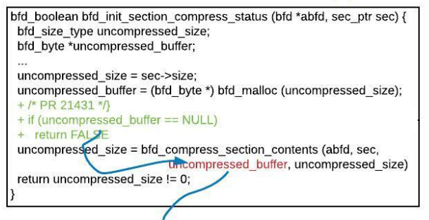
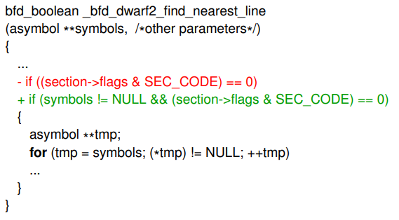
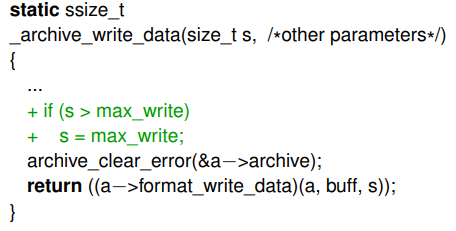

## 综述

补丁比对在2004年提出，当时称为结构化比对。
使用r2对二进制文件作前后对比，利用1day漏洞
使用diff命令对源文件作前后对比，利用1day漏洞

## 补丁模式

通过对CVEs的漏洞修复源码比对，可以找出其修补漏洞的共通模式，三种通用的修复模式如下：
1. 条件终止(ABORT)
2. 条件执行(EXEC)
3. 条件分配(ASSIGN)

**1.条件终止**

特点是增加一个if语句，对程序涉及的变量进行检查，如果不满足条件，则中断控制流(例如，从函数返回)。如下图的CVE-2017-8395漏洞修复：

**2.条件执行**

特点是在现有条件语句(if、while和for)中添加一个连接布尔表达式，对程序涉及的变量进行检查。如下图CVE-2017-8392的漏洞修复。

**3.条件分配**

特点是增加一个新的if语句，对程序涉及的变量进行检查，满足条件则进行赋值。如下图CVE-2013-0211的漏洞修复。

