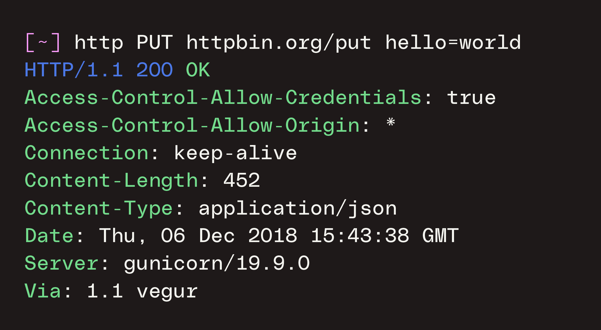

## 综述

在现代软件开发中，应用程序接口（Application Programming Interface，API）发挥着至关重要的作用，因为它们促进了平台互操作性，并充当了数据传输的渠道。

### 一、Web服务API

通过探索web服务不同的api，开发人员可以识别和解决更广泛的漏洞，例如注入攻击、会话劫持，或者web应用程序中的数据过度获取/不足获取。

**1.GET/POST方法**

传统的web应用程序通常采用GET/POST方法来获取用户输入的数据：
1. GET请求用于加载网页或获取资源。
2. POST方法提交表单数据，如用户登录凭据或支付信息。

**2.WebSocket API**

在更高级的领域，WebSocket api提供客户端和服务器之间的实时双向通信，非常适合聊天应用或实时更新，例如，在WebSocket api中，客户端可以：
1. 调用WebSocket建立连接。
2. 使用send方法传输数据到服务端。
3. 使用close方法关闭连接。

**3.Graph API**

GraphQL api提供了一种更高效和灵活的方式来查询和操作数据，允许客户精确指定他们需要的数据，例如，在Graph api中，客户端可以：
1. 使用query操作，获取数据。
2. 使用mutation操作，对数据进行变更，比如增加、删除、修改。
3. 使用substription操作，当数据发生更改，进行消息推送。

**4.SOAP API**

SOAP 协议是一种基于XML的协议，用于在 Web 上进行消息传递。例如，客户端根据不同元素描述SOAP消息：
1. Envelope 元素是 SOAP 消息的根元素，它可把 XML 文档定义为 SOAP 消息。
2. 可选的 SOAP Header 元素可包含有关 SOAP 消息的应用程序专用信息（比如认证、支付等），如果 Header 元素被提供，则它必须是 Envelope 元素的第一个子元素。
3. 必需的 SOAP Body 元素可包含打算传送到消息最终端点的实际 SOAP 消息。
4. 可选的 SOAP Fault 元素用于指示错误消息。

### 二、云服务API

通过自动生成并通过云服务的API发送请求序列，黑盒测试工具可以探索隐藏在不同状态下的错误，并发现诸如命令注入、数据泄漏和不适当的访问管理等漏洞。

**1.RESTFul API**

对大多数云服务的访问通常是通过RESTFul api提供的，它为各种功能提供了便利。在实践中，不同的请求类型可以从云服务中得到不同的响应。例如，在云计算平台中，客户端可以：
1. 使用GET方法检索当前使用的服务列表。
2. 使用POST方法创建虚拟机实例、容器和数据库。
3. 使用PUT方法更新资源信息。
4. 使用DELETE方法删除特定资源。

**2.gRPC API**

gRPC 旨在加快微服务之间的数据传输，默认使用Protocol Buffers来序列化负载数据。例如，微服务之间，客户端可以：
1. 使用GET方法检索当前使用的服务列表。
2. 使用POST方法创建虚拟机实例、容器和数据库。
3. 使用PUT方法更新资源信息。
4. 使用DELETE方法删除特定资源。

### 三、IoT系统API

**1.MQTT API**

在物联网领域，MQTT是一种广泛用于小型传感器和移动设备的轻量级消息传递协议。它能够在物联网设备和服务器之间实现高效和可靠的交易。例如，在MQTT API中，客户端可以：
1. 订阅主题以接收来自设备的更新或传感器数据。
2. 向主题发布消息，向设备发送命令或配置更改。
3. 使用服务质量（QoS）级别，确保消息按所需保证交付。
4. 利用保留的消息为未来的订阅者持久化最后的相关消息。

这些MQTT API操作对于物联网通信的实时、事件驱动性质是不可或缺的。通过严格测试MQTT API消息和主题订阅，安全工具可以识别漏洞，例如不正确的消息处理、不安全的主题订阅和潜在的窃听风险。

## 接口标准

综上，常用的api类型如下：
1. Web服务API：GET/POST、WebSocket api、GraphQL api、SOAP。
2. 云服务API：gRPC、RESTful api。
3. IoT系统API：MQTT。

一个接口的标准通常包括以下3个元素：
1. 通过接口连接的对象。
2. 使用接口定义的方法，以及方法的参数。
3. 对象的返回。

### 一、RESTful API标准

RESTful API本质是面向资源设计的API，网络上的所有事物都抽象为资源，每一个资源都有唯一的资源标识。

**1.URI**

统一资源标识符（URI）：

`protocol://host[:port]/path[?query-string][#anchor]`
- protocol 指定低层使用的协议，例如http,https
- host 服务器的IP地址或域名
- port 服务器端口
- path 访问资源的路径
- query-string 发送给服务器的数据，由一系列参数组成
- anchor 标识页面中的某个具体部分

**2.请求**

请求（Request）：

`Method Request-URI Version CRLF`
- Method 请求方法，例如POST在Request-URI 所标识的资源后附加新的数据
- Request-URI 请求的URI
- Version 协议版本
- CRLF 回车键

**3.响应**

响应（Response）：

`Version Status-Code Reason-Phrase CRLF`
- Version 协议版本
- Status-Code 响应状态码，例如401，服务器收到请求，但是服务器拒绝提供服务
- Reason-Phrase 状态码的补充信息
- CRLF 回车键

**4.接口测试的对象**

在RESTful API中，测试的对象是URI。

## 接口测试

使用Postman获取接口信息，捕获网络流量。

### 一、功能测试

作代码断言，检查不同参数的数据请求时，接口返回的数据与预期结果，对比其与接口文档的一致性。

### 二、性能测试

负载测试、压力测试、并发测试。

### 三、安全测试

解析API参数，基于参数树作变异，使用[SecLists](https://github.com/danielmiessler/SecLists)作为测试向量。

API常见漏洞类型：1.数据泄露；2.命令注入；3.损坏的对象授权；4.文件读取漏洞；5.认证错误，越权；6.SSRF；7.SQL注入；8.安全配置错误；9.拒绝服务；10.错误处理异常；11.XSS；12.CSP未实现；13.未验证的重定向。

## 测试报告

参数覆盖率
参数值覆盖率
操作方法覆盖率