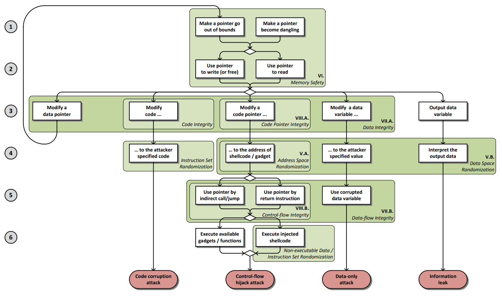

## 漏洞原理

未验证、未正常处理的输入或者操作可能引发漏洞，各种类型的漏洞可能相互引发，形成一条漏洞链，共同造成代码执行等影响。

### 一、漏洞的影响

根据漏洞对程序的影响分类，漏洞的影响有以下3种：
1. DoS/抛出异常
2. 信息泄露
3. 代码执行

代码执行：用来注入进程，提升权限等。

### 二、漏洞的适应性

根据对漏洞适应性的评估，使用编程语言作为适应维度：
1. 漏洞代码的编程语言

编程语言同样可以多样区分，比如以场景区分，以机制区分：
1. 内存安全语言，比如java,go
2. 内存不安全语言，比如C/C++，汇编
3. web语言，比如php，python，js
4. 默认未初始化语言
5. 空指针机制的语言
5. 弱类型语言，强类型语言
6. 异常机制的语言
7. 并发控制的语言

## 内存破坏

内存破坏漏洞，由于编程时内存边界处理不当、处理不正常输入时出现非预期结果，程序却忠实地运行，导致了漏洞的产生。内存破坏漏洞可以被ASAN检测到，可以进行明确的分类。

### 一、OOB(Out-of-bounds)

OOB类型的漏洞有两种原语：
1. OOB R，越界读，导致泄漏关键信息绕过保护策略、读取到非预期的内存页。
2. OOB W，越界写，导致关键指针、数据和控制结构被覆盖，同时越界写通常可以实现越界读。

**1.栈溢出(OOB R/W)**

栈溢出是一种OOB R/W漏洞，通过构造恶意输入可导致4种影响：

| DoS/抛出异常 | 信息泄露| 代码执行 | 
| :-: | :-: | :-: |
| √ | √ | √ |

1. 抛出异常，内存安全语言
2. 信息泄露，复用程序代码来泄露信息。
3. 权限提升，利用内核栈溢出提升进程权限。
4. 代码执行，通过覆写rip或者修改栈上的函数指针实现。

栈溢出的适应性：

| 内存不安全语言 | 内存安全语言 |
| :-: | :-: |
| √ | √ |

1. 内存不安全语言，严重的可导致代码执行
2. 内存安全语言，抛出异常

**1.1 溢出空间可控**

栈溢出在用户态程序或内核调用strcpy(), gets(), sprintf()等不检查是否越界的函数时出现。对栈上的数据造成覆写会导致代码执行。

常见的ret2shellcode造成代码执行。ROP造成代码执行，libc信息泄露，首先劫持控制流反复利用read和puts，通过栈迁移布置rop链，泄露got表libc地址。
kROP造成代码执行，内核基址信息泄露，权限提升。一般是用如下两个函数完成：commit_creds(prepare_kernel_cred (0));  .setuid 0提权。

**1.2 off-by-one**

对于非内存安全语言：

栈off-by-one在用户态程序或内核调用strncat(), strncpy(),strlen()时出现，strlen计算字符串长度时忽略0x00，比如payload=”A”*1024+0x00，而strlen(payload)=1024，那么使用strcpy在array[1024]中存储payload时会导致最后的终止符0x00对邻接变量的单字节覆写。
有三种情况：
1.不可覆写rip，但是可以操纵rbp来修改控制流。对于小端序计算机，不开启栈帧优化，且溢出变量邻接栈内保存的旧rbp时，旧rbp低位修改可为0x00，此后一次函数返回，pop rbp使得rbp抬高，当二次函数返回时mov rsp, rbp使得rsp抬高，因此在执行pop操作时保存的rbp和返回地址都可被修改，修改值在攻击者控制的栈空间内，可以达到控制流的劫持。
2.当编译器开启栈帧优化时，且溢出变量邻接栈内保存的rip时，可以覆写rip的低位为0x00，使得控制流发生改变。
3.溢出变量不邻接rbp和rip时，考虑覆写其邻接变量，如果该邻接变量是指针，可能在将来实现控制流改变。

**2.堆溢出(OOB R/W)**

堆溢出是一种OOB R/W漏洞，通过构造恶意输入可导致3种影响：

| DoS/抛出异常 | 信息泄露| 代码执行 | 
| :-: | :-: | :-: | 
| X | √ | √ | 

1. 信息泄露，通过堆重叠泄露信息。
2. 权限提升，利用内核堆溢出提升进程权限。
3. 代码执行，覆写堆结构相关信息达到代码执行。

堆溢出的适应性：

| 内存不安全语言 | 内存安全语言 |
| :-: | :-: |
| √ | X |

堆溢出存在于C/C++、汇编。

**2.1 溢出空间可控**

通过覆写后续的used、freed堆块，对于used篡改它的函数指针达到代码执行。
对于freed通过tcache污染、各种bins篡改达到任意地址读写，在此基础上覆写got表，篡改FSOP、rtld_global上面的函数指针为one_gadget，实现代码执行。

堆溢出类似于栈溢出，都是由于写入的数据没有控制好大小导致的。区别是堆上并不存在返回地址等数据，但是存在堆结构相关信息。
用户态程序的堆溢出发生在用户态堆管理器中，比如ptmaloc2。而内核堆溢出则发生在特定内核的堆管理器中，比如Linux内核的slub。

**2.2 堆off-by-one**

类似于栈off-by-one，区别在于堆off-by-one造成代码执行的可利用性与堆溢出相当。
一个例子是用户态程序溢出0x00时，在size为0x100倍数的时，使得prev_in_use位被清，这样前块会被认为是freed块，从而触发特定bin的前向合并造成unsafe unlink，实现任意地址写，在此基础上覆写got表，篡改FSOP、rtld_global上面的函数指针为one_gadget，实现代码执行。

**3.缺陷函数越界访问(OOB R)**

缺陷函数越界访问是OOB R类型漏洞，造成2种影响：
| DoS/抛出异常 | 信息泄露| 代码执行 | 
| :-: | :-: | :-: | 
| √ | √ | X |

1. 内存安全语言会抛出异常
2. 内存不安全语言会信息泄露

缺陷函数越界访问的适应性：

| 内存不安全语言 | 内存安全语言 |
| :-: | :-: |
| √ | √ |

对于非内存安全语言：

越界访问会造成泄漏，导致栈地址、堆基址、libc和ld基址被泄露。常见的类string返回时，其实是把栈地址addr作为参数，传入函数使其把返回的string类存储在addr指向的栈空间当中。据此可以泄漏栈基址。

### 二、UAF(Use-After-Free)

UAF类型的漏洞有3种原语：
1. UAF W，释放后写，导致关键指针、数据和控制结构被篡改。
2. UAF R，释放后读，导致泄漏关键信息绕过保护策略。
3. Double Free，二次释放，达到UAF R/W的效果。

**1.堆UAF(UAF R/W)**

堆UAF造成的影响：

| DoS/抛出异常 | 信息泄露| 代码执行 | 
| :-: | :-: | :-: |
| X | √ | √ |

1. UAF R造成信息泄露，单链表的bins会泄露next chunk地址，利用tcache解密safe link，可以泄露堆基址，右移12位。双链表bins会泄露nextchunk和prechunk地址，可能泄露libc地址。
2. UAF W造成代码执行，使用tcache污染或largebin攻击伪造freelist的指向。再次malloc得到任意地址写。在此基础上覆写got表，篡改FSOP、rtld_global上面的函数指针为one_gadget，实现代码执行。

堆UAF的适应性：

| 内存不安全语言 | 内存安全语言 |
| :-: | :-: |
| √ | X |

C/C++、汇编

用户堆UAF：
当一个内存块被free之后再次被使用。此时会出现以下几种情况：
1.内存块释放后，对应指针设置NULL，造成空指针解引用。
2.内存块释放后，对应指针非NULL，再次读造成信息泄露、再次写freed chunk元数据造成任意读写。

内核堆UAF：
在内核页管理代码、细粒度的object管理代码中存在UAF漏洞。

**2.堆Double Free(UAF R/W)**

当一个内存块被2次free后，再1次allocate时，该块会同时处于allocated和freed状态，即该内存块在保存freed状态bins信息的情况下，是可读写的，由此达到UAF R和UAF W的效果。

堆Double Free达到UAF R和UAF W的效果，造成的影响：

| DoS/抛出异常 | 信息泄露| 代码执行 | 
| :-: | :-: | :-: |
| X | √ | √ |

堆Double Free的适应性：

| 内存不安全语言 | 内存安全语言 |
| :-: | :-: |
| √ | X |

C/C++、汇编

**3.UAF变种**

即使使用垃圾回收运行时库，也可能出现UAF漏洞，因为UAF的对象除了chunk，还有文件描述符、网络连接等，比如Use After Close，文件描述符关闭之后仍然访问；Double Close，二次关闭文件描述符。

UAF变种造成的影响：

| DoS/抛出异常 | 信息泄露| 代码执行 | 
| :-: | :-: | :-: | 
| √ | √ | √ | 

UAF变种的适应性：

| 内存不安全语言 | 内存安全语言 |
| :-: | :-: |
| √ | √ |


### 三、未初始化

未初始化的影响：

| DoS/抛出异常 | 信息泄露| 代码执行 | 
| :-: | :-: | :-: | 
| X | √ | √ |

1.代码执行
2.信息泄露

未初始化的适应性：

| 默认未初始化语言| 
| :-: | 
| √ | 

一些提供给程序访问的变量，比如指针、数值等，可能存在未初始化的问题，未初始化有两种类型：
1. 该变量未赋值，攻击者可以控制该变量的值，进而间接控制程序的行为。
2. 该变量未清除，攻击者可以泄露该变量的值，或者利用过时的值。

### 四、空指针解引用

空指针解引用的影响：

| DoS/抛出异常 | 信息泄露|代码执行 | 
| :-: | :-: | :-: | 
| √ | X | X | 

空指针解引用的适应性：

| 空指针机制语言 | 
| :-: | 
| √ | 

比如C/C++，Java，C#，Go


空指针解引用发生在程序解引用一个它认为有效的指针时，但它实际上是NULL。空指针解引用问题可能由于许多漏洞而触发，包括竞争条件和简单的逻辑错误。

### 五、整数类型漏洞

整数类型的影响：

| DoS/抛出异常 | 信息泄露| 代码执行 | 
| :-: | :-: | :-: | 
| √ | √ | √ |

整数类型的适应性：

| 内存不安全语言 | 内存安全语言 |
| :-: | :-: |
| √ | √ |

整数类型的漏洞，可能由整数运算、符号转换产生。

**1.整数运算**

整数溢出是CPU中ALU对(有/无符号)整数之间的运算导致的上溢或下溢。如果一个对象的大小发生整数溢出，会间接影响到栈或堆为该对象分配的空间大小，引发栈溢出和堆溢出，为漏洞利用创造条件。

**1.1 整数上溢**

在OpenSSL 3.3代码中，存在整数上溢。
``` c
int nresp = packet_get_int();

if(nresp > 0){
    response = xmalloc(nresp*sizeof(char*));
    for(int i = 0; i< nresp; i++)
        response[i] = packet_get_string(NULL);
}
```
如果nresp等于UINT_MAX/sizeof(char*)，那么nresp会上溢为0，xmalloc() 分配的堆空间为0，下一行代码的执行会触发堆溢出漏洞。

**1.2 整数下溢**

下面的代码存在整数下溢。
``` c
int num = get_int();
num --;

if(num <= 0) return;
read_buffer(num);
```

如果num等于INT_MIN，符号位作参与运算，会产生下溢，导致其值变成INT_MAX，触发栈越界读。

**2.符号转换**

在无符号整数、带符号整数之间转换时发生了预期之外的数值误差，误差引发栈溢出和堆溢出，为漏洞利用创造条件。

下面的代码存在符号转换误差。
``` c
char buf[512];
int len = get_src_len();
if(len < 512){
    memcpy(buf,src,len);
}
```
get_src_len()接收无符号数大于231，经过符号转换后len变成负数，绕过if判断，造成栈溢出。

### 六、类型混淆

类型混淆的影响：

| DoS/抛出异常 | 信息泄露| 代码执行 | 
| :-: | :-: | :-: | 
| X | √ | √ |

类型混淆的适应性：

| 弱类型语言 |
| :-: |
| √ | 

弱类型语言，比如C/C++

程序首先使用一种类型来分配或初始化资源，如指针、对象或变量，但稍后它使用与原始类型不兼容的类型访问该资源。可能会触发逻辑错误，因为资源没有预期的属性。在没有内存安全的语言中，类型混淆会导致OOB W/R。

### 七、异常未捕获

异常未捕获的影响：

| DoS/抛出异常 | 信息泄露| 代码执行 | 
| :-: | :-: | :-: | 
| √ | X | X | 


异常未捕获的适应性：

| 异常机制的语言 | 
| :-: | 
| √ | 

抛出了异常却未被捕获，会执行非预期的控制流。

## 语义化注入

同样是由恶意输入导致的漏洞，区别在于语义化注入构造的恶意输入有一定的语义，这样才能达到攻击效果。比如内存破坏可以由长字符串A*1024触发，而语义化注入可能需要 ../../../ 这样的语义符号才能触发，因此语义化注入通常出现在web场景中。

### 一、格式化字符串

格式化字符串的影响：

| DoS/抛出异常 | 信息泄露| 代码执行 | 
| :-: | :-: | :-: | 
| √ | √ | √ |


格式化字符串的适应性：
1.格式化字符串机制的语言
2.二进制

1.首先泄露寄存器值，然后使用%6$lx从栈顶开始读取8个字节，则%8$lx会泄露旧的rbp值，%9$lx泄露压入栈的rip值。
2.使用%s可以实现任意内存地址读，泄露libc基址。
3.使用%n可以实现任意内存地址写，在此基础上覆写got表，篡改FSOP、rtld_global上面的函数指针为one_gadget，实现代码执行。

格式化字符串通过语义化注入，构造格式字符串达到OOB的目的。

格式化字符串漏洞由家族函数*printf()的错误使用造成。*printf()家族的格式化处理函数不会考虑参数的数量，而是在格式化字符串解析时不断的对参数进行相应的处理。在64位环境下，调用函数前进行传参，先使用6个寄存器，依此为rdi，rsi，rdx，rcx，r8，r9，然后再通过压栈的方式传递参数7、8等等。所以当printf(s)的s可以控制时，通过%lx、%s、%p、%n这些格式化标识符达到信息泄露、任意内存地址读写的目的。

### 二、反序列化

反序列化的影响：

| DoS/抛出异常 | 信息泄露| 代码执行 | 
| :-: | :-: | :-: |
| X | X | √ |


反序列化的适应性：

| 内存不安全语言 | 内存安全语言 |
| :-: | :-: |
| √ | √ |

在没有验证输入有效的情况下，反序列化了不受信任的数据。攻击者通过构造恶意序列化数据，在反序列化（将数据恢复为对象）时触发非预期行为。
某些编程语言或库在反序列化时会自动执行特定方法（如Java的readObject()、Python的__reduce__），攻击者可利用这些特性注入恶意逻辑。

### 三、控制流注入

控制流注入的影响：

| DoS/抛出异常 | 信息泄露| 代码执行 | 
| :-: | :-: | :-: |
| X | X | √ |

控制流注入是对命令注入、代码注入的概括。利用这些漏洞构造的语义化输入，可以直接劫持控制流，导致代码执行。

**1.命令注入**

命令注入的适应性：

| web语言 | 非web语言 |
| :-: | :-: |
| √ | √ |

程序将恶意输入拼接到操作系统命令中，导致代码执行。

**2.代码注入**

代码注入的适应性：

| web语言 | 
| :-: | 
| √ | 

代码注入有相当多的变种，比如：XSS、XXE、SSTI、SPEL表达式注入等等。都是通过构造语义化输入，使得程序执行其中的代码。

### 四、SQL注入

SQL注入的影响：

| DoS/抛出异常 | 信息泄露| 代码执行 | 
| :-: | :-: | :-: |
| X | √ | √ |

SQL注入的适应性：

| web语言 | 
| :-: | 
| √ | 

服务器端数据库执行了注入的SQL语句，导致信息泄露，甚至代码执行。

### 五、SSRF

SSRF的影响：

| DoS/抛出异常 | 信息泄露| 代码执行 | 
| :-: | :-: | :-: |
| X | √ | √ |

SSRF的适应性：

| web语言 | 
| :-: | 
| √ | 

服务器端执行了SSRF的协议请求，导致信息泄露，甚至代码执行。

### 六、文件操作

文件操作的适应性：

| web语言 | 
| :-: | 
| √ | 

**1.目录遍历**

目录遍历的影响：

| DoS/抛出异常 | 信息泄露| 代码执行 | 
| :-: | :-: | :-: |
| X | √ | X |

程序未对用户提供的文件名、路径参数做严格校验。使得攻击者可以使用../（Linux/Unix）或..\（Windows）跳出合法目录。

**2.文件上传**

文件上传的影响：

| DoS/抛出异常 | 信息泄露| 代码执行 | 
| :-: | :-: | :-: |
| X | X | √ |

服务器未对上传文件类型施加有效限制，攻击者可利用此缺陷上传后门文件。

**3.文件包含**

**4.文件解析**

文件解析漏洞（常见于中间件）

##  竞态条件

竞态条件的影响：

| DoS/抛出异常 | 信息泄露| 代码执行 | 
| :-: | :-: | :-: |
| √ | √ | √ |

尤其是提升权限。

竞态条件的适应性：

| 并发控制语言 | 
| :-: | 
| √ | 

竞态条件（race condition）是指这样一种情形——多个线程或进程在读写一个共享数据时结果依赖于它们执行的相对时间。如果竞态条件危害了程序正确性，就会产生竞态条件漏洞，可以被TSAN明确分类。

### 一、数据竞争
   
定义内存访问操作：e 为一个四元组 (m,t,L,a) ，其中：m 为内存访问操作的内存地址；t 为标识内存访 问操作的线程；L 为操作所属线程拥有的锁集合；a 为 内存访问操作的类型（READ或WRITE）。
数据竞争 IsRace(ei ,ej) 是满足以下条件的两个内存访问操作：
1. 内存访问位置相同，mi=mj；
2. 两者并发执行；
3. 至少有一个为写操作；
4. 未使用“互斥”的同步机制约束。

DirtyCow 漏洞（CVE-2016-5195）是最为典型的数据竞争引发的漏洞。如下图所示，正常的程序流程三次调用了 faultin_ page 函数完成了三个步骤，其中第二次进入 faultin_ page主要是处理写权限的页错误问题，要求的写权限标 志会被去掉，即去掉FOLL_WRITE标志位，第三次调用 faultin_page 时已经成功得到 cow 后的页面，且 flags 已经去掉 FOLL_WRITE，因此不会再产生写错误的处理， 可以直接写入 cow 的页。


但是如果在上述流程即第二 次页错误处理结束时，在一个新的线程调用madvise，会 unmap 掉前面 cow 的页面，又进入缺页处理，这里不同 的是在do_fault调用时，由于没有了写权限的要求，直接 调用了 do_read_fault读取映射文件的内存页，而不是内存页副本，后续即可实现越权写操作。
在 DirtyCow 漏洞中，两个线程竞争的资源是内存页，并且造成了程序 正确性的影响。某些数据竞争发生时 并不会影响程序的正确性，例如当两个进程竞争的内存 共享资源和两个进程的逻辑完全无关，则认为构成数据竞争但是不构成竞态漏洞。DirtyCow正是由于在数据竞争发生之后导致 任意文件被恶意篡改的危害性结果，才被研究人员归结为竞态漏洞。

### 二、TOCTTOU

TOCTTOU（Time Of Check To Time Of Use）指计算机系统中的 资源与权限等状态在检查（安全授权）和使用这个检查 结果之间，因为检查结果（如授权状态）在这段时间发 生了改变而造成的漏洞产生。
TOCTTOU 通常发生 在文件系统的访问时，特别是在 UNIX操作系统中较为 常见，文件系统访问一般会要求对文件先检查再写入， 这就导致检查与读写操作之间存在时间间隔，攻击者 可利用这种时间间隔对文件系统展开攻击。
类 Unix 文件系统中存在 TOCTTOU 缺陷的根本原因在于文件 名和文件对象之间的映射是可变的，如下图所示，TOUCTTOU 的典型例子 Binmail。 Binmail是一个setuid-to-root程序，在普通用户权限下可 以调用执行 root 用户权限的操作。在正常的读取邮件 的过场中，Binmail 首先通过 lstat 函数查看文件 mail 的 信息，如果 mail文件是正常文件，不是符号链接则执行 open函数打开邮件。


但是由于 lstat和 open函数不是原始操作，所以如果在 lstat函数检查完毕后，另外一个线 程或者进程可以通过 unlink和 symlink操作将 mail文件 替换为指向系统关键文件/etc/passwd等文件的链接，那 么 open 的文件将会是替换后的系统关键文件，实现了任意文件读取。
一个基于文件的TOCTTOU例子的exp如下图所示。use在check后面执行而导致的漏洞。


综上，TOCTTOU是竞态漏洞的子集，数据竞争和竞态漏洞存在交集。

### 三、Double Fetch

Double Fetch也是竞态漏洞的一个子集，该漏洞的原理是：内核从用户空间中拷贝复杂数据时，数据在内核中有两次被取用，内核第一次取用数据进行安全检查（如缓冲区大小、指针可用性等），当检查通过后内核第二次取用数据进行实际处理。


在两次取用的时间间隔里，可以对已通过检查的用户态数据进行篡改，在第二次取用时造成访问越界或缓冲区溢出，最终导致内核崩溃或权限提升。Double Fetch通常会出现在以下场景：

1. 类型选择，第一次取数据识别它的类型，然后对数据篡改，第二次取数据进行相应类型处理时产生混淆。
2. 长度检查，第一次取数据计算它的长度，然后对数据篡改，第二次取数据处理时导致溢出、或者信息泄露。
3. 浅拷贝，第一次取数据只是将指向用户数据的指针拷贝到内核中，然后对指针篡改，第二次取的数据将不是原来通过检查的数据。

从原理上来看，Double Fetch和TOCTTOU类似，都是利用时间间隔篡改数据，造成不一致性。也因此是可以被修复的。

## 逻辑漏洞

### 一、越权漏洞

水平越权、垂直越权

常见于容器逃逸

### 二、配置漏洞


